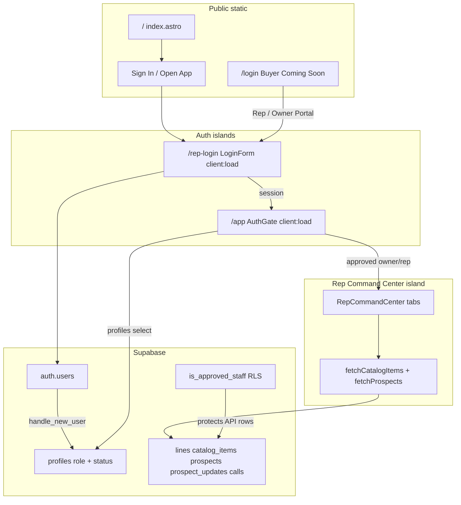

# Architecture Assessment & Gap Analysis

**Project:** Rep Command Center / justin-fassio  
**Branch audited:** `feature/ai-agent-integration` (based on `main` @ `b298b12`)  
**Date:** 2026-08-02  
**Scope:** Full-stack structural soundness after landing, auth/approval, RLS, and tooling work (through PR #29 and related merges)

---

## 1. Executive verdict

**Structurally sound for the phase completed.** The foundation is coherent: Astro 7 static site, React 19 islands, Tailwind 4 design tokens, Supabase Auth + profiles approval workflow, domain RLS gated to approved staff, CI + Dependabot, and a clear public vs internal portal split.

**Not yet “product-complete.”** CRM persistence and directory confidentiality (Phases B–D) are implemented on `feature/ai-agent-integration`: calls write/read under RLS; catalog/prospects load via authenticated Supabase fetches. Server tool boundary (Phase E) and streaming Suggest on Vercel `/api/agent` (Phase F → III; Edge LLM Suggest retired) are in place — this is not a multi-agent platform.

| Dimension               | Rating   | One-line                                                                       |
| ----------------------- | -------- | ------------------------------------------------------------------------------ |
| Framework / build stack | Strong   | Astro 7 + React 19 + Tailwind 4 + Node 22.22.3, intentionally pinned           |
| Auth / approval model   | Strong   | Client gate + DB trigger + RLS + owner Pending reps RPCs                       |
| Domain persistence      | Strong   | Calls + catalog_items + prospects wired under approved-staff RLS               |
| Data confidentiality    | Moderate | Directories not in `/app` bundle; residual = approved JWT / network capture    |
| Test / CI confidence    | Strong   | LoginForm/AuthProvider/filters + format:check in CI; Playwright still deferred |
| AI agent readiness      | Partial  | Streaming Suggest + CRM tools on `/api/agent`; not multi-agent                 |

**Recommendation before `feature/ai-agent-integration` feature work:** treat the items in [§8 Prioritized backlog](#8-prioritized-backlog-before--during-ai-phase) as sequencing constraints. Do not assume RLS alone protects sensitive directory/pricing data.

---

## 2. System overview

### Stack (locked)

| Layer      | Choice                                                                          |
| ---------- | ------------------------------------------------------------------------------- |
| Framework  | Astro 7.1.x, `output: 'static'`                                                 |
| UI islands | React 19.2.x + `@astrojs/react` 6.x                                             |
| Styling    | Tailwind CSS 4 + `@tailwindcss/vite`, Organic tokens in `src/styles/global.css` |
| Auth / DB  | Supabase Auth (PKCE) + Postgres RLS                                             |
| Hosting    | Vercel static; headers in `vercel.json`                                         |
| Tooling    | TypeScript 5.9.x, Vitest 4, ESLint 10, Node `>=22.22.3`                         |

---

## 3. What is structurally sound

### 3.1 Application boundaries

- Clear route split: public landing (`/`), buyer placeholder (`/login`), rep auth (`/rep-login`), gated app (`/app`).
- Only two hydrated islands (`LoginForm`, `AuthGate`). Buyer portal correctly renders without `client:*`.
- `AuthGate` owns `AuthProvider` in one island (avoids nested-island context issues).
- Path alias `@/*`, ESM package, shared `Layout` + global tokens.

### 3.2 Auth & approval

- Signup trigger creates `profiles` with `role = 'rep'`, `status = 'pending'`.
- Self-update RLS freezes `role` and `status` (no client privilege escalation).
- Gate states: unauthenticated → `/rep-login`; pending / rejected screens; buyer wrong-portal; approved owner/rep → `RepCommandCenter`.
- Loading race fixed: profile fetch completes before gate decides (no pending flash for approved staff).
- `isApprovedStaff` lives in `src/lib/auth.ts` (types module stays schema-only).
- Domain RLS uses `SECURITY DEFINER` `is_approved_staff()` — coherent with client helper.

### 3.3 Ops & dependency policy

- Roadmap Phases 0–5 complete (Dependabot, React 19, TS 5.x, Astro 6→7, Tailwind 4).
- Vite/jsxDEV mitigations in place on this branch’s working tree intent: `astro dev --force`, `posttypecheck` cache wipe, `optimizeDeps` includes `react/jsx-dev-runtime` (carry these before relying on local login).
- Vitest cache isolated from `astro dev` (`vitest.config.ts` `cacheDir`).
- Resend kept server-side (`scripts/send-test-email.mjs` + `RESEND_API_KEY`, never `PUBLIC_`).
- Build tolerates missing Supabase env via placeholder client (CI/static-safe).

### 3.4 Design system

- Single Organic token source (`@theme` in `global.css`); landing and app share it.
- Small UI kit (`Button`, `Card`, `Input`, `Dialog`, `Tag`) — appropriate scale for the product.

---

## 4. Architecture inventory

### 4.1 Routes

| Route        | File                        | Nature                                                |
| ------------ | --------------------------- | ----------------------------------------------------- |
| `/`          | `src/pages/index.astro`     | Static marketing landing                              |
| `/login`     | `src/pages/login.astro`     | Buyer portal coming soon (SSR HTML)                   |
| `/rep-login` | `src/pages/rep-login.astro` | `LoginForm` island — magic link / password / register |
| `/app`       | `src/pages/app/index.astro` | `AuthGate` island — approval gate + RCC               |

### 4.2 Runtime data usage

| Data                                 | Source                                   | Used by UI?                 | Protected by RLS?    |
| ------------------------------------ | ---------------------------------------- | --------------------------- | -------------------- |
| Session / user                       | Supabase Auth                            | Yes                         | N/A (Auth)           |
| Profile role/status                  | `profiles`                               | Yes                         | Own-row RLS          |
| Catalog SKUs                         | Supabase `catalog_items` (runtime fetch) | Yes                         | Yes (approved staff) |
| Prospects directory                  | Supabase `prospects` (runtime fetch)     | Yes                         | Yes (approved staff) |
| `lines`, `calls`, `prospect_updates` | Supabase                                 | Yes (calls); updates unused | Yes (approved staff) |

### 4.3 Migrations (canonical order)

1. `20260802185342_initial_schema.sql` — domain tables + early authenticated RLS
2. `20260802193000_profiles_roles.sql` — profiles + signup trigger (historical buyer default)
3. `20260802203500_tighten_auth_rls.sql` — drop public/anon domain access
4. `20260802220000_profiles_approval_workflow.sql` — owner/status + `is_approved_staff` + approved-staff RLS
5. `20260802223000_profiles_role_default_rep.sql` — role default `rep`
6. `20260802250000_prospects_table.sql` — `prospects` + approved-staff RLS
7. `20260802251000_seed_catalog_prospects.sql` — seed OGR catalog + prospect directory
8. `20260802260000_owner_approval_rpcs.sql` — `is_approved_owner` + pending list/approve RPCs

`supabase/schema.sql` matches **end state** of migrations; treat migrations as source of truth for applied databases.

---

## 5. Gap analysis

### 5.1 Critical product / security gaps

| ID  | Gap                                                                  | Impact                                                                       |
| --- | -------------------------------------------------------------------- | ---------------------------------------------------------------------------- |
| G1  | ~~Catalog + prospects shipped in client JS~~ **Mitigated (Phase D)** | Anonymous `/app` assets no longer embed corpora; approved JWT still required |
| G2  | ~~Log Call does not persist~~ **Mitigated (Phase B)**                | Calls persist; Dashboard/Calls/Insights read live rows                       |
| G3  | Open self-registration → unlimited pending reps                      | Documented ops choice; owners clear queue via `/app` Pending reps            |
| G4  | All approved staff share full CRUD on all domain rows                | Fine for solo Justin; `calls.created_by` still deferred                      |

### 5.2 Structural / consistency gaps

| ID  | Gap                                                                 | Impact                                                       |
| --- | ------------------------------------------------------------------- | ------------------------------------------------------------ |
| G5  | Schema/types ahead of UI                                            | Dual mental model; easy to assume DB is live                 |
| G6  | Triple sync: migrations ↔ `schema.sql` ↔ hand-written `database.ts` | Drift risk without codegen                                   |
| G7  | `LoginForm` outside `AuthProvider`                                  | OK with full-page nav; no shared auth context across portals |
| G8  | Missing-profile / fetch-error collapses to “pending” UX             | Confusing for misconfigured DBs                              |
| G9  | One large `/app` island (all tabs + full datasets)                  | Bundle weight; no tab-level code splitting                   |
| G10 | Export CSV button has no handler                                    | Dead control in Header                                       |
| G11 | BKG line switcher is UI-only                                        | Multi-line schema unused                                     |
| G12 | Buyer portal is placeholder only                                    | Intentional for now                                          |

### 5.3 Quality / ops gaps

| ID  | Gap                                                                | Impact                                              |
| --- | ------------------------------------------------------------------ | --------------------------------------------------- |
| G13 | CI deletes `package-lock.json` then `npm install`                  | Non-reproducible builds; fights Dependabot          |
| G14 | Tests thin outside AuthGate + pure libs                            | LoginForm, AuthProvider, tabs, persistence untested |
| G15 | No E2E / coverage reporting                                        | Regressions in auth→app path easy to miss           |
| G16 | README Notes still imply auth is outstanding                       | Docs lag implementation                             |
| G17 | ~~`format:check` not in CI~~ **Mitigated (Phase H)**               | `check` + CI run Prettier `--check`                 |
| G18 | ~~Security headers lack CSP / HSTS~~ **Mitigated (Phase H)**       | `vercel.json` CSP baseline + HSTS                   |
| G19 | Supabase Auth redirect allow-list must include all preview origins | Magic-link failures on Vercel previews if omitted   |

### 5.4 Explicitly out of scope / accepted for prior phase

- Buyer-facing catalog commerce
- Astro middleware / SSR session (would require leaving pure `static` or adding edge)
- Resend as product email (script-only smoke test; Auth email is Supabase’s)
- Per-rep `calls.created_by` ownership (deferred past Phase G)

---

## 6. Security assessment (summary)

**Working as designed**

- No service-role key in the browser.
- Profile escalation paths blocked at RLS.
- Domain tables deny `anon` and non-approved users.
- PKCE + `emailRedirectTo` → `/app`.
- Env conventions documented in `.env.example`.

**Residual risk (must not be forgotten)**

1. **Static hosting:** `/app` HTML/JS is public; AuthGate is UX (directories now require RLS-backed fetch).
2. **~~Bundle exposure~~ mitigated:** corpora live in Supabase; seed copies under `scripts/seed-source/` are not in the Vite client graph. Residual = approved session / network capture.
3. **Staff flat privilege:** approved `rep` ≡ `owner` for domain CRUD.
4. **Local secrets:** keep `RESEND_API_KEY` / `.env` gitignored; rotate if ever shared.

---

## 7. AI agent integration readiness

### Ready inputs

- Approved-staff auth model and typed `Database` / `Call` shapes.
- Structured call fields already modeled in UI (outcome, PMF, tags, notes).
- In-repo catalog/prospect corpora as potential retrieval sources (once access model is fixed).

### Blockers

| Need                             | Current state                                                                                                  |
| -------------------------------- | -------------------------------------------------------------------------------------------------------------- |
| Server tool / agent runtime      | Edge `authorized-ping` + Vercel `/api/agent` (JWT + `is_approved_staff` + CRM tools); Edge LLM Suggest retired |
| Trusted secrets for agents       | AI Gateway / `AI_GATEWAY_API_KEY` + documented `SUPABASE_SERVICE_ROLE_KEY` server-only — never `PUBLIC_*`      |
| Writable CRM                     | Calls persist (Phase B); richer CRM still thin                                                                 |
| Auth-backed data APIs            | Catalog/prospects fetched under RLS (Phase D)                                                                  |
| Embeddings / search / agent docs | Absent                                                                                                         |

**Suggested sequencing for this branch’s phase**

1. Persist calls (and optionally prospect updates) under the user JWT + existing RLS.
2. Read Dashboard / Calls / Insights from Supabase.
3. Move sensitive directories behind authenticated queries (or accept residual risk formally).
4. Add a **server** boundary (Supabase Edge Function and/or Astro hybrid/`@astrojs/vercel` endpoints) for agent tools.
5. Expand tests around write paths and RLS assumptions.
6. Only then wire AI agent orchestration.

---

## 8. Prioritized backlog (before / during AI phase)

### P0 — Correctness & trust

1. Commit/push local Vite/`jsxDEV` mitigations if not already on `main` (`astro.dev --force`, `posttypecheck`, `jsx-dev-runtime` include).
2. Fix CI to prefer `npm ci` (stop deleting the lockfile) while keeping any required `@astrojs/compiler` rebuild.
3. Update README Notes/structure: auth done; persistence outstanding.
4. Confirm migrations + owner bootstrap on the **Apparel / justin-fassio** Supabase project (`mqsyqxnzpncwdrnugytf`), not a different MCP-linked project.

### P1 — Product spine

5. Wire `LogCallModal` → `calls` insert for approved staff.
6. Load Calls / Dashboard aggregates from Supabase.
7. Implement or remove Export CSV.
8. Decide invite-only signup vs open register + pending.

### P2 — Confidentiality & scale

9. ~~Stop shipping full prospect/catalog arrays in the public `/app` chunk~~ **Done (Phase D).**
10. Tab-level code splitting for RCC.
11. Owner-only approve RPC + in-app approval UI. _(Done Phase G)_
12. Per-rep row ownership if multi-user. _(Still deferred)_

### P3 — Quality bar

13. Tests: `LoginForm`, `isApprovedStaff`, AuthProvider loading, call insert mocks.
14. Extract Prospects filter helper (mirror `catalogFilters`) + unit tests.
15. ~~`format:check` in CI~~ **Done (Phase H).** Optional Playwright smoke still deferred.
16. ~~CSP + HSTS on Vercel~~ **Done (Phase H).** Auth redirect allow-list for previews documented in README.

---

## 9. Soundness checklist (phase gate)

Use this before treating the repo as a clean base for AI work:

- [x] Static Astro + React islands compile (`astro check` path green in CI)
- [x] Auth portals and approval gate implemented
- [x] Profiles trigger + approved-staff RLS in migrations
- [x] Client cannot self-promote role/status
- [x] Public vs rep login routes separated
- [ ] Sensitive static datasets removed from public bundle **or** risk explicitly accepted
- [ ] At least one domain write path live (`calls`)
- [ ] CI uses lockfile-reproducible install
- [ ] README matches auth/persistence reality
- [x] Server surface exists for any agent/tooling that needs secrets
- [x] One vertical AI slice (streaming Suggest on `/api/agent`; Edge LLM Suggest retired) — still not a multi-agent platform

**Phase-gate conclusion:** Phases A–H are on `feature/ai-agent-integration`. Residual: approved JWT / network capture on directories; shared domain CRUD without per-rep call ownership; no Playwright e2e.

---

## 10. Key file index

| Area        | Paths                                                                                                    |
| ----------- | -------------------------------------------------------------------------------------------------------- |
| Config      | `astro.config.mjs`, `package.json`, `vitest.config.ts`, `vercel.json`, `.nvmrc`                          |
| Routes      | `src/pages/index.astro`, `login.astro`, `rep-login.astro`, `app/index.astro`                             |
| Auth        | `src/components/auth/*`, `src/hooks/useAuth.ts`, `src/lib/supabase.ts`, `src/lib/auth.ts`                |
| App shell   | `src/components/RepCommandCenter.tsx`, `src/components/tabs/*`                                           |
| Static data | `src/data/landing.ts` (public); directory seed sources under `scripts/seed-source/` (not client-bundled) |
| Types       | `src/types/database.ts`                                                                                  |
| DB          | `supabase/migrations/*`, `supabase/schema.sql`                                                           |
| CI          | `.github/workflows/ci.yml`, `.github/dependabot.yml`                                                     |
| Docs        | `README.md`, `roadmap.md` (dependency phases)                                                            |

---

_Generated as a point-in-time architectural assessment. Re-run after persistence or hosting-mode changes._
