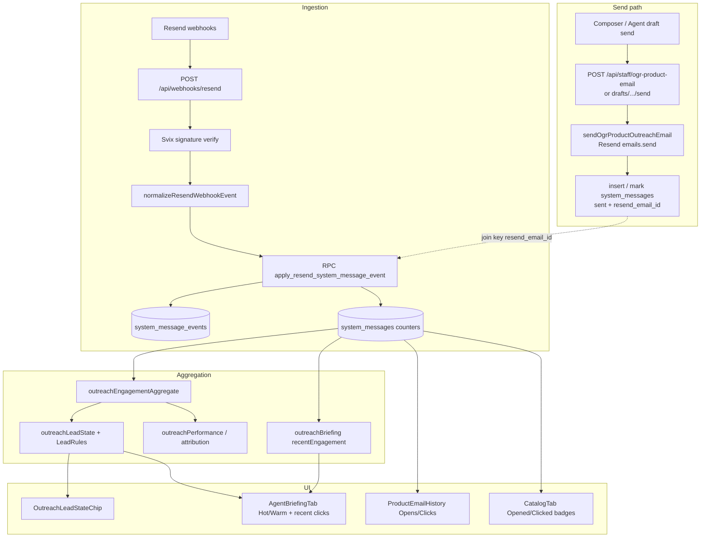

# Email opens & clicks — architectural assessment & gap analysis

Date: 2026-08-27  
Scope: Product Outreach open/click analytics — Resend webhooks → `system_messages` / `system_message_events` → aggregation → UI.  
Out of scope: Wholesale order confirmation mail, live-chat alert mail, and Gmail reply attribution (parallel ledger).

Product principle: **Agent recommends; staff send.** Engagement is a **leading signal** for Warm / Hot / Call Today — not a primary KPI. Primary success remains Active Account conversion.

---

## Verdict

Open/click tracking for Product Outreach is **production-shaped and well tested**: Svix-verified webhooks, idempotent event ledger, atomic counter increments, monotonic last-engagement timestamps, prospect aggregation into Cold/Warm/Hot, Line Sheet unseen badges, and per-message counts in Product Email History.

**Addressed on `update/prospec-email-follow-up` (2026-08-27):**

1. Ledger-first send (`status=sending` → stamp `resend_email_id`) with stamp retries; staff warning when `logged: false`.
2. `resend_unmatched_events` buffers `unknown_email` webhooks; replay after stamp / successful apply.
3. Briefing “Recent engagement” includes opens; Product Email History shows first/last open and click.
4. Ops checklist: [`docs/ops/resend-engagement-checklist.md`](../ops/resend-engagement-checklist.md).

Remaining gaps (deferred): open/click **rates**, click destination URLs, contact-activity engagement, soft-open / MPP filtering, zero-open health cron.

---

## End-to-end architecture



| Step              | Artifact                                                                                                                                                        |
| ----------------- | --------------------------------------------------------------------------------------------------------------------------------------------------------------- |
| Transport         | [`src/lib/sendOgrProductOutreachEmail.ts`](../../src/lib/sendOgrProductOutreachEmail.ts) — `from` / `to` / `subject` / `html` / `text` only; no tracking flags  |
| Manual send       | [`src/pages/api/staff/ogr-product-email.ts`](../../src/pages/api/staff/ogr-product-email.ts) — send then `insertProductOutreachSystemMessage`                   |
| Draft send        | [`src/pages/api/staff/ogr-product-email/drafts/[id]/send.ts`](../../src/pages/api/staff/ogr-product-email/drafts/[id]/send.ts) — send then mark draft sent      |
| Webhook           | [`src/pages/api/webhooks/resend.ts`](../../src/pages/api/webhooks/resend.ts) — `RESEND_WEBHOOK_SECRET`; service-role apply                                      |
| Normalize / apply | [`src/lib/resendWebhook.ts`](../../src/lib/resendWebhook.ts)                                                                                                    |
| RPC               | `apply_resend_system_message_event` — migrations `20260811150000`, monotonic fix `20260811170000`                                                               |
| Events            | [`supabase/migrations/20260811140000_system_message_events.sql`](../../supabase/migrations/20260811140000_system_message_events.sql) — unique `resend_event_id` |
| Aggregate         | [`src/lib/outreachEngagementAggregate.ts`](../../src/lib/outreachEngagementAggregate.ts)                                                                        |
| Lead rules        | [`src/lib/outreachLeadRules.ts`](../../src/lib/outreachLeadRules.ts) — clicks ≫ opens; `openOnlyProductCap`                                                     |
| Briefing          | [`src/lib/outreachBriefing.ts`](../../src/lib/outreachBriefing.ts) — recent engagement = clicks only                                                            |

**Invariant:** Open/click webhooks **never** change `status` to `opened` / `clicked`. Status stays `sent` / `delivered` (or terminal bounce/fail/complaint). Counters + timestamps are the engagement source of truth.

**Not written by webhooks:** `product_outreach_engagement_seen` (staff “seen” cursor only).

---

## Data model

### `system_messages` (rollup)

| Field                                                         | Role                                                                       |
| ------------------------------------------------------------- | -------------------------------------------------------------------------- |
| `resend_email_id`                                             | Join key to Resend / webhook `email_id`                                    |
| `opened_at` / `clicked_at`                                    | First open / first click                                                   |
| `last_opened_at` / `last_clicked_at`                          | Monotonic provider occurrence times                                        |
| `last_engagement_received_at`                                 | Local receipt time when an open/click was **applied** (badge unseen logic) |
| `open_count` / `click_count`                                  | Incremented per unique Svix event                                          |
| `delivered_at` / `bounced_at` / `failed_at` / `complained_at` | Delivery lifecycle                                                         |
| `last_event_at`                                               | Latest provider event time across types                                    |

Schema origins: `20260811120000_system_messages.sql`, engagement receipt `20260811170000_engagement_receipt_monotonic.sql`. Types: `src/types/database.ts`.

### `system_message_events` (ledger)

| Field             | Role                                                                                    |
| ----------------- | --------------------------------------------------------------------------------------- |
| `resend_event_id` | Svix message id — **unique** idempotency key                                            |
| `resend_email_id` | Provider email id                                                                       |
| `event_type`      | `email.opened`, `email.clicked`, …                                                      |
| `occurred_at`     | Provider timestamp                                                                      |
| `payload`         | Trimmed JSON (`type`, `email_id`, `created_at`, bounce/failure) — **no click URL / UA** |

### `product_outreach_engagement_seen`

Per-`catalog_item_id` `seen_at` for Line Sheet Opened/Clicked badges. Marking seen **must not** reset counters (enforced by design).

### Explicitly absent

- Custom tracking pixels / tokens
- Per-click destination URL columns
- Bot / soft-open / MPP flags
- `open_rate` / `click_rate` tables or views
- Tracking consent / privacy preference fields
- Materialized `prospect_outreach_engagement` table (still on-read aggregation)

---

## Ingestion behavior

| Concern      | Behavior                                                                                                        |
| ------------ | --------------------------------------------------------------------------------------------------------------- |
| Auth         | Svix headers via Resend SDK `webhooks.verify`; missing/placeholder secret → HTTP 503                            |
| Dedup        | Insert event with unique `resend_event_id`; conflict → `{ status: 'duplicate' }`, no double-count               |
| Unknown send | No matching `resend_email_id` → `{ status: 'unknown_email' }`, HTTP 200 (logged, not retried)                   |
| Open         | `open_count + 1`; set `opened_at` if null; advance `last_opened_at` if newer; set `last_engagement_received_at` |
| Click        | Same pattern for click fields                                                                                   |
| Terminal     | Bounce / fail / complain update status; open/click never regress terminals                                      |
| Out-of-order | Older open/click timestamps do not regress `last_*_at`                                                          |

Handled types (`HANDLED_RESEND_EVENT_TYPES`): `email.sent`, `email.delivered`, `email.opened`, `email.clicked`, `email.bounced`, `email.failed`, `email.complained`.

Tests: [`src/lib/resendWebhook.test.ts`](../../src/lib/resendWebhook.test.ts), [`src/test/api/resend-webhook.test.ts`](../../src/test/api/resend-webhook.test.ts).

---

## Send path & tracking dependency

```text
Staff send → Resend.emails.send → CRM persist with resend_email_id
                                    ↓ (if persist fails)
                              { ok: true, logged: false }
                                    ↓
                         Later webhooks → unknown_email (dropped)
```

| Fact                                               | Implication                                                       |
| -------------------------------------------------- | ----------------------------------------------------------------- |
| Send API does not pass open/click tracking options | Relies entirely on Resend account/dashboard defaults              |
| No tags / UTMs on send                             | Link-level campaign attribution not in CRM                        |
| Persist after send                                 | Orphan Resend emails possible when DB write fails                 |
| Wholesale / live-chat also call Resend             | Those sends never enter `system_messages` Product Outreach ledger |

---

## Aggregation & product use of opens/clicks

| Module                                    | Opens                                     | Clicks                                                       | Notes                                              |
| ----------------------------------------- | ----------------------------------------- | ------------------------------------------------------------ | -------------------------------------------------- |
| `outreachEngagementAggregate`             | Sum + messages opened + distinct products | Sum + messages clicked + max click_count + distinct products | On-read; includes unique-email unlinked manuals    |
| `outreachLeadRules` / `outreachLeadState` | Open-only products score with **cap**     | Clicks ≫ opens; multi-product / repeat-click bonuses         | Opens alone cannot make Hot                        |
| `outreachLeadLists`                       | Feeds Warm                                | Feeds Hot / Call Today                                       | Briefing call queues                               |
| `outreachBriefing.loadRecentEngagement`   | **Ignored**                               | Last 7d by `last_clicked_at`                                 | UI label: “Recent engagement”                      |
| `outreachPerformance`                     | Snapshot inputs for calibration           | Snapshot inputs                                              | Reports **conversion** rates, not open/click rates |
| `outreachNightlyPrep`                     | Not used                                  | Not used                                                     | Prep is draft-only                                 |

Epic authority: [Agentic Outreach §9](../epics/agentic-outreach/README.md), [Phase 3 engagement qualification](../epics/agentic-outreach/phase-3-engagement-qualification.md).

---

## UI surfaces

| Surface               | Path                                                                              | What staff see                                                  |
| --------------------- | --------------------------------------------------------------------------------- | --------------------------------------------------------------- |
| Product Email History | [`ProductEmailHistory.tsx`](../../src/components/product/ProductEmailHistory.tsx) | `Opens N · Clicks N` per message; **no** first/last timestamps  |
| Line Sheet badges     | [`CatalogTab.tsx`](../../src/components/tabs/CatalogTab.tsx)                      | Unseen Opened / Clicked via `fetchProductEngagementAlerts`      |
| Lead chip             | [`OutreachLeadStateChip.tsx`](../../src/components/OutreachLeadStateChip.tsx)     | Cold/Warm/Hot + open/click summary text                         |
| Daily Briefing        | [`AgentBriefingTab.tsx`](../../src/components/tabs/AgentBriefingTab.tsx)          | Hot/Warm/Call Today; “Recent engagement (7d)” = **clicks only** |
| Contact activity      | `contactActivityHistory`                                                          | Sends only — **no** open/click columns                          |
| Dashboard / Goals     | Leading-indicator framing                                                         | Opens/clicks are **not** primary KPIs                           |

**Documented but not built:** Messages “System” mode / full event timeline UI (`system-messages-product-outreach-roadmap.md`).

---

## What works today

1. End-to-end open/click ingestion when Resend tracking is on, webhook secret is valid, and CRM row has matching `resend_email_id`.
2. Idempotent, atomic increments via service-role RPC + unique Svix event ids.
3. Monotonic `last_*_at` + `last_engagement_received_at` for correct Line Sheet unseen badges under delayed webhooks.
4. Product history counts; prospect rollup → Warm / Hot / Call Today with clicks weighted higher than opens.
5. Briefing call queues + recent **click** engagement list.
6. Attribution / performance learning stores engagement snapshots; conversion remains the measured KPI.
7. Strong unit and API tests around webhook patch semantics and engagement aggregation.

---

## Gaps

| #   | Gap                                                                                 | Impact                                                       | Severity |
| --- | ----------------------------------------------------------------------------------- | ------------------------------------------------------------ | -------- |
| 1   | Send succeeds, CRM persist fails → `logged: false`; webhooks become `unknown_email` | Opens/clicks permanently lost for that send                  | **P0**   |
| 2   | Open/click tracking enabled only in Resend dashboard; app never asserts             | Silent zero analytics in prod                                | **P0**   |
| 3   | Missing / placeholder `RESEND_WEBHOOK_SECRET` → 503                                 | All engagement ingestion stops                               | **P0**   |
| 4   | No open rate / click rate (unique or total) anywhere                                | Cannot answer “how are emails performing?” as rates          | **P1**   |
| 5   | Briefing “Recent engagement” ignores opens                                          | Label overclaims; open-only attention invisible              | **P1**   |
| 6   | Product history omits first/last open & click times                                 | Counts without recency context                               | **P1**   |
| 7   | Contact / account activity omits engagement                                         | Staff must leave account context to see opens/clicks         | **P1**   |
| 8   | Click URL (and UA) stripped from event payload                                      | Cannot see _what_ was clicked                                | **P1**   |
| 9   | No soft-open / Apple MPP / bot filter beyond scoring cap                            | Inflated opens → Warm noise                                  | **P1**   |
| 10  | Status never advances to `opened`/`clicked`                                         | Fine if counters are used; confusing if UI filters by status | **P1**   |
| 11  | Wholesale / live-chat Resend mail outside ledger                                    | Incomplete “email analytics” if scope expands                | **P1**   |
| 12  | No event timeline UI from `system_message_events`                                   | Ops debugging requires SQL / Resend dashboard                | **P2**   |
| 13  | No UTM / link-level campaign analytics                                              | Beyond Resend click events                                   | **P2**   |
| 14  | No staff-facing privacy note for open tracking / link wrapping                      | Compliance/UX gap if recipients ask                          | **P2**   |
| 15  | On-read aggregation only (no materialized prospect rollup)                          | Acceptable at current volume; Briefing cost grows with sends | **P2**   |

---

## Recommendations

### P0 — Reliability

1. **Reconcile orphan sends** — on `logged: false`, alert + retry persist with known `resend_email_id`; optionally queue unknown webhook `email_id`s for delayed replay once the CRM row appears.
2. **Ops checklist** — require Resend open + click tracking toggles and webhook subscription for all handled event types; add a health signal when delivered product-outreach sends have near-zero opens over a lookback window.
3. Keep counter mutation on the service-role RPC path only (already correct — do not move increments to staff JWT clients).

### P1 — Analytics surfaces

4. **Rates** — expose unique open/click rates (messages with ≥1 open or click ÷ delivered) on Product Email History and optionally as Briefing/dashboard leading indicators.
5. **Briefing honesty** — include opens in recent engagement, or rename the section to “Recent clicks”.
6. **History depth** — show first/last open and click timestamps on `ProductEmailHistory`.
7. **Account context** — add open/click summary to contact or account activity where product emails already appear.
8. **Click URL** — persist destination URL (and optionally user-agent) into `system_message_events.payload` when Resend provides it.
9. **Document open bias** — note Apple/privacy-prefetch inflation; filter if Resend metadata later allows.

### P2 — Depth / polish

10. Event timeline in Product Drawer from `system_message_events`.
11. Optional Wholesale System list for ops debugging of non–product-outreach mail.
12. Short staff-facing privacy note for tracking pixels / wrapped links.
13. UTMs only if campaign attribution beyond Resend clicks becomes a product requirement.
14. Revisit materialized prospect engagement if Briefing/list queries become slow.

---

## Component responsibilities (quick reference)

| Function / surface                    | Responsibility                                            |
| ------------------------------------- | --------------------------------------------------------- |
| `sendOgrProductOutreachEmail`         | Transport only; returns `resendEmailId`                   |
| Staff send routes                     | Send then persist; may return `logged: false`             |
| `POST /api/webhooks/resend`           | Verify, normalize, apply; ignore unhandled types with 200 |
| `apply_resend_system_message_event`   | Lock row, insert event, bump counters atomically          |
| `fetchProductEngagementAlerts`        | Unseen Opened/Clicked for Line Sheet                      |
| `aggregateProspectOutreachEngagement` | Pure on-read prospect rollup                              |
| `deriveLeadState` / lead lists        | Warm/Hot/Call Today from rules + engagement               |
| `loadRecentEngagement`                | Briefing click list (7d)                                  |
| `ProductEmailHistory`                 | Per-message Opens · Clicks                                |

---

## Related docs

| Doc                                                                                                                                | Role                                      |
| ---------------------------------------------------------------------------------------------------------------------------------- | ----------------------------------------- |
| [`system-messages-product-outreach-roadmap.md`](../../system-messages-product-outreach-roadmap.md)                                 | Original ledger + webhook design          |
| [`docs/epics/agentic-outreach/README.md`](../epics/agentic-outreach/README.md)                                                     | Engagement as leading signal              |
| [`docs/epics/agentic-outreach/phase-3-engagement-qualification.md`](../epics/agentic-outreach/phase-3-engagement-qualification.md) | Prospect rollup + Cold/Warm/Hot           |
| [`docs/audits/outreach-run-prep-now-audit.md`](./outreach-run-prep-now-audit.md)                                                   | Prep path (does not consume opens/clicks) |

---

## Suggested follow-up for this branch

Branch `update/prospec-email-follow-up` **shipped** the narrow follow-up (2026-08-27):

1. [x] Harden `logged: false` / unknown-email reconciliation (P0).
2. [x] Clarify Briefing “Recent engagement” labeling / include opens (P1).
3. [x] Add first/last open & click to Product Email History (P1).

Defer rates dashboards, click-URL timeline, and privacy copy unless product prioritizes them explicitly.
