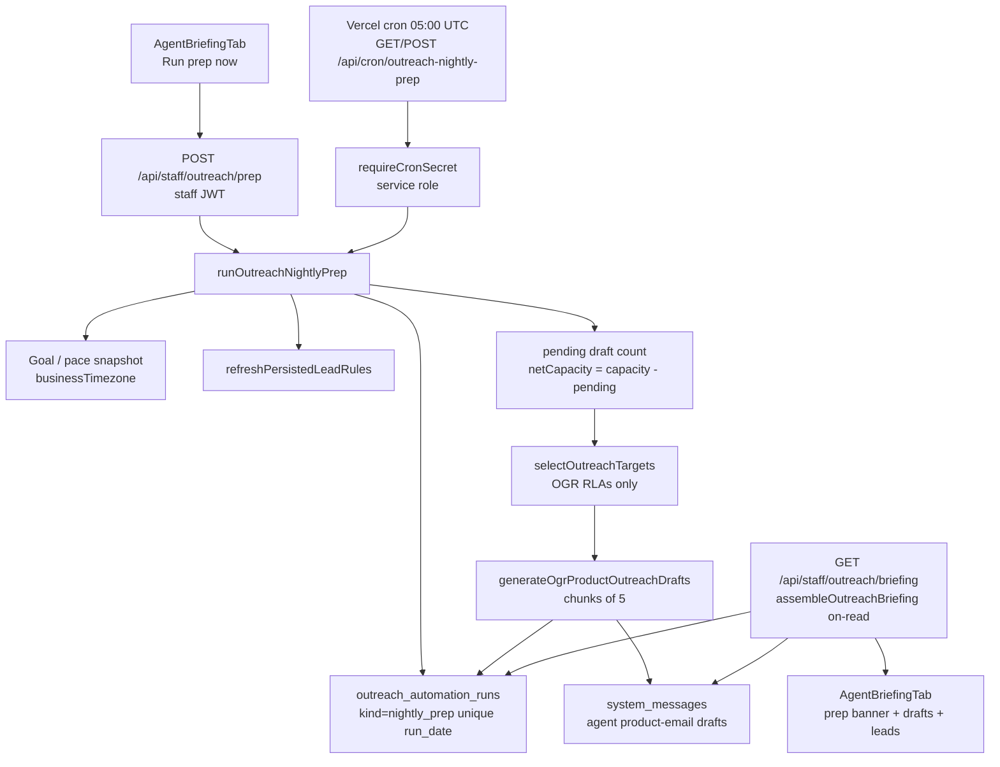

# Run prep now — architectural assessment & gap analysis

Date: 2026-08-25  
Scope: Staff **Run prep now** control on Daily Agent Briefing, shared nightly prep orchestrator, cron path, and briefing consumption.  
Product principle: **Agent recommends; staff send.** Prep must never call Resend / product-email send.

---

## Verdict

Prep is a solid **OGR draft-only** orchestrator with run-table idempotency, pace-aware capacity, partial AI failure handling, and an on-read Daily Agent Briefing. The overnight cron path is coherent. The largest gaps are operational, not foundational:

1. **Default “Run prep now” prepares tomorrow; Briefing shows today** — daytime recovery after a missed overnight run is wrong unless staff pass `preparationDate` (UI never does).
2. **Zero multi-line awareness** while Briefing / prep UI still appear on every sales line.
3. **Phase 5 docs drift** (`agent_briefing_runs` / snapshots never shipped; live = `outreach_automation_runs` + on-read assembly).

---

## End-to-end architecture

| Step         | Artifact                                                                                                                                                               |
| ------------ | ---------------------------------------------------------------------------------------------------------------------------------------------------------------------- |
| UI           | [`src/components/tabs/AgentBriefingTab.tsx`](../../src/components/tabs/AgentBriefingTab.tsx) — `runPrepNow()` → `staffPost('/api/staff/outreach/prep', {})`            |
| Manual API   | [`src/pages/api/staff/outreach/prep.ts`](../../src/pages/api/staff/outreach/prep.ts) — `requireApprovedStaffClient`, `maxDuration = 300`, optional `preparationDate`   |
| Cron API     | [`src/pages/api/cron/outreach-nightly-prep.ts`](../../src/pages/api/cron/outreach-nightly-prep.ts) — `requireCronSecret` + service role                                |
| Schedule     | [`vercel.json`](../../vercel.json) — `0 5 * * *` → `/api/cron/outreach-nightly-prep`                                                                                   |
| Orchestrator | [`src/lib/outreachNightlyPrep.ts`](../../src/lib/outreachNightlyPrep.ts) — `runOutreachNightlyPrep` / `continuePrep`                                                   |
| Selection    | [`src/lib/outreachSelectTargets.ts`](../../src/lib/outreachSelectTargets.ts) — hardcoded `lines.code = 'ogr'`                                                          |
| Drafts       | [`src/lib/generateOgrProductOutreachDraft.ts`](../../src/lib/generateOgrProductOutreachDraft.ts) — insert/update; stamps `automation_run_id` **on insert only**        |
| Briefing     | [`src/lib/outreachBriefing.ts`](../../src/lib/outreachBriefing.ts) — on-read assembly; no snapshot table                                                               |
| Schema       | [`supabase/migrations/20260812140000_outreach_automation_runs.sql`](../../supabase/migrations/20260812140000_outreach_automation_runs.sql) — unique `(kind, run_date)` |

**Invariant:** prep never imports send/Resend helpers (enforced by unit test).

**Not written by prep:** lead-list rows, briefing snapshots, outbound email.

---

## Component responsibilities

| Function / surface          | Responsibility                                                                                      |
| --------------------------- | --------------------------------------------------------------------------------------------------- |
| `runPrepNow` (UI)           | Escape hatch; empty body; reload briefing token on success                                          |
| Staff prep route            | Auth; resolve `preparationDate` (default next selling day); `trigger: 'manual'`                     |
| Cron route                  | Secret; service role; `trigger: 'cron'`; default next selling day                                   |
| `runOutreachNightlyPrep`    | Idempotency gate; capacity from pace as-of noon on `run_date`                                       |
| `continuePrep`              | Lead-rules refresh → pending count → channel allocate → select → chunked generate → finalize status |
| `finalizeStatus`            | Map counts → `succeeded` / `empty_pool` / `partial` / `failed`                                      |
| `defaultNightlyPrepRunDate` | **Next** selling day **after** today                                                                |
| `briefingSellingDate`       | Today if weekday, else next (`nextSellingDayOnOrAfter`)                                             |
| `selectOutreachTargets`     | OGR RLA pool → eligibility → channel fill/spill → product pick                                      |
| `assembleOutreachBriefing`  | Prep banner + goals + drafts + Hot/Call/Warm + learning slices                                      |

---

## Auth matrix

| Path         | Auth                                         | DB client         | Actor                                                                  |
| ------------ | -------------------------------------------- | ----------------- | ---------------------------------------------------------------------- |
| Manual prep  | Approved staff JWT                           | User-scoped (RLS) | `triggeredBy = userId`; drafts `sent_by` = that user                   |
| Cron         | `Authorization: Bearer CRON_SECRET`          | Service role      | `triggeredBy = null`; drafts use `OUTREACH_PREP_ACTOR_USER_ID` or null |
| Briefing GET | Staff JWT (+ optional `sales_line_id` query) | User client       | N/A                                                                    |

---

## Idempotency, capacity, dates

### Idempotency

- Unique `(kind, run_date)` on `outreach_automation_runs`.
- Terminal noop: `succeeded` or `empty_pool` → return existing run (no re-select / re-generate).
- Concurrent: `running` younger than 15 minutes → HTTP 409.
- Stale `running` → mark failed, then reclaim and retry.
- `failed` / `partial` → reset counters on same row and re-enter `continuePrep`.
- Draft path: `regenerate: false`; skip targets that already have a pending draft.

### Capacity

- `capacity = pace.recommendedDailySends` evaluated at noon local on `run_date` (so weekday pace is non-zero).
- `netCapacity = max(0, capacity − pendingBefore)`.
- Zero capacity → succeeded with reason (`goal_met_or_non_selling` / `already_at_pace`).

### Selling day / timezone

- Business TZ from outreach goal settings (default `America/Vancouver`).
- Weekdays only — no holiday calendar.
- **Cron / default manual:** next selling day **after** today.
- **Briefing:** today if selling day, else next.
- Staff API allows catch-up `preparationDate: today` when today is a weekday; **UI never sends it**.

### `sales_line_id`

Absent from prep orchestrator, staff prep route, cron, and automation-run schema. Selection hardcodes OGR. Multi-line tests lock this in.

---

## Failure modes

| Mode                                 | Behavior                                                    |
| ------------------------------------ | ----------------------------------------------------------- |
| Goal / lead-rules / select hard fail | Run → `failed`                                              |
| Selection empty with capacity        | `empty_pool` (terminal for that date)                       |
| Per-target draft insert errors       | Counted; mid-loop progress; final `partial` if any produced |
| Stub drafts (no AI)                  | Expected for prep; personalized copy is staff **Add copy**  |
| All selected fail                    | `failed`                                                    |
| Concurrent run                       | 409                                                         |
| Already pending draft                | `skippedCount` (not failure)                                |

**Partial-retry nuance:** retry resets `produced_count` to 0; banner metrics reflect the retry batch, not cumulative day drafts.

**Pending-count risk:** paginates global pending drafts (newest first, cap ~2000) then filters in memory — undercount risk if many unrelated pendings exist.

---

## Multi-line constraints

| Concern                     | Current behavior                                                                |
| --------------------------- | ------------------------------------------------------------------------------- |
| Prep / selection            | OGR-only                                                                        |
| Briefing on EP / Big Fish   | Empty book: “No outreach book for {lineCode} yet.”                              |
| Empty-book TZ               | Hardcoded `America/Vancouver` (ignores goal settings)                           |
| **Run prep now** visibility | Always shown; no line gate — can still fire OGR prep while viewing another line |

---

## Gap analysis

### P0 — Product / date mismatch (recovery)

| Issue                                                               | Impact                                                                                                  |
| ------------------------------------------------------------------- | ------------------------------------------------------------------------------------------------------- |
| Overnight cron preps **tomorrow**; morning briefing shows **today** | Aligned after a successful overnight run                                                                |
| Daytime **Run prep now** also defaults to **tomorrow**              | After a **missed** overnight run, staff still see “No prep for today” while prep creates tomorrow’s run |
| API supports `preparationDate: today`; UI posts `{}`                | Escape hatch incomplete without a catch-up control                                                      |

**Recommended direction:** When briefing `sellingDate` has no successful run, “Run prep now” should target that same `sellingDate` (or offer explicit Today / Next day).

### P1 — Multi-line UX / data model

| Issue                            | Impact                                                  |
| -------------------------------- | ------------------------------------------------------- |
| Prep has no `sales_line_id`      | EP/BF cannot have their own book                        |
| Prep button on all lines         | Operator can mutate OGR prep while viewing another line |
| Single global `(kind, run_date)` | Future multi-line prep needs a line-scoped unique key   |

### P1 — `empty_pool` permanence

Once a date is `empty_pool`, same-day refill is impossible even if the eligible pool grows (new imports, eligibility changes). Consider allowing retry from `empty_pool` under an explicit ops policy.

### P2 — Observability

| Gap                   | Notes                                                                   |
| --------------------- | ----------------------------------------------------------------------- |
| No step timestamps    | Only run start/finish                                                   |
| `target_errors` in DB | Not surfaced in staff UI beyond banner counts                           |
| No external alert     | Epic treated alerts as optional; in-app banner only                     |
| Mid-chunk crash       | Leaves `running` until 15-minute stale reclaim                          |
| Cron actor unset      | Drafts may have null `sent_by` if `OUTREACH_PREP_ACTOR_USER_ID` missing |

### P2 — Epic / doc drift

| Phase 5 doc claim                              | Live reality                                                                                                                            |
| ---------------------------------------------- | --------------------------------------------------------------------------------------------------------------------------------------- |
| `agent_briefing_runs` / `agent_briefing_items` | **Not in codebase**                                                                                                                     |
| Optional `outreach_briefing_snapshots`         | Not implemented; briefing is on-read                                                                                                    |
| Account research before product pick           | Explicitly **out of** prep loop today ([account-research epic](../epics/agentic-outreach/account-research-before-product-selection.md)) |

### P3 — Test holes

**Covered:** no Resend import; happy path; weights; succeeded noop; `empty_pool`; `partial`; `already_at_pace`; staff/cron auth smoke.

**Thin / missing:**

- Stale `running` reclaim + fresh 409
- `failed` / `partial` retry and produced-count reset
- Unique insert race
- UI empty body vs briefing date mismatch
- Pending-count pagination ceiling
- Non-OGR briefing + prep still runnable
- Integration with real selection + DB

---

## What works well

- Clear **draft-only** boundary (cron/manual both share one orchestrator; send unreachable).
- **Idempotent** successful / empty-pool runs prevent duplicate books for a date.
- Pace-aware **net capacity** accounts for already-pending drafts.
- Partial AI failures do not discard successful drafts; status reflects reality.
- Briefing is cheap to evolve (on-read) without snapshot schema churn.
- Staff and cron auth paths are correctly separated (JWT vs cron secret / service role).

---

## Recommended next work (ordered)

1. **Fix Run prep now catch-up:** bind default (or recovery) `preparationDate` to briefing `sellingDate` when that date has no terminal success; keep next-day default for proactive overnight-style runs if desired.
2. **Gate prep UI by line:** hide or disable on non-OGR until multi-line prep exists; show copy explaining OGR-only book.
3. **Document / amend Phase 5** to name `outreach_automation_runs` and on-read briefing (remove fictional table names).
4. **Surface `target_errors`** (or first N) on the prep banner for partial/failed runs.
5. **Revisit `empty_pool` terminal** policy for same-day eligibility growth.
6. **Add tests** for date mismatch, stale reclaim, and non-OGR prep visibility.

---

## Deferred “Add copy” (2026-08-25)

Prep is **stub-only**: `copyMode: 'generic_stub'` writes deterministic subject + default intro/closing (`copyStatus: 'stub'`) and does **not** call `produceOutreachCopy`. Personalized prose runs only when staff opens a draft and clicks **Add copy** (one target per request; staff API rejects `targets.length > 1`). Add copy uses CRM + product + `prospects.website` host + accepted account-research citation excerpts when present.

---

## Regional manual prep (2026-08-25 slice)

Shipped first slice for coastal/road-trip books:

- Manual **Run prep now** on OGR Briefing selects an **operational territory** (`pnw-west` / `pnw-east`) plus optional store geo (`or` / `wa`), fixed **limit 25**, **fit_score** rank, no channel spill.
- Run kind `manual_regional_prep` with unique `(run_date, operational_territory_id, store_territory_code)`; `empty_pool` is retryable for regional only.
- Overnight cron remains behind `FEATURE_OUTREACH_NIGHTLY_PREP` (default off).
- **Deferred:** proximity / coastal-county route order; CA ops territories in OGR prep.

---

## Key file index

| Path                                                                       | Why it matters               |
| -------------------------------------------------------------------------- | ---------------------------- |
| `src/components/tabs/AgentBriefingTab.tsx`                                 | Run prep now UX              |
| `src/pages/api/staff/outreach/prep.ts`                                     | Manual prep + date rules     |
| `src/pages/api/cron/outreach-nightly-prep.ts`                              | Scheduled prep               |
| `src/lib/outreachNightlyPrep.ts`                                           | Orchestrator + date helpers  |
| `src/lib/outreachSelectTargets.ts`                                         | OGR selection                |
| `src/lib/outreachBriefing.ts`                                              | Morning surface              |
| `src/lib/generateOgrProductOutreachDraft.ts`                               | Draft create/skip            |
| `vercel.json`                                                              | Cron schedule                |
| `docs/epics/agentic-outreach/phase-5-nightly-briefing.md`                  | Intent (partially drifted)   |
| `docs/epics/agentic-outreach/account-research-before-product-selection.md` | Accurate live pipeline notes |
