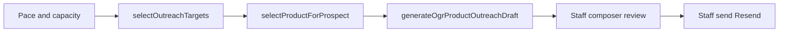
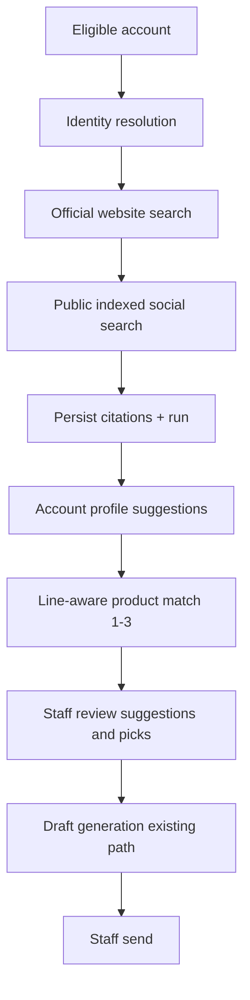

# Account Research Before Product Selection

**Status:** Planning only (Aug 2026) — do not implement from this doc without an approved PR plan.  
**Epic parent:** [Agentic Outreach](./README.md)  
**Audience:** Implementation agents and reviewers. Treat this file as the source of truth for the Account Research feature until code lands.

---

## 1. Objective

Insert an **on-demand public-web Account Research** step **before** catalog product selection so the agent:

1. Resolves the correct business identity before accepting evidence.
2. Searches the official website and publicly indexed recent social activity.
3. Stores reviewable evidence (URL, title, platform, dates, excerpt, confidence, identity confidence).
4. Produces **suggestions only** — never auto-overwrites canonical CRM fields.
5. Uses account evidence + line context to recommend **1–3** catalog products with citations.
6. Avoids products recently emailed to the same account.
7. Keeps staff approval before draft generation or send.
8. Uses a **7-day freshness** window with manual refresh.
9. Never treats missing indexed social activity as business inactivity.
10. Never accesses private social content or bypasses platform restrictions.

**Hard separation:** retailer-level research ≠ line-specific product matching.

---

## 2. Current-state evidence (live code audit)

### 2.1 Outreach pipeline today (no research step)

Nightly prep orchestrator: [`src/lib/outreachNightlyPrep.ts`](../../../src/lib/outreachNightlyPrep.ts)  
Cron: [`src/pages/api/cron/outreach-nightly-prep.ts`](../../../src/pages/api/cron/outreach-nightly-prep.ts)  
Manual prep: [`src/pages/api/staff/outreach/prep.ts`](../../../src/pages/api/staff/outreach/prep.ts)

| #   | Step                            | Key module                                                                            | Writes                         |
| --- | ------------------------------- | ------------------------------------------------------------------------------------- | ------------------------------ |
| 1   | Goal / pace / capacity          | `outreachPace.ts`, goal snapshot                                                      | —                              |
| 2   | Automation run row              | `outreachNightlyPrep.ts`                                                              | `outreach_automation_runs`     |
| 3   | Lead-rules refresh              | `refreshPersistedLeadRules.ts`                                                        | goal settings lead-rules cache |
| 4   | Channel + product + fit weights | `outreachChannelWeights.ts`, `outreachProductWeights.ts`, `outreachFitBandWeights.ts` | run JSON                       |
| 5   | Channel slot allocation         | `outreachChannelAllocation.ts`                                                        | —                              |
| 6   | **Account + product select**    | `outreachSelectTargets.ts`                                                            | — (DTO only)                   |
| 7   | AI draft copy                   | `generateOgrProductOutreachDraft.ts`                                                  | `system_messages` drafts       |
| 8   | Finalize run                    | prep orchestrator                                                                     | run status                     |

Morning briefing is **on-read** ([`outreachBriefing.ts`](../../../src/lib/outreachBriefing.ts)), not a prep write.



**Gap:** There is **no Account Research step** between eligibility and product selection. Product pick uses CRM channels / themes already on the prospect row.

### 2.2 Account selection

| Concern         | Location                                               | Behavior                                                                                            |
| --------------- | ------------------------------------------------------ | --------------------------------------------------------------------------------------------------- |
| Pool load       | `outreachSelectTargets.ts` → `loadProspectAccounts`    | OGR RLAs: prospect pool + opened reactivation with `outreach_eligible`                              |
| Hard exclusions | same                                                   | pending agent draft, no usable email, bounce/complaint suppression, 14-day cooldown                 |
| Rank            | `outreachEligibility.ts` `compareOutreachProspectRank` | priority → fit → fit-band weights → grade → channel → older last send                               |
| Constants       | `outreachSelectionConstants.ts`                        | cooldown **14d**, product dedup **90d**, Top rank **30**, pending statuses `draft/queued/scheduled` |

### 2.3 Product selection

| Concern           | Location                                         | Behavior                                                                                      |
| ----------------- | ------------------------------------------------ | --------------------------------------------------------------------------------------------- |
| Pool              | `outreachProductSelection.ts`                    | Published OGR active + public slug; Top 30 sales rank **or** `is_new`                         |
| Prior-email avoid | `fetchRecentProductOutreachCatalogIdsByProspect` | Exclude catalog ids with `sent_at` in last **90 days**                                        |
| Fit               | `selectProductForProspect`                       | Prefer channel intersection → weak global → remainder; measured product weights when adaptive |
| Output            | `SelectedOutreachTarget`                         | Frozen DTO including **one** product + `selectionReasons`                                     |

### 2.4 Draft gen context (not research)

[`generateOgrProductOutreachDraft.ts`](../../../src/lib/generateOgrProductOutreachDraft.ts) `loadProspectContext` loads only:

- `city`, `region`, `fit`, `lifestyleThemes`

Prompt rules forbid inventing facts. No web search at draft time.

### 2.5 Human-review and send gates

| Gate                           | Where                                                                            |
| ------------------------------ | -------------------------------------------------------------------------------- |
| Status must be `draft` to send | `drafts/[id]/send.ts`, `markAgentProductOutreachDraftSent`                       |
| Composer review / edit         | `OgrProductEmailComposerModal.tsx`                                               |
| Staff send only                | Resend from authenticated staff; agent never calls Resend                        |
| Cancel                         | `drafts/[id]/cancel.ts` → `cancelled`                                            |
| Auth                           | `requireApprovedStaffClient` on staff APIs; cron uses service role + cron secret |

**No separate approve status** — review + Send is the gate. Agent origin: `agent_product_email`.

### 2.6 Suppression (selection)

Implemented via `system_messages` bounce/complaint signals (`loadSuppressedKeys`, `isProductOutreachRecipientSuppressed`).

**Not implemented for selection:** unsubscribe / List-Unsubscribe / DNC (documented gap in phase-1).

### 2.7 Existing public-web research (parallel product, not wired to outreach)

| Capability                    | Path                                 | Notes                                                                                                                              |
| ----------------------------- | ------------------------------------ | ---------------------------------------------------------------------------------------------------------------------------------- |
| Company web research          | `src/lib/companyWebResearch.ts`      | Perplexity via AI Gateway; identity disambiguation by city/URL; directory host denylist includes `facebook.com`                    |
| Fill-blank evidence           | `src/lib/fillBlankProspectFields.ts` | Zod `FillBlankEvidence`: website, address, phone, category, apparel, themes, `operatingConfirmed`, `directoryOnly`, `sourceUrls[]` |
| Research update preview/apply | `src/lib/updateProspectResearch.ts`  | Modes `fill-blanks` / `update`; apply overwrites allowlisted fields after staff confirm                                            |
| Contact enrich                | `src/lib/createEnrichedContact.ts`   | Separate contact gaps                                                                                                              |
| Lookalike search              | `src/lib/lookalike/search.ts`        | Perplexity; candidates store free-text `evidence`                                                                                  |
| Landed rates                  | `src/lib/landedRatesResearch.ts`     | Unrelated FX research                                                                                                              |
| Agent CRM tools               | `src/lib/agentCrmTools.ts`           | **DB-only** — no web search tool                                                                                                   |
| Chat agent                    | `src/pages/api/agent.ts`             | No Perplexity tool                                                                                                                 |

**Provider today:** single path — `gateway.tools.perplexitySearch({ maxResults: 5, searchDomainFilter? })` + `AI_GATEWAY_API_KEY`. No multi-provider abstraction.

### 2.8 Evidence storage today

| Store                                                        | What it holds                                                                                               | Gaps vs target                                                             |
| ------------------------------------------------------------ | ----------------------------------------------------------------------------------------------------------- | -------------------------------------------------------------------------- |
| `account_enrichment_jobs.research_brief` + `.evidence` jsonb | Job-scoped fill-blank / update blobs                                                                        | Not citation-row shaped; job lifecycle tied to import/enrich               |
| `retailer_field_changes`                                     | Per-field audit: `source_urls`, `confidence` text, `provider`, `status` pending/applied/rejected/superseded | No title, platform, published/observed dates, excerpt, identity confidence |
| `lookalike_candidates.evidence`                              | Free-text                                                                                                   | Unstructured                                                               |
| `prospects.website` (+ taxonomy)                             | Thin durable leftovers after apply                                                                          | No social URL columns                                                      |
| `system_messages.payload`                                    | Product outreach generation metadata                                                                        | Not research                                                               |

### 2.9 Social URLs and research timestamps

| Need                                                                                     | Status                                                                                             |
| ---------------------------------------------------------------------------------------- | -------------------------------------------------------------------------------------------------- |
| Instagram / Facebook / LinkedIn / X / TikTok / YouTube URL columns on `prospects` or RLA | **Missing**                                                                                        |
| `last_researched_at` / `enriched_at` on prospect                                         | **Missing**                                                                                        |
| Dedicated `research_evidence` (or equivalent) citation table                             | **Missing**                                                                                        |
| Social treated as research target (not just directory denylist)                          | **Missing** — `facebook.com` is currently a **directory host to avoid** in `companyWebResearch.ts` |

### 2.10 Tables in scope (existing)

| Table                      | Role for this feature                                                                   |
| -------------------------- | --------------------------------------------------------------------------------------- |
| `prospects`                | Retailer identity; `website` only for web identity today                                |
| `retailer_line_accounts`   | Line relationship + markers (`outreach_eligible`, etc.); no research columns            |
| `retailer_field_changes`   | Suggested vs applied field ledger (reuse for profile **suggestions**, not citations)    |
| `account_contacts`         | Buyer email/phone; no social                                                            |
| `catalog_items`            | Product pool                                                                            |
| `system_messages`          | Drafts + prior product email history (`product_outreach`, `sent_at`, `catalog_item_id`) |
| `account_enrichment_jobs`  | Existing enrich jobs — **do not overload** for outreach research runs                   |
| `outreach_automation_runs` | Nightly prep — research should be separately keyed                                      |

### 2.11 Prior product email history

Source of truth: `system_messages` where `message_type = 'product_outreach'` and `sent_at IS NOT NULL`.

- Dedup window used by selection: **90 days** (`AGENT_OUTREACH_PRODUCT_DEDUP_DAYS`).
- Helpers: `fetchRecentProductOutreachCatalogIdsByProspect`, `fetchLatestProductOutreachSend`, contact activity history.

### 2.12 Canonical overwrite behavior today (contrast)

- **Manual AI Update apply** and **fill-blanks apply** can write allowlisted prospect columns after staff confirm (`updateProspectResearch.ts`).
- **Bulk import enrich** may auto-apply “safe” diffs and leave uncertain ones `pending` on `retailer_field_changes`.

**This feature must be stricter:** research never writes canonical CRM fields automatically. Suggestions only, until explicit staff apply (separate action).

---

## 3. Target architecture

### 3.1 Placement in the outreach flow

Insert research **after** account eligibility/ranking and **before** (or as input to) product recommendation. Two operating modes:

| Mode                                     | When                                                                                | Product selection                                                                                                      |
| ---------------------------------------- | ----------------------------------------------------------------------------------- | ---------------------------------------------------------------------------------------------------------------------- |
| **A. On-demand review** (primary for v1) | Staff opens research for a selected account from Briefing / Directory / prep review | Recommend 1–3 products; staff picks; then draft gen                                                                    |
| **B. Prep-time optional** (later phase)  | Nightly prep for N highest-ranked targets with stale/missing research               | Cache research; still **one** product for auto-draft only after staff-approved profile or “use cached research” policy |

**v1 recommendation:** Mode A only. Do not block nightly `selectOutreachTargets` / draft generation on research. Wire research into Briefing and account drawer first; integrate into prep as Phase 3+.



### 3.2 Layer separation (required)

| Layer                     | Scope                                         | Keyed by                        | Must not contain                       |
| ------------------------- | --------------------------------------------- | ------------------------------- | -------------------------------------- |
| **Retailer research**     | Public identity + evidence about the business | `retailer_id` (`prospects.id`)  | Line-specific SKU picks, OGR-only copy |
| **Line product matching** | Catalog recommendations                       | `retailer_id` + `sales_line_id` | Raw web scrape storage owned by line   |

```
prospects (retailer)
  └── account_research_runs (retailer-level)
        └── account_research_citations (evidence rows)
        └── account_research_profile_suggestions (optional normalized suggestions)
  └── retailer_line_accounts (line)
        └── account_product_match_runs (line-specific)
              └── account_product_match_items (1–3 SKUs + rationale + citation ids)
```

### 3.3 Identity resolution gate

Before accepting any evidence as belonging to this account:

1. Inputs: CRM `name`, `city`/`region`, `address`, existing `website`, optional phone.
2. Resolve candidate official website (reuse patterns from `companyWebResearch` + fill-blank `officialWebsite`).
3. Compute **identity confidence** (`high` | `medium` | `low` | `unresolved`).
4. If `unresolved` or `low`: store run as `needs_identity_review`; **do not** attach social/website excerpts as accepted evidence for matching; still allow staff to confirm identity manually.
5. Never invent a different store with a similar name (existing prompt discipline in `companyWebResearch.ts`).

### 3.4 Web + social search rules

| Source           | Allowed                                                         | Forbidden                                                                                |
| ---------------- | --------------------------------------------------------------- | ---------------------------------------------------------------------------------------- |
| Official website | Public pages via search provider / domain filter                | Login walls, inventing pages                                                             |
| Social           | Publicly **indexed** posts/profiles returned by search provider | Private accounts, authenticated scrapes, ToS bypass, unofficial mirrors as sole identity |
| Directories      | Lead-only (existing directory host list)                        | Treat as operational proof                                                               |

**Missing indexed social activity ≠ inactive business.** Persist explicit finding:

- `social_index_status`: `found` | `none_indexed` | `not_searched` | `blocked`
- Profile suggestion / briefing copy must say “no recent public indexed activity found,” never “store appears inactive.”

### 3.5 Product matching rules

Inputs:

- Accepted research citations + profile suggestions (themes, apparel capability, merch signals).
- Line context (`sales_line_id`, AI persona / catalog for that line; OGR first).
- Existing CRM taxonomy as **hints**, not sole truth.
- Prior sends: reuse `fetchRecentProductOutreachCatalogIdsByProspect` (90d) — exclude those SKUs.
- Pool: same Top 30 / New published pool as `loadOutreachProductPool` (or line-scoped equivalent later).

Outputs: **1–3** ranked `catalog_item_id`s, each with:

- match rationale (short)
- citation ids (FK to research citations)
- fit kind / score
- “excluded recent send” note if near-miss

Staff must pick a product (or approve the top pick) before draft generation.

### 3.6 Staff gates

| Action                           | Gate                                                                           |
| -------------------------------- | ------------------------------------------------------------------------------ |
| Run / refresh research           | Approved staff                                                                 |
| Accept identity                  | Staff confirm when confidence &lt; high                                        |
| Apply profile suggestions to CRM | Explicit apply → `retailer_field_changes` + prospect update (existing pattern) |
| Accept product match             | Staff select SKU(s)                                                            |
| Generate draft                   | Existing generate-draft API / prep path only after product chosen              |
| Send                             | Existing composer send                                                         |

Agent still never calls Resend.

### 3.7 Freshness (7 days)

| Field                           | Meaning                                                    |
| ------------------------------- | ---------------------------------------------------------- |
| `researched_at` on research run | Wall clock when run completed successfully                 |
| Fresh                           | `now - researched_at &lt; 7 days` and `status = succeeded` |
| Stale                           | Older than 7 days or superseded                            |
| Manual refresh                  | Staff action forces new run even if fresh                  |

Product match runs should record `research_run_id` used. If research goes stale, mark match run `stale_research` and require refresh before trusting recommendations.

---

## 4. Schema proposal (smallest additive)

**Verdict:** Existing tables **cannot** cleanly support citation-level evidence + freshness + line-separated matches without overloading `account_enrichment_jobs.evidence` jsonb and losing queryability. Propose **four small tables** + optional thin columns on `prospects`.

### 4.1 New tables

#### `account_research_runs`

| Column                                       | Type                 | Notes                                                                          |
| -------------------------------------------- | -------------------- | ------------------------------------------------------------------------------ |
| `id`                                         | uuid PK              |                                                                                |
| `retailer_id`                                | int FK → `prospects` | Retailer-level                                                                 |
| `status`                                     | text                 | `running` \| `succeeded` \| `failed` \| `needs_identity_review` \| `cancelled` |
| `provider`                                   | text                 | e.g. `perplexity_via_gateway`                                                  |
| `trigger`                                    | text                 | `manual` \| `prep` \| `api`                                                    |
| `identity_confidence`                        | text                 | `high` \| `medium` \| `low` \| `unresolved`                                    |
| `resolved_website`                           | text null            |                                                                                |
| `social_index_status`                        | text                 | `found` \| `none_indexed` \| `not_searched` \| `blocked`                       |
| `research_brief`                             | text null            | Short narrative (not canonical CRM)                                            |
| `error`                                      | text null            |                                                                                |
| `started_at` / `completed_at` / `created_at` | timestamptz          |                                                                                |
| `requested_by`                               | uuid null            | auth user                                                                      |
| `supersedes_run_id`                          | uuid null            | Chain for refresh                                                              |

#### `account_research_citations`

| Column                | Type             | Notes                                                                                                          |
| --------------------- | ---------------- | -------------------------------------------------------------------------------------------------------------- |
| `id`                  | uuid PK          |                                                                                                                |
| `research_run_id`     | uuid FK          |                                                                                                                |
| `retailer_id`         | int FK           | Denormalized for RLS/query                                                                                     |
| `source_url`          | text             | Required                                                                                                       |
| `title`               | text null        |                                                                                                                |
| `platform`            | text             | `website` \| `instagram` \| `facebook` \| `linkedin` \| `x` \| `tiktok` \| `youtube` \| `other` \| `directory` |
| `published_at`        | timestamptz null | When known from source                                                                                         |
| `observed_at`         | timestamptz      | When we saw it (required)                                                                                      |
| `excerpt`             | text null        | Short quote; never private content                                                                             |
| `confidence`          | text             | `high` \| `medium` \| `low`                                                                                    |
| `identity_confidence` | text             | Per-citation attachment confidence                                                                             |
| `accepted`            | boolean          | Default false until identity gate passes / staff accept                                                        |
| `metadata`            | jsonb            | Provider raw ids, etc. (non-secret)                                                                            |

#### `account_research_profile_suggestions`

Normalized suggestions **not** written to `prospects` until apply:

| Column            | Type      | Notes                                                         |
| ----------------- | --------- | ------------------------------------------------------------- |
| `id`              | uuid PK   |                                                               |
| `research_run_id` | uuid FK   |                                                               |
| `retailer_id`     | int FK    |                                                               |
| `field_path`      | text      | Align with `retailer_field_changes.field_path` where possible |
| `suggested_value` | jsonb     |                                                               |
| `rationale`       | text null |                                                               |
| `citation_ids`    | uuid[]    |                                                               |
| `status`          | text      | `pending` \| `accepted` \| `rejected` \| `superseded`         |
| `confidence`      | text      |                                                               |

**Apply path:** staff accept → write via existing `retailer_field_changes` + prospect update helpers; mark suggestion `accepted`. Do not invent a second apply stack.

#### `account_product_match_runs` + `account_product_match_items`

| Table                         | Key columns                                                                                                                           |
| ----------------------------- | ------------------------------------------------------------------------------------------------------------------------------------- |
| `account_product_match_runs`  | `id`, `retailer_id`, `sales_line_id`, `research_run_id`, `status`, `created_at`, `requested_by`                                       |
| `account_product_match_items` | `id`, `match_run_id`, `catalog_item_id`, `rank` (1–3), `rationale`, `citation_ids` uuid[], `product_fit`, `excluded_recent_send` bool |

### 4.2 Optional thin columns on `prospects` (convenience only)

| Column                         | Purpose                                   |
| ------------------------------ | ----------------------------------------- |
| `last_account_research_at`     | Fast freshness badge without joining runs |
| `last_account_research_run_id` | Pointer to latest succeeded run           |

**Do not** add social URL columns in v1 unless staff apply invents them via suggestions → then add allowlisted columns in a later PR. Prefer storing discovered social URLs as **citations** (`platform` + `source_url`) first.

### 4.3 What not to reuse as primary store

| Avoid                                             | Why                                                                  |
| ------------------------------------------------- | -------------------------------------------------------------------- |
| Stuffing citations into `system_messages.payload` | Wrong domain; pollutes outreach ledger                               |
| Overloading `account_enrichment_jobs`             | Different lifecycle (import/enrich); mode enum is fill-blanks/update |
| Writing suggestions straight to `prospects`       | Violates no-auto-overwrite                                           |

### 4.4 RLS

Mirror existing pattern:

```sql
-- approved staff full access
using (public.is_approved_staff())
with check (public.is_approved_staff());
```

On all new tables. No buyer access. Cron/service-role only if a future prep job needs it (document exception).

Staff APIs: `requireApprovedStaffClient` only (same as research-update / enrich).

---

## 5. Exact files to touch (implementation map)

### 5.1 New (expected)

| Path                                                                | Role                                                                 |
| ------------------------------------------------------------------- | -------------------------------------------------------------------- |
| `supabase/migrations/YYYYMMDDHHMMSS_account_research.sql`           | Tables + RLS + indexes                                               |
| `src/lib/accountResearch/` (or flat `accountResearch*.ts`)          | Run lifecycle, identity gate, citation write                         |
| `src/lib/accountResearchSearch.ts`                                  | Thin wrapper over Perplexity (extend `companyWebResearch` carefully) |
| `src/lib/accountProductMatch.ts`                                    | 1–3 product recommend using research + pool + 90d dedup              |
| `src/pages/api/staff/account-research/run.ts`                       | Start / refresh research                                             |
| `src/pages/api/staff/account-research/[runId].ts`                   | Get run + citations + suggestions                                    |
| `src/pages/api/staff/account-research/[runId]/apply-suggestions.ts` | Apply accepted fields                                                |
| `src/pages/api/staff/account-product-match/run.ts`                  | Create match run from research                                       |
| `src/components/...`                                                | Research review UI (drawer section or Briefing panel)                |
| `src/types/database.ts`                                             | Regenerated types                                                    |
| Tests under `src/lib/accountResearch*.test.ts`, API tests           |                                                                      |

### 5.2 Extend (reuse)

| Path                                       | Change                                                                                             |
| ------------------------------------------ | -------------------------------------------------------------------------------------------------- |
| `src/lib/companyWebResearch.ts`            | Extract shared search helpers; add social-index search mode without treating FB as identity source |
| `src/lib/fillBlankProspectFields.ts`       | Optionally share Zod fragments for website/apparel/themes — do not merge product surfaces          |
| `src/lib/retailerFieldChanges.ts`          | Apply path for accepted suggestions                                                                |
| `src/lib/outreachProductSelection.ts`      | Export pool helpers for match; keep select-one for nightly                                         |
| `src/lib/systemMessages.ts`                | Reuse recent-send catalog id fetch                                                                 |
| `src/components/tabs/AgentBriefingTab.tsx` | Entry: Research / Refresh on lead or draft row (later)                                             |
| `src/components/AccountDetailDrawer.tsx`   | Research panel                                                                                     |
| `docs/epics/agentic-outreach/README.md`    | Link this doc; update flowchart when shipped                                                       |

### 5.3 Do not change in v1

| Path                                          | Reason                                        |
| --------------------------------------------- | --------------------------------------------- |
| `outreachNightlyPrep.ts` product → draft loop | Keep auto-draft path stable until Mode B      |
| Resend send path                              | Unchanged staff gate                          |
| `agentCrmTools.ts`                            | Optional later; not required for v1 staff API |

---

## 6. Failure and stale-result handling

| Condition                             | Behavior                                                                                                               |
| ------------------------------------- | ---------------------------------------------------------------------------------------------------------------------- |
| Provider / Gateway error              | Run `failed`; surface error; keep prior succeeded run as current for freshness UI                                      |
| Identity unresolved                   | `needs_identity_review`; no accepted citations; no product match until staff confirms or refresh                       |
| Website found, social none indexed    | `social_index_status = none_indexed`; succeed run; **do not** claim inactivity                                         |
| Partial citations                     | Store what passed identity gate; mark others `accepted = false`                                                        |
| Stale (&gt;7d)                        | UI badge; match recommendations disabled or marked stale until refresh                                                 |
| Concurrent refresh                    | New run `supersedes_run_id`; mark prior suggestions `superseded`                                                       |
| Rate limit / cost budget exceeded     | Refuse new run with clear error; do not half-write citations                                                           |
| Catalog product missing / unpublished | Drop from match items; never invent SKU                                                                                |
| All top products in 90d dedup set     | Return empty match with reason `all_recently_emailed`; suggest wait or expand pool with staff override flag (explicit) |

Soft-fail pattern from `researchCompany` (brief null + error) should become **hard status on the run row** for this feature so the UI can distinguish soft vs hard failures.

---

## 7. Cost and rate-limit controls

| Control                       | Proposal                                                                                      |
| ----------------------------- | --------------------------------------------------------------------------------------------- |
| Provider                      | Stay on Vercel AI Gateway + Perplexity (one vendor) for v1                                    |
| Max search calls per run      | Cap tool steps (e.g. `stepCountIs(4–6)`) + `maxResults: 5` per call                           |
| Max runs per retailer per day | e.g. 3 manual refreshes (configurable constant)                                               |
| Max concurrent research jobs  | Serialize per `retailer_id`; global soft concurrency limit on API                             |
| Prep Mode B (later)           | Hard daily budget (N research runs / prep) separate from draft AI budget                      |
| Logging                       | Log provider, step count, duration on run row metadata — no raw PII beyond what’s already CRM |
| Caching                       | Fresh 7-day window is the cache; do not re-bill Perplexity when fresh unless refresh          |

Draft generation (`gpt-4o` in `generateOgrProductOutreachDraft`) remains a **separate** cost center after staff product pick.

---

## 8. Test plan

| Layer            | Cases                                                                 |
| ---------------- | --------------------------------------------------------------------- |
| Identity         | Same name different city → low/unresolved; official site match → high |
| Social absence   | `none_indexed` does not set inactive / operating false                |
| Citations        | Required URL + observed_at; platform enum; accepted flag              |
| Freshness        | &lt;7d fresh; &gt;7d stale; refresh supersedes                        |
| No CRM overwrite | Succeeded research leaves `prospects` unchanged until apply           |
| Apply            | Accepted suggestion writes field change + prospect; rejected no-op    |
| Product match    | Returns 1–3; excludes 90d emailed SKUs; citations attached            |
| Auth             | Unapproved user 401/403 on staff APIs                                 |
| RLS              | Non-staff cannot read research tables                                 |
| Integration      | Match → staff pick → existing generate-draft still works              |

Prefer pure unit tests for identity/match ranking; mock Gateway/Perplexity like existing enrich tests.

---

## 9. Phased PR breakdown

### PR1 — Schema + types + RLS

- Migration for runs, citations, suggestions, match tables (+ optional prospect pointer columns).
- Regenerate `database.ts`.
- Empty lib stubs + RLS tests if present pattern exists.
- **No UI, no nightly changes.**

### PR2 — Research run API (retailer-level)

- Identity gate + website search (refactor shared bits from `companyWebResearch`).
- Persist citations + brief + `social_index_status`.
- Freshness helper + manual refresh.
- Unit tests for identity and “none_indexed ≠ inactive.”

### PR3 — Profile suggestions + apply

- Suggestion rows from research.
- Staff apply/reject → `retailer_field_changes` + allowlisted prospect updates.
- Explicit: no auto-apply.

### PR4 — Product match (line-specific)

- `accountProductMatch` using research + `outreachProductSelection` pool + 90d dedup.
- API to create match run; return 1–3 with citation ids.
- Tests for dedup and empty-pool reasons.

### PR5 — UI surfaces

- Account drawer Research panel: Run / Refresh / citations / suggestions / matches.
- Wire “use selected product → open draft composer / generate-draft.”
- Briefing optional entry point.

### PR6 — (Optional) Prep integration Mode B

- Only after PR1–5 stable.
- Budgeted research for top N stale targets; still no autosend; drafts still staff-reviewed.
- Update epic README flowchart.

**Out of scope for all phases above:** private social scrapers, unsubscribe selection (separate phase-1 gap), autosend, multi-search-provider abstraction (unless Gateway forces it).

---

## 10. GO / NO-GO

### GO if

- Additive tables land with staff-only RLS.
- Identity gate blocks low-confidence evidence from driving product match.
- Freshness = 7 days with manual refresh.
- CRM fields unchanged until explicit apply.
- Product recommendations cite stored evidence and respect 90-day email dedup.
- Draft/send continue to require staff through existing Product Email path.
- Missing social index never implies inactivity.
- Retailer research and line product match stay separate tables/APIs.

### NO-GO if

- Implementation writes `prospects` / RLA fields automatically from research.
- Nightly prep silently changes product selection based on unreviewed research (Mode B without staff policy).
- Evidence stored only as opaque jsonb on enrichment jobs without citation rows.
- Scraping behind logins or using unofficial private APIs.
- Treating “no social results” as store closed / inactive.
- Bypassing composer / send auth for “research-informed” autosend.
- Collapsing line product picks into retailer research rows (breaks multi-line).

### Decision

**GO to implement behind phased PRs (start PR1–PR2), Mode A only.**  
**NO-GO on Mode B prep integration and social URL columns on `prospects` until Mode A proves citation quality and cost controls.**

---

## 11. Open questions (resolve before PR3/PR5)

1. Should accepted social profile URLs eventually become first-class `prospects` columns, or remain citation-only?
2. For OGR-only v1, is `sales_line_id` always OGR, or must match API require explicit line from `LineContext` day one?
3. Does “staff approval before draft generation” mean a new `research_approved` flag, or is picking a matched SKU in UI sufficient?
4. Should Call Today / Hot / Warm briefing cards deep-link to Research before Log Call?

Default recommendations if unanswered: (1) citation-only v1, (2) require `sales_line_id` from line context, (3) SKU pick is sufficient approval, (4) optional later — don’t block Log Call.

---

## 12. Reference index

| Topic                    | Path                                                                                        |
| ------------------------ | ------------------------------------------------------------------------------------------- |
| Epic overview            | `docs/epics/agentic-outreach/README.md`                                                     |
| Selection                | `src/lib/outreachSelectTargets.ts`, `outreachEligibility.ts`, `outreachProductSelection.ts` |
| Prep                     | `src/lib/outreachNightlyPrep.ts`                                                            |
| Draft                    | `src/lib/generateOgrProductOutreachDraft.ts`                                                |
| Ledger                   | `src/lib/systemMessages.ts`                                                                 |
| Web research today       | `src/lib/companyWebResearch.ts`, `fillBlankProspectFields.ts`, `updateProspectResearch.ts`  |
| Field suggestions ledger | `src/lib/retailerFieldChanges.ts`                                                           |
| Staff auth               | `src/lib/agentAuth.ts`                                                                      |
| Schema                   | `supabase/schema.sql`, `src/types/database.ts`                                              |

---

_Document generated from live codebase audit. Implementation must not begin until a PR plan citing this file is approved. This document is planning-only._
