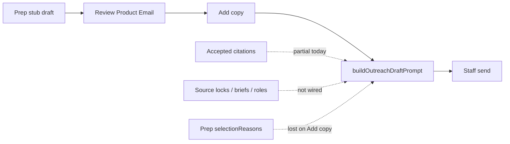

# Epic: Outreach Copy Context & Personalization

**Status:** Draft (Aug 2026) — planning only; do not implement without an approved PR plan.  
**Epic parent:** [Agentic Outreach & Lead Qualification](./README.md)  
**Extends:** [Phase 2 — Draft Generation](./phase-2-draft-generation.md), [Account Research Before Product Selection](./account-research-before-product-selection.md)  
**Related:** [Yelp Business Verification & Contact Enrichment](../yelp-contact-enrichment.md)  
**Audit source:** Live-code assessment of `generateOgrProductOutreachDraft.ts` / Briefing **Add copy** (Aug 2026)

---

## 1. Objective

Make prospecting Product Outreach intros and closings **noticeably more account-specific** by:

1. Feeding generation with the research and CRM context staff already collect (locks, accepted evidence, contact role, selection reasons).
2. Closing the **prep ↔ Add copy** gap so regeneration uses the same frozen selection context prep already chose.
3. Keeping hard safety rules: no invented facts, no pasted live URLs in the email body, no pricing language, staff always review/send.

**Business outcome:** Staff spend less time rewriting stub or generic AI copy; messages reflect what the store actually is (channel, lifestyle, public evidence) while remaining short and send-safe.

---

## 2. Problem statement (current live behavior)

| Fact                              | Detail                                                                                                                                                             |
| --------------------------------- | ------------------------------------------------------------------------------------------------------------------------------------------------------------------ |
| Prep does not AI-write copy       | Regional / nightly prep uses `copyMode: 'generic_stub'` — drafts open with fixed defaults (“strong fit for your store” / “pricing or availability”).               |
| Personalized copy is deferred     | Staff **Add copy** (or research/follow-up AI paths) calls `produceOutreachCopy` → `generateObject` (gpt-4o, promptVersion `v1`).                                   |
| Subject is never AI               | Always `Old Guys Rule — {productName}`.                                                                                                                            |
| Research into prompt is thin      | Up to **5 accepted citation excerpts** (`platform: excerpt\|title`, URLs stripped, ≤180 chars) + website **hostname only**.                                        |
| Live URLs unused as structure     | Source locks, Yelp listing URLs, LinkedIn verification URLs, research briefs are **not** prompt inputs.                                                            |
| Briefing Add copy weakens context | Rebuilds target with `primaryChannel: null`, empty secondaries, `productSalesRank: null`, `productFit: 'global_fallback'` — discards prep’s frozen selection meta. |

Staff can now copy research URLs in the drawer for manual browsing, but the model that writes intro/closing still cannot “see” that evidence in a structured way.



---

## 3. Locked product principles

These supersede vague “more personalization” requests:

| Topic                   | Lock                                                                                                                                                                          |
| ----------------------- | ----------------------------------------------------------------------------------------------------------------------------------------------------------------------------- |
| What AI may write       | **introText + closingText only** (same Phase 2 contract).                                                                                                                     |
| Subject                 | Remains **deterministic** in this epic unless a later slice explicitly opens A/B (non-goal for v1).                                                                           |
| Live URLs in email body | **Forbidden** — model must never paste hrefs; renderer/card already carries product links.                                                                                    |
| Research into prompt    | Prefer **structured, allowlisted facts** + short paraphrasable excerpts — not raw HTML scrapes.                                                                               |
| Invented facts          | Still banned — if evidence is missing, omit the field; do not guess owner title, inventory, or city.                                                                          |
| Autosend                | Still forbidden.                                                                                                                                                              |
| Stub-first prep         | May remain the default for batch cost control; personalization must work correctly when staff click Add copy **and** optionally when research/follow-up generate immediately. |
| Prompt version          | Bump `OGR_OUTREACH_DRAFT_PROMPT_VERSION` when context shape or rules change; store on `payload.generation`.                                                                   |

---

## 4. Desired outcomes

1. **Parity of selection context:** Add copy / regenerate uses the same channel, sales-rank, and productFit signals that prep (or product match) already stored on the draft.
2. **Richer safe research context:** Generation can use locked source **hostnames/platforms**, contact **role/title**, optional short research-brief bullets, and accepted citation notes — without dumping full URLs into the email.
3. **Visible quality lift:** For accounts with locked website + accepted citations, AI intros reference store-specific themes more often than the generic stub (measured via staff edit rate and spot review).
4. **Traceability:** Drafts record which context keys were present (`generation.contextFlags` or equivalent) for debugging and learning.

---

## 5. Scope by slice

Implement as sequential PRs. Each slice must ship tests + `npm run check`.

### Slice A — Context prep parity (highest leverage, low risk)

**Problem:** Briefing Add copy throws away prep metadata.

**Work**

- Persist frozen selection context on the stub draft (`payload.generation`: channels, `selectionReasons`, `productSalesRank`, preparationDate) at prep time (already partially present — verify completeness).
- **Add copy** and regenerate must **reload that frozen target** from the draft (or from `system_messages.payload`) instead of inventing null channels / `global_fallback`.
- Align research handoff + follow-up draft paths so all AI entry points share one `buildSelectedTargetFromDraft` helper.
- UI: no behavior change beyond better intros after Add copy.

**Acceptance**

- [x] Add copy on a prep draft includes the same `primaryChannel` / `productFit` / sales-rank hints that prep wrote.
- [x] Unit tests cover “draft with frozen meta → prompt contains Retail channels / Product fit”.
- [x] Prompt version bump if context block changes. _(No bump — context block shape unchanged.)_

### Slice B — Structured research & profile pack

**Problem:** Locks, roles, and briefs never reach the model.

**Work**

- Introduce `loadOutreachCopyContextPack(client, prospectId, contactId?)` that returns an allowlisted DTO, e.g.:
  - Existing: city, region, fit, lifestyle labels, website host, accepted citation notes (cap 5).
  - **New:** locked sources as `{ platform, hostname }` (not full path/query) for website + social/Shopify locks.
  - **New:** contact `role` / `title` when present (still **no** greeting by name — role is for tone/fit only).
  - **New (optional, clipped):** 1–3 short bullets from latest research brief or Yelp verified name/categories — text only, no URLs.
- Wire pack into `buildSafeOutreachPromptContext` + `buildOutreachDraftPrompt`.
- Keep URL strip + forbidden-key asserts; extend asserts for lock URLs (hostname-only).
- Cap total research note characters to protect token cost.

**Acceptance**

- [x] Locked Instagram/Facebook/website contribute hostname/platform lines when present.
- [x] No full `https://…` strings in the built prompt (test).
- [x] Accounts without research still generate (empty optional fields).

### Slice C — Personalization quality & staff affordances

**Problem:** Staff cannot tell whether copy used research; regenerate may still feel generic.

**Work**

- Composer: show compact “Copy context” meta (e.g. “Used: website host · 3 research notes · channel golf”) after Add copy — read-only, from generation metadata.
- Optional **Regenerate with research** vs **Regenerate shorter** (reuse existing SHORTEN path).
- Soft guidance when research is thin: banner “No accepted citations — copy may stay generic; lock sources or accept citations.”
- Spot-check rubric in tests or a golden-prompt fixture (2–3 fixed context packs → snapshot prompt text, not flaky model output).

**Acceptance**

- [x] Staff can see whether research notes were available for the last AI write.
- [x] Thin-context banner appears when pack has zero notes and no locks.
- [x] Prompt fixtures frozen in unit tests.

### Slice D — Prep-time AI (optional / flag)

**Problem:** Morning queue still opens on stubs, so personalization requires an extra click.

**Work**

- Feature-flagged `copyMode: 'ai'` for regional prep and/or nightly prep with hard rate limits and budget caps.
- On AI failure, keep stub (current defaults) and mark `fallback: 'defaults'`.
- Prefer Slice A+B first so prep-time AI does not bake in weak context.

**Acceptance**

- [ ] Flag off = today’s stub behavior.
- [ ] Flag on = AI intro/closing at prep with same context pack as Add copy.
- [ ] Cost/ops note in run row (`producedCount`, model, failures).

---

## 6. Out of scope

- Autosend, sequences, autonomous reply handling.
- AI-written subject lines or From/signature.
- Pasting live research URLs into the email body or product card.
- Auto-accepting citations or auto-locking sources.
- Redesigning the product card HTML.
- Using private LinkedIn/Yelp sessions or scraping behind login.
- Changing eligibility / product selection ranking (except consuming its DTOs correctly).

---

## 7. Current-state foundation (reuse)

| Area                        | Location                                                  |
| --------------------------- | --------------------------------------------------------- |
| Prompt + AI                 | `src/lib/generateOgrProductOutreachDraft.ts`              |
| Defaults / subject / render | `src/lib/ogrProductOutreachEmail.ts`                      |
| Add copy UI                 | `src/components/OgrProductEmailComposerModal.tsx`         |
| Generate API                | `src/pages/api/staff/ogr-product-email/generate-draft.ts` |
| Prep stubs                  | `src/lib/outreachNightlyPrep.ts`                          |
| Research notes loader       | `loadAcceptedResearchNotesForOutreach` (via pack)         |
| Context pack (Slice B)      | `loadOutreachCopyContextPack` → locks/role/brief/Yelp     |
| Locks / citations           | Account research tables + `AccountResearchPanel`          |
| Contact role                | `account_contacts` + discover preview                     |

---

## 8. Proposed data / metadata changes

Prefer **payload-only** changes first (no migration) unless a slice needs durable queryability:

| Field (on draft `payload.generation`)      | Purpose                                                                                                          |
| ------------------------------------------ | ---------------------------------------------------------------------------------------------------------------- |
| `promptVersion`                            | Already exists — bump on prompt/context changes                                                                  |
| `copyStatus`                               | `stub` \| `ai` (exists)                                                                                          |
| `selectionReasons` / channels / sales rank | Ensure always written at prep and reused on Add copy                                                             |
| `contextFlags` (new)                       | Booleans/counts: `hasWebsiteHost`, `acceptedNoteCount`, `lockedSourceCount`, `hasContactRole`, `hasBriefBullets` |
| `contextPackHash` (optional)               | Debug drift between prep and regenerate                                                                          |

Avoid new CRM columns for social URLs (Account Research lock: citation/lock tables remain source of truth).

---

## 9. Prompt contract (target)

Keep the Phase 2 voice and safety rules. Extend the **Context** block only with allowlisted lines, for example:

```text
…existing rules…

Context (use only what is present; skip empty fields):
Store name: …
Buyer first name: …          # still do not greet by name
Contact role: …              # NEW, if set
City / Region / Fit / Lifestyle / Retail channels: …
Store website host: …
Locked public profiles (hostname only; do not invent activity):
- website: nmscharters.com
- facebook: facebook.com
Recent public notes (paraphrase lightly; do not invent; never paste URLs):
- yelp: …
- website: …
Directory signals: …         # NEW optional, e.g. Yelp verified name/categories text
Product … / Channel match / Product fit: …
```

No separate system message required unless a later slice proves better compliance — default remains single user `prompt` + Zod schema.

---

## 10. Success metrics

| Signal                     | How to read it                                                                |
| -------------------------- | ----------------------------------------------------------------------------- |
| Add-copy edit distance     | Lower staff edit rate on intro after Slice A+B (sample Briefing sends)        |
| Stub→send without Add copy | Should decline if Slice D enabled; otherwise unchanged                        |
| Context coverage           | % of AI drafts with `acceptedNoteCount > 0` or `lockedSourceCount > 0`        |
| Safety regressions         | Zero prompts containing `https://` in CI fixtures; pricing filter still holds |
| Cost                       | Tokens per AI draft; prep-time AI only behind flag                            |

---

## 11. Risks

| Risk                                     | Mitigation                                                    |
| ---------------------------------------- | ------------------------------------------------------------- |
| Model echoes research URLs               | Strip + CI assert; existing sanitize/pricing checks           |
| Over-personalization invents owner facts | Explicit “do not invent”; role/title only when CRM has them   |
| Token/cost growth                        | Caps on notes/locks; stub-first default; flag for prep AI     |
| Stale research                           | Prefer latest completed run; freshness already on research UI |
| Breaking Add copy UX                     | Slice A is behavior-compatible; only copy quality changes     |

---

## 12. Dependencies

- Account Research locks + accepted citations (shipped).
- Phase 2 generate/save/review path (shipped).
- Prep draft carryover / open-batch mounting (shipped) — staff must still see drafts to Add copy.
- Yelp verify / contact role fields when present (optional enrichment for Slice B).

---

## 13. Suggested PR order

1. **PR-A:** Freeze + reuse selection context on Add copy / regenerate (`buildSelectedTargetFromDraft`).
2. **PR-B:** `loadOutreachCopyContextPack` + prompt v2 context lines + tests.
3. **PR-C:** Composer context flags + thin-research banner + prompt fixtures.
4. **PR-D (optional):** Feature-flagged prep-time AI with stub fallback.

---

## 14. Completion checklist

- [ ] Epic reviewed; slices prioritized
- [x] Slice A merged — Add copy parity with prep selection meta
- [x] Slice B merged — structured research/profile pack in prompt
- [x] Slice C merged — staff visibility into context used
- [ ] Slice D decided (ship or explicitly defer)
- [ ] Account Research epic §2.4 / Phase 2 docs updated to match live prompt inputs
- [ ] No autosend; subject still deterministic; no live URLs in generated prose
