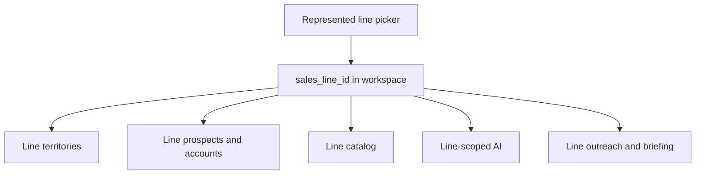

# Epic: Multi-Line / Multi-Territory CRM

**Status:** Draft — documentation only. No application code, migrations, schemas, or production data have been changed. **Requires approval before implementation.**

**Source of truth:** [docs/multi-line-territory-audit.md](../multi-line-territory-audit.md) (revised 2026-08-14).

**Business outcome:** Operate a multi-line independent sales agency without commingling account data. Each represented line has its own accounts, territories, catalog, activities, AI, and KPIs. Shared retailers are identity only.

---

## 1. Epic objective

Replace the current OGR-and-BC single-lifecycle CRM with a **line-first** workspace:

- **Retailer** = shared real-world business identity (dedupe, address, contacts-as-people).
- **Line account** = the commercial relationship between one retailer and one represented line.
- **Line territory** = geographic rights for a particular line (not a field on the retailer).

**Represented lines (this epic):**

| Line | Intent | First ship |
|------|--------|------------|
| Old Guys Rule | Active | Migrate all existing data onto OGR line accounts |
| Eagle Peak | Active or onboarding | Empty book + territories as confirmed; no OGR clone |
| Big Fish | **Confirmed represented** | Empty book; onboard independently; not a Prospective Line |

**Prospective Lines (acquisition pipeline):** up to ~12 candidate principals. Research and retailer-target mapping only. They **must not** participate in active selling, orders, commissions, automated outreach, public catalogs, or active-line KPIs.

Staff always send outreach. This epic does not add autosend.

---

## 2. Current architecture being replaced

Live CRM (see audit §2):

```
prospects (integer PK) = retailer + OGR account + planning sheet
  account_status global: prospect | active_account | inactive
  territory_id → territories (bc|ab|ca|or|wa) on the store
catalog_items.line_id → lines (ogr active, bkg inactive unused)
orders / calls / notes / contacts / reorder / outreach → prospect id
/app tabs, hardcoded ogr, AI prompts “BC wholesale apparel (Old Guys Rule)”
```

Gaps this epic closes: no retailer master, no per-line status, no `sales_line_territories`, California = entire state, Eagle Peak / Big Fish / Prospective Lines absent, RLS not line-scoped.

---

## 3. Non-goals

- Duplicate retailer databases per line
- Autosend, sequences, Gmail as the send system
- Automatic merge of uncertain duplicate retailers
- Treating Northern California as the State of California
- Assigning BC/AB to Eagle Peak or OGR OR/WA/CA without confirmation
- Reusing `bkg` (Busted Knuckles Garage) for Eagle Peak or Big Fish
- Copying OGR prospects/orders onto Eagle Peak or Big Fish
- Putting Prospective Lines in the represented line picker or Daily Briefing
- Combined unlabeled portfolio revenue/KPI

---

## 4. Line status model

Keep physical table `lines`. Add `status` (and treat `active boolean` as derived or drop later):

| Status | Meaning | In represented picker | Selling / orders / convert | Outreach cron / briefing KPIs | Public catalog |
|--------|---------|----------------------|----------------------------|-------------------------------|----------------|
| `active` | Represented, operational | Yes | Yes | Yes (per line) | If published |
| `onboarding` | Represented, not fully live | Yes (badge) | Feature-flagged | No until flag | No until flag |
| `paused` | Represented, temporarily stopped | Yes | Read-only selling | No | Existing URLs may stay |
| `terminated` | Former line | Admin only | No | No | No |
| `prospective` | Acquisition candidate | **No** — `/app/prospective-lines` only | **No** | **No** | **No** |

OGR migrates to `active`. Eagle Peak and Big Fish insert as `onboarding` until catalog/territories/accounts exist, then `active`. Prospective Lines use **only** `prospective`. Soft cap: ~12 prospective rows in UX (schema may allow more; product should warn).

---

## 5. Research-only retailer targets

Prospective Lines may map retailers they *might* sell if the line is signed. That mapping is **not** a selling line account.

**Recommended:** table `retailer_line_targets`

| Column | Purpose |
|--------|---------|
| `id` | PK |
| `retailer_id` | Shared identity |
| `sales_line_id` | Must be `lines.status = prospective` |
| `interest` / `fit_notes` | Research |
| `suggested_geo` | Text only — not `sales_line_territories` rights |
| `status` | `watching` \| `shortlist` \| `dropped` |
| `created_at` / `updated_at` | Audit |

**CHECK:** `sales_line_id` references a prospective line (trigger or app + constraint).

**Forbidden on this table:** orders, convert, commissions, `system_messages` outreach, nightly prep, catalog send.

If implemented as `retailer_line_accounts.status = 'research_target'` instead, the same CHECKs apply; selling statuses remain exclusive to represented lines. Prefer a separate table so unique `(retailer_id, sales_line_id)` on selling accounts stays clean.

Promoting a Prospective Line to represented (`onboarding`/`active`) does **not** auto-convert targets into line accounts. Staff create line accounts deliberately.

---

## 6. End-to-end workflow (represented line)



Cross-line badge: names/statuses only → user must switch line context to open the other book.

---

## 7. Phased implementation

Each phase is a reviewable PR (or small PR stack) on `feature/multi-line-multi-territory-implementation`. Do not skip the OGR split to “just add Eagle Peak.”

Feature-flag convention: `PUBLIC_` is forbidden for secrets. Use server `FEATURE_MULTI_LINE_CRM` (or per-phase flags listed in §12). Flags default off in production until that phase is validated.

### Phase 0 — Decisions and freeze

**Deliverable:** answered audit §14 items needed for seed (Eagle Peak/Big Fish legal names and slugs, norcal as proposed vs county list, OGR rights_type for BC, BKG fate). Backup production. Stop conflicting directory imports.

**Exit:** written decision log in the epic or a short `docs/epics/multi-line-decisions.md` (only if the user wants it; otherwise comments on the implementing PR).

### Phase 1 — Schema foundation (additive)

**Must not** drop `prospects` columns. **Must not** change staff UI behavior yet (flag off).

- `principals`
- Extend `lines`: `principal_id`, `status`, `default_currency`, `commission_rate`, `effective_date`, `termination_date`
- Hierarchical `territories` (drop five-code CHECK; keep `bc,ab,ca,or,wa` as `province_state` rows)
- Seed `norcal` region as **proposed** child of California (not a replacement for `ca`)
- `sales_line_territories`
- `retailer_line_accounts` + `UNIQUE (retailer_id, sales_line_id)` (or partial unique)
- `retailer_line_contacts`
- `retailer_field_changes` (identity audit)
- `retailer_line_targets` for prospective mapping
- Nullable `retailer_line_account_id` on `orders`, `calls`, `system_messages`, `account_reorder_settings` (or 1:1 settings keyed by line account)
- RLS: keep `is_approved_staff()` in v1; document app-level filters

**OGR backfill (same phase or immediately following migration PR):**

- One line account per existing `prospects` row, `lines.code = ogr`
- `sales_line_territories`: OGR × BC `active`; `rights_type` from decisions (or `non_exclusive` + note “unconfirmed”)
- Copy line-specific fields onto the OGR line account
- Stamp existing orders/calls/messages onto that line account (`line_id` null → ogr)
- **Zero** Eagle Peak / Big Fish / prospective line accounts

**Validation:** audit §10.4 queries. Rollback: reverse migration; `prospects` still source of truth.

**Flag:** `FEATURE_MULTI_LINE_SCHEMA` (server) — unused by UI yet.

### Phase 2 — Line context in the app (reads)

- Represented picker: OGR (live), Eagle Peak / Big Fish (onboarding cards if rows exist, else omit until Phase 6–7)
- Routes as in audit §7.1 (`/app/lines/:lineSlug/...`); compatibility aliases for `?tab=` / `?prospectId=`
- All directory, catalog, dashboard, briefing, outreach **reads** take `sales_line_id`
- Dual-read: if flag off, current `/app` behavior unchanged (OGR-only)

**Exit:** OGR lists match pre-change counts. Switching to a second line (if seeded) shows empty books, not OGR rows.

### Phase 3 — Writes on line accounts

- Convert / demote, notes, contacts (junction), orders, calls, reorder, Gmail/Calendar link stamps, outreach goals **per line**
- Stop writing line-specific fields onto `prospects` except dual-write trigger while flag on
- Cross-line badges (name + status only)

**Exit:** converting an Eagle Peak (test) account cannot flip OGR `account_status`. Isolation tests in CI.

### Phase 4 — AI isolation

- Every staff AI request: `sales_line_id`, `retailer_line_account_id` (or explicit line-level scope), permitted territory ids
- `sales_line_ai_profiles` (or JSON on `lines`): ICP, rubric, prompts, catalog filter, currency
- Generalize or fork OGR prompts; fill-blanks / Add via AI / APF / agent tools refuse cross-line catalog and notes
- Prospective Line AI: research notes only; tools cannot convert, send, or load other lines’ catalogs
- Verified retailer fields: propose + audit; no silent overwrite

**Exit:** APF in Eagle Peak context returns zero OGR SKUs. Agent tests for missing context → 400.

### Phase 5 — Territory administration

- `/app/lines/:lineSlug/territories`: assignments for **that line only**
- Rights type, status (`proposed|active|expired|disputed`), dates, contract source, restrictions
- Line account assignment must FK a `sales_line_territories` row for the same line
- AI/import cannot auto-assign from address
- Stop using `prospects.territory_id` as rights (keep retailer location columns)

**Exit:** adding Oregon to Eagle Peak does not add Oregon to OGR. Norcal ≠ full California.

### Phase 6 — Eagle Peak onboarding

- Insert principal + `eagle-peak` `onboarding`
- Territories only if confirmed (OR, WA, norcal `proposed` until county list)
- Catalog import / ICP when assets exist (canopies) — separate catalog job, `line_id` = Eagle Peak
- Empty `retailer_line_accounts` until staff opens accounts
- Feature flags: `FEATURE_EAGLE_PEAK_SELLING`, `FEATURE_EAGLE_PEAK_OUTREACH`, `FEATURE_EAGLE_PEAK_PUBLIC_CATALOG` (all default off)
- Badges on shared retailers only after a line account exists

**Exit:** OGR counts unchanged. No Eagle Peak orders. Public `/old-guys-rule-wholesale` unchanged.

### Phase 7 — Big Fish onboarding (confirmed represented)

Same pattern as Eagle Peak, **not** Prospective Lines:

- Insert principal + `big-fish` `status=onboarding`
- **No** territories until confirmed; **no** account clone from OGR
- Catalog/ICP/currency when known
- Flags: `FEATURE_BIG_FISH_SELLING`, `FEATURE_BIG_FISH_OUTREACH`, `FEATURE_BIG_FISH_PUBLIC_CATALOG` (default off)
- Appears in **represented** picker with Onboarding badge
- May use the same selling UI as OGR **only** after flags + at least one territory or explicit “nationwide unassigned” policy (decision)

**Exit:** Big Fish book empty unless staff created accounts. Isolation tests vs OGR and Eagle Peak.

### Phase 8 — Prospective Lines acquisition pipeline

- `/app/prospective-lines` and `/:lineSlug` research workspace (owner/admin)
- CRUD up to ~12 candidate lines (`status=prospective` only)
- Retailer target mapping (`retailer_line_targets`)
- Research notes, ICP drafts, geographic *interest* text
- **Hard blocks (DB + API + UI):**
  - orders, commissions, quotes as commercial docs
  - convert to active account
  - nightly prep / briefing KPIs / outreach send
  - `get_public_*` RPCs / showroom
  - represented line picker
- Promote-to-represented is an explicit owner action (status → `onboarding`) that does **not** auto-create selling accounts from targets
- Flag: `FEATURE_PROSPECTIVE_LINES` (default off until Phase 8 ships)

**Exit:** attempting `POST` order or outreach against a prospective line returns 403. Active-line dashboards exclude them.

### Phase 9 — Cleanup

- Drop dual-write columns from `prospects` / rename to `retailers` if contracted
- Add missing FKs on calls / prospect_updates
- Optional PostGIS later
- Optional `staff_line_memberships` RLS (v2)
- Remove unused flags

---

## 8. Migrations and rollback

### 8.1 Expand / contract

1. Add tables and nullable FKs.  
2. Backfill OGR.  
3. Dual-write.  
4. Switch reads (flag).  
5. Switch writes.  
6. Drop old line-specific columns.

Never regenerate `prospects.id` / `retailers.id`.

### 8.2 Rollback

| After | How |
|-------|-----|
| Phase 1–2 | Reverse migration; flag off; UI is OGR `/app` |
| Phase 3–5 | Revert deploy; dual-write still populated `prospects` |
| Phase 6–8 | Disable line-specific feature flags; leave empty Eagle Peak / Big Fish / prospective rows in place (harmless) |
| Phase 9 | Restore DB snapshot taken before drop; this phase is irreversible without backup |

Snapshot before Phase 1 backfill: `prospects`, `orders`, `calls`, `account_contacts`, `system_messages`, `account_reorder_settings`.

### 8.3 Validation (every migrate)

Reuse audit §10.4 plus:

```sql
-- Represented onboarding lines have zero selling accounts until staff creates them
select l.code, count(rla.id)
from lines l
left join retailer_line_accounts rla on rla.sales_line_id = l.id
where l.code in ('eagle-peak', 'big-fish')
group by 1;

-- Prospective: no orders
select count(*) from orders o
join retailer_line_accounts rla on rla.id = o.retailer_line_account_id
join lines l on l.id = rla.sales_line_id
where l.status = 'prospective';  -- must be 0

-- Targets only on prospective lines
select count(*) from retailer_line_targets t
join lines l on l.id = t.sales_line_id
where l.status <> 'prospective';  -- must be 0
```

---

## 9. Testing plan

Aligned with audit §13, plus:

1. Unique `(retailer, line)` and same-line territory FK.  
2. OGR backfill counts.  
3. UI isolation: two line accounts, no leaked orders/notes/scores.  
4. Route 404 when `lineAccountId` belongs to another slug.  
5. AI context required; no cross-line SKUs.  
6. Outreach prep scoped by line; cron ignores prospective and unflagged onboarding.  
7. Currency: Eagle Peak/Big Fish USD (if used) not in OGR CAD LTV.  
8. Territory admin isolation.  
9. Public OGR RPCs still `code = 'ogr'`.  
10. Prospective: 12-line UX; 13th warned; order/outreach/convert 403.  
11. Research targets cannot convert.  
12. Promote prospective → onboarding does not create line accounts automatically.  
13. `npm run check` on every PR.

---

## 10. Feature flags

| Flag | Phase | Default prod | Effect |
|------|-------|--------------|--------|
| `FEATURE_MULTI_LINE_SCHEMA` | 1 | n/a (schema) | Document only |
| `FEATURE_MULTI_LINE_UI` | 2 | off | Line routes + picker |
| `FEATURE_MULTI_LINE_WRITES` | 3 | off | Writes to line accounts |
| `FEATURE_MULTI_LINE_AI` | 4 | off | Strict AI context |
| `FEATURE_LINE_TERRITORY_ADMIN` | 5 | off | Territory CRUD |
| `FEATURE_EAGLE_PEAK_SELLING` | 6 | off | Convert/orders/calls for Eagle Peak |
| `FEATURE_EAGLE_PEAK_OUTREACH` | 6 | off | Prep/briefing/send |
| `FEATURE_EAGLE_PEAK_PUBLIC_CATALOG` | 6 | off | Public RPCs/showroom |
| `FEATURE_BIG_FISH_SELLING` | 7 | off | Same for Big Fish |
| `FEATURE_BIG_FISH_OUTREACH` | 7 | off | |
| `FEATURE_BIG_FISH_PUBLIC_CATALOG` | 7 | off | |
| `FEATURE_PROSPECTIVE_LINES` | 8 | off | Acquisition UI |

Never `PUBLIC_` for these if they gate server writes; server reads `import.meta.env` in API routes. UI may use a staff-only `/api/staff/features` snapshot if needed (no secrets).

Onboarding represented lines **appear** in the picker when their row exists; selling/outreach stay off until the matching flags.

---

## 11. Security

- v1: `is_approved_staff()` + mandatory `sales_line_id` in every CRM query.  
- Prospective Lines: owner/admin only in UI; APIs 403 for non-owner if that is decided (§14).  
- Cron: existing `CRON_SECRET`; prep runner must receive `sales_line_id` and skip `prospective` / unflagged onboarding.  
- No service role in React islands.  
- Public catalogs remain per-line RPCs.

---

## 12. Files likely touched (by phase)

See audit §16. Phase 1 is almost entirely `supabase/migrations/`, `schema.sql`, `src/types/database.ts`. Phases 2–3 concentrate on `RepCommandCenter`, tabs, `prospects.ts`, convert/orders/calls. Phase 4: `agent.ts`, `agentCrmTools.ts`, fill-blanks, outreach generate. Phase 8: new prospective-lines pages/components and `retailer_line_targets`.

Do not rewrite historical BC seed migrations.

---

## 13. Numbered sequence (approval checklist)

1. Approve this epic + revised audit.  
2. Record remaining §14 decisions (territories, currencies, BKG).  
3. Phase 1 schema + OGR backfill + validation.  
4. Phase 2 UI reads + `FEATURE_MULTI_LINE_UI`.  
5. Phase 3 writes + badges.  
6. Phase 4 AI isolation.  
7. Phase 5 territory admin.  
8. Phase 6 Eagle Peak empty book + flags.  
9. Phase 7 Big Fish represented empty book + flags.  
10. Phase 8 Prospective Lines (~12) + research targets.  
11. Phase 9 drop dual-write.

---

## 14. Open questions (from audit, still blocking some seeds)

Not blocking the *shape* of this epic:

- Eagle Peak / Big Fish legal names, slugs, currencies, commission.  
- Northern California county list vs proposed region only.  
- OGR OR/WA/AB rights and exclusivity.  
- Busted Knuckles Garage keep/retire.  
- Research targets: separate table (recommended) vs `research_target` status.  
- Who sees Prospective Lines.  
- Outreach goal of 5 accounts: per represented line vs agency (labelled portfolio only).

**Settled:** Big Fish is a confirmed **represented** line. Prospective Lines is a **different** pipeline.

---

**Stop:** no implementation until this epic is approved.
