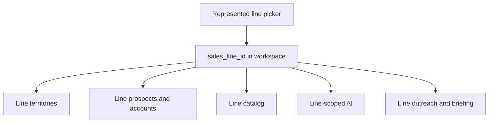

# Epic: Multi-Line / Multi-Territory CRM

**Status:** Draft — documentation only. No application code, migrations, schemas, or production data have been changed. **Requires approval before implementation.**

**Source of truth (current state):** [docs/multi-line-territory-audit.md](../multi-line-territory-audit.md) (revised 2026-08-14).  
**Settled decisions (this revision):** supersede audit §8.4 / §14 items 1–6, 8, and 13 where they conflict.  
**Phase 1 plan:** [docs/plans/multi-line-phase-1-schema-foundation.md](../plans/multi-line-phase-1-schema-foundation.md).

**Business outcome:** Operate a multi-line independent sales agency without commingling account data. Each represented line has its own accounts, territories, catalog, activities, AI, and KPIs. Shared retailers are identity only.

---

## 1. Epic objective

Replace the current OGR-and-BC single-lifecycle CRM with a **line-first** workspace:

- **Retailer** = shared real-world business identity (dedupe, address, contacts-as-people).
- **Line account** = the commercial relationship between one retailer and one represented line.
- **Line territory** = geographic rights for a particular line (not a field on the retailer).

**Represented lines (this epic):**

| Line          | `lines.status` | First ship                                                                            |
| ------------- | -------------- | ------------------------------------------------------------------------------------- |
| Old Guys Rule | `active`       | Migrate all existing data onto OGR line accounts                                      |
| Eagle Peak    | `onboarding`   | Line + territories as known; empty book; no OGR clone                                 |
| Big Fish      | `confirmed`    | Line row only; empty book; **not** a Prospective Line; do not invent commercial terms |

**Busted Knuckles Garage (`bkg`):** keep as an inactive independent line (`active = false`, map `status = paused`). **Do not reuse** for Eagle Peak or Big Fish.

**Prospective Lines (acquisition pipeline):** up to ~12 candidate principals. Research and retailer-target mapping only. They **must not** participate in active selling, orders, commissions, automated outreach, public catalogs, or active-line KPIs. Owner/admin only.

Staff always send outreach. This epic does not add autosend.

---

## 2. Current architecture being replaced

Live CRM (see audit §2):

```
prospects (integer PK) = retailer + OGR account + planning sheet
  account_status global: prospect | active_account | inactive
  territory_id → territories (bc|ab|ca|or|wa) on the store
catalog_items.line_id → lines (ogr active, bkg inactive unused)
orders / calls / notes / contacts / reorder / outreach → prospect id
/app tabs, hardcoded ogr, AI prompts “BC wholesale apparel (Old Guys Rule)”
```

Gaps this epic closes: no retailer master, no per-line status, no `sales_line_territories`, California = entire state, Eagle Peak / Big Fish / Prospective Lines absent, RLS not line-scoped.

---

## 3. Non-goals

- Duplicate retailer databases per line
- Autosend, sequences, Gmail as the send system
- Automatic merge of uncertain duplicate retailers
- Treating Northern California as the State of California
- Assigning BC/AB to Eagle Peak
- Assigning CA/AB to OGR (geo rows may exist; rights are **not** assigned)
- Reusing `bkg` for Eagle Peak or Big Fish
- Copying OGR prospects/orders onto Eagle Peak or Big Fish
- Inventing Big Fish legal name, territories, commission, currency, catalog, or commercial terms
- Putting Prospective Lines in the represented line picker or Daily Briefing
- Combined unlabeled portfolio revenue/KPI

---

## 4. Line status model

Keep physical table `lines`. Add `status`. Keep existing `active boolean` as the **public-portfolio flag** (independent of `status`) so `fetchActiveLines` / `get_public_active_lines` stay OGR-only until intentionally published. Seed Eagle Peak and Big Fish with `active = false`.

| Status        | Meaning                                                      | In represented picker                  | Selling / orders / convert | Outreach cron / briefing KPIs | Public catalog         |
| ------------- | ------------------------------------------------------------ | -------------------------------------- | -------------------------- | ----------------------------- | ---------------------- |
| `prospective` | Acquisition candidate                                        | **No** — `/app/prospective-lines` only | **No**                     | **No**                        | **No**                 |
| `confirmed`   | Represented agreement in place; configuration incomplete     | Yes (badge)                            | Feature-flagged            | No until flag                 | No until flag          |
| `onboarding`  | Represented; catalog/territories/accounts being set up       | Yes (badge)                            | Feature-flagged            | No until flag                 | No until flag          |
| `active`      | Represented, operational                                     | Yes                                    | Yes                        | Yes (per line)                | If published           |
| `paused`      | Represented or dormant independent line, temporarily stopped | Yes (admin)                            | Read-only selling          | No                            | Existing URLs may stay |
| `declined`    | Acquisition ended without representation                     | Admin only                             | No                         | No                            | No                     |
| `terminated`  | Former represented line                                      | Admin only                             | No                         | No                            | No                     |

**Seed mapping:**

| Code                   | `status`      | `active` | Notes                                                               |
| ---------------------- | ------------- | -------- | ------------------------------------------------------------------- |
| `ogr`                  | `active`      | `true`   | Full OGR backfill                                                   |
| `bkg`                  | `paused`      | `false`  | Independent; unused in `src/`                                       |
| `eagle-peak`           | `onboarding`  | `false`  | Phase 1 line row + known territories; zero accounts                 |
| `big-fish`             | `confirmed`   | `false`  | Phase 1 line row only; zero territories/accounts; no invented terms |
| Prospective candidates | `prospective` | `false`  | Phase 8 pipeline; ~12 soft cap                                      |

Prospective Lines use **only** `status = prospective`. Soft cap: ~12 prospective rows in UX.

### 4.1 Prospective acquisition stage (separate from `status`)

When `status = prospective`, require `acquisition_stage`:

| Stage               | Meaning                         |
| ------------------- | ------------------------------- |
| `identified`        | Candidate named                 |
| `researching`       | ICP / market research           |
| `contact_requested` | Outreach to principal requested |
| `conversation`      | Active discussion               |
| `evaluating`        | Fit / capacity evaluation       |
| `negotiating`       | Terms discussion                |
| `decision_pending`  | Waiting on yes/no               |

When `status <> prospective`, `acquisition_stage` must be null. Promote-to-represented is an explicit owner action (e.g. `prospective` → `confirmed` or `onboarding`) that does **not** auto-create selling accounts from targets.

---

## 5. Confirmed line seeds and territories

### 5.1 Old Guys Rule

- Status: `active`
- Assigned territories: **British Columbia, Oregon, Washington**
- California and Alberta geo rows may exist but are **not** assigned to OGR
- `sales_line_territories.rights_type = unconfirmed` for all OGR assignments unless written evidence establishes exclusivity
- Never store an unknown right as `non_exclusive`

### 5.2 Eagle Peak

- Legal principal: **Global Shade Co. dba Eagle Peak**
- Line code: `eagle-peak`
- Status: `onboarding`
- Default currency: **USD**
- Commission: **10%**
- Territories: Oregon and Washington **assigned** (`active`); Northern California **proposed** pending an exact boundary; **no** BC or Alberta

### 5.3 Big Fish

- Confirmed **represented** line (`status = confirmed`)
- **Not** prospective
- Do **not** invent legal principal name, territories, commission, currency, catalog, or commercial terms
- Phase 1: line row only; zero `sales_line_territories`; zero `retailer_line_accounts`
- Remains `confirmed` until onboarding configuration is complete (do not auto-flip to `onboarding`)

### 5.4 Rights type enum

`sales_line_territories.rights_type` must support:

- `exclusive`
- `limited_exclusive`
- `non_exclusive`
- `unconfirmed`

---

## 6. Research-only retailer targets

Prospective Lines may map retailers they _might_ sell if the line is signed. That mapping is **not** a selling line account.

**Required:** table `retailer_line_targets`

| Column                      | Purpose                                         |
| --------------------------- | ----------------------------------------------- |
| `id`                        | PK                                              |
| `retailer_id`               | Shared identity (`prospects.id` in Phase 1)     |
| `sales_line_id`             | Must be `lines.status = prospective`            |
| `interest` / `fit_notes`    | Research                                        |
| `suggested_geo`             | Text only — not `sales_line_territories` rights |
| `status`                    | `watching` \| `shortlist` \| `dropped`          |
| `created_at` / `updated_at` | Audit                                           |

**Enforcement:** trigger (not a cross-table CHECK) ensures `sales_line_id` references a prospective line.

**Forbidden on this table:** orders, convert, commissions, `system_messages` outreach, nightly prep, catalog send, active-line KPIs.

Prefer a separate table so unique `(retailer_id, sales_line_id)` on operational line accounts stays clean.

Promoting a Prospective Line to represented does **not** auto-convert targets into line accounts. Staff create line accounts deliberately.

---

## 7. End-to-end workflow (represented line)



Cross-line badge: names/statuses only → user must switch line context to open the other book.

---

## 8. Phased implementation

Each phase is a reviewable PR (or small PR stack) on `feature/multi-line-multi-territory-implementation`. Do not skip the OGR split to “just add Eagle Peak.”

Feature-flag convention: `PUBLIC_` is forbidden for secrets. Use server flags listed in §11. Flags default off in production until that phase is validated.

### Phase 0 — Decisions and freeze

**Deliverable:** settled decisions recorded in this epic (§4–§5). Remaining open items in §15. Backup production before any migrate. Stop conflicting directory imports.

**Exit:** Phase 1 plan approved; go/no-go gate in the Phase 1 plan passes.

### Phase 1 — Schema foundation (additive)

See [docs/plans/multi-line-phase-1-schema-foundation.md](../plans/multi-line-phase-1-schema-foundation.md).

**Must not** drop `prospects` columns, rename `prospects`, regenerate ids, change staff UI, clone OGR accounts, or invent Big Fish commercial terms.

- `principals`
- Extend `lines`: `principal_id`, `status`, `acquisition_stage`, `default_currency`, `commission_rate`, `effective_date`, `termination_date`, `productivity_thresholds`
- Hierarchical `territories` (drop five-code CHECK; keep `bc,ab,ca,or,wa` as `province_state` rows)
- Seed `norcal` region as **proposed** child of California
- `sales_line_territories` with `rights_type` including `unconfirmed`
- `retailer_line_accounts` with split relationship / activity / productivity concepts
- `retailer_line_contacts`, `retailer_field_changes`, `retailer_line_targets`, `migration_review_queue`
- Nullable transitional `retailer_line_account_id` on operational records
- Seed OGR + Eagle Peak + Big Fish **line rows**; OGR BC/OR/WA and Eagle Peak OR/WA/norcal assignments
- OGR backfill only; **zero** Eagle Peak / Big Fish / prospective line accounts
- RLS: keep `is_approved_staff()` in v1

**Flag:** `FEATURE_MULTI_LINE_SCHEMA` (server) — documented only; unused by UI yet.

### Phase 2 — Line context in the app (reads)

- Represented picker: OGR (live); Eagle Peak (`onboarding`); Big Fish (`confirmed`)
- Routes as in audit §7.1; compatibility aliases for `?tab=` / `?prospectId=`
- All directory, catalog, dashboard, briefing, outreach **reads** take `sales_line_id`
- Dual-read: if flag off, current `/app` behavior unchanged (OGR-only)

**Exit:** OGR lists match pre-change counts. Switching to Eagle Peak / Big Fish shows empty books, not OGR rows.

### Phase 3 — Writes on line accounts

- Convert / demote, notes, contacts (junction), orders, calls, reorder, Gmail/Calendar link stamps, outreach goals **per line**
- Stop writing line-specific fields onto `prospects` except dual-write trigger while flag on
- Cross-line badges (name + status only)

**Exit:** converting an Eagle Peak (test) account cannot flip OGR `account_status`. Isolation tests in CI.

### Phase 4 — AI isolation

- Every staff AI request: `sales_line_id`, `retailer_line_account_id` (or explicit line-level scope), permitted territory ids
- `sales_line_ai_profiles` (or JSON on `lines`): ICP, rubric, prompts, catalog filter, currency
- Generalize or fork OGR prompts; fill-blanks / Add via AI / APF / agent tools refuse cross-line catalog and notes
- Prospective Line AI: research notes only; tools cannot convert, send, or load other lines’ catalogs
- Verified retailer fields: propose + audit; no silent overwrite

**Exit:** APF in Eagle Peak context returns zero OGR SKUs. Agent tests for missing context → 400.

### Phase 5 — Territory administration

- `/app/lines/:lineSlug/territories`: assignments for **that line only**
- Rights type (including `unconfirmed`), status (`proposed|active|expired|disputed`), dates, contract source, restrictions
- Line account assignment must FK a `sales_line_territories` row for the same line
- AI/import cannot auto-assign from address
- Stop using `prospects.territory_id` as rights (keep retailer location columns)

**Exit:** adding Oregon to Eagle Peak does not add Oregon to OGR. Norcal ≠ full California. OGR CA/AB remain unassigned.

### Phase 6 — Eagle Peak onboarding

- Principal + `eagle-peak` already seeded in Phase 1 as `onboarding`
- Territories already seeded (OR, WA active; norcal proposed)
- Catalog import / ICP when assets exist — separate catalog job, `line_id` = Eagle Peak
- Empty `retailer_line_accounts` until staff opens accounts
- Feature flags: `FEATURE_EAGLE_PEAK_SELLING`, `FEATURE_EAGLE_PEAK_OUTREACH`, `FEATURE_EAGLE_PEAK_PUBLIC_CATALOG` (all default off)
- Badges on shared retailers only after a line account exists

**Exit:** OGR counts unchanged. No Eagle Peak orders. Public `/old-guys-rule-wholesale` unchanged.

### Phase 7 — Big Fish configuration (confirmed represented)

Big Fish is already a represented line at `confirmed`. This phase fills configuration **without inventing unknown terms**:

- Add principal legal name, currency, commission, territories, catalog **only when known**
- Staff may move status to `onboarding` or `active` after configuration — never automatic
- **No** account clone from OGR
- Flags: `FEATURE_BIG_FISH_SELLING`, `FEATURE_BIG_FISH_OUTREACH`, `FEATURE_BIG_FISH_PUBLIC_CATALOG` (default off)
- Appears in **represented** picker with Confirmed / Onboarding badge as appropriate

**Exit:** Big Fish book empty unless staff created accounts. Isolation tests vs OGR and Eagle Peak.

### Phase 8 — Prospective Lines acquisition pipeline

- `/app/prospective-lines` and `/:lineSlug` research workspace (owner/admin)
- CRUD up to ~12 candidate lines (`status=prospective` + `acquisition_stage`)
- Retailer target mapping (`retailer_line_targets`)
- Research notes, ICP drafts, geographic _interest_ text
- **Hard blocks (DB + API + UI):**
  - orders, commissions, quotes as commercial docs
  - convert to active account
  - nightly prep / briefing KPIs / outreach send
  - `get_public_*` RPCs / showroom
  - represented line picker
- Promote-to-represented is an explicit owner action that does **not** auto-create selling accounts from targets
- Flag: `FEATURE_PROSPECTIVE_LINES` (default off until Phase 8 ships)

**Exit:** attempting `POST` order or outreach against a prospective line returns 403. Active-line dashboards exclude them.

### Phase 9 — Cleanup

- Drop dual-write columns from `prospects` / rename to `retailers` if contracted
- Add missing FKs on calls / prospect_updates
- Optional PostGIS later
- Optional `staff_line_memberships` RLS (v2)
- Remove unused flags

---

## 9. Migrations and rollback

### 9.1 Expand / contract

1. Add tables and nullable FKs.
2. Backfill OGR.
3. Dual-write.
4. Switch reads (flag).
5. Switch writes.
6. Drop old line-specific columns.

Never regenerate `prospects.id` / `retailers.id`.

### 9.2 Rollback

| After     | How                                                                                                           |
| --------- | ------------------------------------------------------------------------------------------------------------- |
| Phase 1–2 | Reverse migration; flag off; UI is OGR `/app`                                                                 |
| Phase 3–5 | Revert deploy; dual-write still populated `prospects`                                                         |
| Phase 6–8 | Disable line-specific feature flags; leave empty Eagle Peak / Big Fish / prospective rows in place (harmless) |
| Phase 9   | Restore DB snapshot taken before drop; this phase is irreversible without backup                              |

Snapshot before Phase 1 backfill: `prospects`, `orders`, `calls`, `account_contacts`, `system_messages`, `account_reorder_settings`.

### 9.3 Validation (every migrate)

Reuse audit §10.4 plus:

```sql
-- Represented non-OGR lines have zero selling accounts until staff creates them
select l.code, count(rla.id)
from lines l
left join retailer_line_accounts rla on rla.sales_line_id = l.id
where l.code in ('eagle-peak', 'big-fish')
group by 1;

-- Prospective: no orders
select count(*) from orders o
join retailer_line_accounts rla on rla.id = o.retailer_line_account_id
join lines l on l.id = rla.sales_line_id
where l.status = 'prospective';  -- must be 0

-- Targets only on prospective lines
select count(*) from retailer_line_targets t
join lines l on l.id = t.sales_line_id
where l.status <> 'prospective';  -- must be 0

-- OGR has BC, OR, WA assignments; not CA or AB
select t.code
from sales_line_territories slt
join lines l on l.id = slt.sales_line_id
join territories t on t.id = slt.territory_id
where l.code = 'ogr' and slt.status = 'active'
order by 1;
-- expect: bc, or, wa
```

---

## 10. Testing plan

Aligned with audit §13, plus:

1. Unique `(retailer, line)` and same-line territory FK.
2. OGR backfill counts.
3. UI isolation: two line accounts, no leaked orders/notes/scores.
4. Route 404 when `lineAccountId` belongs to another slug.
5. AI context required; no cross-line SKUs.
6. Outreach prep scoped by line; cron ignores prospective and unflagged confirmed/onboarding.
7. Currency: Eagle Peak USD (and future Big Fish currency when set) not in OGR CAD LTV.
8. Territory admin isolation; OGR CA/AB remain unassigned.
9. Public OGR RPCs still `code = 'ogr'`.
10. Prospective: 12-line UX; 13th warned; order/outreach/convert 403.
11. Research targets cannot convert.
12. Promote prospective → confirmed/onboarding does not create line accounts automatically.
13. `npm run check` on every PR.

---

## 11. Feature flags

| Flag                                | Phase | Default prod | Effect                              |
| ----------------------------------- | ----- | ------------ | ----------------------------------- |
| `FEATURE_MULTI_LINE_SCHEMA`         | 1     | n/a (schema) | Document only                       |
| `FEATURE_MULTI_LINE_UI`             | 2     | off          | Line routes + picker                |
| `FEATURE_MULTI_LINE_WRITES`         | 3     | off          | Writes to line accounts             |
| `FEATURE_MULTI_LINE_AI`             | 4     | off          | Strict AI context                   |
| `FEATURE_LINE_TERRITORY_ADMIN`      | 5     | off          | Territory CRUD                      |
| `FEATURE_EAGLE_PEAK_SELLING`        | 6     | off          | Convert/orders/calls for Eagle Peak |
| `FEATURE_EAGLE_PEAK_OUTREACH`       | 6     | off          | Prep/briefing/send                  |
| `FEATURE_EAGLE_PEAK_PUBLIC_CATALOG` | 6     | off          | Public RPCs/showroom                |
| `FEATURE_BIG_FISH_SELLING`          | 7     | off          | Same for Big Fish                   |
| `FEATURE_BIG_FISH_OUTREACH`         | 7     | off          |                                     |
| `FEATURE_BIG_FISH_PUBLIC_CATALOG`   | 7     | off          |                                     |
| `FEATURE_PROSPECTIVE_LINES`         | 8     | off          | Acquisition UI                      |

Never `PUBLIC_` for these if they gate server writes; server reads `import.meta.env` in API routes. UI may use a staff-only `/api/staff/features` snapshot if needed (no secrets).

Confirmed / onboarding represented lines **appear** in the picker when their row exists; selling/outreach stay off until the matching flags.

---

## 12. Security

- v1: `is_approved_staff()` + mandatory `sales_line_id` in every CRM query.
- Prospective Lines: **owner/admin** only in UI; APIs 403 for non-owner.
- Cron: existing `CRON_SECRET`; prep runner must receive `sales_line_id` and skip `prospective` / unflagged confirmed/onboarding.
- No service role in React islands.
- Public catalogs remain per-line RPCs.

---

## 13. Files likely touched (by phase)

See audit §16. Phase 1 is almost entirely `supabase/migrations/`, `schema.sql`, `src/types/database.ts`. Phases 2–3 concentrate on `RepCommandCenter`, tabs, `prospects.ts`, convert/orders/calls. Phase 4: `agent.ts`, `agentCrmTools.ts`, fill-blanks, outreach generate. Phase 8: new prospective-lines pages/components and `retailer_line_targets`.

Do not rewrite historical BC seed migrations.

---

## 14. Numbered sequence (approval checklist)

1. Approve this epic + revised audit + Phase 1 plan.
2. Phase 1 schema + OGR backfill + validation.
3. Phase 2 UI reads + `FEATURE_MULTI_LINE_UI`.
4. Phase 3 writes + badges.
5. Phase 4 AI isolation.
6. Phase 5 territory admin.
7. Phase 6 Eagle Peak selling flags when ready.
8. Phase 7 Big Fish configuration when commercial terms are known.
9. Phase 8 Prospective Lines (~12) + research targets.
10. Phase 9 drop dual-write.

---

## 15. Open questions

**Settled (do not re-litigate):**

- Big Fish is a confirmed **represented** line (`status = confirmed`), not prospective.
- OGR assigned territories: BC, OR, WA; not CA or AB.
- OGR `rights_type = unconfirmed` until written exclusivity evidence.
- Eagle Peak: Global Shade Co. dba Eagle Peak; `eagle-peak`; USD; 10%; OR/WA assigned; norcal proposed; no BC/AB.
- BKG: keep as independent paused/inactive line; do not reuse.
- Prospective Lines: owner/admin acquisition records; research targets only; no selling/orders/commissions/outreach/public catalog/active KPIs.
- Research targets: separate `retailer_line_targets` table.
- Line status enum includes `prospective`, `confirmed`, `onboarding`, `active`, `paused`, `declined`, `terminated`.
- Acquisition stage is separate from line status.

**Still open (do not block Phase 1 schema shape):**

| Item                                                                         | Blocks implementation?              |
| ---------------------------------------------------------------------------- | ----------------------------------- |
| Big Fish legal name, currency, commission, territories, catalog              | No — leave null / empty until known |
| Northern California exact county list                                        | No — keep `norcal` as `proposed`    |
| Written evidence that OGR rights are exclusive                               | No — keep `unconfirmed`             |
| OGR `productivity_thresholds` numbers                                        | No — leave null → `unclassified`    |
| Outreach goal of 5 accounts: per line vs agency                              | No — Phase 2+                       |
| Whether to move Big Fish from `confirmed` to `onboarding` when config starts | No — staff decision later           |

---

**Stop:** no implementation until this epic and the Phase 1 plan are approved.
