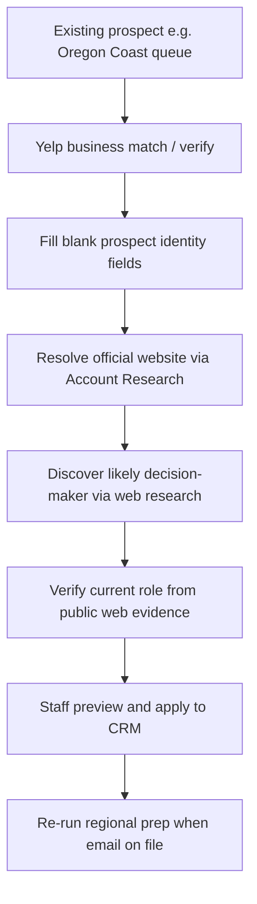

# Epic: Yelp Business Verification & Contact Enrichment

**Status:** Phase 1 implemented (Aug 2026) — contact discovery preview/apply in Account Research; pilot on #674, #634, #631 pending staff run.  
**Branch:** `feature/yelp-contact-finder`  
**Related epics:** [Agentic Outreach](./agentic-outreach/README.md), [Account Research Before Product Selection](./agentic-outreach/account-research-before-product-selection.md)  
**Oregon context:** [Oregon Business Contact Enrichment](../prospect-uploads/oregon/Oregon%20Business%20Contact%20Enrichment.md), [Oregon prospect uploads README](../prospect-uploads/oregon/README.md)

---

## 1. Objective

Add a **prospect-enrichment workflow** that uses **Yelp for business discovery and verification**, then reuses existing web research plus **public web evidence** (including LinkedIn search snippets) to identify and verify the likely purchasing contact — without expanding the CRM schema or building a parallel research system.

**Business outcome:** Populate **existing** `prospects` and `account_contacts` fields so regional outreach prep can move accounts from “identified, needs email” to draft-ready contacts.

**Hard rules**

1. Never guess emails, contact names, roles, websites, or other missing data.
2. Preserve existing higher-confidence CRM data; do not blindly overwrite.
3. Never create duplicate prospects — enrich known `retailer_id` rows only.
4. Do not scrape LinkedIn or use browser automation; use publicly discoverable information only for role verification.
5. Yelp is a **directory verification** source — not the locked official website.
6. **LinkedIn is confirmation, not discovery** — identify the candidate contact from other sources first, then corroborate role via public web-indexed LinkedIn snippets only.
7. Do not log into LinkedIn or Yelp in automated flows; no authenticated session scraping, Selenium/Playwright, or HTML profile crawls.

---

## 1.1 Locked verification methodology (2026-08-26)

This section records the **manual Oregon Coast enrichment process** that produced `oregon-coast-contact-enrichment-20260826.xlsx`. Automated implementation must follow the same order and thresholds.

### Business verification (prospect identity)

Use Yelp plus other public directory sources to confirm the **physical business** (name, address, phone). Yelp may appear alongside Chamber, BBB, tourism org, ODFW/FFL records, etc. — not as the only source.

**Automation preference:** [Yelp Fusion API](https://www.yelp.com/developers/documentation/v3) (server key in `YELP_FUSION_API_KEY`) for structured business match. A staff Yelp login is **not** wired into the CRM pipeline — manual browsing is fine for one-off research, but automated jobs must not store credentials or scrape logged-in Yelp HTML.

### Contact discovery (who to outreach)

Identify the likely purchasing contact **first** from non-LinkedIn sources:

- Official website (About, Contact, team pages)
- Chamber / tourism / BBB listings
- Yelp business page (public, no login required for listed info)
- FFL / state business records
- Local news / trade press

Target roles: owner, buyer, general manager, store manager.

Only after a **named candidate** exists, run role verification.

### LinkedIn role verification (public index only)

LinkedIn is a **verification layer**, not a discovery source. Do not start from LinkedIn to find who owns the store.

**Query patterns** (Exa / Perplexity / web search — not LinkedIn login):

```text
"{Person Name}" "{Business Name}" LinkedIn
site:linkedin.com/in "{Person Name}" "{Business Name}"
"{Person Name}" "{City}" LinkedIn
```

**Evaluate each public result/snippet against four signals:**

| Signal                | Example              |
| --------------------- | -------------------- |
| Person name           | Bob Leis             |
| Company / business    | Newport Ace Hardware |
| Current role          | Owner                |
| Location (when shown) | Newport, OR          |

**Outcomes** (store in contact `notes` and/or enrichment report — no new CRM columns):

| Label                    | Meaning                                                                                | Example                                                                         |
| ------------------------ | -------------------------------------------------------------------------------------- | ------------------------------------------------------------------------------- |
| **Verified**             | Public LinkedIn snippet independently connects person + company + role                 | Bob Leis → Newport Ace → Owner                                                  |
| **Partial public match** | Name/location suggest a match but company or role is not exposed in the public snippet | Aaron L. in Lincoln City — cannot prove Aaron Linfoot / LC Sporting Goods owner |
| **Not found**            | No usable public LinkedIn corroboration; contact may still be valid from other sources | Tony Gile — ownership from other sources; LinkedIn column empty                 |

**Explicitly forbidden:** LinkedIn login, profile HTML scraping, authenticated API, browser automation against linkedin.com.

### End-to-end pipeline (matches manual workbook)

```text
Existing CRM prospect
        ↓
Yelp / Chamber / official site / other public source  →  verify business + optional phone/address/website
        ↓
Candidate person (from non-LinkedIn sources)
        ↓
Public web search: "{Name}" + "{Business}" + LinkedIn
        ↓
Compare snippet: Name + Company + Role + Location
        ↓
Verified / Partial / Not found
        ↓
Populate existing fields only (staff preview or audited script apply)
        ↓
Re-run regional prep when sendable email exists
```

The Oregon Coast spreadsheet (`LinkedIn Verification` column) is the reference implementation of the Verified / Partial / Not found labels above.

---

## 2. Desired workflow



| Step | Action                                                           | Target fields                                                                        |
| ---- | ---------------------------------------------------------------- | ------------------------------------------------------------------------------------ |
| 1    | Yelp find/verify physical business                               | `prospects.name`, `address`, `city`, `postal_code`, `phone`, optional `website` seed |
| 2    | Resolve official website (existing Exa flow)                     | `prospects.website` (staff-locked)                                                   |
| 3    | Identify purchasing contact (owner / buyer / GM / store manager) | `account_contacts.full_name`, `role`, `title`                                        |
| 4    | Verify role from public web (no LinkedIn scraping)               | `account_contacts.title`, `notes` (evidence summary)                                 |
| 5    | Populate only verified, non-conflicting values                   | `account_contacts.email`, `phone` when explicitly published                          |

Staff always preview before writes (same human-review model as Account Research suggestions and AI Update).

---

## 3. Current-state evidence (live code audit)

### 3.1 Two research stacks (compose, do not replace)

| Stack                          | Search provider           | Primary UI                                   | Writes                                                           |
| ------------------------------ | ------------------------- | -------------------------------------------- | ---------------------------------------------------------------- |
| **Account Research**           | Exa via AI Gateway        | `AccountResearchPanel`                       | Citation-backed **suggestions** → staff apply → `prospects` only |
| **AI Update / Contact enrich** | Perplexity via AI Gateway | `AiUpdateResearchModal`, `AddContactAiModal` | Preview/apply → `prospects` and/or new `account_contacts`        |

Key modules:

| Concern                        | Location                                                                                                                                                                   |
| ------------------------------ | -------------------------------------------------------------------------------------------------------------------------------------------------------------------------- |
| Account Research orchestration | [`src/lib/accountResearch/orchestrate.ts`](../../src/lib/accountResearch/orchestrate.ts)                                                                                   |
| Account Research UI            | [`src/components/accountResearch/AccountResearchPanel.tsx`](../../src/components/accountResearch/AccountResearchPanel.tsx)                                                 |
| Website lock + identity gate   | [`src/lib/accountResearch/lockSource.ts`](../../src/lib/accountResearch/lockSource.ts), [`src/lib/accountResearch/identity.ts`](../../src/lib/accountResearch/identity.ts) |
| Profile suggestions            | [`src/lib/accountResearch/suggestions.ts`](../../src/lib/accountResearch/suggestions.ts)                                                                                   |
| Suggestion field defs          | [`src/lib/accountResearch/suggestionFields.ts`](../../src/lib/accountResearch/suggestionFields.ts)                                                                         |
| Apply suggestion RPC           | `apply_account_research_profile_suggestion` (migration `20260823160000`)                                                                                                   |
| Perplexity company brief       | [`src/lib/companyWebResearch.ts`](../../src/lib/companyWebResearch.ts)                                                                                                     |
| Fill blank prospect fields     | [`src/lib/fillBlankProspectFields.ts`](../../src/lib/fillBlankProspectFields.ts)                                                                                           |
| AI Update preview/apply        | [`src/lib/updateProspectResearch.ts`](../../src/lib/updateProspectResearch.ts)                                                                                             |
| Contact enrich (attach)        | [`src/lib/createEnrichedContact.ts`](../../src/lib/createEnrichedContact.ts)                                                                                               |
| Outreach contact pick          | [`src/lib/outreachEligibility.ts`](../../src/lib/outreachEligibility.ts) `pickOutreachContact`                                                                             |

### 3.2 Entry points staff use today

| Surface                                 | Path                                                                    | Notes                                                  |
| --------------------------------------- | ----------------------------------------------------------------------- | ------------------------------------------------------ |
| Research tab on prospect/account drawer | `ProspectDetailDrawer` / `AccountDetailDrawer` → `AccountResearchPanel` | Primary UX for outreach “Research” deep link           |
| Verify & Update / Fill Blank Fields     | `ProspectsTab`, `ActiveAccountsTab` → `AiUpdateResearchModal`           | Blank-only or overwrite with verified-identity guards  |
| Add Contact via AI                      | `AddContactAiModal` → `POST /api/contacts/enrich`                       | `attach` mode for existing accounts                    |
| Outreach queue                          | `AgentBriefingTab` → `openResearch: true`                               | Opens drawer on Research tab for Oregon regional queue |

### 3.3 CRM fields in scope (no new schema)

**`prospects`** (existing columns only):

`name`, `address`, `city`, `region`, `postal_code`, `phone`, `website`, `retail_category`, `apparel_capability`, `category`, taxonomy JSON arrays (`lifestyle_themes`, `secondary_channels`, etc.)

**`account_contacts`** (existing columns only):

`full_name`, `title`, `phone`, `email`, `role` (`buyer` | `manager` | `owner`), `is_primary`, `notes`

### 3.4 Yelp and LinkedIn today

| Source       | Current behavior                                                                                                                                                                                  |
| ------------ | ------------------------------------------------------------------------------------------------------------------------------------------------------------------------------------------------- |
| **Yelp**     | Denylisted as official website (`companyWebResearch.ts`, Exa website prompt in `provider.ts`); filtered from website candidates (`candidates.test.ts`); **no Yelp API**                           |
| **LinkedIn** | In citation platform enum (`directory` migration); **not** a V1 Account Research scope (`constants.ts` rejects `linkedin`); denylisted in Perplexity domain filter; **no role-verification flow** |

Citation platform `directory` already exists on `account_research_citations` — suitable for Yelp listing URLs.

### 3.5 Overwrite and confidence rules (reuse as-is)

| Path                         | Rule                                                                                                                                 |
| ---------------------------- | ------------------------------------------------------------------------------------------------------------------------------------ |
| Account Research suggestions | `blankOnly` identity scalars; `baseline_value` drift check; `import_protected` / `buyer_verified` require `confirmVerifiedOverwrite` |
| Fill Blanks                  | Only writes currently **empty** allowlisted columns                                                                                  |
| AI Update                    | Strips verified identity fields unless staff confirms overwrite                                                                      |
| Contact enrich               | Form values beat AI; **insert-only** (no update path today)                                                                          |
| Duplicate contacts           | `classifyAccountContactDuplicate` — email hard block, name soft match                                                                |

### 3.6 Outreach context (why this epic exists)

Regional prep ([`outreachNightlyPrep.ts`](../../src/lib/outreachNightlyPrep.ts)) can identify up to **25** accounts per CRM region **without** requiring email (`allowMissingEmail`). Identified targets surface in [`AgentBriefingTab`](../../src/components/tabs/AgentBriefingTab.tsx) with a **Research** action. This epic closes the gap from “identified” → “contact email on file” → draft-ready.

---

## 4. Architecture (additive)

Treat Yelp as a **directory verification layer**, separate from the locked official website:

```text
Existing prospect (known retailer_id)
        │
        ▼
① Yelp Fusion API match          NEW — platform citation: `directory`
        │
        ▼
② Blank-only prospect patch      REUSE fill-blanks / suggestion rules
        │
        ▼
③ Official website (Exa)         REUSE Account Research website lock
        │
        ▼
④ Decision-maker discovery       REUSE companyWebResearch brief + strict schemas
        │
        ▼
⑤ Role verification            NEW — public web snippets only; null if not explicit
        │
        ▼
⑥ Staff apply                    REUSE suggestion apply / contact attach / fill-blanks
```

**Explicit non-goals**

- New tables or prospect/contact columns
- Yelp URL as locked “official website”
- LinkedIn scraping or authenticated profile access
- Email pattern guessing (`firstname@domain.com`, etc.)
- Creating new prospects during enrichment (`createEnrichedProspect` insert path)

---

## 5. Reuse vs. build

| Step                  | Reuse                                                                     | Build (minimal)                                    |
| --------------------- | ------------------------------------------------------------------------- | -------------------------------------------------- |
| Yelp discovery        | Citation model (`platform: 'directory'`), orchestration patterns          | `src/lib/yelp/` — Fusion API client + match scorer |
| Business verification | `suggestionFields.ts`, protected identity RPC                             | Yelp → blank-only prospect patch mapper            |
| Website resolution    | `AccountResearchPanel` website search + lock                              | Pass Yelp `business_url` as website search seed    |
| Contact discovery     | `createEnrichedContact` attach mode, `contactGapsSchema`                  | Brief builder with Yelp + locked-site context      |
| Role verification     | `researchCompany` infrastructure                                          | `verifyPublicContactRole()` — explicit-only schema |
| Apply + audit         | `applyProspectResearchUpdate`, suggestion apply, `retailer_field_changes` | Preview/report before writes                       |

---

## 6. Conflict, duplicate, and stale-data policy

| Situation                                 | Policy                                                                  |
| ----------------------------------------- | ----------------------------------------------------------------------- |
| Yelp vs populated CRM phone/address       | **Keep CRM**; suggest Yelp only when field is blank                     |
| Verified / import-protected identity      | Require staff confirm to overwrite (existing gates)                     |
| Ambiguous Yelp match (multiple locations) | No auto-apply; staff picks candidate (like website candidate list)      |
| Contact email already exists              | Block duplicate insert (email match)                                    |
| Same name, different email                | Soft match → staff decides                                              |
| Stale title on existing contact           | Phase 1: do not overwrite; add evidence to `notes` or staff manual edit |
| New primary contact for outreach          | Set `is_primary` only if no primary with usable email exists            |

**Prospect dedup:** Enrichment always targets an existing `retailer_id`. Do not use `createEnrichedProspect` for this flow. Reference matching logic in [`matchRetailers.ts`](../../src/lib/accountImport/matchRetailers.ts) for validation patterns only.

---

## 7. Phased delivery

### Phase 0 — Pilot script (smallest testable step)

**Goal:** Validate Yelp matching + blank prospect field population on ~5 Oregon Coast accounts. **No contact writes.**

| Item       | Detail                                                                                                                              |
| ---------- | ----------------------------------------------------------------------------------------------------------------------------------- |
| Env        | `YELP_FUSION_API_KEY` (server-only; add to `.env.example`)                                                                          |
| Lib        | `src/lib/yelp/businessMatch.ts`, `mapYelpToProspectPatch.ts`                                                                        |
| Script     | `scripts/yelp-enrich-oregon-prospects.ts` — `--region "Oregon Coast" --limit 5 --dry-run` (default)                                 |
| Selection  | Prospects in region with no usable outreach email; prefer blank `phone` or `website`                                                |
| Apply mode | `--apply` updates **blank only**: `phone`, `address`, `city`, `postal_code`, `website` (only if Yelp exposes explicit business URL) |
| Output     | CSV/JSON report for manual Yelp cross-check                                                                                         |
| Audit      | `retailer_field_changes` on apply                                                                                                   |

**Exit criteria:** ≥3/5 high-confidence matches; no overwrites of populated fields; no new prospects; no guessed emails.

### 7.1 Phase 0 implementation spec (shipped 2026-08-26)

Locked decisions for the script-only pilot. Code lives on `feature/yelp-contact-finder`.

#### Fusion API flow

1. **Business Match** — `GET /v3/businesses/matches` with `name`, `address1` (street or empty), `city`, `state=OR`, `country=US`, optional `postal_code` / `phone`, `match_threshold=strict` when street address is present, `limit=3`.
2. **Business Search fallback** — when Match is empty or scores `low`: `GET /v3/businesses/search` with `term={prospect.name}`, `location={city}, OR`, `limit=3`.
3. **Business Details** — `GET /v3/businesses/{id}` to enrich phone, address, and listing URL before scoring.

Auth: `Authorization: Bearer ${YELP_FUSION_API_KEY}` (server-only; documented in `.env.example`).

#### Local match confidence rubric

Implemented in [`src/lib/yelp/businessMatch.ts`](../../src/lib/yelp/businessMatch.ts) (`scoreYelpMatch` + `confidenceFromScore`):

| Signal                            | Points |
| --------------------------------- | ------ |
| Exact normalized name             | +50    |
| Partial name containment          | +30    |
| City match (normalized)           | +30    |
| Postal code match (both present)  | +10    |
| Phone digits match (both present) | +10    |

| Confidence | Rule                                              |
| ---------- | ------------------------------------------------- |
| **high**   | Single candidate, exact name + city, score ≥ 80   |
| **medium** | Score ≥ 60 without name mismatch                  |
| **low**    | Name mismatch, multiple candidates, or weak score |

**Auto-apply (`--apply`):** only `high` confidence. Medium/low are report-only.

#### Cohort selection

[`scripts/yelp-enrich-oregon-prospects.ts`](../../scripts/yelp-enrich-oregon-prospects.ts):

- `prospects.region = --region` (default `"Oregon Coast"`)
- Exclude accounts where any contact has a usable OGR outreach email (`isValidOgrProductEmailRecipient`)
- Prefer prospects with more blank identity fields (`phone`, `website`, `address`, `city`, `postal_code`)
- `--limit` (default 5); optional `--ids` for spot-checks

#### Blank-only patch

[`src/lib/yelp/mapYelpToProspectPatch.ts`](../../src/lib/yelp/mapYelpToProspectPatch.ts) — fields: `phone`, `address`, `city`, `postal_code`, `website`.

- Write only when CRM field is trim-empty
- **`website`:** only non-directory URLs (`isDirectoryCitationHost` guard); never set Yelp listing URL as official website
- Never write `name`, contacts, or guessed emails

#### Report and audit

| Item           | Value                                                           |
| -------------- | --------------------------------------------------------------- |
| Report path    | `docs/prospect-uploads/oregon/yelp-enrichment-pilot-report.csv` |
| Audit provider | `yelp_fusion_enrichment`                                        |
| Audit source   | `import`                                                        |
| API pacing     | 200ms delay between prospects                                   |

CSV columns: `retailer_id`, `crm_name`, `crm_city`, `match_confidence`, `match_method`, `match_score`, `yelp_id`, `yelp_name`, `yelp_url`, `yelp_phone`, `yelp_address`, `yelp_website`, `proposed_patch_json`, `skipped_fields`, `apply_status`.

#### Phase 0 non-goals (explicit)

- No `account_contacts` writes
- No `account_research_citations` rows
- No staff API routes or UI
- No Yelp/LinkedIn login or browser automation
- No new prospect inserts

#### Runbook

```bash
# Add YELP_FUSION_API_KEY to .env (Fusion app server key)
npx tsx --env-file=.env scripts/yelp-enrich-oregon-prospects.ts --region "Oregon Coast" --limit 5
# Staff: open yelp_url values in CSV and confirm ≥3/5 matches
npx tsx --env-file=.env scripts/yelp-enrich-oregon-prospects.ts --apply   # high-confidence blank-only
```

Unit tests: `npm run test -- src/lib/yelp`

#### Phase 0 pilot results (2026-08-26)

First live dry-run (`--limit 5`, Oregon Coast):

| retailer_id | CRM name                     | Result                                                                                                    | Action                                 |
| ----------- | ---------------------------- | --------------------------------------------------------------------------------------------------------- | -------------------------------------- |
| 624         | Lincoln City Surf Shop       | **high** — correct                                                                                        | Applied blank `phone` (`541-996-7433`) |
| 634         | Chetco Outdoor Store         | **high** — correct                                                                                        | No patch (CRM already populated)       |
| 631         | FARM HOUSE FUNK              | **high** after scorer fix — [Farmhouse Funk](https://www.yelp.com/biz/farmhouse-funk-astoria) Astoria     | Applied blank `phone` (`503-325-4474`) |
| 674         | Sassy Seagull (Bandon Store) | **high** after scorer fix — [The Sassy Seagull](https://www.yelp.com/biz/the-sassy-seagull-bandon) Bandon | Verified; CRM already populated        |
| 643         | U Save Gas & Tackle          | **low** — wrong Yelp hit (Black Bird, Medford)                                                            | **Do not apply** — manual research     |

Scorer follow-up: `normalizeYelpMatchName` strips parentheticals and leading `The`; `compactYelpNameKey` matches spaced variants (`FARM HOUSE FUNK` ↔ `Farmhouse Funk`).

Report archive: `docs/prospect-uploads/oregon/yelp-enrichment-pilot-report.csv`

### 7.2 Phase 1 implementation spec (shipped 2026-08-26)

Contact discovery preview chains Yelp + CRM context into a research brief, then staff confirm before insert.

#### Brief builder

| Input                 | Source                                                                                                           |
| --------------------- | ---------------------------------------------------------------------------------------------------------------- |
| Prospect identity     | `prospects` row (name, city, address, phone, website)                                                            |
| Yelp directory match  | `matchProspectToYelp` — included when confidence is **high** or **medium**; omitted on low / missing key         |
| Official website hint | Latest Account Research `resolved_website` when non-directory; else `prospect.website` when not a directory host |
| Candidate name        | Optional staff override in preview UI                                                                            |

Lib: `src/lib/contactResearch/buildContactResearchBrief.ts` — outputs `seedBlock`, `yelpMatch`, `websiteUrl`. Yelp listing URL is labeled **directory evidence** in the seed (never official website).

Role mapping: `src/lib/contactResearch/mapContactRole.ts` — owner / manager / buyer from verified title text.

#### Research + preview lib

| Function                       | Path                               | Behavior                                              |
| ------------------------------ | ---------------------------------- | ----------------------------------------------------- |
| `researchContextSeed`          | `src/lib/companyWebResearch.ts`    | Optional seed prepended to Perplexity prompt          |
| `previewEnrichedContactAttach` | `src/lib/createEnrichedContact.ts` | No DB write; returns `ContactEnrichPreview`           |
| `applyEnrichedContactAttach`   | `src/lib/createEnrichedContact.ts` | Insert-only attach with staff-confirmed fields + role |

Preview flow: load prospect + contacts → `buildContactResearchBrief` → `researchCompany` → `fillContactGapsFromBrief` → `mapContactRole` → `classifyAccountContactDuplicate`.

Hard rules: null email/phone/title when not explicit in brief; reject invalid OGR recipient email; block apply on email duplicate unless `confirmDuplicateEmail: true`.

#### Staff API routes

| Route                               | Body                                                                                    |
| ----------------------------------- | --------------------------------------------------------------------------------------- |
| `POST /api/contacts/enrich/preview` | `{ accountId, candidateName?, resolvedWebsite?, salesLineId?, retailerLineAccountId? }` |
| `POST /api/contacts/enrich/apply`   | `{ accountId, fullName, title?, phone?, email?, role, confirmDuplicateEmail? }`         |

Client: `src/lib/enrichContactPreview.ts` — `previewContactEnrich`, `applyContactEnrich`.

Existing `POST /api/contacts/enrich` unchanged (AddContactAiModal backward compat).

#### UI

`AccountResearchPanel` → **Contact discovery** section → `ContactDiscoverPreview.tsx`.

- Optional candidate name input
- Preview → collapsible research brief + Yelp directory link
- Editable proposed fields (name, title, role, phone, email)
- Email duplicate = block until acknowledged; name duplicate = soft warning

#### Phase 1 pilot accounts (staff manual run pending)

| retailer_id | Business                     | Rationale                                                |
| ----------- | ---------------------------- | -------------------------------------------------------- |
| 674         | Sassy Seagull (Bandon Store) | High Yelp match; CRM populated; likely needs contact row |
| 634         | Chetco Outdoor Store         | High match score 100                                     |
| 631         | FARM HOUSE FUNK              | High match after Phase 0 scorer fix                      |

Pilot checklist: preview returns name + title from public sources (email optional); staff confirms role mapping; apply inserts without duplicate errors; re-run regional prep when email exists.

### 7.3 Phase 1.5 implementation spec (shipped 2026-08-26)

Yelp-first contact discovery: when Fusion match confidence is **high** or **medium**, treat Yelp-verified identity as ground truth and run contact-specific research (not prospect CRM category enrichment).

#### Fusion API limits

| Capability                        | Standard Fusion | Phase 1.5 approach                                  |
| --------------------------------- | --------------- | --------------------------------------------------- |
| Business Match / Search / Details | Yes             | `matchProspectToYelp`, `fetchYelpBusinessDetails`   |
| Phone Search fallback             | Yes             | Used when match/search confidence is low            |
| Owner name ("From the business")  | **No**          | Perplexity `site:yelp.com/biz/{alias}` owner search |
| Reviews endpoint                  | Often 404       | Graceful skip — not required for contact discovery  |

Owner names visible on Yelp web (e.g. Karen R. on #674) are **not** returned by Business Details. Phase 1.5 uses a constrained Perplexity pass against the matched `yelp.com/biz/{alias}` URL — no HTML scraping, no Places Enterprise tier.

#### Enriched Yelp DTO

`YelpBusiness` extended with `alias`, `categories[]`, `isClaimed`, `reviewCount`, `rating`. Helper: `yelpBizSearchUrl()` → clean listing URL without tracking params.

#### Rich seed block

`buildContactResearchBrief` seed includes Yelp-verified name, categories, address, phone, claimed status. Surfaces `yelpMatchError` when key missing, match fails, or confidence too low (UI shows fallback message).

#### Contact research libs

| Function                      | Path                                                     | Behavior                                                                     |
| ----------------------------- | -------------------------------------------------------- | ---------------------------------------------------------------------------- |
| `researchContactDiscovery`    | `src/lib/contactResearch/researchContactDiscovery.ts`    | US retail contact prompt; Yelp URL as first search target; no CRM categories |
| `extractOwnerFromYelpListing` | `src/lib/contactResearch/extractOwnerFromYelpListing.ts` | Perplexity yelp.com domain filter for Meet the Business Owner / owner name   |

Preview attach path (`previewEnrichedContactAttach`) uses contact research + Yelp owner extraction instead of `researchCompany`. Create-prospect path unchanged.

#### UI updates

`ContactDiscoverPreview`: label **Contact name (optional)**; shows Yelp verified name + categories when match succeeds; warning when match unavailable.

#### Phase 1.5 pilot — #674 Sassy Seagull

| Field         | Expected preview                                          |
| ------------- | --------------------------------------------------------- |
| Yelp in seed  | The Sassy Seagull + Gift Shop categories + Bandon address |
| Proposed name | Karen R. (from Perplexity yelp.com/biz snippet)           |
| Title         | Business Owner                                            |
| Role          | owner                                                     |
| Email         | null (unless explicit elsewhere)                          |

Ops: confirm `YELP_FUSION_API_KEY` on Vercel preview deployments — local `.env` alone does not guarantee server-side Yelp match.

### Phase 1 — Contact discovery preview (summary)

Chain existing `researchCompany` with Yelp (+ optional locked website) context. Preview contact via `createEnrichedContact` **attach** semantics — staff confirms in UI before insert.

| Item      | Detail                                                                      |
| --------- | --------------------------------------------------------------------------- |
| Lib       | `src/lib/contactResearch/buildContactResearchBrief.ts`                      |
| API or UI | Extend contact enrich preview to accept research context seed               |
| Roles     | Map verified titles → `account_contacts.role` (`owner`, `buyer`, `manager`) |

### Phase 2 — Role verification

| Item        | Detail                                                                                                                                                             |
| ----------- | ------------------------------------------------------------------------------------------------------------------------------------------------------------------ |
| Lib         | `src/lib/contactResearch/verifyPublicContactRole.ts`                                                                                                               |
| Behavior    | Generate LinkedIn-corroboration queries from `{candidateName, businessName, city}`; evaluate public search snippets; return `verified` \| `partial` \| `not_found` |
| LinkedIn    | Search-result snippets only — never fetch authenticated profiles (see §1.1)                                                                                        |
| CRM storage | Map role to `account_contacts.title` / `role`; store verification label + source URLs in `notes`                                                                   |

### Phase 3 — Account Research UI integration

| Item          | Detail                                                                                                   |
| ------------- | -------------------------------------------------------------------------------------------------------- |
| UI            | `AccountResearchPanel` — “Verify business (Yelp)” action                                                 |
| Orchestration | Optional pre-step in `orchestrate.ts` before website scope                                               |
| Citations     | Store Yelp matches as `directory` platform citations                                                     |
| Suggestions   | Allow `directory` citations for blank `phone`, `address`, `city`, `postal_code` in `suggestionFields.ts` |

---

## 8. File map (planned)

### New

| Path                                                   | Purpose                                 |
| ------------------------------------------------------ | --------------------------------------- |
| `src/lib/yelp/businessMatch.ts`                        | Yelp Fusion match by name + geo         |
| `src/lib/yelp/types.ts`                                | Normalized Yelp business DTO            |
| `src/lib/yelp/mapYelpToProspectPatch.ts`               | Blank-only `prospects` patch            |
| `src/lib/yelp/businessMatch.test.ts`                   | Mocked HTTP unit tests                  |
| `src/lib/contactResearch/buildContactResearchBrief.ts` | Merge Yelp + website + prospect context |
| `src/lib/contactResearch/verifyPublicContactRole.ts`   | Public role verification                |
| `scripts/yelp-enrich-oregon-prospects.ts`              | Batch pilot / dry-run                   |

### Extend (later phases)

| Path                                                      | Change                                                                    |
| --------------------------------------------------------- | ------------------------------------------------------------------------- |
| `src/lib/companyWebResearch.ts`                           | Optional `researchContext` seed; keep Yelp off official-website discovery |
| `src/lib/createEnrichedContact.ts`                        | Prebuilt brief; role mapping from verified title                          |
| `src/lib/accountResearch/orchestrate.ts`                  | Optional Yelp directory pre-step                                          |
| `src/lib/accountResearch/suggestionFields.ts`             | `directory` platform for blank identity scalars                           |
| `src/components/accountResearch/AccountResearchPanel.tsx` | Yelp verify action + match confidence display                             |
| `.env.example`                                            | `YELP_FUSION_API_KEY`                                                     |

### Unchanged behavior (call, do not fork)

| Path                                         | Role                       |
| -------------------------------------------- | -------------------------- |
| `src/lib/updateProspectResearch.ts`          | Fill-blanks apply          |
| `src/lib/accountResearch/applySuggestion.ts` | Suggestion apply           |
| `src/lib/accountContacts.ts`                 | Duplicate classification   |
| `src/lib/outreachEligibility.ts`             | Outreach email eligibility |

---

## 9. API and env

| Item                     | Notes                                                           |
| ------------------------ | --------------------------------------------------------------- |
| **Yelp Fusion API**      | Server-only; Business Match / Business Details endpoints        |
| **Existing staff auth**  | `requireApprovedStaffClient` for any new `/api/staff/*` routes  |
| **No new public routes** | Phase 0 is script-only; later phases extend existing staff APIs |

---

## 10. Integration with existing UI actions

**Primary (recommended):** Extend **Account Research panel** — staff already land here from outreach “Research”.

**Secondary:** **Fill Blank Fields** on prospect row after Yelp context is stored on a research run.

**Not in v1:** New parallel modal or standalone enrichment app.

---

## 11. Progress checklist

Update this section as work lands.

### Phase 0 — Pilot script

- [x] Oregon Coast spreadsheet applied (2026-08-26, 35/35 matched) — `scripts/apply-oregon-coast-contact-enrichment.ts`
- [x] `YELP_FUSION_API_KEY` documented in `.env.example`
- [x] `src/lib/yelp/businessMatch.ts` + `mapYelpToProspectPatch.ts` + unit tests
- [x] `scripts/yelp-enrich-oregon-prospects.ts` (dry-run default, `--apply` with audit)
- [x] Manual review of pilot report (2026-08-26 — 4/5 correct Yelp listings; #643 rejected)
- [x] `--apply` with audit rows (#624, #631 phone applied; provider `yelp_fusion_enrichment`)

### Phase 1 — Contact preview

- [x] Research brief builder with Yelp context (`buildContactResearchBrief.ts`, `mapContactRole.ts`)
- [x] Contact attach preview + apply APIs (`/api/contacts/enrich/preview`, `/apply`)
- [x] Account Research UI — `ContactDiscoverPreview` with staff confirm
- [ ] Pilot: 3 accounts with verified name + title (email optional) — #674, #634, #631 pending staff run

### Phase 2 — Role verification

- [ ] `verifyPublicContactRole` with explicit-only schema
- [ ] Evidence stored in contact `notes` or citation metadata

### Phase 3 — UI integration

- [ ] Account Research “Verify on Yelp”
- [ ] Directory citations + suggestion apply for blank identity fields
- [ ] End-to-end: outreach queue → Research → Yelp → contact → re-run prep → draft

---

## 12. Open decisions

| #   | Question                      | Recommendation                                                                                     |
| --- | ----------------------------- | -------------------------------------------------------------------------------------------------- |
| 1   | Yelp API tier / rate limits   | Confirm Fusion plan before batch scripts                                                           |
| 2   | Contact update vs insert-only | Phase 1: insert new contact; Phase 2+: optional title update on matched contact with staff confirm |
| 3   | Store Yelp `business_id`      | Use citation `provider_metadata` JSON — no new prospect column                                     |
| 4   | Oregon pilot region           | **Oregon Coast** (largest outreach queue, 32/35 missing email per pool diagnostics)                |
| 5   | LinkedIn in Exa queries       | Role-verification queries only; never as website candidate; **confirmation not discovery** (§1.1)  |
| 6   | Staff Yelp login              | Manual research only — **not** stored or used in automated CRM jobs; prefer Fusion API             |

---

## 13. Document index

| File                                                                                                            | Purpose                                   |
| --------------------------------------------------------------------------------------------------------------- | ----------------------------------------- |
| [yelp-contact-enrichment.md](./yelp-contact-enrichment.md)                                                      | This epic (source of truth until shipped) |
| [agentic-outreach/README.md](./agentic-outreach/README.md)                                                      | Parent outreach epic                      |
| [account-research-before-product-selection.md](./agentic-outreach/account-research-before-product-selection.md) | Account Research feature spec             |
| [Oregon Business Contact Enrichment.md](../prospect-uploads/oregon/Oregon%20Business%20Contact%20Enrichment.md) | Oregon contact intelligence narrative     |
| [outreach-run-prep-now-audit.md](../audits/outreach-run-prep-now-audit.md)                                      | Regional prep / email gap audit           |

---

## 14. Revision log

| Date       | Change                                                                                              |
| ---------- | --------------------------------------------------------------------------------------------------- |
| 2026-08-26 | Initial epic drafted from codebase audit on `feature/yelp-contact-finder`                           |
| 2026-08-26 | Locked §1.1 verification methodology (LinkedIn confirmation layer, Verified/Partial/Not found)      |
| 2026-08-26 | Phase 0 shipped: Fusion API lib, pilot script, §7.1 implementation spec                             |
| 2026-08-26 | Live pilot: apply #624/#631 phone; scorer compact/parenthetical fix; §7.1 results table             |
| 2026-08-26 | Phase 1 shipped: brief builder, preview/apply APIs, Account Research contact discovery UI; §7.2     |
| 2026-08-26 | Phase 1.5 shipped: Yelp-first contact research, owner extraction from yelp.com URL, rich seed; §7.3 |
