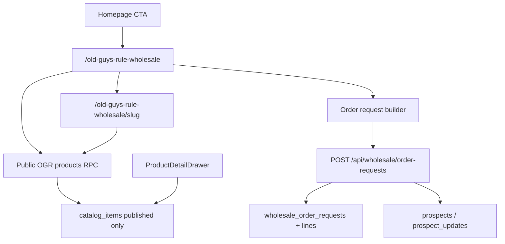

# Old Guys Rule wholesale public — status

Living notes for the public OGR showroom and **OG product cards**. Companion delivery report for the MVP gate: [`ogr-wholesale-delivery-report.md`](./ogr-wholesale-delivery-report.md). Spec source: [`product-architecture.md`](./product-architecture.md).

**Branch for next card work:** `feature/og-cards` (cut from `main` after PR #48).

---

## Status overview (2026-08-07)

| Area | Status |
|------|--------|
| Public showroom `/old-guys-rule-wholesale` | **Shipped** |
| Product detail `/old-guys-rule-wholesale/[slug]` | **Shipped** |
| Homepage OGR brand CTA → showroom | **Shipped** |
| Public catalog RPCs (no anon table SELECT) | **Shipped** |
| Order-request submit → CRM | **Shipped** |
| OG product cards (grid) | **Shipped** — see below |
| Sales-volume “Best sellers” sort + `#N` badges | **Shipped** (PR #48) |
| Lifestyle theme tags on cards / filters | **Shipped** (PR #48 taxonomy) |
| Retailer pricing gate + likes on cards | **Shipped** |
| Open Graph / social preview polish | Partial — layout + product `og:image`; structured data / dedicated share art still open |
| Payment, live inventory, cloud carts | Out of scope |

---

## OG product cards — done to date

Public grid cards live in [`WholesaleProductCard.tsx`](../src/components/wholesale/WholesaleProductCard.tsx), rendered by [`WholesaleShowroom.tsx`](../src/components/wholesale/WholesaleShowroom.tsx).

### Card surface (buyer-facing)

Each published product card currently shows:

- Primary catalog image (4:5, object-contain) or “Image coming soon”
- Optional **heart / like** when a signed-in retailer (`buyer` role) is present
- Badge row:
  - **`#N best seller`** when absolute sales-volume rank is **1–32** (`BEST_SELLER_BADGE_MAX_RANK`)
  - Otherwise up to **3 lifestyle theme** pills (canonical merchandise themes only)
  - **New** / **Featured** when flagged
- Name, SKU · category · color, tagline
- Suggested retail CAD (FX-buffered range when unlocked) + disclaimer
- Wholesale USD when pricing is unlocked for the session; otherwise locked / request-access copy
- Actions: **View Details**, **Add** (order draft) or **Request pricing**

Best-seller chips take priority over theme pills so top sellers stay visually consistent regardless of active filters.

### Ranking & sort

- Staff enter **Sales rank** via `catalog_items.public_sort_order` in the product drawer (top sellers use 10, 20, 30…; other published items fall back to `9000 + page*10`).
- Migration: [`20260807120000_ogr_sales_rank_public_sort.sql`](../supabase/migrations/20260807120000_ogr_sales_rank_public_sort.sql).
- Client helper: `salesVolumeRankByProductId` in [`wholesaleFilters.ts`](../src/lib/wholesaleFilters.ts).
- Default showroom sort label is **Best sellers** (sales volume, highest first), with an explanatory hint in the filter bar.

### Lifestyle themes & CRM taxonomy

- Themes on cards/filters come from the **merchandise lifestyle theme** vocabulary in [`crmRetailTaxonomy.ts`](../src/lib/crmRetailTaxonomy.ts) (not the old Golf/Marina/Hardware/Resort Gift CRM codes).
- Staff edit **Lifestyle Themes** and **Recommended Retail Channels** (primaries, max 3) on the product drawer; saves preserve any non-canonical stored values so accidental wipe-on-save is avoided.
- Catalog rows were remapped via migrations `20260807140000_*`, `20260807150000_*`, `20260807161000_*`; prospects use the full primary/subchannel/venue/capability model (`20260807160000_*`).

### Pricing gate & buyer account hooks on the card

- Anonymous / locked buyers see retail guidance and request-access CTAs; approved signed-in buyers see wholesale and can **Add** to the draft.
- Likes sync through [`buyerLikes.ts`](../src/lib/buyerLikes.ts); cart sync through [`buyerCart.ts`](../src/lib/buyerCart.ts).
- Account entry points sit in the showroom chrome (`/login`, `/account`).

### Homepage brand card (related)

The Brands band on [`index.astro`](../src/pages/index.astro) is driven by **line portfolio** fields (`tagline`, description, hero image) editable from the Line Sheet. OGR **View Line** targets `/old-guys-rule-wholesale` (not the external marketplace).

---

## Supporting stack already in place

- **Routes:** collection + slug detail SSR pages; `POST /api/wholesale/order-requests`
- **Public data:** `get_public_ogr_products` / by-slug / supplier-terms RPCs; mapping in [`publicCatalog.ts`](../src/lib/publicCatalog.ts)
- **Staff publish controls:** Published / Featured / Sort / Slug / preview link in `ProductDetailDrawer`
- **Quality gate:** see delivery report §6–10; later work covered by Vitest around filters, ranks, taxonomy, buyer access

Architecture mermaid from the original plan (still accurate):

---

## Original inspection (superseded)

The pre-implementation audit below is kept for history. It described the repo **before** Phases 1–4; those gaps are closed (see Status overview).

Pre-MVP inspection findings

| Area | Then |
|------|------|
| Public routes | No wholesale showroom |
| Homepage View Line | External marketplace URL |
| RLS | Catalog staff-only; no public projection |
| Order-request entity | Missing |
| Public product card | Missing |

Security constraint that still holds: **do not** grant anon `SELECT` on `catalog_items`; public data only via restricted RPCs.

---

## Next on `feature/og-cards`

Use this branch for further OG card / showroom card design and behavior work. Candidates implied by architecture but not fully closed:

- Richer Open Graph / social preview cards (collection + product)
- Product / collection structured data
- Card layout or imagery polish beyond the current Organic elev card
- Any remaining architecture card fields (e.g. hover alternate image on pointer devices only)

Record decisions here as they ship.
