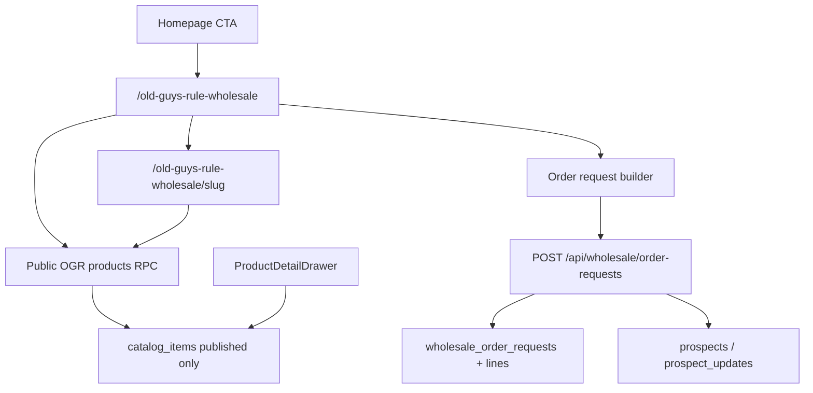

# Old Guys Rule wholesale public — status

Living notes for the public OGR showroom, **social OG metadata**, and **staff product email** (Copy Email Card + Email Product). Companion delivery report for the MVP gate: [`ogr-wholesale-delivery-report.md`](./ogr-wholesale-delivery-report.md). Spec source: [`product-architecture.md`](./product-architecture.md). Roadmap: [`../ogr-product-email-composer-roadmap.md`](../ogr-product-email-composer-roadmap.md).

**Branch:** `feature/og-cards` (Phases 1–5 card stack + Phases A–D email composer).

---

## Status overview (2026-08-07)

| Area                                                  | Status                        |
| ----------------------------------------------------- | ----------------------------- |
| Public showroom `/old-guys-rule-wholesale`            | **Shipped**                   |
| Product detail `/old-guys-rule-wholesale/[slug]`      | **Shipped**                   |
| Homepage OGR brand CTA → showroom                     | **Shipped**                   |
| Public catalog RPCs (no anon table SELECT)            | **Shipped**                   |
| Order-request submit → CRM                            | **Shipped**                   |
| Storefront product cards (grid)                       | **Shipped** — see below       |
| Sales-volume “Best sellers” sort + `#N` badges        | **Shipped** (PR #48)          |
| Lifestyle theme tags on cards / filters               | **Shipped** (PR #48 taxonomy) |
| Retailer pricing gate + likes on cards                | **Shipped**                   |
| Public presentation + canonical URLs + SSR OG/Twitter | **Shipped** (Phases 1–4)      |
| Share-image policy (primary → line hero → omit)       | **Shipped** (Phase 4)         |
| Email-safe product card HTML fragment                 | **Shipped** (Phase 5)         |
| Copy Email Card (staff clipboard)                     | **Shipped** (Phase B)         |
| Staff Email Product send via Resend                   | **Shipped** (Phases A–D)      |
| Payment, live inventory, cloud carts                  | Out of scope                  |

---

## Four concepts (do not conflate)

| Concept                 | Meaning                                                                                        |
| ----------------------- | ---------------------------------------------------------------------------------------------- |
| **Product Link**        | Public page URL: `/old-guys-rule-wholesale/{slug}` (absolute via `buildOgrProductUrl`)         |
| **Open Graph Metadata** | SSR `<head>` tags for social/link unfurlers (`ogrPageMetadata` → Layout)                       |
| **Email Card**          | HTML **fragment** from `renderOgrProductEmailCard` — clipboard or embedded in outreach         |
| **Email Product**       | Full outreach email (`renderOgrProductOutreachEmail`) composed server-side and sent via Resend |

> **There is no “email OG card URL.”** The product page URL is the CTA target. The email card is HTML, not a route like `/email-card/{slug}`.

### Staff workflows

**Copy Email Card** (convenience; clients may rewrite paste HTML):

1. Product drawer → Public wholesale → Email → **Copy Email Card**
2. Client builds presentation from the current draft → `renderOgrProductEmailCard`
3. Clipboard: `text/html` + `text/plain` (`copyOgrProductEmailCard`); falls back to plain text only

**Email Product** (canonical app-sent path):

1. Product drawer → **Email Product** (requires published + slug)
2. `OgrProductEmailComposerModal` → `sendOgrProductEmail` → `POST /api/staff/ogr-product-email`
3. Server: approved staff → published OGR lookup → presentation → absolute product URL → outreach compose → Resend

App-sent Resend HTML is the **canonical** rendering path. Rich clipboard paste is a convenience feature.

### Developer commands

```bash
# Card HTML file preview (no send)
npm run email:preview-ogr-card
# → tmp/ogr-product-email-card-preview.html

# Staging send — never hardcodes recipient; prefers staff API
npm run email:test-ogr-product -- --to=you@example.com --product-id=<uuid> --token=<staff-jwt>
# Slug fallback (public RPC + Resend, not the staff API):
npm run email:test-ogr-product -- --to=you@example.com --slug=<public-slug>
```

### Env (server-only)

| Variable                     | Role                                                                  |
| ---------------------------- | --------------------------------------------------------------------- |
| `RESEND_API_KEY`             | Required for send; missing → `Email is not configured` (no silent OK) |
| `WHOLESALE_ORDER_EMAIL_FROM` | Optional From override; else `Justin Fassio <office@…>`               |
| `PUBLIC_SITE_URL`            | Preferred absolute origin for product CTAs in email                   |

Never import `RESEND_API_KEY` into React islands.

### Relevant files

| File                                                                                     | Role                        |
| ---------------------------------------------------------------------------------------- | --------------------------- |
| [`publicProductPresentation.ts`](../src/lib/publicProductPresentation.ts)                | Wholesale-free view model   |
| [`productUrls.ts`](../src/lib/productUrls.ts)                                            | Paths + absolute URLs       |
| [`ogrPageMetadata.ts`](../src/lib/ogrPageMetadata.ts)                                    | SSR OG/Twitter              |
| [`ogrShareImages.ts`](../src/lib/ogrShareImages.ts)                                      | Social image fallback       |
| [`ogrProductEmailCard.ts`](../src/lib/ogrProductEmailCard.ts)                            | Phase 5 email card fragment |
| [`ogrProductOutreachEmail.ts`](../src/lib/ogrProductOutreachEmail.ts)                    | Full outreach compose       |
| [`copyOgrProductEmailCard.ts`](../src/lib/copyOgrProductEmailCard.ts)                    | Clipboard helper            |
| [`sendOgrProductEmailClient.ts`](../src/lib/sendOgrProductEmailClient.ts)                | Staff Bearer client         |
| [`sendOgrProductOutreachEmail.ts`](../src/lib/sendOgrProductOutreachEmail.ts)            | Resend transport            |
| [`loadPublishedOgrProductForEmail.ts`](../src/lib/loadPublishedOgrProductForEmail.ts)    | Authoritative send lookup   |
| [`api/staff/ogr-product-email.ts`](../src/pages/api/staff/ogr-product-email.ts)          | Staff send endpoint         |
| [`OgrProductEmailComposerModal.tsx`](../src/components/OgrProductEmailComposerModal.tsx) | Composer UI                 |

**Intentional differences:** social share may fall back to line hero; email card uses primary/override only then text-only. Suggested retail appears on storefront, not in meta/email card. Best-seller badge on draft-preview/clipboard cards may be absent (staff sort steps ≠ absolute 1–32 ranks).

**Known limitation:** direct `/[slug]` product page does not refetch catalog after buyer login (collection showroom does). Pre-existing; not introduced by card/email phases.

---

## OGR Card System (Phases 1–5)

One public-safe product contract, multiple renderers:

| Layer        | Module                                                                    | Role                                                                      |
| ------------ | ------------------------------------------------------------------------- | ------------------------------------------------------------------------- |
| Presentation | [`publicProductPresentation.ts`](../src/lib/publicProductPresentation.ts) | Wholesale-free product view model                                         |
| URLs         | [`productUrls.ts`](../src/lib/productUrls.ts)                             | Collection/product paths + absolute URLs                                  |
| Metadata     | [`ogrPageMetadata.ts`](../src/lib/ogrPageMetadata.ts)                     | SSR `PageMetadata` → Layout OG/Twitter                                    |
| Share images | [`ogrShareImages.ts`](../src/lib/ogrShareImages.ts)                       | Product: absolute primary → OGR line hero → omit; collection: hero → omit |
| Email card   | [`ogrProductEmailCard.ts`](../src/lib/ogrProductEmailCard.ts)             | Pure HTML fragment                                                        |

## Storefront product cards — done to date

Public grid cards live in [`WholesaleProductCard.tsx`](../src/components/wholesale/WholesaleProductCard.tsx), rendered by [`WholesaleShowroom.tsx`](../src/components/wholesale/WholesaleShowroom.tsx).

### Card surface (buyer-facing)

Each published product card currently shows:

- Primary catalog image (4:5, object-contain) or “Image coming soon”
- Optional **heart / like** when a signed-in retailer (`buyer` role) is present
- Badge row:
  - **`#N best seller`** when absolute sales-volume rank is **1–32** (`BEST_SELLER_BADGE_MAX_RANK`)
  - Otherwise up to **3 lifestyle theme** pills (canonical merchandise themes only)
  - **New** / **Featured** when flagged
- Name, SKU · category · color, tagline
- Suggested retail CAD (FX-buffered range when unlocked) + disclaimer
- Wholesale USD when pricing is unlocked for the session; otherwise locked / request-access copy
- Actions: **View Details**, **Add** (order draft) or **Request pricing**

Best-seller chips take priority over theme pills so top sellers stay visually consistent regardless of active filters.

### Ranking & sort

- Staff enter **Sales rank** via `catalog_items.public_sort_order` in the product drawer (top sellers use 10, 20, 30…; other published items fall back to `9000 + page*10`).
- Migration: [`20260807120000_ogr_sales_rank_public_sort.sql`](../supabase/migrations/20260807120000_ogr_sales_rank_public_sort.sql).
- Client helper: `salesVolumeRankByProductId` in [`wholesaleFilters.ts`](../src/lib/wholesaleFilters.ts).
- Default showroom sort label is **Best sellers** (sales volume, highest first), with an explanatory hint in the filter bar.

### Lifestyle themes & CRM taxonomy

- Themes on cards/filters come from the **merchandise lifestyle theme** vocabulary in [`crmRetailTaxonomy.ts`](../src/lib/crmRetailTaxonomy.ts) (not the old Golf/Marina/Hardware/Resort Gift CRM codes).
- Staff edit **Lifestyle Themes** and **Recommended Retail Channels** (primaries, max 3) on the product drawer; saves preserve any non-canonical stored values so accidental wipe-on-save is avoided.
- Catalog rows were remapped via migrations `20260807140000_*`, `20260807150000_*`, `20260807161000_*`; prospects use the full primary/subchannel/venue/capability model (`20260807160000_*`).

### Pricing gate & buyer account hooks on the card

- Anonymous / locked buyers see retail guidance and request-access CTAs; approved signed-in buyers see wholesale and can **Add** to the draft.
- Likes sync through [`buyerLikes.ts`](../src/lib/buyerLikes.ts); cart sync through [`buyerCart.ts`](../src/lib/buyerCart.ts).
- Account entry points sit in the showroom chrome (`/login`, `/account`).

### Homepage brand card (related)

The Brands band on [`index.astro`](../src/pages/index.astro) is driven by **line portfolio** fields (`tagline`, description, hero image) editable from the Line Sheet. OGR **View Line** targets `/old-guys-rule-wholesale` (not the external marketplace).

---

## Supporting stack already in place

- **Routes:** collection + slug detail SSR pages; `POST /api/wholesale/order-requests`
- **Public data:** `get_public_ogr_products` / by-slug / supplier-terms RPCs; mapping in [`publicCatalog.ts`](../src/lib/publicCatalog.ts)
- **Staff publish controls:** Published / Featured / Sort / Slug / Copy public link / Preview / Copy Email Card / Email Product in `ProductDetailDrawer`
- **Quality gate:** see delivery report §6–10; later work covered by Vitest around filters, ranks, taxonomy, buyer access

Architecture mermaid from the original plan (still accurate):



---

## Original inspection (superseded)

The pre-implementation audit below is kept for history. It described the repo **before** Phases 1–4; those gaps are closed (see Status overview).

<details>
<summary>Pre-MVP inspection findings</summary>

| Area                 | Then                                     |
| -------------------- | ---------------------------------------- |
| Public routes        | No wholesale showroom                    |
| Homepage View Line   | External marketplace URL                 |
| RLS                  | Catalog staff-only; no public projection |
| Order-request entity | Missing                                  |
| Public product card  | Missing                                  |

Security constraint that still holds: **do not** grant anon `SELECT` on `catalog_items`; public data only via restricted RPCs.

</details>

---

## Next after email composer

Deferred (not blockers for this merge):

- CRM contact picker / account-first Email Product
- Optional UTM wrapper around Phase 2 absolute URLs (never on canonical/`og:url`)
- CRM activity logging of sends
- Generated branded OG images / curated 1200×630 collection asset
- Product / collection JSON-LD
- Absolute sales-volume rank on server-sent cards (best-seller badge)

Record decisions here as they ship.
