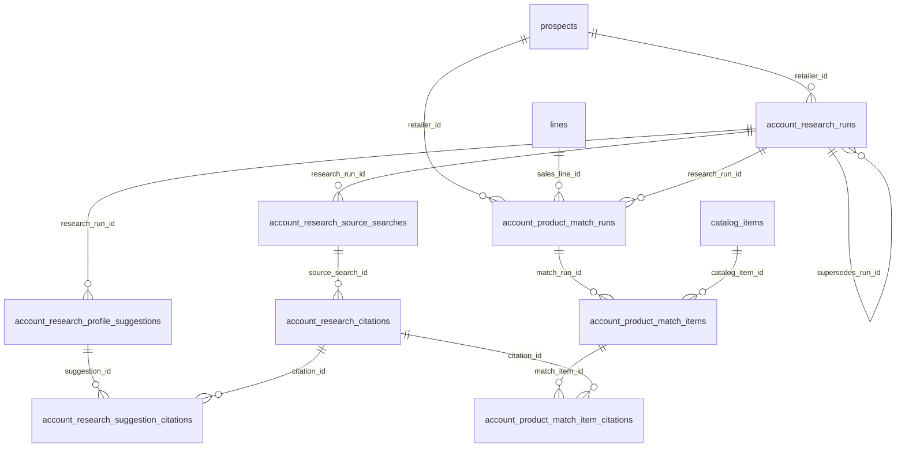

# PR1 Plan: Account Research Schema Foundation

**Status:** Planning only — ready for implementation PR after approval.  
**Feature audit (source of truth):** [docs/epics/agentic-outreach/account-research-before-product-selection.md](../epics/agentic-outreach/account-research-before-product-selection.md)  
**Epic:** [docs/epics/agentic-outreach/README.md](../epics/agentic-outreach/README.md)  
**Branch inspected:** `update/enhance-agent-email-draft-and-research-workflow` at `2459a12`  
**Date:** 2026-08-23  

This document is the implementation-ready plan for **PR1 only**. It creates durable database structures, constraints, indexes, RLS, hand-written types, schema validation tests, and documentation. It does **not** run searches, call providers, add APIs/UI, generate suggestions/matches, or change outreach selection/send behavior.

---

## 1. PR1 objective and explicit boundaries

### Objective

Add an **additive** Account Research schema so later PRs can:

1. Persist retailer-level immutable research runs with **platform-specific** source searches.
2. Store citation-level public evidence with acceptance and identity confidence.
3. Store profile **suggestions** (not CRM writes) linked to citations via junction tables.
4. Store line-specific product-match runs (explicit `sales_line_id`) linked to **one** research run and to citations via junctions.

### In scope

- One additive SQL migration + mirror into `supabase/schema.sql`
- Hand-update `src/types/database.ts` (Row / Insert / Update)
- Vitest SQL-content schema foundation tests
- Documentation (this plan + audit reconciliation)

### Out of scope (hard NO)

| Exclusion | Reason |
| --------- | ------ |
| Public-web / social / Shopify search execution | PR2+ |
| Perplexity / AI Gateway calls | PR2+ |
| Staff APIs or UI / platform buttons | PR2 / PR5 |
| Profile suggestion generation | PR3 |
| Product recommendations | PR4 |
| Nightly / prep Mode B research | PR6 (deferred) |
| Changes to account or product selection | Unrelated |
| Draft generation or send / Resend / suppression / cooldown | Unrelated |
| Social URL columns on `prospects` | Locked: citation-only v1 |
| `last_account_research_at` / run pointers on `prospects` | Locked: out of PR1 |
| Auto-apply research to canonical CRM fields | Later apply RPC only |
| Overloading `system_messages` or `account_enrichment_jobs` | Wrong domain |
| Empty unused application stubs | No PR1 function |

---

## 2. Current-state evidence (exact file references)

Re-audited against the live repo (do not rely solely on the prior audit narrative).

### 2.1 Identity and FK types

| Fact | Evidence |
| ---- | -------- |
| `prospects.id` is `integer primary key` | [supabase/schema.sql](../../supabase/schema.sql) (~L462) |
| Sales line table is **`lines`**, PK `uuid` | schema.sql (~L45); never invent `sales_lines` |
| `retailer_line_accounts.sales_line_id` → `lines(id)` (no ON DELETE) | schema.sql (~L747–748) |
| `catalog_items.id` is `uuid` | schema.sql (~L205–207) |
| `retailer_field_changes.retailer_id` → `prospects` **ON DELETE CASCADE**; `actor_id` → `auth.users` **ON DELETE SET NULL** | schema.sql (~L847–865) |
| `field_path` is free `text` (app uses snake_case) | [src/lib/retailerFieldChanges.ts](../../src/lib/retailerFieldChanges.ts); [src/lib/updateProspectAccountDetails.ts](../../src/lib/updateProspectAccountDetails.ts) |

### 2.2 Constraints and indexes conventions

| Fact | Evidence |
| ---- | -------- |
| Prefer `text` + `CHECK` / named `*_check`; **no** `CREATE TYPE … AS ENUM` | Entire migrations tree |
| Partial unique indexes are established | e.g. `retailer_line_accounts_retailer_line_operational_uidx … WHERE relationship_status <> 'terminated'` (schema.sql ~L801–803); `account_enrichment_jobs_batch_retailer_mode_uidx … WHERE status <> 'cancelled'` (~L993–995) |
| Child ownership often **CASCADE**; optional actors **SET NULL**; strong line refs often omit ON DELETE | Multi-line Phase 1 migrations |

### 2.3 RLS and grants

| Fact | Evidence |
| ---- | -------- |
| `public.is_approved_staff()` — approved `owner`/`rep` | schema.sql (~L1592–1608); grant EXECUTE to `authenticated` only |
| Typical policy: `"approved staff full access"` FOR ALL TO authenticated USING/WITH CHECK `is_approved_staff()` | e.g. prospects, `retailer_field_changes` |
| No `GRANT … ON TABLE` to `authenticated`/`anon` for CRM tables; access via RLS + default privileges | Migrations |

### 2.4 Types generation

| Fact | Evidence |
| ---- | -------- |
| Types are **hand-written**, not CLI-generated | [src/types/database.ts](../../src/types/database.ts) L1–7 |
| No `supabase gen types` script in `package.json` | package.json scripts |
| Prior foundation PR mirrored schema + types by hand | [docs/plans/multi-line-phase-1-schema-foundation.md](./multi-line-phase-1-schema-foundation.md) |

**Material difference from early audit wording:** do **not** plan on `supabase gen types` for PR1. Hand-update `database.ts` + `schema.sql`.

### 2.5 Schema test pattern

| Fact | Evidence |
| ---- | -------- |
| Vitest reads migration + `schema.sql` as strings and asserts CREATE/CHECK/RLS | [src/lib/multiLinePhase1aSchema.test.ts](../../src/lib/multiLinePhase1aSchema.test.ts), [src/lib/bulkImportPhase1Schema.test.ts](../../src/lib/bulkImportPhase1Schema.test.ts) |
| Not live DB RLS integration tests | Same |

### 2.6 Product outreach and fit vocabulary

| Fact | Evidence |
| ---- | -------- |
| 90-day product dedup | `AGENT_OUTREACH_PRODUCT_DEDUP_DAYS = 90` in [src/lib/outreachSelectionConstants.ts](../../src/lib/outreachSelectionConstants.ts) |
| Indexes for recent sends | `system_messages_prospect_sent_at_idx`, `system_messages_catalog_item_sent_at_idx` (schema.sql) |
| `ProductFitKind` | `'channel_intersect' \| 'global_fallback'` in [src/lib/outreachProductSelection.ts](../../src/lib/outreachProductSelection.ts) |
| Confidence | App uses `'high' \| 'medium' \| 'low'` with `retailer_field_changes.confidence` text |

### 2.7 Existing research storage (do not overload)

| Store | Path | Gap |
| ----- | ---- | --- |
| `account_enrichment_jobs` | schema.sql ~L976 | Job-scoped jsonb; import lifecycle |
| `retailer_field_changes` | schema.sql ~L847 | Field audit; not citation rows |
| `companyWebResearch` | [src/lib/companyWebResearch.ts](../../src/lib/companyWebResearch.ts) | Live search only; `facebook.com` is a **directory host to avoid**, not a research target |
| Fill-blank evidence | [src/lib/fillBlankProspectFields.ts](../../src/lib/fillBlankProspectFields.ts) | Zod blob; not durable citations |

### 2.8 Migration sequence (latest)

Latest: `20260822220100_outreach_adaptive_weights_toggle.sql`.  
Proposed PR1: `20260823120000_account_research_schema_foundation.sql` (after that sequence).

### 2.9 Confirm: research tables absent

`rg account_research` under `supabase/` finds none. Audit gap remains valid.

---

## 3. Locked product and platform decisions

| Decision | Lock |
| -------- | ---- |
| Operating mode | **Mode A** (on-demand staff research) only; Mode B deferred |
| Search All | One parent run + **six** child source searches — never one combined provider query |
| v1 sources | `website`, `shopify`, `instagram`, `facebook`, `tiktok`, `pinterest` |
| Shopify | Storefront source (`search_mode = storefront`), not social; later logic supports `*.myshopify.com` + custom domains with cited evidence |
| Future sources in CHECK | `linkedin`, `youtube`, `x`, `other` allowed in schema; **no** v1 buttons |
| Single-platform refresh | New immutable run; `supersedes_run_id` chain; do not mutate completed evidence |
| Product match | Requires explicit `sales_line_id` (NOT NULL); no silent OGR default |
| Match ↔ research | Exactly one `research_run_id`; no silent merge across runs |
| Draft approval (later) | Staff selection of a recommended SKU is sufficient to generate a draft |
| Send | Existing staff composer Send remains mandatory |
| Briefing | Call Today / Hot / Warm do **not** force Research before Log Call |
| Social URLs | Citation-only in v1; no `prospects` social columns |
| Prospect pointers | No `last_account_research_*` columns in PR1 |
| Citation links | Junction tables only — **no** `uuid[]` |
| `none_indexed` | Distinct from inactive / closed business |

---

## 4. Exact target ER model



**Layer rule:** retailer research tables never store SKU picks; product-match tables never store raw web evidence as primary storage.

---

## 5. Exact tables and columns

### 5.1 `account_research_runs`

| Column | Type | Null | Default | Notes |
| ------ | ---- | ---- | ------- | ----- |
| `id` | uuid | NO | `gen_random_uuid()` | PK |
| `retailer_id` | integer | NO | — | FK → `prospects(id)` ON DELETE CASCADE |
| `status` | text | NO | `'pending'` | CHECK (see §6) |
| `trigger` | text | NO | `'manual'` | CHECK |
| `requested_scope` | text | NO | — | CHECK; `all` or single source |
| `identity_confidence` | text | NO | `'unresolved'` | CHECK |
| `identity_review_status` | text | NO | `'not_required'` | CHECK |
| `identity_reviewed_by` | uuid | YES | — | FK → `auth.users` ON DELETE SET NULL |
| `identity_reviewed_at` | timestamptz | YES | — | |
| `identity_resolution` | text | YES | — | Staff/system note |
| `resolved_website` | text | YES | — | |
| `research_brief` | text | YES | — | Non-canonical narrative |
| `provider` | text | YES | — | e.g. `perplexity_via_gateway` |
| `provider_metadata` | jsonb | NO | `'{}'` | Non-secret cost/step metadata |
| `error` | text | YES | — | |
| `requested_by` | uuid | YES | — | FK → `auth.users` ON DELETE SET NULL |
| `started_at` | timestamptz | YES | — | |
| `completed_at` | timestamptz | YES | — | Freshness = `completed_at` when succeeded/partial |
| `created_at` | timestamptz | NO | `now()` | |
| `supersedes_run_id` | uuid | YES | — | Self-FK → `account_research_runs(id)` ON DELETE SET NULL |

**Do not store** aggregate `social_index_status`. Platform outcomes live only on `account_research_source_searches.status`. A later read model may derive a summary; PR1 does not add a drift-prone denormalized column.

### 5.2 `account_research_source_searches`

| Column | Type | Null | Default | Notes |
| ------ | ---- | ---- | ------- | ----- |
| `id` | uuid | NO | `gen_random_uuid()` | PK |
| `research_run_id` | uuid | NO | — | FK → runs ON DELETE CASCADE |
| `source_type` | text | NO | — | CHECK |
| `search_mode` | text | NO | — | CHECK: `identity` \| `recent_activity` \| `storefront` |
| `status` | text | NO | `'pending'` | CHECK incl. `none_indexed`, `blocked` |
| `resolved_public_url` | text | YES | — | Profile/storefront URL |
| `query_text` | text | YES | — | Exact query |
| `provider` | text | YES | — | |
| `result_count` | integer | NO | `0` | CHECK `>= 0` |
| `error` | text | YES | — | |
| `requested_by` | uuid | YES | — | auth.users SET NULL |
| `provider_metadata` | jsonb | NO | `'{}'` | |
| `started_at` | timestamptz | YES | — | |
| `completed_at` | timestamptz | YES | — | |
| `created_at` | timestamptz | NO | `now()` | |

**Uniqueness:** `UNIQUE (research_run_id, source_type, search_mode)`.

**Search-all invariant:** When `requested_scope = 'all'`, PR2 transactional insert creates exactly the six v1 source rows (with modes chosen by service: website→identity, shopify→storefront, social→recent_activity). **Not** enforceable by cross-table CHECK in PR1.

### 5.3 `account_research_citations`

| Column | Type | Null | Default | Notes |
| ------ | ---- | ---- | ------- | ----- |
| `id` | uuid | NO | `gen_random_uuid()` | PK |
| `source_search_id` | uuid | NO | — | FK → source_searches ON DELETE CASCADE |
| `research_run_id` | uuid | NO | — | Denormalized; must match parent search’s run (trigger) |
| `retailer_id` | integer | NO | — | Denormalized for query/RLS locality |
| `source_url` | text | NO | — | As observed |
| `source_url_normalized` | text | NO | — | Dedupe key; app-normalized in PR2+ |
| `title` | text | YES | — | |
| `platform` | text | NO | — | CHECK (source types + `directory`) |
| `published_at` | timestamptz | YES | — | When known |
| `observed_at` | timestamptz | NO | — | Required |
| `excerpt` | text | YES | — | Short; never private/full page |
| `confidence` | text | NO | — | `high` \| `medium` \| `low` |
| `identity_confidence` | text | NO | — | Same enum as run-level |
| `acceptance_status` | text | NO | `'pending'` | CHECK |
| `acceptance_basis` | text | YES | — | `identity_gate` \| `staff` when set |
| `accepted_or_rejected_by` | uuid | YES | — | auth.users SET NULL |
| `accepted_or_rejected_at` | timestamptz | YES | — | |
| `provider_metadata` | jsonb | NO | `'{}'` | |
| `created_at` | timestamptz | NO | `now()` | |

**Uniqueness:** `UNIQUE (source_search_id, source_url_normalized)`.

**Do not store:** full scraped HTML, secrets, private social content, excessive copyrighted text.

### 5.4 `account_research_profile_suggestions`

| Column | Type | Null | Default | Notes |
| ------ | ---- | ---- | ------- | ----- |
| `id` | uuid | NO | `gen_random_uuid()` | PK |
| `research_run_id` | uuid | NO | — | FK → runs ON DELETE CASCADE |
| `retailer_id` | integer | NO | — | FK → prospects CASCADE; must match run (trigger) |
| `field_path` | text | NO | — | Align with `retailer_field_changes.field_path` |
| `suggested_value` | jsonb | NO | — | |
| `rationale` | text | YES | — | |
| `confidence` | text | NO | — | `high` \| `medium` \| `low` |
| `status` | text | NO | `'pending'` | CHECK |
| `reviewed_by` | uuid | YES | — | auth.users SET NULL |
| `reviewed_at` | timestamptz | YES | — | |
| `created_at` | timestamptz | NO | `now()` | |

**No `citation_ids uuid[]`.**

### 5.5 `account_research_suggestion_citations`

| Column | Type | Null | Notes |
| ------ | ---- | ---- | ----- |
| `suggestion_id` | uuid | NO | FK → suggestions ON DELETE CASCADE |
| `citation_id` | uuid | NO | FK → citations ON DELETE CASCADE |
| `research_run_id` | uuid | NO | Denormalized for same-run enforcement |
| `created_at` | timestamptz | NO | default `now()` |

**PK:** composite `(suggestion_id, citation_id)` (unique pair).  
**Same-run integrity:** BEFORE INSERT/UPDATE trigger verifies suggestion.`research_run_id` = citation.`research_run_id` = row.`research_run_id`.

### 5.6 `account_product_match_runs`

| Column | Type | Null | Default | Notes |
| ------ | ---- | ---- | ------- | ----- |
| `id` | uuid | NO | `gen_random_uuid()` | PK |
| `retailer_id` | integer | NO | — | FK → prospects CASCADE |
| `sales_line_id` | uuid | NO | — | FK → `lines(id)` **no ON DELETE**; **NOT NULL**; no default |
| `research_run_id` | uuid | NO | — | FK → research runs; prefer **RESTRICT** so match history is not silently orphaned by accidental run delete (or CASCADE if product prefers wipe — **choose RESTRICT** for PR1) |
| `status` | text | NO | `'pending'` | CHECK |
| `empty_reason` | text | YES | — | CHECK when set; required by service when status=`empty` |
| `requested_by` | uuid | YES | — | auth.users SET NULL |
| `provider_metadata` | jsonb | NO | `'{}'` | Model/provider non-secret |
| `error` | text | YES | — | |
| `started_at` | timestamptz | YES | — | |
| `completed_at` | timestamptz | YES | — | |
| `created_at` | timestamptz | NO | `now()` | |

### 5.7 `account_product_match_items`

| Column | Type | Null | Default | Notes |
| ------ | ---- | ---- | ------- | ----- |
| `id` | uuid | NO | `gen_random_uuid()` | PK |
| `match_run_id` | uuid | NO | — | FK → match_runs ON DELETE CASCADE |
| `catalog_item_id` | uuid | NO | — | FK → catalog_items (no ON DELETE / RESTRICT) |
| `rank` | smallint | NO | — | CHECK `BETWEEN 1 AND 3` |
| `rationale` | text | NO | — | Short |
| `product_fit` | text | NO | — | CHECK `channel_intersect` \| `global_fallback` |
| `created_at` | timestamptz | NO | `now()` | |

**Constraints:** `UNIQUE (match_run_id, rank)`; `UNIQUE (match_run_id, catalog_item_id)`.  
**No** `excluded_recent_send`. Products filtered by 90-day rule **before insert** in PR4. Empty outcomes use match run `status = 'empty'` + `empty_reason`.

### 5.8 `account_product_match_item_citations`

| Column | Type | Null | Notes |
| ------ | ---- | ---- | ----- |
| `match_item_id` | uuid | NO | FK → items ON DELETE CASCADE |
| `citation_id` | uuid | NO | FK → citations ON DELETE CASCADE |
| `research_run_id` | uuid | NO | Must equal parent match run’s research_run_id |
| `created_at` | timestamptz | NO | default `now()` |

**PK:** `(match_item_id, citation_id)`.  
**Same-run integrity:** trigger: citation.`research_run_id` = match_run.`research_run_id` via item → run join (or denormalized `research_run_id` on item row — prefer denormalize onto junction only + validate against match_runs).

---

## 6. Controlled values, defaults, and nullability

### Status / enum CHECKs (text)

**`account_research_runs.status`:**  
`pending` | `running` | `succeeded` | `partial` | `failed` | `needs_identity_review` | `cancelled`

**`account_research_runs.trigger`:**  
`manual` | `prep` | `api`

**`account_research_runs.requested_scope`:**  
`all` | `website` | `shopify` | `instagram` | `facebook` | `tiktok` | `pinterest` | `linkedin` | `youtube` | `x` | `other`

**Identity confidence (run + citation):**  
`high` | `medium` | `low` | `unresolved`

**`identity_review_status`:**  
`pending` | `auto_accepted` | `staff_confirmed` | `rejected` | `not_required`

**`source_type` / citation `platform`:**  
`website` | `shopify` | `instagram` | `facebook` | `tiktok` | `pinterest` | `linkedin` | `youtube` | `x` | `other`  
Citation `platform` also allows `directory`.

**`search_mode`:**  
`identity` | `recent_activity` | `storefront`

**Source search `status`:**  
`pending` | `running` | `succeeded` | `none_indexed` | `blocked` | `failed` | `cancelled`

**Citation `acceptance_status`:**  
`pending` | `accepted` | `rejected`

**Citation `acceptance_basis`:**  
`identity_gate` | `staff` (nullable until decided)

**Suggestion `status`:**  
`pending` | `accepted` | `rejected` | `superseded`

**Match run `status`:**  
`pending` | `running` | `succeeded` | `empty` | `failed` | `stale_research` | `cancelled`

**Match `empty_reason`:**  
`all_recently_emailed` | `no_eligible_products` | `no_accepted_evidence` | `identity_unresolved`

**Confidence:** `high` | `medium` | `low`

**`product_fit`:** `channel_intersect` | `global_fallback` (matches live `ProductFitKind`)

---

## 7. PKs, FKs, deletion behavior, constraints, and indexes

### Deletion matrix

| Edge | ON DELETE |
| ---- | --------- |
| runs → prospects | CASCADE |
| source_searches → runs | CASCADE |
| citations → source_searches | CASCADE |
| suggestions → runs | CASCADE |
| suggestion_citations → suggestion / citation | CASCADE |
| match_runs → prospects | CASCADE |
| match_runs → lines | _(omit / NO ACTION)_ |
| match_runs → research_runs | **RESTRICT** |
| match_items → match_runs | CASCADE |
| match_items → catalog_items | _(omit / NO ACTION)_ |
| match_item_citations → item / citation | CASCADE |
| actor columns → auth.users | SET NULL |
| supersedes_run_id → runs | SET NULL |

### Critical constraints

1. **One active research run per retailer**  
   `CREATE UNIQUE INDEX account_research_runs_one_active_per_retailer_uidx ON account_research_runs (retailer_id) WHERE status IN ('pending', 'running');`  
   **Release:** terminal statuses (`succeeded`, `partial`, `failed`, `needs_identity_review`, `cancelled`) leave the partial index, allowing the next refresh. Concurrent second `pending`/`running` insert fails — expected.

2. **Source uniqueness within run** — `UNIQUE (research_run_id, source_type, search_mode)`.

3. **URL uniqueness within source search** — `UNIQUE (source_search_id, source_url_normalized)`.

4. **Match ranks** — CHECK 1–3 + unique rank + unique catalog item per run.

### Indexes (named queries)

| Index name (proposed) | Definition | Query |
| --------------------- | ---------- | ----- |
| `…_one_active_per_retailer_uidx` | partial unique `(retailer_id) WHERE status IN ('pending','running')` | Concurrent guard |
| `account_research_runs_retailer_completed_idx` | `(retailer_id, completed_at DESC) WHERE status IN ('succeeded','partial')` | Latest successful / 7-day freshness |
| `account_research_source_searches_run_source_status_idx` | `(research_run_id, source_type, status)` | Source rows by run |
| `account_research_citations_search_observed_idx` | `(source_search_id, observed_at DESC)` | Evidence timeline |
| `account_research_citations_run_acceptance_idx` | `(research_run_id, acceptance_status)` | Accepted evidence for matching |
| `account_research_profile_suggestions_run_pending_idx` | `(research_run_id) WHERE status = 'pending'` | Pending review |
| `account_research_profile_suggestions_retailer_status_idx` | `(retailer_id, status)` | Retailer queue |
| `account_product_match_runs_retailer_line_created_idx` | `(retailer_id, sales_line_id, created_at DESC)` | Match history |
| `account_product_match_items_run_rank_uidx` | unique `(match_run_id, rank)` | Ordered recs |
| `account_product_match_items_run_catalog_uidx` | unique `(match_run_id, catalog_item_id)` | No dup SKUs |
| `account_research_suggestion_citations_citation_idx` | `(citation_id)` | Reverse lookup |
| `account_product_match_item_citations_citation_idx` | `(citation_id)` | Reverse lookup |

Avoid speculative indexes beyond the above.

---

## 8. Platform-specific search representation

| UI / product concept | Schema representation |
| -------------------- | --------------------- |
| Search all sources | `requested_scope = 'all'` + six `account_research_source_searches` rows |
| Website only | `requested_scope = 'website'` + one search (`source_type=website`, typically `search_mode=identity`) |
| Shopify only | `requested_scope = 'shopify'` + one search (`storefront`) |
| Instagram / Facebook / TikTok / Pinterest | Single-source scope + `recent_activity` mode |
| Refresh a source | New run with `supersedes_run_id` pointing at prior relevant run; new search row(s); history immutable |

**Shopify later (PR2+ logic, not PR1 columns):** require cited evidence before labeling a store Shopify; support both `*.myshopify.com` and custom domains.

**`none_indexed`:** valid terminal source status. Must never flip `prospects.account_status` or imply inactivity.

---

## 9. Identity-review and citation-acceptance model

1. Run starts with `identity_confidence = unresolved`, `identity_review_status = not_required` or `pending` as service decides.
2. Low / unresolved identity → run may become `needs_identity_review`; citations stay `acceptance_status = pending`.
3. Auto-accept path (high identity): `identity_review_status = auto_accepted`; citations may be set `accepted` with `acceptance_basis = identity_gate` **only** when service rules say so (PR2).
4. Staff confirm/reject: `staff_confirmed` / `rejected` with actor + timestamp.
5. **Product matching (PR4) may use only `acceptance_status = accepted` citations** for the selected `research_run_id`. Pending/rejected never drive SKU picks.

---

## 10. Suggestion-to-citation integrity

- Junction `account_research_suggestion_citations` only.
- BEFORE INSERT/UPDATE trigger `account_research_suggestion_citations_same_run` asserting:
  - suggestion.research_run_id = NEW.research_run_id
  - citation.research_run_id = NEW.research_run_id
- Unique `(suggestion_id, citation_id)`.
- Cascade delete when suggestion or citation removed.

---

## 11. Product-match-to-citation integrity

- Match run stores exactly one `research_run_id`.
- Junction `account_product_match_item_citations`.
- Trigger: citation.research_run_id equals parent match_run.research_run_id (via match_item_id → match_run_id).
- No citation arrays on items.
- Excluded-by-90-day products are **not** inserted; use `empty` + `all_recently_emailed` when nothing remains.

---

## 12. RLS policies and grants

For **each** of the eight tables:

```sql
alter table <t> enable row level security;

create policy "approved staff full access" on <t>
  for all to authenticated
  using (public.is_approved_staff())
  with check (public.is_approved_staff());
```

- No anon/buyer policies.
- No new table GRANTs (follow CRM convention).
- Direct authenticated client access is **technically possible** under RLS (same as other CRM tables) but **intended** consumption is staff APIs with `requireApprovedStaffClient` (PR2+).
- Service-role / cron: documented for possible Mode B later; **not exposed in PR1**. RLS does not apply to service role.

---

## 13. Migration sequence

| Step | Artifact |
| ---- | -------- |
| 1 | `supabase/migrations/20260823120000_account_research_schema_foundation.sql` |
| 2 | Mirror definitions into `supabase/schema.sql` |
| 3 | Hand-update `src/types/database.ts` |
| 4 | Add `src/lib/accountResearchSchemaFoundation.test.ts` |
| 5 | Link from epic/audit as implemented when PR merges |

Migration contents order:

1. Create tables (runs → source_searches → citations → suggestions → suggestion_citations → match_runs → match_items → match_item_citations)
2. CHECKs / unique / FKs / partial unique
3. Indexes
4. Same-run triggers + functions
5. `ENABLE ROW LEVEL SECURITY` + staff policies
6. **No** DML seeds; **no** ALTER on prospects/RLA/system_messages/catalog

---

## 14. Generated-type procedure

Because types are hand-maintained:

1. Add TypeScript string-union aliases for new CHECKs (optional, colocated in `database.ts` or nearby).
2. Add `Tables` entries with `Row`, `Insert`, `Update` for all eight tables matching SQL nullability/defaults.
3. Do **not** invent RPC types in PR1 (no RPCs yet).
4. Do **not** create empty `src/lib/accountResearch*` runtime stubs.

Optional later aliases (document only): `AccountResearchRunStatus`, `AccountResearchSourceType`, etc. — create when first consumer lands (PR2), not as unused PR1 noise unless needed for `database.ts` cleanliness.

---

## 15. Validation queries

After migration on a disposable DB (manual / local):

```sql
-- Tables exist
select to_regclass('public.account_research_runs');
-- … repeat for all eight

-- Active-run uniqueness (expect second insert to fail)
-- insert two pending runs for same retailer_id

-- none_indexed without touching prospects
-- insert source_search status none_indexed; select account_status unchanged

-- Rank constraints
-- insert match_items rank 4 → fail; duplicate rank → fail; duplicate catalog → fail

-- RLS as non-staff: expect zero rows / policy deny (manual with test JWT)
```

Automated PR1 coverage is SQL-string Vitest (see §17), not mandatory live RLS harness.

---

## 16. Rollback procedure

**While tables unused (PR1 window):**

```sql
drop table if exists account_product_match_item_citations cascade;
drop table if exists account_product_match_items cascade;
drop table if exists account_product_match_runs cascade;
drop table if exists account_research_suggestion_citations cascade;
drop table if exists account_research_profile_suggestions cascade;
drop table if exists account_research_citations cascade;
drop table if exists account_research_source_searches cascade;
drop table if exists account_research_runs cascade;
-- drop trigger functions if standalone
```

Revert `schema.sql` + `database.ts` + delete foundation test.  
**No** prospect / RLA / message / catalog / outreach row changes to undo.

After production data exists, rollback requires a dedicated data-migration plan (out of PR1).

---

## 17. Tests and fixtures

Add [`src/lib/accountResearchSchemaFoundation.test.ts`](../../src/lib/accountResearchSchemaFoundation.test.ts) patterned on Phase 1A:

| Assertion | Method |
| --------- | ------ |
| All eight `create table` present in migration + schema.sql | regex |
| Controlled status/source CHECK literals present | `toContain` |
| Partial unique active-run index present | regex |
| Source unique `(research_run_id, source_type, search_mode)` | regex |
| Citation URL unique per search | regex |
| `none_indexed` in source status CHECK | contain |
| No `social_index_status` column on runs | `not.toMatch` |
| No `uuid[]` citation columns | `not.toMatch(/citation_ids/)` |
| No prospect research pointer columns in migration | `not.toMatch(/last_account_research/)` |
| Match `sales_line_id` not null / references `lines` | regex |
| Rank CHECK + unique indexes | regex |
| `product_fit` includes `channel_intersect` / `global_fallback` | contain |
| Same-run trigger function names present | contain |
| RLS policy `"approved staff full access"` on each table | loop |
| No INSERT seed into research tables | `not.toMatch(/insert into account_research/i)` |
| No DROP/ALTER of prospects, system_messages, selection tables | negative matches |
| `database.ts` includes all eight table keys | readFileSync assert |

**Fixtures:** none required (no live DB). Do not claim integration search/match behavior.

---

## 18. Exact files expected to change in implementation

| File | Change |
| ---- | ------ |
| `supabase/migrations/20260823120000_account_research_schema_foundation.sql` | **New** |
| `supabase/schema.sql` | Append mirrored DDL |
| `src/types/database.ts` | Hand-written Row/Insert/Update |
| `src/lib/accountResearchSchemaFoundation.test.ts` | **New** Vitest |
| `docs/epics/agentic-outreach/account-research-before-product-selection.md` | Already reconciled for locks; mark PR1 shipped when merged |
| `docs/plans/agent-outreach-account-research-pr1-schema-foundation.md` | This file (status → implemented later) |

**Do not change in PR1:** outreach selection/prep/draft/send libs, UI, APIs, enrich jobs, `system_messages`.

---

## 19. Risks and failure triggers

| Risk | Mitigation / failure trigger |
| ---- | ---------------------------- |
| Drift between migration and `schema.sql` / types | Foundation test asserts both files; PR checklist |
| Same-run trigger buggy → blocks legitimate inserts | Unit-test SQL presence; PR2 integration tests with real inserts |
| Active-run unique blocks legitimate refresh | Service must terminalize prior run before insert; document API contract |
| Over-eager CASCADE deletes match history | Match → research_run uses RESTRICT |
| Implementers add prospect columns “for convenience” | Explicit NO in acceptance; test forbids |
| Implementers use `uuid[]` “temporarily” | Test forbids `citation_ids` |
| Mode B sneaks into migration (`trigger='prep'` defaults) | `trigger` allows `prep` for future but no cron in PR1; OK |

---

## 20. Acceptance criteria

PR1 is complete when:

1. Migration creates all eight tables with CHECKs, FKs, indexes, RLS, and same-run triggers.
2. Partial unique index enforces one `pending`/`running` run per retailer.
3. Schema represents Search All as six independent source rows and single-source runs without a combined search type.
4. Citations require a source-search FK; URL unique per search via normalized column.
5. `none_indexed` is a valid source status; no prospect inactivity semantics.
6. Suggestions and match items use junction tables only.
7. Match runs require NOT NULL `sales_line_id` referencing `lines`.
8. Match ranks constrained 1–3 and unique; catalog unique per run.
9. Staff-only RLS policies present; no anon access.
10. `database.ts` mirrors all tables.
11. Foundation Vitest suite passes; `npm run check` green.
12. No changes to existing prospect/RLA/catalog/message/outreach selection data or behavior.
13. Rollback procedure documented and valid while unused.
14. No application search/API/UI stubs.

---

## 21. Work explicitly deferred to PR2–PR6

| PR | Scope |
| -- | ----- |
| **PR2** | Research run API; Perplexity/website/social/Shopify searches; identity gate; citation write; freshness; transactional create of six source rows for `all` |
| **PR3** | Suggestion generation; staff apply/reject RPC using `retailer_field_changes` |
| **PR4** | Product match 1–3; 90-day dedup filter; citation-backed rationales |
| **PR5** | Account drawer / Briefing UI; platform buttons; refresh UX |
| **PR6** | Optional Mode B prep integration (budgeted) |

### Future apply-path transactional boundary (PR3)

Single transaction / RPC:

1. Revalidate suggestion `pending` + linked citations `accepted`.
2. Update allowlisted canonical CRM field (existing update helpers).
3. Insert `retailer_field_changes` (`source='ai'`, `status='applied'`, `source_urls`, `confidence`, `provider`, `actor_id`).
4. Mark suggestion `accepted` with `reviewed_by` / `reviewed_at`.

Do **not** invent a second CRM apply stack.

---

## 22. Questions that block PR1 vs may remain unresolved

### Blocking for PR1 — **resolved by this plan**

- Eight-table normalized model + junctions
- No prospect pointer/social columns
- Partial unique active run
- Hand-written types (no CLI)
- Vitest SQL-content tests
- Match `sales_line_id` NOT NULL; `product_fit` vocabulary
- Same-run integrity via triggers
- Six-source “all” enforced in PR2 service, not SQL CHECK

### Non-blocking (PR2+)

- Exact URL normalization algorithm (host lowercasing, slash/fragment strip)
- When identity auto-accepts vs requires staff
- Shopify custom-domain detection heuristics
- Excerpt max length
- Precise `provider_metadata` JSON shape
- Whether run `partial` requires ≥1 succeeded source search (service rule)

---

## 23. GO / NOGO verdict

### GO

**GO** to implement PR1 schema foundation as specified here, Mode A only, additive migration `20260823120000_account_research_schema_foundation.sql`, hand-updated types, Vitest foundation tests, staff RLS, no app behavior changes.

### NO-GO

**NO-GO** if the implementation PR:

- Executes searches or adds APIs/UI
- Adds prospect research timestamps or social URL columns
- Uses `citation_ids uuid[]` or aggregate run `social_index_status` as source of truth
- Auto-applies CRM fields
- Changes selection, prep, drafts, or send
- Defaults `sales_line_id` to OGR silently
- Skips same-run junction integrity

---

_End of PR1 plan. Implementation must cite this document. Planning-only until an implementation PR is opened._
