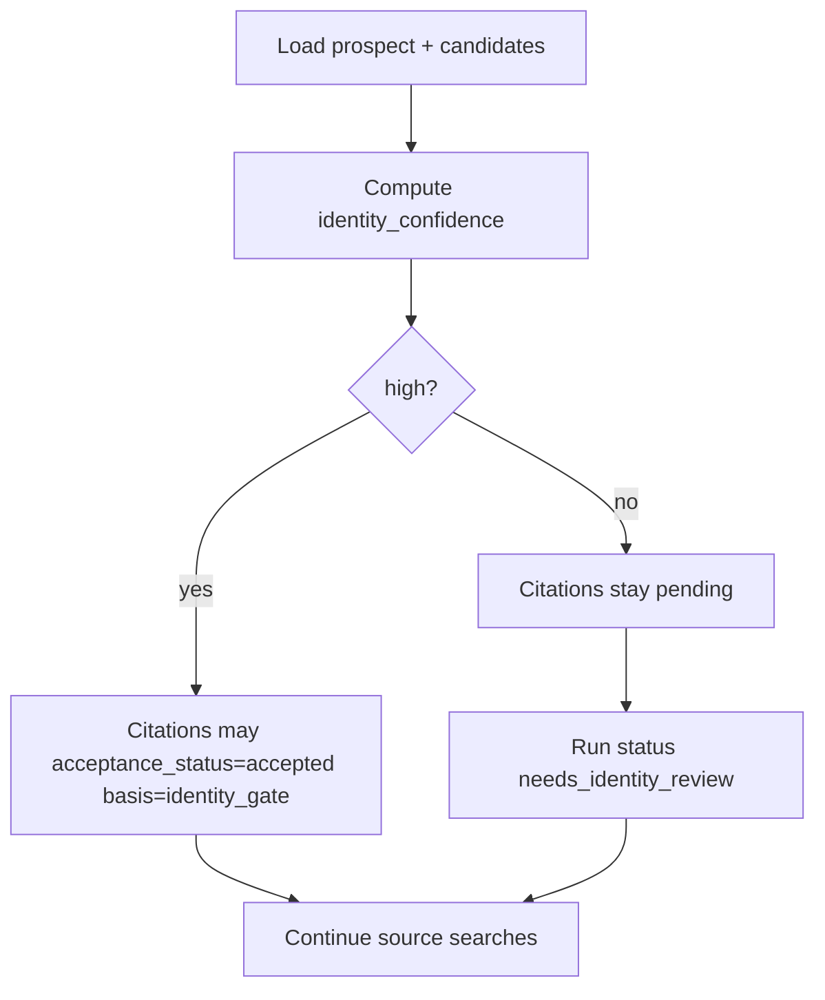
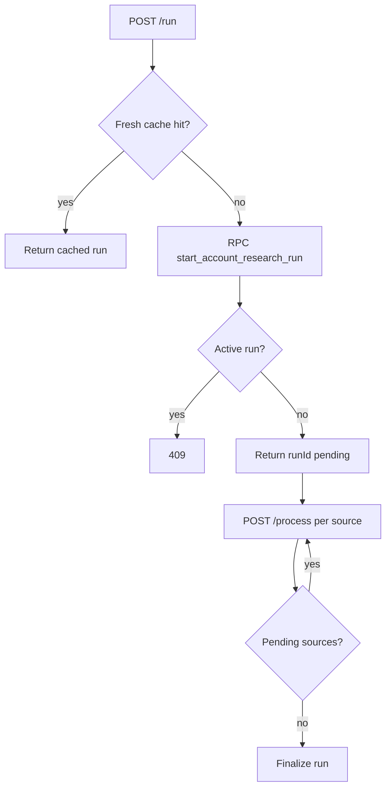
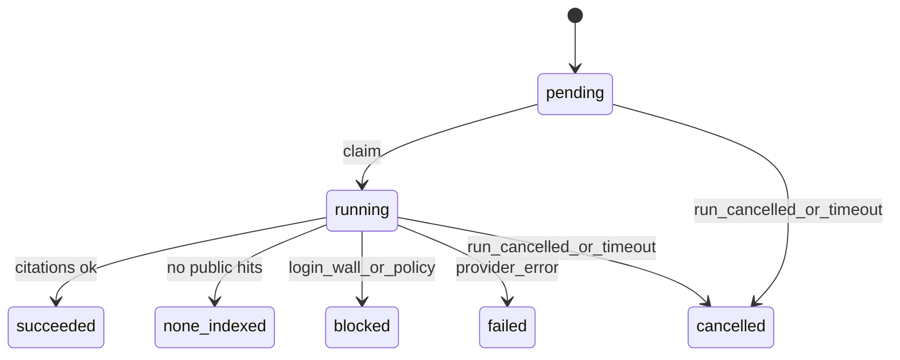

# PR2 Plan: Account Research Service (Retailer-Level)

**Status:** Implemented (service landed) — queued staff APIs, start/complete RPCs, identity gate, platform searches, citation persistence, freshness, and Vitest coverage.  
**Feature audit (source of truth):** [docs/epics/agentic-outreach/account-research-before-product-selection.md](../epics/agentic-outreach/account-research-before-product-selection.md)  
**PR1 plan (schema contract):** [docs/plans/agent-outreach-account-research-pr1-schema-foundation.md](./agent-outreach-account-research-pr1-schema-foundation.md)  
**Epic:** [docs/epics/agentic-outreach/README.md](../epics/agentic-outreach/README.md)  
**PR1 on main:** Merged via [PR #114](https://github.com/jlfassio-vibecoder/justin-fassio/pull/114) (`83b830e`) — migration `20260823120000_account_research_schema_foundation.sql`  
**Date:** 2026-08-23

This document is the implementation-ready plan for **PR2 only**. It defines retailer-level research orchestration, identity resolution, platform-specific public search, citation persistence, freshness, rate limits, and staff APIs. It does **not** generate profile suggestions, product matches, UI panels, or change nightly outreach / draft / send.

---

## 1. PR2 objective and exclusions

### Objective

Deliver an on-demand, staff-triggered Account Research service that:

1. Resolves the correct retailer identity before accepting evidence.
2. Executes each requested source search independently (never one generic “social” query).
3. Persists immutable runs, source-search rows, and citation-level evidence in PR1 tables.
4. Supports Search All plus individual Website, Shopify, Instagram, Facebook, TikTok, and Pinterest scopes.
5. Enforces a seven-day freshness window and explicit manual refresh (`forceRefresh`).
6. Never changes canonical CRM fields (`prospects`, RLA, field changes).
7. Exposes staff APIs that PR5 UI can pump and display cleanly.

### In scope

- Lib modules under `src/lib/accountResearch/`
- Additive migration for `start_account_research_run` RPC (+ grant EXECUTE to authenticated)
- Staff routes: run start, process-one-source, GET by id, GET latest
- Zod provider contracts; URL normalization; freshness helpers; DB-backed daily caps
- Vitest + API tests with Gateway/Perplexity mocks
- Minimal audit reconciliation (this planning pass)

### Out of scope (hard NO)

| Exclusion                                                     | Reason                     |
| ------------------------------------------------------------- | -------------------------- |
| Profile suggestion generation / apply                         | PR3                        |
| Product match runs / items                                    | PR4                        |
| UI buttons, drawers, Briefing panels                          | PR5                        |
| Nightly / prep Mode B research                                | PR6                        |
| Staff identity-confirm UI                                     | PR5 (GET must expose data) |
| Writes to `prospects` / RLA / `retailer_field_changes`        | Explicit apply later       |
| Changes to outreach selection, draft generation, send, Resend | Unrelated                  |
| Run-level `social_index_status` column                        | Locked omitted in PR1      |
| Prospect social URL columns / `last_account_research_*`       | Locked out                 |
| Private social scrape / unofficial APIs / login bypass        | Forbidden                  |
| Synchronous Search All in one HTTP request                    | Unsafe under Vercel 60s    |
| Corrective rewrite of PR1 tables                              | Not required               |

---

## 2. Current-state evidence (exact files)

Re-audited against the repo with PR1 on `main`. Do not assume filenames or provider behavior from memory alone.

### 2.1 PR1 schema (authoritative)

| Artifact         | Path                                                                                                                                                         |
| ---------------- | ------------------------------------------------------------------------------------------------------------------------------------------------------------ |
| Migration        | [supabase/migrations/20260823120000_account_research_schema_foundation.sql](../../supabase/migrations/20260823120000_account_research_schema_foundation.sql) |
| Mirror           | [supabase/schema.sql](../../supabase/schema.sql) (Account Research section)                                                                                  |
| Types            | [src/types/database.ts](../../src/types/database.ts) (`AccountResearch*` / `AccountProductMatch*` unions + eight tables)                                     |
| Foundation tests | [src/lib/accountResearchSchemaFoundation.test.ts](../../src/lib/accountResearchSchemaFoundation.test.ts)                                                     |

### 2.2 Existing research / provider stack

| Fact                                                                                             | Evidence                                                                                                                                                     |
| ------------------------------------------------------------------------------------------------ | ------------------------------------------------------------------------------------------------------------------------------------------------------------ |
| Company research uses AI Gateway + Perplexity tool                                               | [src/lib/companyWebResearch.ts](../../src/lib/companyWebResearch.ts) — `gateway.tools.perplexitySearch`, `stepCountIs(4)`, `maxResults: 5`                   |
| Tool returns `title` / `url` / `snippet` / optional `date`; **today only `result.text` is kept** | Same file; contrast [src/lib/landedRatesResearch.ts](../../src/lib/landedRatesResearch.ts) `collectResearchContext`                                          |
| Soft-fail `{ brief: null, error }`                                                               | `researchCompany` — **PR2 must use hard source/run statuses**                                                                                                |
| Directory denylist includes `facebook.com`                                                       | `DIRECTORY_HOST_SUFFIXES` + `isSharedDirectoryHost` — skip domain filter for fill-blanks; **not** Facebook research identity                                 |
| Hostname helper                                                                                  | [src/lib/enrichGuidance.ts](../../src/lib/enrichGuidance.ts) `hostnameFromUrl`                                                                               |
| Website prepend helper (UI apply path)                                                           | Private `normalizeWebsite` in [src/lib/updateProspectAccountDetails.ts](../../src/lib/updateProspectAccountDetails.ts)                                       |
| Fill-blank / update research                                                                     | [src/lib/fillBlankProspectFields.ts](../../src/lib/fillBlankProspectFields.ts), [src/lib/updateProspectResearch.ts](../../src/lib/updateProspectResearch.ts) |
| Contact enrich research                                                                          | [src/lib/createEnrichedContact.ts](../../src/lib/createEnrichedContact.ts)                                                                                   |
| Lookalike Perplexity (no domain filter)                                                          | [src/lib/lookalike/search.ts](../../src/lib/lookalike/search.ts)                                                                                             |
| Gateway auth helpers                                                                             | [src/lib/aiGatewayEnv.ts](../../src/lib/aiGatewayEnv.ts) — PR2 should use `ensureAiGatewayApiKey` / `staffAiGateway`                                         |
| Zod `generateObject` patterns                                                                    | fill-blank / enriched prospect / lookalike / landed-rates — prefer `.nullable()`, `schemaName`                                                               |

### 2.3 Staff auth, jobs, limits, runtime

| Fact                               | Evidence                                                                                                                                          |
| ---------------------------------- | ------------------------------------------------------------------------------------------------------------------------------------------------- |
| Staff JWT + RLS client             | [src/lib/agentAuth.ts](../../src/lib/agentAuth.ts) `requireApprovedStaffClient`                                                                   |
| In-memory rate limit (20 / 10 min) | [src/lib/agentRateLimit.ts](../../src/lib/agentRateLimit.ts) — **not durable for per-retailer daily caps**                                        |
| Queued AI job pattern              | [src/pages/api/staff/account-import/batches/[id]/enrich/](../../src/pages/api/staff/account-import/batches/) start/process/status; lookalike jobs |
| Claim pattern                      | Conditional update `queued` → `running`                                                                                                           |
| `maxDuration = 60`                 | enrich process, lookalike process, `prospects/enrich`                                                                                             |
| `maxDuration = 300`                | outreach prep / cron only — **wrong domain for research**                                                                                         |
| `prerender = false`                | Staff API convention                                                                                                                              |
| Atomic multi-row RPC example       | `commit_account_import_row` in account-import commit path                                                                                         |

### 2.4 Provider limitations (verified)

1. Perplexity via Gateway is **general web search** — no first-class “Instagram-only” API.
2. Platform scope must be enforced by **query construction + optional `searchDomainFilter` + post-validation** of host/platform agreement.
3. Restricting domain filter to `facebook.com` / `instagram.com` can help isolation but may return empty/`none_indexed` often; do not invent activity.
4. Publication dates are often missing — store `published_at = null` when unknown.
5. Model-inferred `sourceUrls` in fill-blank evidence are **untrusted**; PR2 citations must prefer **tool result URLs**.

---

## 3. Confirmed PR1 schema contract

PR2 writes only to research tables (not match/suggestion generation):

| Table                              | PR2 use                                                    |
| ---------------------------------- | ---------------------------------------------------------- |
| `account_research_runs`            | Parent run lifecycle                                       |
| `account_research_source_searches` | One row per platform search                                |
| `account_research_citations`       | Evidence rows; denormalized run/retailer synced by trigger |

**Do not write in PR2:** profile suggestions, suggestion junctions, product match tables.

### Critical constraints PR2 relies on

- Partial unique: one `pending`/`running` run per `retailer_id`
- Source unique: `(research_run_id, source_type, search_mode)`
- Citation unique: `(source_search_id, source_url_normalized)`
- Sync triggers fire on **all** UPDATEs for denormalized integrity
- Staff RLS: `"approved staff full access"` + `is_approved_staff()`

### v1 scopes vs CHECK

| Layer                        | Values                                                                      |
| ---------------------------- | --------------------------------------------------------------------------- |
| **PR2 API accepts**          | `all`, `website`, `shopify`, `instagram`, `facebook`, `tiktok`, `pinterest` |
| **Schema CHECK also allows** | `linkedin`, `youtube`, `x`, `other` — **reject in API** until a later PR    |

### Search All child rows (service invariant)

| `source_type` | `search_mode`     |
| ------------- | ----------------- |
| `website`     | `identity`        |
| `shopify`     | `storefront`      |
| `instagram`   | `recent_activity` |
| `facebook`    | `recent_activity` |
| `tiktok`      | `recent_activity` |
| `pinterest`   | `recent_activity` |

**No PR1 corrective migration** is required before PR2. PR2 adds only the start RPC (+ optional small helpers), not table rewrites.

---

## 4. Identity-resolution algorithm

### Inputs (from fresh `prospects` row)

- `retailer_id`, business name, city, region/state/province, address, website, phone (when present)

### Pure result

```ts
type IdentityResolution = {
  identity_confidence: 'high' | 'medium' | 'low' | 'unresolved';
  identity_review_status: 'not_required' | 'pending' | /* later staff values unused in PR2 auto path */;
  resolved_website: string | null;
  identity_resolution: string | null; // short staff-visible note
  official_hostname: string | null;
  corroborators: Array<'website_match' | 'city_match' | 'region_match' | 'phone_match' | 'name_on_host'>;
};
```

### Ladder (model confidence alone is **never** sufficient for `high`)

| Level          | Requirements                                                                                                                                                                                                        |
| -------------- | ------------------------------------------------------------------------------------------------------------------------------------------------------------------------------------------------------------------- |
| **high**       | Normalized official hostname equals/aligns with `prospects.website` hostname **and** ≥1 corroborator: city or region on official-domain evidence, matching phone digits, or strong business-name match on that host |
| **medium**     | Likely official host (name + website agreement) but weak/no location or phone corroboration                                                                                                                         |
| **low**        | Conflicting city/region vs candidate, or only directory/social hosts without official domain agreement                                                                                                              |
| **unresolved** | No usable official host; empty/ambiguous candidates                                                                                                                                                                 |

**Reject same-name / different-city** candidates for acceptance (keep pending at most, never `identity_gate` accept).

### Gate effects



- `high` → `identity_review_status = 'not_required'` (or `auto_accepted` if we auto-set; prefer `not_required` when confidence high without staff).
- `medium` / `low` / `unresolved` → run finalizes as `needs_identity_review`; citations remain `pending`; product matching (PR4) must refuse until accepted evidence exists.

PR2 does **not** implement staff identity-confirm UI; GET responses must include identity fields and pending citations for PR5.

---

## 5. Platform-specific query strategies

Shared rules for every source:

| Rule           | Value                                                                                                                               |
| -------------- | ----------------------------------------------------------------------------------------------------------------------------------- |
| Max results    | 5                                                                                                                                   |
| Excerpt max    | 500 chars (truncate with ellipsis)                                                                                                  |
| `published_at` | Parse provider date when present; else `null`                                                                                       |
| `observed_at`  | `now()` at persist                                                                                                                  |
| URL normalize  | Lowercase host; strip fragment; strip trailing slash (except root); strip `www.`; drop tracking query params (`utm_*`, `fbclid`, …) |
| Dedupe         | Unique on `source_url_normalized` per source search                                                                                 |
| Provider       | Gateway + Perplexity; capture **tool results**, not only prose                                                                      |
| Steps          | `stepCountIs(4)`                                                                                                                    |
| Soft brief     | Optional `research_brief` on run from website/identity pass only; never CRM write                                                   |

### 5.1 Website (`identity`)

| Aspect        | Spec                                                                                                                                               |
| ------------- | -------------------------------------------------------------------------------------------------------------------------------------------------- |
| Query         | Official domain + About / Shop / Brands / Collections / Events / Contact; include name + city                                                      |
| Domain filter | Official hostname when not a directory host; if website is directory-only, search without filter but treat directory hits as non-operational proof |
| Identity      | Must reinforce or establish official host                                                                                                          |
| Failure map   | Tool empty → `none_indexed`; login wall rare → `blocked`; provider error → `failed`                                                                |
| Acceptance    | Only if run identity `high`                                                                                                                        |

### 5.2 Shopify (`storefront`)

| Aspect            | Spec                                                                                                                                              |
| ----------------- | ------------------------------------------------------------------------------------------------------------------------------------------------- |
| Query             | Start from resolved official website; look for Shopify storefront signals                                                                         |
| Evidence required | Cited `*.myshopify.com`, Shopify CDN/assets, or deterministic public storefront metadata on custom domain — **not** model guess alone             |
| Capture           | Categories, collections, brands, visible price ranges as **citation excerpts only**                                                               |
| Status            | No Shopify evidence → `none_indexed` (or `succeeded` with zero Shopify-labeled citations — prefer `none_indexed` when storefront not established) |
| Acceptance        | Same identity gate                                                                                                                                |

### 5.3 Instagram (`recent_activity`)

| Aspect   | Spec                                                                   |
| -------- | ---------------------------------------------------------------------- |
| Query    | Name + city + `site:instagram.com` (or domain filter `instagram.com`)  |
| Identity | Profile must agree with business name/location; reject similar handles |
| Capture  | Recent indexed posts, arrivals, events, merchandising themes           |
| Status   | No indexed public hits → `none_indexed` (**≠ inactive**)               |

### 5.4 Facebook (`recent_activity`)

| Aspect     | Spec                                                                              |
| ---------- | --------------------------------------------------------------------------------- |
| Query      | Deliberate Facebook platform search (override fill-blank denylist mindset)        |
| Identity   | Unverified FB page is **not** official business proof                             |
| Safeguards | Keep directory denylist for _website identity_; allow FB only as this source type |
| Status     | Login wall / blocked scrape → `blocked`; no public index → `none_indexed`         |

### 5.5 TikTok (`recent_activity`)

| Aspect   | Spec                                                                            |
| -------- | ------------------------------------------------------------------------------- |
| Query    | Indexed public profile/video; name + city + `tiktok.com`                        |
| Identity | Require business-identity agreement; no activity from unverified similar handle |
| Status   | `none_indexed` / `failed` / `blocked` as appropriate                            |

### 5.6 Pinterest (`recent_activity`)

| Aspect    | Spec                                                                                   |
| --------- | -------------------------------------------------------------------------------------- |
| Query     | Public profiles/boards/pins; merchandising/aesthetic evidence                          |
| Identity  | Require agreement                                                                      |
| Ops claim | Do not treat as proof of current operations unless evidence is recent **and** explicit |

Never combine social platforms into one provider call under Search All.

---

## 6. Search All orchestration

### Entry point

```ts
runAccountResearch({
  retailerId: number;
  scope: AccountResearchV1Scope;
  requestedBy: string; // auth user id
  forceRefresh: boolean;
  trigger?: 'manual' | 'api'; // default manual
})
```

API boundary authenticates staff first; lib assumes authorized caller.

### Steps

1. Load retailer fresh from DB (staff client / RLS).
2. Validate scope ∈ v1 set.
3. Freshness short-circuit (unless `forceRefresh`) — may return cached run (**no new provider call**).
4. Enforce daily manual-refresh cap (DB count).
5. Call RPC `start_account_research_run` (atomic parent + children).
6. Return run snapshot; client pumps `POST …/process` until sources terminal.
7. Each process: claim one `pending` source → identity (once per run, early) → platform search → validate → persist citations transactionally → update source status.
8. When no pending/running sources remain, finalize parent run status deterministically.



Orchestration never writes CRM fields.

---

## 7. Provider and Zod contracts

Stay on **Vercel AI Gateway + Perplexity** for v1.

### Schemas (illustrative names)

| Schema                     | Purpose                                                    |
| -------------------------- | ---------------------------------------------------------- |
| `identityResolutionSchema` | Confidence, resolved website, corroborators, note          |
| `citationCandidateSchema`  | url, title, platform, excerpt, publishedAt?, confidence    |
| `sourceSearchResultSchema` | status, queryText, resolvedPublicUrl?, citations[], error? |
| `shopifyEvidenceSchema`    | isShopify, evidenceUrls[], signals[] — must cite URLs      |
| `runSummarySchema`         | Optional narrative for `research_brief` only               |

### Validation before persist

- Absolute http(s) URL; host matches allowed platform or official domain as required
- Platform enum agreement with `source_type` (directory only as citation platform when appropriate)
- Excerpt ≤ 500; confidence ∈ high/medium/low
- Max 5 citations per source
- Drop duplicates by normalized URL
- Sanitize errors (no API keys, no raw dumps)

### `provider_metadata` (non-secret)

Store: provider id, model id, step count, latency ms, result_count, tool error codes.  
**Never** store: API keys, full prompts, hidden reasoning, unrestricted raw payloads.

---

## 8. Run and source state machines

### Source search



### Parent run finalize (deterministic)

| Condition                                                             | Final `status`          |
| --------------------------------------------------------------------- | ----------------------- |
| Identity medium/low/unresolved after searches                         | `needs_identity_review` |
| Else all sources in `{succeeded, none_indexed}`                       | `succeeded`             |
| Else ≥1 usable `{succeeded, none_indexed}` and ≥1 `{failed, blocked}` | `partial`               |
| Else no usable source                                                 | `failed`                |
| Explicit cancel                                                       | `cancelled`             |

Usable for freshness cache: `succeeded` or `partial` only (not `needs_identity_review`, `failed`, `cancelled`).

Failed refresh does **not** supersede prior succeeded run as current usable result (latest query filters by status).

---

## 9. Freshness and caching

| Rule                       | Spec                                                                                              |
| -------------------------- | ------------------------------------------------------------------------------------------------- |
| Window                     | 7 days                                                                                            |
| Clock                      | Prefer source `completed_at` for platform freshness; run `completed_at` for aggregate             |
| Fresh usable run           | `status IN ('succeeded','partial')` AND `completed_at > now() - 7 days`                           |
| Scope key                  | Exact `requested_scope`                                                                           |
| Search All → platform read | **Allowed** if that source row is terminal success/`none_indexed` and its `completed_at` is fresh |
| Platform → Search All      | **Never**                                                                                         |
| `forceRefresh`             | New immutable run; set `supersedes_run_id` to prior relevant run when known                       |
| Failed / identity-review   | Not a cache hit for “fresh success”                                                               |

Do not hide a stale platform under a fresh aggregate: when serving platform-scoped latest from an `all` run, check **that source’s** `completed_at`.

---

## 10. Concurrency and stale-worker protection

| Mechanism                | Spec                                                                                                                                                                                  |
| ------------------------ | ------------------------------------------------------------------------------------------------------------------------------------------------------------------------------------- |
| One active run           | Partial unique index — insert conflict → 409                                                                                                                                          |
| One source per process   | Process endpoint claims single `pending` row                                                                                                                                          |
| Claim                    | `UPDATE … SET status='running', started_at=now() WHERE id=? AND status='pending' RETURNING *` — empty → no-op / already claimed                                                       |
| Stale write guard        | Before finalize write, re-read run; abort if `cancelled` or a newer active/completed superseding run exists                                                                           |
| Timed-out running source | Reaper or next process: if `running` and `started_at` older than e.g. 120s → mark `failed` with sanitized timeout error (mirror enrich `STALE_RUNNING_MS`)                            |
| No half citations        | Insert citations in one DB transaction with source status update (RPC or single batched client call with careful ordering); on failure roll back to `failed` without orphan citations |

---

## 11. Rate limits and cost controls

| Control                                    | Starting value                | Enforcement                                                                                                                                |
| ------------------------------------------ | ----------------------------- | ------------------------------------------------------------------------------------------------------------------------------------------ |
| Manual refreshes / retailer / calendar day | 3                             | `COUNT(*)` from `account_research_runs` where `retailer_id`, `trigger='manual'`, `created_at::date = CURRENT_DATE` — **DB, not in-memory** |
| Active runs / retailer                     | 1                             | Existing unique index                                                                                                                      |
| Max search calls / run                     | ≤6 sources × 1 primary search | Source row set                                                                                                                             |
| Max tool steps / source                    | 4                             | `stepCountIs(4)`                                                                                                                           |
| Max results / source                       | 5                             | Provider + Zod                                                                                                                             |
| Concurrent sources / process invocation    | 1                             | API design                                                                                                                                 |
| Process `maxDuration`                      | 60                            | Route export                                                                                                                               |
| Soft user throttle                         | Existing window               | `checkAgentRateLimit(\`account-research:${userId}\`)` on process                                                                           |

No nightly/scheduled research budgets in PR2.

In-memory-only counters are **insufficient** across serverless isolates — daily cap must be SQL.

---

## 12. Transaction boundaries

### A. Start run (atomic)

**New RPC** `start_account_research_run(p_retailer_id int, p_scope text, p_trigger text, p_requested_by uuid, p_supersedes_run_id uuid)`:

1. Validate scope/trigger.
2. Insert `account_research_runs` (`status='pending'` then immediately `'running'`, or `'pending'` until first process — prefer `running` once accepted).
3. Insert 6 or 1 `account_research_source_searches` with correct modes.
4. On unique violation → raise catchable error for 409.
5. `SECURITY INVOKER` + grant EXECUTE to `authenticated`; RLS still applies.

Mirror into `schema.sql`; hand-update `database.ts` Functions if the repo patterns include RPC types (optional; match existing style).

### B. Persist one source result (atomic)

For claimed source: delete none (immutable citations); insert N citations; update source row status/counts/error/completed_at; optionally append run `provider_metadata` / brief. Prefer a second RPC `complete_account_research_source_search(...)` **or** a documented single-request multi-statement with failure compensation. **Do not** leave `running` with partial citation inserts.

### C. Finalize run

When zero sources remain non-terminal: compute status, set `completed_at`, `identity_*` fields, sanitized `error`.

---

## 13. Staff API contracts and status codes

All routes: `export const prerender = false`; `requireApprovedStaffClient`; JSON `{ ok: true|false, ... }`.

| Method | Path                                                    | Role                                  |
| ------ | ------------------------------------------------------- | ------------------------------------- |
| POST   | `/api/staff/account-research/run`                       | Freshness / rate limit / start RPC    |
| POST   | `/api/staff/account-research/[runId]/process`           | Process one source (`maxDuration=60`) |
| GET    | `/api/staff/account-research/[runId]`                   | Full snapshot                         |
| GET    | `/api/staff/account-research/latest?retailerId=&scope=` | Usable latest by freshness rules      |

### POST `/run` body

```json
{ "retailerId": 123, "scope": "all", "forceRefresh": false }
```

### POST `/run` outcomes

| Outcome              | HTTP    | Body hints                                      |
| -------------------- | ------- | ----------------------------------------------- |
| Cached fresh run     | 200     | `outcome: 'cached'`, run snapshot               |
| New run started      | 200     | `outcome: 'started'`, runId, sources pending    |
| Active run conflict  | 409     | `outcome: 'active_conflict'`                    |
| Daily rate limited   | 429     | `outcome: 'rate_limited'`, Retry-After optional |
| Bad scope / retailer | 400     |                                                 |
| Not found retailer   | 404     |                                                 |
| Auth                 | 401/403 |                                                 |

### GET snapshot must include

- Run row (identity fields, status, brief, errors, timestamps, supersedes)
- All source-search rows
- Citations grouped by `source_search_id` / `source_type`
- Per-source freshness boolean
- **No** profile suggestions or product matches

### Execution decision (blocking → decided)

**Queued start/process** (enrich/lookalike pattern). Synchronous Search All is **NO-GO** under current Vercel 60s AI job limits.

---

## 14. Error and partial-success behavior

| Condition                      | Behavior                                                                |
| ------------------------------ | ----------------------------------------------------------------------- |
| Provider error on one source   | That source `failed`; others continue; run may end `partial`            |
| All sources fail               | Run `failed`; prior succeeded run remains “latest usable”               |
| Identity unresolved/low/medium | `needs_identity_review`; citations pending                              |
| Timeout                        | Finalize stuck `running` → `failed`/`cancelled`; no orphan running rows |
| Stale worker late write        | Ignored / no-op                                                         |
| Retry                          | Always **new** immutable run (never reopen completed run)               |
| Soft `researchCompany` pattern | **Do not use** for Account Research statuses                            |

---

## 15. Exact files expected to change (implementation PR)

| File                                                                | Change                                                             |
| ------------------------------------------------------------------- | ------------------------------------------------------------------ |
| `supabase/migrations/YYYYMMDDHHMMSS_account_research_start_rpc.sql` | `start_account_research_run` (+ optional complete-source RPC)      |
| `supabase/schema.sql`                                               | Mirror RPC                                                         |
| `src/types/database.ts`                                             | Hand-update Functions if needed                                    |
| `src/lib/accountResearch/constants.ts`                              | Caps, excerpt length, freshness days, scopes                       |
| `src/lib/accountResearch/normalizeUrl.ts`                           | Citation URL normalization                                         |
| `src/lib/accountResearch/identity.ts`                               | Pure identity ladder                                               |
| `src/lib/accountResearch/freshness.ts`                              | Cache / latest helpers                                             |
| `src/lib/accountResearch/sources/*.ts`                              | Per-platform strategies                                            |
| `src/lib/accountResearch/provider.ts`                               | Gateway + Perplexity + tool citation harvest                       |
| `src/lib/accountResearch/orchestrate.ts`                            | `runAccountResearch`, process, finalize                            |
| `src/lib/accountResearch/*.test.ts`                                 | Unit tests                                                         |
| `src/pages/api/staff/account-research/run.ts`                       | POST start                                                         |
| `src/pages/api/staff/account-research/[runId]/index.ts`             | GET                                                                |
| `src/pages/api/staff/account-research/[runId]/process.ts`           | POST process                                                       |
| `src/pages/api/staff/account-research/latest.ts`                    | GET latest                                                         |
| `src/test/api/staff-account-research*.test.ts`                      | API tests                                                          |
| `src/lib/companyWebResearch.ts`                                     | Extract shared helpers carefully; **preserve** fill-blank behavior |

**Do not change:** outreach prep/selection/draft/send, enrich job tables, UI components (PR5).

---

## 16. Tests and fixtures

Require coverage for:

- Search All creates **six** distinct source-search operations / rows
- Individual platform creates **only** that source
- No generic combined social search (assert query builders / mock call args)
- One active run per retailer (409 / unique)
- Fresh cache reuse without provider call
- Forced refresh creates immutable superseding run
- Daily rate limit (3) via DB count
- High-confidence identity accepts valid citations (`identity_gate`)
- Low/unresolved keeps citations pending + run `needs_identity_review`
- Same-name / different-city evidence rejected for acceptance
- Website identity matching
- Shopify custom-domain / myshopify evidence accepted; guess without evidence rejected
- IG / FB / TikTok / Pinterest source isolation
- `none_indexed` never marks retailer inactive / never writes `prospects`
- Partial source failure preserves successful citations
- All-source failure finalizes run
- Timeouts do not leave `running` rows
- Stale worker cannot overwrite newer run
- URL normalization + citation dedupe
- `published_at` null when unknown; excerpts length-limited
- No writes to prospects, RLAs, field changes, product matches, messages, drafts, sends
- Staff auth required
- Provider mocks receive bounded, source-specific queries
- Existing enrichment and outreach tests remain green

Fixtures: mock `ai` gateway tools like [companyWebResearch.test.ts](../../src/lib/companyWebResearch.test.ts); no live Perplexity in CI.

---

## 17. Security and privacy

- Staff-only: `requireApprovedStaffClient` + table RLS
- Public indexed content only; no login, no private APIs, no bypass
- No sensitive trait inference
- Sanitize errors and metadata
- Do not log full provider payloads
- Directory hosts are not operational identity proof
- Buyer/anonymous: no access

---

## 18. Rollback strategy

1. Feature-flag or simply stop calling new routes (UI not shipped yet).
2. RPC/migration: forward-only; drop function if needed — tables remain (PR1).
3. Orphan `running` rows: ops SQL to mark `failed`/`cancelled`.
4. No CRM rollback required (PR2 writes none).

---

## 19. Risks and failure triggers

| Risk                            | Mitigation / failure trigger                                 |
| ------------------------------- | ------------------------------------------------------------ |
| Sync Search All timeout         | Queued process only — fail review if sync Search All lands   |
| Platform search quality low     | Document `none_indexed`; never imply inactive                |
| Citation drift / wrong business | Identity gate + same-city rules                              |
| Half-created Search All         | Start RPC only                                               |
| Cross-isolate daily cap bypass  | SQL count                                                    |
| Soft-fail brief hides errors    | Hard source/run statuses                                     |
| Changing fill-blank behavior    | Extract helpers; keep `researchCompany` soft-fail API stable |
| Adding `social_index_status`    | Fail review — forbidden                                      |

---

## 20. Acceptance criteria

1. Staff can start Search All and six independent sources process to terminal states.
2. Single-platform scopes create one source only.
3. Freshness 7d + forceRefresh + supersedes behavior works.
4. Daily cap and active-run uniqueness enforced.
5. Identity high accepts citations; otherwise pending + `needs_identity_review`.
6. Citations persisted with normalized URLs; no CRM writes.
7. GET snapshot sufficient for PR5 (no suggestions/matches yet).
8. Tests listed in §16 green; `npm run check` green.
9. No outreach/draft/send changes.

---

## 21. Explicitly deferred (PR3–PR6)

| PR  | Work                                                               |
| --- | ------------------------------------------------------------------ |
| PR3 | Profile suggestions + staff apply/reject → field changes           |
| PR4 | Product match using accepted citations + line pool + 90d dedup     |
| PR5 | UI: Run/Refresh, citations, identity confirm, product pick → draft |
| PR6 | Mode B prep-budgeted research (optional)                           |

---

## 22. Blocking vs non-blocking questions and GO/NOGO

### Blocking (resolved in this plan)

| Question                         | Decision                                                                    |
| -------------------------------- | --------------------------------------------------------------------------- |
| Sync vs background Search All?   | **Queued** start/process (`maxDuration=60` per source)                      |
| PR1 corrective migration?        | **None** — schema on `main` is sufficient                                   |
| Run-level `social_index_status`? | **Forbidden** — per-source status only                                      |
| Freshness field?                 | **`completed_at`** (not `researched_at`)                                    |
| Search All vs platform cache?    | All may satisfy platform read if source fresh; platform never satisfies All |
| Daily cap storage?               | **DB count**, not in-memory only                                            |

### Non-blocking (tune during implementation)

- Exact tracking-query param denylist for URL norm
- Whether website pass also sets `research_brief`
- Exact stale-running threshold (default 120s)
- Whether complete-source is RPC vs careful client batch
- Shopify signal heuristics beyond myshopify + CDN markers

### Verdict

**GO** to implement PR2 against merged PR1 on `main`, Mode A only, queued staff APIs, Gateway + Perplexity, no CRM writes, no UI.

**NO-GO** on: synchronous Search All; run-level `social_index_status`; auto CRM writes; private scrapers; Mode B prep; treating `none_indexed` as inactive; collapsing platforms into one provider query.
