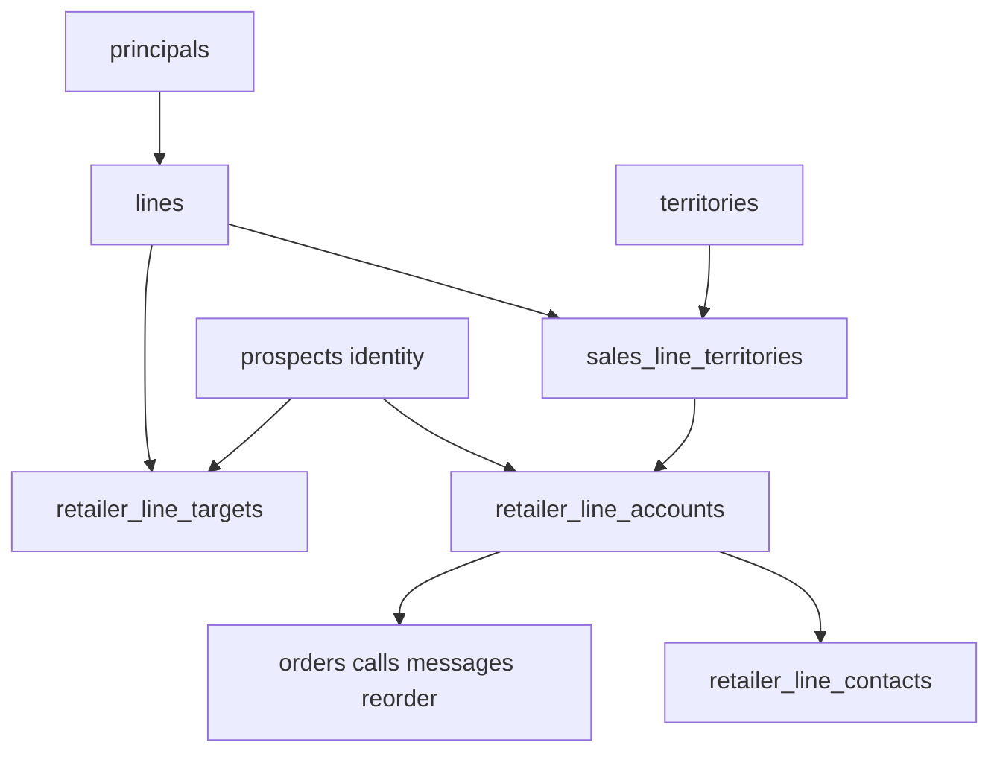
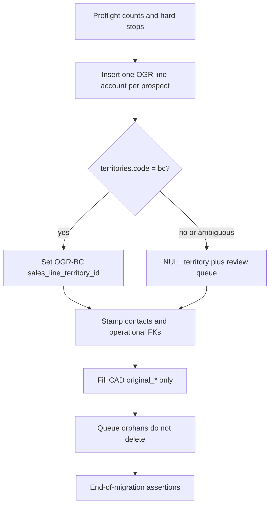

# Phase 1 Plan: Multi-Line Schema Foundation

**Status:** Phase 1A + Phase 1B + Phase 1C dual-write **implemented** (local validation complete). Overall Phase 1 schema foundation is complete; application cutover remains Phase 2+.  
**Epic:** [docs/epics/multi-line-multi-territory-crm.md](../epics/multi-line-multi-territory-crm.md)  
**Current-state audit:** [docs/multi-line-territory-audit.md](../multi-line-territory-audit.md)  
**Branch inspected (plan authorship):** `feature/multi-line-multi-territory-implementation` at `a1b2e57` (docs commit on `main` `879a24a`)  
**Date:** 2026-08-14  
**Phase 1B plan revision:** 2026-08-14

Settled business decisions in the epic **supersede** audit §8.4 / §14 items 1–6, 8, and 13 where they conflict. Live schema evidence below was re-verified against the repository; it matches the audit (no schema drift).

**Phase split (expand/contract):**

| Sub-phase | Scope                                      | Status                       |
| --------- | ------------------------------------------ | ---------------------------- |
| **1A**    | Additive tables, seeds, prospective guards | Done                         |
| **1B**    | OGR backfill + validation only             | Done locally (results below) |
| **1C**    | Dual-write triggers (`…130000`)            | Done locally (results below) |

---

## 1. Phase objective

Add an **additive expand/contract** schema foundation so the CRM can represent multiple lines without commingling account data, while the staff UI continues to run unchanged on `prospects`.

Phase 1 must:

1. Create `principals`, extend `lines`, make `territories` hierarchical, and add `sales_line_territories`, `retailer_line_accounts`, `retailer_line_contacts`, `retailer_field_changes`, `retailer_line_targets`, and `migration_review_queue`. **(1A — done)**
2. Seed OGR (`active`), Eagle Peak (`onboarding`), Big Fish (`confirmed`), and leave BKG as an independent paused/inactive line. **(1A — done)**
3. Assign OGR territories BC/OR/WA with `rights_type = unconfirmed`; assign Eagle Peak OR/WA/norcal (proposed in 1A); assign **zero** Big Fish territories. **(1A — done)**
4. Backfill **one OGR line account per existing `prospects` row**; stamp operational records onto those accounts. **(1B)**
5. Install dual-write triggers so new writes to `prospects` keep the OGR line account in sync while the UI flag is off. **(1C — not 1B)**
6. Leave Eagle Peak, Big Fish, and Prospective Lines with **zero** operational line accounts.
7. Not change staff UI behavior, public catalogs, or historical migrations.



---

## 2. Current-state evidence (exact file references)

### 2.1 Branch and types

| Fact                                      | Evidence                                                         |
| ----------------------------------------- | ---------------------------------------------------------------- |
| HEAD is docs-only on main                 | `a1b2e57` on `feature/multi-line-multi-territory-implementation` |
| Types are hand-written, not CLI-generated | [src/types/database.ts](../../src/types/database.ts) lines 1–7   |
| No `FEATURE_*` flags in app today         | `rg FEATURE_` under `src/` finds none for multi-line             |
| No `docs/plans/` before this plan         | Created by this phase                                            |

### 2.2 `lines`

| Fact                                                              | Evidence                                                                                                                                                             |
| ----------------------------------------------------------------- | -------------------------------------------------------------------------------------------------------------------------------------------------------------------- |
| Table: uuid PK, `code` unique, `active` boolean, marketing fields | [supabase/schema.sql](../../supabase/schema.sql) lines 26–58                                                                                                         |
| Seeds: `ogr` active, `bkg` inactive                               | Same; initial seed [20260802185342_initial_schema.sql](../../supabase/migrations/20260802185342_initial_schema.sql)                                                  |
| Portfolio fields + public RPC                                     | [20260806180000_line_portfolio_fields.sql](../../supabase/migrations/20260806180000_line_portfolio_fields.sql) — `get_public_active_lines()` filters `active = true` |
| App hardcodes OGR                                                 | [src/lib/lines.ts](../../src/lib/lines.ts) `resolveOgrLineId`, explicit `LINE_SELECT`                                                                                |
| `LineKey`                                                         | [src/types/index.ts](../../src/types/index.ts) `'ogr' \| 'bkg'`                                                                                                      |

### 2.3 `territories` and retailer geography

| Fact                                  | Evidence                                                                                                                                                 |
| ------------------------------------- | -------------------------------------------------------------------------------------------------------------------------------------------------------- |
| Five codes CHECK `bc\|ab\|ca\|or\|wa` | [supabase/schema.sql](../../supabase/schema.sql) lines 64–89; [20260806170000_territories.sql](../../supabase/migrations/20260806170000_territories.sql) |
| `prospects.territory_id` NOT NULL FK  | Same migration; backfilled all nulls to BC                                                                                                               |
| App defaults unknown province to BC   | [src/lib/territories.ts](../../src/lib/territories.ts) `territoryCodeFromProvince`                                                                       |

### 2.4 `prospects` (identity + commercial blob)

| Fact                                                              | Evidence                                                                                                                                                                             |
| ----------------------------------------------------------------- | ------------------------------------------------------------------------------------------------------------------------------------------------------------------------------------ |
| Integer PK; `account_status` `prospect\|active_account\|inactive` | [supabase/schema.sql](../../supabase/schema.sql) lines 352–390; [20260802270000_account_lifecycle_orders.sql](../../supabase/migrations/20260802270000_account_lifecycle_orders.sql) |
| Planning columns                                                  | [20260804010000_prospects_planning_columns.sql](../../supabase/migrations/20260804010000_prospects_planning_columns.sql), taxonomy migrations                                        |
| Convert flips global status                                       | [src/lib/convertToActiveAccount.ts](../../src/lib/convertToActiveAccount.ts)                                                                                                         |

### 2.5 Contacts, orders, calls, reorder

| Table                      | Key columns                                          | FK to prospects?       | Evidence                                                                                                                                     |
| -------------------------- | ---------------------------------------------------- | ---------------------- | -------------------------------------------------------------------------------------------------------------------------------------------- |
| `account_contacts`         | `account_id`, role, `is_primary`                     | Yes, ON DELETE CASCADE | [20260803010000_account_contacts.sql](../../supabase/migrations/20260803010000_account_contacts.sql); partial unique one primary per account |
| `orders`                   | `account_id`, nullable `line_id`, `total_amount_cad` | Yes                    | [20260802270000_account_lifecycle_orders.sql](../../supabase/migrations/20260802270000_account_lifecycle_orders.sql)                         |
| `account_reorder_settings` | PK = `account_id`                                    | Yes, CASCADE           | Same                                                                                                                                         |
| `calls`                    | `prospect_id`, nullable `line_id`, `order_value_cad` | **No FK**              | [supabase/schema.sql](../../supabase/schema.sql) lines 426–444; initial schema                                                               |
| `prospect_updates`         | `prospect_id`                                        | **No FK**              | Same lines 412–420                                                                                                                           |

`CALL_SELECT` omits `line_id` ([src/lib/calls.ts](../../src/lib/calls.ts)). Convert may stamp `orders.line_id` ([convertToActiveAccount.ts](../../src/lib/convertToActiveAccount.ts)).

### 2.6 Tables referencing `prospects.id` (enforced FK)

From migrations / [supabase/schema.sql](../../supabase/schema.sql):

- `orders.account_id`
- `account_reorder_settings.account_id`
- `account_contacts.account_id`
- `system_messages.prospect_id` ([20260811120000_system_messages.sql](../../supabase/migrations/20260811120000_system_messages.sql))
- `gmail_thread_links.prospect_id` ([20260809200000_gmail_thread_links.sql](../../supabase/migrations/20260809200000_gmail_thread_links.sql))
- `calendar_event_links.prospect_id` ([20260810020000_calendar_event_links.sql](../../supabase/migrations/20260810020000_calendar_event_links.sql))
- `message_threads.prospect_id` ([20260805060000_message_center.sql](../../supabase/migrations/20260805060000_message_center.sql))
- `wholesale_order_requests.prospect_id` ([20260805050000_public_ogr_wholesale_access.sql](../../supabase/migrations/20260805050000_public_ogr_wholesale_access.sql))
- `profiles.prospect_id` ([20260806190000_retailer_pricing_and_buyer_account.sql](../../supabase/migrations/20260806190000_retailer_pricing_and_buyer_account.sql))
- `account_conversion_attribution.prospect_id` ([20260812120000_outreach_goals_and_attribution.sql](../../supabase/migrations/20260812120000_outreach_goals_and_attribution.sql))

### 2.7 Tables storing `prospect_id` without FK

- `calls.prospect_id`
- `prospect_updates.prospect_id`

**Phase 1 does not add those FKs** (deferred to Phase 9 / later cleanup).

### 2.8 Nullable `line_id`

- `orders.line_id` → `lines(id)` ON DELETE SET NULL
- `calls.line_id` → `lines(id)` ON DELETE SET NULL
- Catalog tables use **required** `line_id` (`catalog_items`, `catalog_settings`, `catalog_assets`, `catalog_import_runs`)

### 2.9 Monetary columns assuming CAD

- `orders.total_amount_cad`
- `calls.order_value_cad`
- Catalog already has USD wholesale + CAD MSRP/landed (`price_usd`, `msrp_cad`, landed overrides)
- `catalog_settings` brokerage/freight allocations in CAD

### 2.10 RLS

All CRM tables use `is_approved_staff()` ([supabase/schema.sql](../../supabase/schema.sql) ~873–889, policies ~1338+). Phase 1 keeps this pattern on new tables. No line-scoped RLS in v1.

### 2.11 Import / seed scripts assuming BC or OGR

- [supabase/migrations/20260802251000_seed_catalog_prospects.sql](../../supabase/migrations/20260802251000_seed_catalog_prospects.sql) — OGR catalog + BC prospects
- [supabase/migrations/20260804120000_upsert_bc_prospect_list.sql](../../supabase/migrations/20260804120000_upsert_bc_prospect_list.sql)
- [src/lib/prospectListImport.ts](../../src/lib/prospectListImport.ts)
- [scripts/catalog-import/from-json.ts](../../scripts/catalog-import/from-json.ts) hardcodes `'ogr'`
- [src/lib/catalog.ts](../../src/lib/catalog.ts), [src/lib/catalogSettings.ts](../../src/lib/catalogSettings.ts)

**Do not rewrite historical migrations.** Do not re-run BC seeds against production as part of Phase 1.

---

## 3. Confirmed business decisions

| Decision                             | Value                                                                                                             |
| ------------------------------------ | ----------------------------------------------------------------------------------------------------------------- |
| `lines.status` enum                  | `prospective`, `confirmed`, `onboarding`, `active`, `paused`, `declined`, `terminated`                            |
| Acquisition stage (prospective only) | `identified`, `researching`, `contact_requested`, `conversation`, `evaluating`, `negotiating`, `decision_pending` |
| Big Fish                             | Confirmed represented; `status = confirmed`; not prospective; do not invent commercial terms                      |
| OGR territories                      | BC, OR, WA assigned; CA and AB **not** assigned                                                                   |
| OGR `rights_type`                    | `unconfirmed` until written exclusivity evidence                                                                  |
| `rights_type` enum                   | `exclusive`, `limited_exclusive`, `non_exclusive`, `unconfirmed` — never store unknown as `non_exclusive`         |
| Eagle Peak                           | Global Shade Co. dba Eagle Peak; code `eagle-peak`; USD; 10%; OR/WA assigned; norcal proposed; no BC/AB           |
| BKG                                  | Keep `bkg`, `active = false`, map `status = paused`; do not reuse                                                 |
| Prospective Lines                    | Owner/admin; research targets OK; no orders/commissions/outreach/public catalog/active KPIs                       |
| Preserve `prospects.id`              | Yes — used as `retailer_id`                                                                                       |
| `lines.active`                       | Remains public-portfolio flag; Eagle Peak / Big Fish seed `active = false`                                        |

---

## 4. Remaining values that must stay null, proposed, or unconfirmed

| Item                                                         | Phase 1 treatment                                          |
| ------------------------------------------------------------ | ---------------------------------------------------------- |
| Big Fish `principals.legal_name`                             | **NULL** (line display name only: `Big Fish`)              |
| Big Fish currency / commission / territories / catalog       | **NULL / empty**                                           |
| Northern California county list                              | `norcal` territory `status = proposed`; no county children |
| OGR exclusivity                                              | All OGR assignments `rights_type = unconfirmed`            |
| OGR CA / AB rights                                           | Geo rows exist; **no** `sales_line_territories` rows       |
| Eagle Peak BC / AB                                           | No assignments                                             |
| `lines.productivity_thresholds` for OGR                      | **NULL** → productivity view returns `unclassified`        |
| Prospective line rows                                        | **Zero** in Phase 1 seed (pipeline ships Phase 8)          |
| Eagle Peak / Big Fish / prospective `retailer_line_accounts` | **Zero** auto-created                                      |
| `retailer_line_targets`                                      | Empty table; structure + triggers only                     |
| FKs on `calls` / `prospect_updates`                          | Not added                                                  |
| Rename `prospects` → `retailers`                             | Deferred to Phase 9                                        |

---

## 5. Exact target tables and columns

### 5.1 `principals` (new)

| Column                      | Type                               | Notes                                     |
| --------------------------- | ---------------------------------- | ----------------------------------------- |
| `id`                        | uuid PK `gen_random_uuid()`        |                                           |
| `legal_name`                | text nullable                      | Required when known; Big Fish may be null |
| `dba_name`                  | text nullable                      | Eagle Peak: `Eagle Peak`                  |
| `notes`                     | text nullable                      |                                           |
| `created_at` / `updated_at` | timestamptz NOT NULL default now() | `set_updated_at` trigger                  |

### 5.2 Extend `lines`

Keep existing columns. Add:

| Column                    | Type                                            | Notes                                   |
| ------------------------- | ----------------------------------------------- | --------------------------------------- |
| `principal_id`            | uuid NULL → `principals(id)` ON DELETE SET NULL |                                         |
| `status`                  | text NOT NULL default `'prospective'`           | CHECK enum §3                           |
| `acquisition_stage`       | text NULL                                       | CHECK enum §3; required iff prospective |
| `default_currency`        | text NULL                                       | ISO-4217 (`CAD`, `USD`)                 |
| `commission_rate`         | numeric(5,4) NULL                               | e.g. `0.1000` = 10%                     |
| `effective_date`          | date NULL                                       |                                         |
| `termination_date`        | date NULL                                       |                                         |
| `productivity_thresholds` | jsonb NULL                                      | Shape documented in §6                  |

CHECK: `(status = 'prospective' AND acquisition_stage IS NOT NULL) OR (status <> 'prospective' AND acquisition_stage IS NULL)`.

Keep `active boolean` as public-portfolio flag (do not derive-drop in Phase 1).

### 5.3 Extend `territories`

| Change                    | Detail                                                                                               |
| ------------------------- | ---------------------------------------------------------------------------------------------------- |
| Drop                      | `territories_code_check` (five codes)                                                                |
| Keep                      | `territories_country_code_check` (`CA`,`US`) for now; revisit if country-level rows need other codes |
| Add `level`               | text NOT NULL default `'province_state'` CHECK (`country\|province_state\|region\|county`)           |
| Add `parent_territory_id` | uuid NULL → `territories(id)`                                                                        |
| Add `status`              | text NOT NULL default `'active'` CHECK (`active\|proposed`)                                          |
| Add `metadata`            | jsonb NOT NULL default `'{}'`                                                                        |

Existing five rows: `level = province_state`, `status = active`, `parent_territory_id = null`.  
Seed `norcal`: `level = region`, parent = `ca`, `status = proposed`.

### 5.4 `sales_line_territories` (new)

| Column                               | Type                                                                             |
| ------------------------------------ | -------------------------------------------------------------------------------- |
| `id`                                 | uuid PK                                                                          |
| `sales_line_id`                      | uuid NOT NULL → `lines(id)` ON DELETE CASCADE                                    |
| `territory_id`                       | uuid NOT NULL → `territories(id)`                                                |
| `rights_type`                        | text NOT NULL CHECK (`exclusive\|limited_exclusive\|non_exclusive\|unconfirmed`) |
| `status`                             | text NOT NULL CHECK (`proposed\|active\|expired\|disputed`)                      |
| `effective_date` / `expiration_date` | date NULL                                                                        |
| `contract_source`                    | text NULL                                                                        |
| `restrictions`                       | jsonb NOT NULL default `'{}'`                                                    |
| `notes`                              | text NULL                                                                        |
| `created_at` / `updated_at`          | timestamptz                                                                      |

### 5.5 `retailer_line_accounts` (new)

| Column                      | Type                                                 | Source                               |
| --------------------------- | ---------------------------------------------------- | ------------------------------------ |
| `id`                        | uuid PK                                              |                                      |
| `retailer_id`               | integer NOT NULL → `prospects(id)` ON DELETE CASCADE | Preserve identity id                 |
| `sales_line_id`             | uuid NOT NULL → `lines(id)`                          |                                      |
| `sales_line_territory_id`   | uuid NULL                                            | Composite FK with `sales_line_id`    |
| `relationship_status`       | text NOT NULL                                        | See §6                               |
| `converted_at`              | timestamptz NULL                                     | from `prospects`                     |
| `initial_order_date`        | timestamptz NULL                                     |                                      |
| `notes`                     | text NULL                                            |                                      |
| `fit`                       | text NULL                                            |                                      |
| `fit_score`                 | smallint NULL                                        |                                      |
| `ideal_opening_units`       | integer NULL                                         |                                      |
| `priority`                  | text NULL                                            |                                      |
| `provisional_grade`         | text NULL                                            |                                      |
| `verification_status`       | text NULL                                            |                                      |
| `buyer_verified`            | boolean NOT NULL default false                       |                                      |
| `apparel_capability`        | text NULL                                            |                                      |
| `existing_ogr`              | text NULL                                            | Keep name in Phase 1; rename later   |
| `qualification_status`      | text NULL                                            |                                      |
| `next_action`               | text NULL                                            |                                      |
| `source_note`               | text NULL                                            |                                      |
| `region`                    | text NULL                                            | BC planning corridor (line-specific) |
| `primary_district`          | text NULL                                            |                                      |
| `subterritory`              | text NULL                                            |                                      |
| `secondary_channels`        | jsonb NOT NULL default `'[]'`                        |                                      |
| `retail_subchannels`        | jsonb NOT NULL default `'[]'`                        |                                      |
| `venue_contexts`            | jsonb NOT NULL default `'[]'`                        |                                      |
| `lifestyle_themes`          | jsonb NOT NULL default `'[]'`                        |                                      |
| `retail_capabilities`       | jsonb NOT NULL default `'[]'`                        |                                      |
| `backfill_review_reason`    | text NULL                                            | Set when territory ambiguous         |
| `created_at` / `updated_at` | timestamptz                                          |                                      |

Do **not** store `activity_status` or `productivity_class` as mutable columns (see §6).

### 5.6 `retailer_line_contacts` (new)

| Column                      | Type                                                           |
| --------------------------- | -------------------------------------------------------------- |
| `id`                        | uuid PK                                                        |
| `retailer_line_account_id`  | uuid NOT NULL → `retailer_line_accounts(id)` ON DELETE CASCADE |
| `account_contact_id`        | uuid NOT NULL → `account_contacts(id)` ON DELETE CASCADE       |
| `role`                      | text NOT NULL CHECK (`buyer\|manager\|owner`)                  |
| `is_primary`                | boolean NOT NULL default false                                 |
| `notes`                     | text NULL                                                      |
| `created_at` / `updated_at` | timestamptz                                                    |

UNIQUE `(retailer_line_account_id, account_contact_id)`.

### 5.7 `retailer_field_changes` (new)

Mirror `catalog_field_changes`:

| Column                    | Type                                                                           |
| ------------------------- | ------------------------------------------------------------------------------ |
| `id`                      | uuid PK                                                                        |
| `retailer_id`             | integer NOT NULL → `prospects(id)` ON DELETE CASCADE                           |
| `field_path`              | text NOT NULL                                                                  |
| `old_value` / `new_value` | jsonb                                                                          |
| `source`                  | text NOT NULL default `'user'` CHECK (`user\|ai\|import\|calculated\|unknown`) |
| `actor_id`                | uuid NULL → `auth.users(id)` ON DELETE SET NULL                                |
| `created_at`              | timestamptz NOT NULL default now()                                             |

Phase 1 creates the table; writers land in Phase 4.

### 5.8 `retailer_line_targets` (new)

| Column                      | Type                                                                      |
| --------------------------- | ------------------------------------------------------------------------- |
| `id`                        | uuid PK                                                                   |
| `retailer_id`               | integer NOT NULL → `prospects(id)` ON DELETE CASCADE                      |
| `sales_line_id`             | uuid NOT NULL → `lines(id)` ON DELETE CASCADE                             |
| `interest`                  | text NULL                                                                 |
| `fit_notes`                 | text NULL                                                                 |
| `suggested_geo`             | text NULL                                                                 |
| `status`                    | text NOT NULL default `'watching'` CHECK (`watching\|shortlist\|dropped`) |
| `created_at` / `updated_at` | timestamptz                                                               |

UNIQUE `(retailer_id, sales_line_id)`.

### 5.9 `migration_review_queue` (new)

| Column        | Type                               |
| ------------- | ---------------------------------- |
| `id`          | uuid PK                            |
| `entity_type` | text NOT NULL                      | e.g. `prospect`, `order`, `call`, `system_message` |
| `entity_id`   | text NOT NULL                      | stringified id                                     |
| `reason`      | text NOT NULL                      |                                                    |
| `payload`     | jsonb NOT NULL default `'{}'`      |                                                    |
| `resolved_at` | timestamptz NULL                   |                                                    |
| `created_at`  | timestamptz NOT NULL default now() |

### 5.10 Nullable transitional FKs on operational records

Add `retailer_line_account_id uuid NULL → retailer_line_accounts(id) ON DELETE SET NULL` to:

- `orders`
- `calls`
- `system_messages`
- `account_reorder_settings`
- `gmail_thread_links`
- `calendar_event_links`
- `message_threads`
- `wholesale_order_requests`
- `account_conversion_attribution`

**Optional (recommended):** add nullable `retailer_line_account_id` on `prospect_updates` **without** adding `prospect_id` FK yet — stamp during backfill when prospect exists; orphans go to review queue.

**Do not** add `retailer_line_account_id` to `profiles` in Phase 1 (buyer identity stays retailer-level).

### 5.11 Financial columns on `orders` (additive)

Keep `total_amount_cad`. Add:

| Column               | Type               |
| -------------------- | ------------------ |
| `original_amount`    | numeric(12,2) NULL |
| `original_currency`  | text NULL          |
| `exchange_rate`      | numeric(18,8) NULL |
| `exchange_rate_date` | date NULL          |
| `converted_amount`   | numeric(12,2) NULL |
| `converted_currency` | text NULL          |
| `conversion_source`  | text NULL          |

`order_date` remains the transaction date.

**Optional parallel on `calls`:** `order_value_original_amount`, `order_value_original_currency`, … — treat as estimate, not booked revenue. If deferred to keep Phase 1 smaller, document as Phase 3; preference is to add nullable columns now so CAD-only calls do not block multi-currency later.

---

## 6. Data types, enums, and defaults

### 6.1 Line status / acquisition

See §3. Defaults: new lines `status = 'prospective'` (safe); seeds override. OGR seed `active`, Eagle Peak `onboarding`, Big Fish `confirmed`, BKG `paused`.

### 6.2 Line-account relationship status

`relationship_status`:

| Value        | Meaning                                             |
| ------------ | --------------------------------------------------- |
| `prospect`   | Not yet opened                                      |
| `qualified`  | Qualified, not opened (unused in OGR backfill)      |
| `opened`     | Opened account (maps from today's `active_account`) |
| `inactive`   | Inactive relationship                               |
| `terminated` | Ended; excluded from partial unique                 |

**OGR map from `prospects.account_status`:**

| Today            | `relationship_status` |
| ---------------- | --------------------- |
| `prospect`       | `prospect`            |
| `active_account` | `opened`              |
| `inactive`       | `inactive`            |

Do **not** overload relationship with activity or productivity.

### 6.3 Activity status (dynamic — do not store)

**Recommendation:** expose a **view** `retailer_line_account_activity` (not a generated column — cannot subquery other tables; not a write-through cache — would go stale).

Rules:

- `never_ordered` — no non-draft orders for the line account
- `active` — at least one non-draft order with `order_date >= current_date - 365`
- `dormant` — has non-draft orders, but none in the previous 12 months

Nightly materialized view is **deferred**.

### 6.4 Productivity class (dynamic)

View `retailer_line_account_productivity` joins `lines.productivity_thresholds` jsonb.

Suggested jsonb shape (when configured later):

```json
{
  "productive_min_annual_cad": 10000,
  "developing_min_annual_cad": 2500,
  "currency": "CAD"
}
```

If thresholds NULL → all rows `unclassified`. Classes: `productive | developing | low_value | unclassified`.

### 6.5 `productivity_thresholds` default

NULL for all Phase 1 seeds.

---

## 7. Primary keys, foreign keys, unique constraints, and indexes

### 7.1 Uniqueness

| Constraint                                       | Mechanism                                                                                                                                                    |
| ------------------------------------------------ | ------------------------------------------------------------------------------------------------------------------------------------------------------------ |
| One operational line account per retailer × line | Partial unique index `UNIQUE (retailer_id, sales_line_id) WHERE relationship_status <> 'terminated'`                                                         |
| One primary contact per line account             | Partial unique index `UNIQUE (retailer_line_account_id) WHERE is_primary` on `retailer_line_contacts`                                                        |
| Contact membership                               | `UNIQUE (retailer_line_account_id, account_contact_id)`                                                                                                      |
| Line × territory assignment                      | Partial unique `UNIQUE (sales_line_id, territory_id) WHERE status <> 'expired'` (or full unique if expired rows must be archived elsewhere — prefer partial) |
| Composite FK support                             | `UNIQUE (id, sales_line_id)` on `sales_line_territories`                                                                                                     |
| Target uniqueness                                | `UNIQUE (retailer_id, sales_line_id)` on `retailer_line_targets`                                                                                             |
| Principals                                       | No uniqueness on name (legal names may collide across markets)                                                                                               |

### 7.2 Same-line territory assignment (composite FK)

```
retailer_line_accounts (sales_line_territory_id, sales_line_id)
  → sales_line_territories (id, sales_line_id)
```

MATCH SIMPLE: NULL `sales_line_territory_id` allowed. **Impossible with a single-column CHECK** — composite FK is the correct mechanism.

### 7.3 Prospective / represented separation (triggers)

PostgreSQL cannot express “FK only if parent.status = X” as a CHECK across tables. Use:

| Rule                                         | Mechanism                                                                                                                      |
| -------------------------------------------- | ------------------------------------------------------------------------------------------------------------------------------ |
| Targets only on prospective lines            | `BEFORE INSERT OR UPDATE` trigger on `retailer_line_targets` reading `lines.status`                                            |
| No operational accounts on prospective lines | `BEFORE INSERT OR UPDATE` trigger on `retailer_line_accounts` rejecting `lines.status = 'prospective'`                         |
| No orders against prospective line accounts  | `BEFORE INSERT OR UPDATE` trigger on `orders` joining line via `retailer_line_account_id` (and via `line_id` when set)         |
| No outreach sends against prospective lines  | `BEFORE INSERT OR UPDATE` trigger on `system_messages` when `origin` is product outreach / agent draft and line is prospective |
| Targets cannot own orders                    | Structural: orders FK `retailer_line_account_id`, not `retailer_line_target_id` — no path to attach                            |

Service-layer 403 for Prospective Lines UI is Phase 8; Phase 1 ships DB guards.

### 7.4 Recommended indexes

- `retailer_line_accounts (sales_line_id, relationship_status)`
- `retailer_line_accounts (retailer_id)`
- `sales_line_territories (sales_line_id)`
- `sales_line_territories (territory_id)`
- Operational tables: index on new `retailer_line_account_id`
- `migration_review_queue (entity_type, resolved_at)` where unresolved

---

## 8. RLS behavior

- Enable RLS on every new table.
- Policy: `"approved staff full access"` using / with check `public.is_approved_staff()` — same as `prospects` / `orders`.
- Do **not** introduce line-scoped RLS or owner-only Prospective Lines policies in Phase 1 (UI/API in Phase 8).
- `get_public_active_lines()` continues to filter `lines.active = true` only — Eagle Peak / Big Fish stay hidden from public portfolio while `active = false`.
- Public OGR RPCs unchanged (`code = 'ogr'`).

---

## 9. Migration ordering

After existing latest: `20260812140000_outreach_automation_runs.sql`.

| #   | File                                                               | Sub-phase   | Contents                                                                                                                                                                                                                                                                                                            |
| --- | ------------------------------------------------------------------ | ----------- | ------------------------------------------------------------------------------------------------------------------------------------------------------------------------------------------------------------------------------------------------------------------------------------------------------------------- |
| 1   | `20260814100000_multi_line_phase1_tables.sql`                      | **1A done** | `principals`; alter `lines`; alter `territories` (drop code check, add hierarchy); create `sales_line_territories`, `retailer_line_accounts`, contacts, field changes, targets, review queue; add nullable FKs + financial columns; indexes; composite FK; RLS; views for activity/productivity; prospective guards |
| 2   | `20260814110000_multi_line_phase1_line_seeds.sql`                  | **1A done** | Principals + update `ogr`/`bkg`; insert `eagle-peak` / `big-fish`; seed `norcal`; OGR BC/OR/WA; Eagle Peak OR/WA/norcal **proposed**. **No accounts**                                                                                                                                                               |
| 3   | `20260814115000_multi_line_phase1a_block_promote_with_targets.sql` | **1A done** | Block leaving `prospective` while `retailer_line_targets` exist                                                                                                                                                                                                                                                     |
| 4   | `20260814120000_multi_line_phase1_ogr_backfill.sql`                | **1B**      | Line accounts; stamp operational rows; financial backfill; review queue; assertions. **No dual-write.**                                                                                                                                                                                                             |
| 5   | `20260814130000_multi_line_phase1_dual_write.sql`                  | **1C**      | Dual-write triggers only (prospective guards already shipped in 1A)                                                                                                                                                                                                                                                 |

Also update [supabase/schema.sql](../../supabase/schema.sql) and [src/types/database.ts](../../src/types/database.ts) when implementation PRs require it (hand-maintained mirror). Phase 1B typically does **not** need `database.ts` changes unless a new unique index is mirrored in schema only.

**Do not rewrite** historical BC/OGR seed migrations.

---

## 10. Existing-to-new field mapping

### 10.1 Identity stays on `prospects`

`id`, `name`, `category`, `city`, `address`, `phone`, `website`, `territory_id` (location hint only — not rights), `external_id`, `retail_category`, `created_at`, `updated_at`.

### 10.2 Commercial / planning → OGR `retailer_line_accounts`

Copy: `account_status`→`relationship_status` (map §6.2), `converted_at`, `initial_order_date`, `notes`, `fit`, `fit_score`, `ideal_opening_units`, `priority`, `provisional_grade`, `verification_status`, `buyer_verified`, `apparel_capability`, `existing_ogr`, `qualification_status`, `next_action`, `source_note`, `region`, `primary_district`, `subterritory`, taxonomy jsonb columns.

Leave originals on `prospects` (dual-write source of truth for UI).

### 10.3 Contacts

`account_contacts` remains person identity. Insert `retailer_line_contacts` linking each contact to the OGR line account with same `role` / `is_primary`.

### 10.4 Orders / calls / messages / reorder / links / attribution

| Source                                                                | Map                                                                                                      |
| --------------------------------------------------------------------- | -------------------------------------------------------------------------------------------------------- |
| `orders.account_id`                                                   | OGR line account for that retailer; set `retailer_line_account_id`; set `line_id = ogr` when null or ogr |
| `calls.prospect_id`                                                   | Same; set `line_id = ogr` when null                                                                      |
| `system_messages.prospect_id`                                         | Same when non-null                                                                                       |
| `account_reorder_settings.account_id`                                 | Same                                                                                                     |
| Gmail / Calendar / message_threads / wholesale requests / attribution | Same when prospect/account id present                                                                    |

---

## 11. OGR backfill algorithm

> **Superseded for territory auto-assignment by Phase 1B execution (§22).**  
> Original draft assigned OR/WA automatically. **Phase 1B assigns only BC.**  
> OGR still _owns_ OR/WA rights on `sales_line_territories` from 1A seeds; retailer location is **not** inferred as a line-account assignment.

High-level steps (exact execution in §22):

1. **Pre-count snapshot** and hard-stop preflight (§22.1).
2. Confirm 1A seeds: Eagle Peak / Big Fish / prospective account counts = 0.
3. Resolve `ogr_line_id` and OGR–BC `sales_line_territories` id only (for auto-assignment).
4. `INSERT INTO retailer_line_accounts … SELECT … FROM prospects` with mapped columns; `retailer_id = prospects.id`.
5. **Territory assignment (Phase 1B rule):**
   - Join `prospects.territory_id` → `territories.code`.
   - If code = `bc`: set `sales_line_territory_id` to the OGR–BC assignment.
   - If code in (`or`,`wa`,`ca`,`ab`,`norcal`) or unknown / join miss: leave NULL, set `backfill_review_reason`, insert `migration_review_queue` row.
   - **Never** infer from address/city/region.
6. **Orders / calls gate:**
   - If any `orders.line_id` or `calls.line_id` references a non-OGR line → **hard stop** (abort migration). Prefer fail immediately so a partial stamp cannot commit.
   - Else stamp all stampable orders to OGR line account; set `line_id = ogr` where null; set financial columns: `original_amount = total_amount_cad`, `original_currency = 'CAD'`, `exchange_rate = 1`, `exchange_rate_date = order_date`, `converted_amount = total_amount_cad`, `converted_currency = 'CAD'`, `conversion_source = 'legacy_cad_column'`.
7. Stamp calls, system_messages, reorder settings, gmail, calendar, threads, wholesale requests, attribution, prospect_updates (when prospect exists).
8. Contacts → `retailer_line_contacts`.
9. **Orphans:** `calls` / `prospect_updates` with `prospect_id` not in `prospects` → review queue; **do not delete**.
10. Assert reconciliation (§22.9).

**Do not begin dual-write in 1B** — that is Phase 1C.

---

## 12. Handling of orphaned or ambiguous records

| Case                                                  | Action                                                                                          |
| ----------------------------------------------------- | ----------------------------------------------------------------------------------------------- |
| Prospect on BC                                        | Line account created; `sales_line_territory_id` = OGR–BC                                        |
| Prospect on OR, WA, CA, AB, norcal                    | Line account created; territory NULL; review queue (`non_bc_territory`)                         |
| Prospect territory missing / unknown code             | Same (`ambiguous_territory`)                                                                    |
| Call / update with unknown `prospect_id`              | Review queue; leave row unchanged except skip stamp                                             |
| Linked row with non-null `prospect_id` that misses    | Review queue; skip stamp (rare where FK exists)                                                 |
| Null `prospect_id` on Gmail/Calendar/thread/wholesale | **Do not** queue (normal unlinked state)                                                        |
| Order / call with non-OGR `line_id`                   | **Hard stop** — abort migration before mass stamp                                               |
| Order with null `line_id`                             | Map to OGR **only after** confirming all non-null line_ids are OGR                              |
| Call with null `line_id` and orphan prospect          | Leave `line_id` null; queue orphan; do not invent OGR                                           |
| Duplicate-looking retailers                           | Do **not** merge; optional later review queue reason `possible_duplicate` (not auto in Phase 1) |
| Big Fish / Eagle Peak / BKG / prospective             | Never auto-create accounts from OGR geography                                                   |

---

## 13. Temporary dual-write strategy (Phase 1C — not 1B)

> Dual-write belongs to **Phase 1C** (`20260814130000_multi_line_phase1_dual_write.sql`).  
> Phase 1B must **not** create this migration or install these triggers.

While UI still writes `prospects` (flag off), Phase 1C will add:

| Trigger                               | Behavior                                                                                                                     |
| ------------------------------------- | ---------------------------------------------------------------------------------------------------------------------------- |
| `AFTER INSERT OR UPDATE ON prospects` | Upsert OGR `retailer_line_accounts` commercial fields for that `retailer_id`                                                 |
| `AFTER INSERT ON account_contacts`    | Insert OGR `retailer_line_contacts` (ignore conflict)                                                                        |
| `BEFORE INSERT ON orders` (and peers) | If `retailer_line_account_id` IS NULL and retailer resolves, set to OGR account; set financial defaults when CAD-only insert |

Prospective / order / outreach guards from §7.3 already shipped in **Phase 1A**.

Dual-write does **not** create Eagle Peak or Big Fish accounts.  
Dual-write does **not** change React islands or API handlers in Phase 1.  
Recursion guards (`pg_trigger_depth()` / update-only-if-changed) are required in 1C.

---

## 14. Application compatibility while the feature flag is off

| Surface                                                  | Why safe                                                                                                                |
| -------------------------------------------------------- | ----------------------------------------------------------------------------------------------------------------------- |
| [src/lib/lines.ts](../../src/lib/lines.ts) `LINE_SELECT` | Explicit column list — extra `lines` columns ignored                                                                    |
| `fetchActiveLines` / `get_public_active_lines`           | Still filter `active = true` → OGR only                                                                                 |
| Convert / orders / calls inserts                         | Omit unknown columns; triggers fill `retailer_line_account_id`                                                          |
| [src/types/database.ts](../../src/types/database.ts)     | Must be updated to include new tables/columns so `npm run check` passes — types expand without requiring UI to use them |
| Staff UI / tabs                                          | Unchanged routes and queries                                                                                            |
| Public wholesale                                         | Unchanged RPCs                                                                                                          |

`FEATURE_MULTI_LINE_SCHEMA` is **documentation only** in Phase 1 (no runtime branch required). Runtime UI gating starts Phase 2 (`FEATURE_MULTI_LINE_UI`).

---

## 15. Validation queries

### Pre-migration counts

```sql
select count(*) as prospects from prospects;
select account_status, count(*) from prospects group by 1 order by 1;
select t.code, count(*) from prospects p join territories t on t.id = p.territory_id group by 1 order by 1;
select count(*) as orders from orders;
select line_id is null as line_null, count(*) from orders group by 1;
select count(*) as calls from calls;
select count(*) as contacts from account_contacts;
select count(*) as reorder from account_reorder_settings;
select count(*) as system_messages from system_messages;
select count(*) as orphan_calls from calls c
  left join prospects p on p.id = c.prospect_id where p.id is null;
```

### Post-backfill

```sql
-- OGR account count equals prospects
select
  (select count(*) from prospects) as prospects,
  (select count(*) from retailer_line_accounts rla
     join lines l on l.id = rla.sales_line_id where l.code = 'ogr') as ogr_accounts;

-- Zero non-OGR operational accounts
select l.code, count(rla.id)
from lines l
left join retailer_line_accounts rla on rla.sales_line_id = l.id
where l.code in ('eagle-peak', 'big-fish', 'bkg')
   or l.status = 'prospective'
group by 1;

-- OGR territories
select t.code, slt.rights_type, slt.status
from sales_line_territories slt
join lines l on l.id = slt.sales_line_id
join territories t on t.id = slt.territory_id
where l.code = 'ogr'
order by 1;
-- expect bc/or/wa, rights_type unconfirmed

-- Eagle Peak territories
select t.code, slt.status
from sales_line_territories slt
join lines l on l.id = slt.sales_line_id
join territories t on t.id = slt.territory_id
where l.code = 'eagle-peak'
order by 1;
-- expect or, wa active; norcal proposed

-- Big Fish has zero territories and zero accounts
select
  (select count(*) from sales_line_territories slt join lines l on l.id = slt.sales_line_id where l.code = 'big-fish') as bf_terr,
  (select count(*) from retailer_line_accounts rla join lines l on l.id = rla.sales_line_id where l.code = 'big-fish') as bf_acct;

-- Orders stamped
select count(*) from orders where retailer_line_account_id is null; -- expect 0 for rows with known account_id
select count(*) from orders o
join retailer_line_accounts rla on rla.id = o.retailer_line_account_id
join lines l on l.id = rla.sales_line_id
where l.status = 'prospective'; -- 0

-- Review queue non-empty only if CA/AB/orphans exist
select reason, count(*) from migration_review_queue where resolved_at is null group by 1;
```

---

## 16. Rollback procedure

| Stage                        | Procedure                                                                                                                                                |
| ---------------------------- | -------------------------------------------------------------------------------------------------------------------------------------------------------- |
| After tables+seeds only (1A) | Reverse migrations 3→2→1 (`DROP` new tables/columns; restore `territories_code_check`). `prospects` untouched.                                           |
| After OGR backfill only (1B) | Data-only reverse (§22.10). Leave 1A schema in place. Snapshot restore if mid-backfill failure.                                                          |
| After dual-write (1C)        | Disable/drop triggers first; then reverse 1B data; then reverse 1A if needed.                                                                            |
| Snapshot required before 1B  | `prospects`, `orders`, `calls`, `account_contacts`, `system_messages`, `account_reorder_settings`, gmail/calendar links, attribution, `prospect_updates` |

`prospects` remains source of truth for the app throughout Phase 1 — rollback never needs to reconstruct UI data from line accounts.

---

## 17. Required fixtures and tests

Prefer SQL fixture tests and/or Vitest that read migration SQL (pattern: [src/lib/multiLinePhase1aSchema.test.ts](../../src/lib/multiLinePhase1aSchema.test.ts)).

**Phase 1A (done):**

1. Schema: partial unique rejects second non-terminated account for same retailer×line.
2. Composite FK: attaching Eagle Peak territory id to OGR account fails.
3. Target trigger: insert target for `ogr` fails; for a prospective fixture line succeeds.
4. Account trigger: insert line account for prospective line fails.
5. Order trigger: order against prospective line account fails.
6. Seeds: BKG `status=paused`, `active=false`; Big Fish `status=confirmed`, zero territories; Eagle Peak currency USD / commission 0.1.
7. Promote-with-targets: leaving prospective while targets exist is blocked.

**Phase 1B (planned):**

8. Backfill SQL-text tests in `multiLinePhase1bBackfill.test.ts` (§22.11).
9. Local disposable-DB runbook: mixed `account_status`; territories BC vs non-BC; null `line_id` orders; orphan call → counts + review queue.
10. Financial backfill: CAD legacy columns populated; no invented USD.
11. `npm run check` on the Phase 1B PR.

No UI / Playwright changes in Phase 1. Dual-write tests are Phase 1C.

---

## 18. Exact files expected to change during implementation

### Phase 1A (done)

| File                                                                                   | Change                              |
| -------------------------------------------------------------------------------------- | ----------------------------------- |
| `supabase/migrations/20260814100000_multi_line_phase1_tables.sql`                      | Created                             |
| `supabase/migrations/20260814110000_multi_line_phase1_line_seeds.sql`                  | Created                             |
| `supabase/migrations/20260814115000_multi_line_phase1a_block_promote_with_targets.sql` | Created (promote-with-targets fix)  |
| [supabase/schema.sql](../../supabase/schema.sql)                                       | Mirrored 1A objects                 |
| [src/types/database.ts](../../src/types/database.ts)                                   | New tables/columns/enums            |
| `src/lib/multiLinePhase1aSchema.test.ts`                                               | Constraint / migration string tests |

### Phase 1B (planned — not started)

| File                                                                    | Change                                                           |
| ----------------------------------------------------------------------- | ---------------------------------------------------------------- |
| `supabase/migrations/20260814120000_multi_line_phase1_ogr_backfill.sql` | **New** — backfill DML, optional review-queue unique, assertions |
| [supabase/schema.sql](../../supabase/schema.sql)                        | Only if the unique index (or equivalent) is added                |
| `src/lib/multiLinePhase1bBackfill.test.ts`                              | **New**                                                          |
| This plan document                                                      | 1B results section after implementation                          |

### Phase 1C (deferred)

| File                                                                  | Change                             |
| --------------------------------------------------------------------- | ---------------------------------- |
| `supabase/migrations/20260814130000_multi_line_phase1_dual_write.sql` | **New** — dual-write triggers only |

**Do not change in Phase 1B implementation:** React islands, API routes, `LINE_SELECT` consumers for behavior, historical migrations, `database.ts` (unless a type-affecting schema add is approved), production/staging data, public RPCs, dual-write migration.

---

## 19. Risks and failure triggers

| Risk                                               | Failure trigger                        | Mitigation                                                                 |
| -------------------------------------------------- | -------------------------------------- | -------------------------------------------------------------------------- |
| Non-OGR `orders.line_id` exists                    | Pre-backfill query count > 0           | Stop; manual review                                                        |
| Orphan calls inflate silently                      | Orphans discarded                      | Review queue only                                                          |
| Dropping `territories_code_check` allows bad codes | Bad seed                               | App + CHECK on `level`; careful seeds                                      |
| Dual-write trigger recursion                       | Update prospects ↔ line accounts loop  | Trigger uses `WHEN` / `pg_trigger_depth()` / update only differing columns |
| `lines.active` confused with `status`              | Eagle Peak appears in public portfolio | Seed `active=false`; leave RPC filter                                      |
| Unknown rights stored as `non_exclusive`           | Audit regression                       | Enum includes `unconfirmed`; seed uses it                                  |
| Big Fish invented terms                            | Seed invents currency/commission       | Explicit NULLs                                                             |
| Type drift                                         | `database.ts` not updated              | Same PR as migrations; `npm run check`                                     |
| CA prospects auto-assigned OGR-CA                  | Inferring rights                       | No OGR-CA assignment; review queue                                         |

---

## 20. Phase 1 acceptance criteria

### Phase 1A (done)

- [x] Tables + seeds + promote-with-targets migrations applied on local path; `schema.sql` and `database.ts` match.
- [x] `ogr` status `active`, territories BC/OR/WA with `rights_type=unconfirmed`.
- [x] `eagle-peak` onboarding, USD, 10%, OR/WA/norcal proposed, zero accounts.
- [x] `big-fish` confirmed, no invented commercial fields, zero territories, zero accounts.
- [x] `bkg` paused / inactive, unused.
- [x] Prospective guards exist; targets table empty.
- [x] Staff UI behavior unchanged; public OGR site unchanged.

### Phase 1B (planned)

- [ ] One OGR line account per prospect; ids preserved; legacy columns untouched.
- [ ] Status map `prospect|active_account|inactive` → `prospect|opened|inactive`.
- [ ] Only BC accounts receive `sales_line_territory_id`; all other geos queued.
- [ ] Operational stamps complete or queued; orphans not deleted.
- [ ] Financial columns filled for OGR CAD orders without inventing USD.
- [ ] Null OGR-safe `line_id` filled; conflicting non-OGR `line_id` never committed.
- [ ] Zero Eagle Peak / Big Fish / BKG / prospective accounts; zero targets.
- [ ] Migration idempotent and transactional; rollback documented.
- [ ] Validation queries pass; `npm run check` passes.
- [ ] No dual-write, no UI/API cutover, no staging/production apply.

### Phase 1C (deferred)

- [ ] Dual-write triggers keep OGR accounts synced on prospect writes.
- [ ] Staging smoke: insert prospect → OGR account appears.

---

## 21. Explicitly deferred work

- Phase 2+ UI, routes, line picker, feature-flagged reads/writes
- AI isolation and `retailer_field_changes` writers
- Territory admin UI
- Eagle Peak / Big Fish selling, outreach, public catalogs
- Prospective Lines CRUD UI (~12) and owner/admin API 403
- Rename `prospects` → `retailers`; drop dual-write columns
- FKs on `calls.prospect_id` / `prospect_updates.prospect_id`
- PostGIS / county children for norcal
- Staff-line RLS
- Quotes / commissions / samples tables
- Productivity threshold configuration UI
- Big Fish commercial term capture
- Written OGR exclusivity evidence
- Autosend / Gmail-as-send

---

## Appendix A — Recommended migration-file sequence

1. `20260814100000_multi_line_phase1_tables.sql` — **1A done**
2. `20260814110000_multi_line_phase1_line_seeds.sql` — **1A done**
3. `20260814115000_multi_line_phase1a_block_promote_with_targets.sql` — **1A done**
4. `20260814120000_multi_line_phase1_ogr_backfill.sql` — **1B**
5. `20260814130000_multi_line_phase1_dual_write.sql` — **1C (not now)**

---

## Appendix B — Pre-migration count checklist

Record before applying Phase 1B (`…120000`):

- [ ] `prospects` total + by `account_status`
- [ ] `prospects` by territory code (expect mostly `bc`; note any `or`/`wa`/`ca`/`ab`)
- [ ] `orders` total + by `line_id` null/non-null
- [ ] Distinct non-null `orders.line_id` codes (must be empty or only `ogr`)
- [ ] Distinct non-null `calls.line_id` codes (must be empty or only `ogr`)
- [ ] `calls`, orphan call count
- [ ] `prospect_updates`, orphan update count
- [ ] `account_contacts`, `account_reorder_settings`
- [ ] `system_messages`, gmail/calendar links, threads, wholesale requests, attribution
- [ ] Confirm `retailer_line_accounts` count is 0 before first 1B apply (or only prior OGR rows if re-running idempotently)

---

## Appendix C — Post-backfill validation checklist

- [ ] OGR account count = prospect count
- [ ] Eagle Peak / Big Fish / BKG / prospective accounts = 0
- [ ] Big Fish territories = 0
- [ ] OGR territories = bc, or, wa only; `unconfirmed`
- [ ] Eagle Peak territories = or, wa, norcal (proposed)
- [ ] Orders with known accounts have `retailer_line_account_id`
- [ ] Prospective order count = 0
- [ ] Targets count = 0
- [ ] Review queue explains every non-BC / ambiguous / orphan case
- [ ] BC accounts have OGR–BC territory; non-BC accounts have NULL territory
- [ ] Dual-write smoke (**Phase 1C only**): insert test prospect creates OGR line account

---

## Appendix D — Go / no-go decision gate

### Phase 1B implementation

**GO only if all are true:**

1. Phase 1A migrations present on disposable local DB; this plan revision approved.
2. Pre-count checklist recorded (Appendix B).
3. Every existing `orders.line_id` / `calls.line_id` is NULL or OGR.
4. OGR–BC `sales_line_territories` row exists and is active.
5. No conflicting directory import running.
6. Implementers will not invent Big Fish commercial terms, assign OGR CA/AB/OR/WA to line accounts, invent USD, clone non-OGR accounts, or start dual-write (1C).

**NO-GO if:** non-OGR orders/calls exist; OGR–BC missing; non-OGR operational accounts already exist; backup/snapshot missing for any non-local apply; or remaining open questions are misread as “invent defaults.”

### Production apply (later, not part of 1B coding PR)

Requires separate go/no-go: staging validation + production backup.

---

## Appendix E — Rollback triggers

Roll back Phase 1B immediately if:

- OGR account count ≠ prospect count after backfill
- Any Eagle Peak / Big Fish / BKG / prospective operational account auto-created
- Public `get_public_active_lines` returns non-OGR unexpectedly
- Staff UI errors on prospect list/convert due to type or trigger failure
- Financial backfill invents USD or nulls `total_amount_cad`
- Non-BC accounts received an auto-assigned `sales_line_territory_id`

Roll back Phase 1C (when implemented) if dual-write recursion or write amplification is detected.

---

## Appendix F — Questions that block vs can remain unresolved

| Question                                                  | Blocks Phase 1 implementation? |
| --------------------------------------------------------- | ------------------------------ |
| Approve this plan + epic decisions                        | **Yes**                        |
| Confirm all live orders are OGR (or null line_id)         | **Yes** (go/no-go query)       |
| Big Fish legal name / currency / commission / territories | No — leave null                |
| Norcal county list                                        | No — keep proposed             |
| OGR exclusivity evidence                                  | No — keep `unconfirmed`        |
| Productivity thresholds                                   | No — leave null                |
| Outreach goal per line vs agency                          | No — Phase 2+                  |
| Whether Big Fish later moves `confirmed` → `onboarding`   | No — staff decision            |

---

## Appendix G — Recommended PR breakdown for Phase 1

### PR 1 — Tables, seeds, types (no operational backfill) — **done (1A)**

- Migrations `…100000` + `…110000` + `…115000`
- `schema.sql` + `database.ts`
- Schema constraint tests (composite FK, enums, seed assertions)
- **No** dual-write; **no** production account stamp

### PR 2 — OGR backfill only (Phase 1B)

- Migration `…120000` only
- Pre/post validation SQL as comments or local disposable-DB runbook
- Backfill fixture / SQL-text tests (`multiLinePhase1bBackfill.test.ts`)
- Local disposable DB apply → validation checklist
- **No** dual-write; **no** staging/production apply in the 1B implementation PR unless separately approved

### PR 3 — Dual-write (Phase 1C)

- Migration `…130000`
- Recursion guards; staging smoke: insert prospect → OGR account
- Rollback of PR3 does not require reverting PR1/PR2 if triggers are dropped first and nullable columns left in place (expand/contract safe).

---

## Implementation results — Phase 1A (additive schema only)

**Status:** Phase 1A implemented in the local repository. Phase 1 overall is **not** complete. Phase 1B is **planned** (see §22); dual-write is **Phase 1C**.  
**Date:** 2026-08-14  
**Branch tip at implementation:** `feature/multi-line-multi-territory-implementation` (docs HEAD was `4ec008b` before this work).

### Migration files created

| File                                                                                   | Role                                                                                   |
| -------------------------------------------------------------------------------------- | -------------------------------------------------------------------------------------- |
| `supabase/migrations/20260814100000_multi_line_phase1_tables.sql`                      | Tables, column extensions, indexes, composite FK, views, enforcement triggers, RLS     |
| `supabase/migrations/20260814110000_multi_line_phase1_line_seeds.sql`                  | Principals, line status/commercial seeds, norcal geo, OGR + Eagle Peak territory seeds |
| `supabase/migrations/20260814115000_multi_line_phase1a_block_promote_with_targets.sql` | Block leaving prospective while targets exist                                          |

**Not created (Phase 1B):** `…120000` OGR backfill.  
**Not created (Phase 1C):** `…130000` dual-write.

### Schema and type files changed

- `supabase/schema.sql` — mirrored Phase 1A objects, enums, FKs, views, triggers, RLS
- `src/types/database.ts` — new enums/tables; extended `lines`, `territories`, `orders`, `calls`, and operational `retailer_line_account_id` columns

### Constraints and enforcement mechanisms implemented

| Rule                                          | Mechanism                                                                                              |
| --------------------------------------------- | ------------------------------------------------------------------------------------------------------ |
| Same-line territory on line account           | Composite FK `(sales_line_territory_id, sales_line_id)` → `sales_line_territories (id, sales_line_id)` |
| One operational account per retailer × line   | Partial unique index where `relationship_status <> 'terminated'`                                       |
| One primary contact per line account          | Partial unique index on `retailer_line_contacts` where `is_primary`                                    |
| Targets only on prospective lines             | `BEFORE INSERT/UPDATE` trigger `retailer_line_targets_prospective_only`                                |
| No operational accounts on prospective lines  | Trigger `retailer_line_accounts_not_prospective`                                                       |
| No orders / outreach on prospective lines     | Triggers on `orders` and `system_messages`                                                             |
| Leave prospective blocked while targets exist | Trigger `lines_leave_prospective_without_targets`                                                      |
| Activity / productivity                       | Views only (`retailer_line_account_activity`, `retailer_line_account_productivity`)                    |

### Tests added

- `src/lib/multiLinePhase1aSchema.test.ts` — migration/schema string assertions for enums, FKs, triggers, RLS, seeds, no-backfill

### Validation results

- `npm run check` — **passed** (lint, typecheck, format, 801 tests after promote-with-targets fix)
- No production migration applied
- No OGR backfill / no `retailer_line_accounts` seeded

### Deviations from the plan

1. **Eagle Peak territory assignments seeded as `proposed` only** (not `active`). Phase 1A prompt forbids active Eagle Peak grants; plan § seeds said OR/WA `active`. Documented in the seeds migration header.
2. **Enforcement triggers shipped in the tables migration (1A)** rather than waiting for the dual-write migration (1C), so prospective guards are testable without backfill.
3. **`lines.status` column default** is temporarily `'active'` during expand (to protect existing ogr/bkg rows), then seeds set default to `'prospective'` and add the acquisition_stage combined CHECK.
4. Fixture/type updates in a few existing tests (`lines.test.ts`, order/gmail/calendar fixtures) so hand-written `Database` types compile; **no UI behavior changes**.
5. **Promote-with-targets gap fixed** in `…115000` after local verification found status update could leave invalid targets.

### Deferred Phase 1B work (planned in §22 — not started)

- OGR `retailer_line_accounts` backfill and operational stamps
- Financial CAD → `original_*` backfill with `legacy_cad_column`
- `migration_review_queue` population for non-BC / ambiguous / orphans
- Migration `20260814120000_*` only

### Deferred Phase 1C work

- Dual-write triggers from `prospects` / contacts / orders
- Migration `20260814130000_*`
- Staging dual-write smoke test

### Deferred later

- Activating Eagle Peak OR/WA grants when approved

### Rollback instructions for Phase 1A

1. Do **not** apply these migrations to production until go/no-go for staging.
2. If applied only on a local/staging DB: reverse by dropping new objects in reverse dependency order (triggers → views → new tables → new columns on existing tables → restore `territories_code_check` if required), or restore a pre-1A snapshot.
3. Application remains compatible with empty new tables; rolling back types/migrations in git restores the prior compile surface.
4. `prospects` and existing operational rows are untouched by 1A seeds (no account stamp).

**Phase 1 is not complete.** Phase 1B implementation must wait for explicit approval after this plan revision.

---

## 22. Phase 1B execution plan (OGR backfill and validation)

**Status:** Planned / not started.  
**Date:** 2026-08-14  
**Scope:** Documentation and future implementation of `20260814120000_multi_line_phase1_ogr_backfill.sql` only.  
**Out of scope:** Dual-write (`…130000`), application cutover, staging/production apply, Eagle Peak/Big Fish account creation.

### Locked rules (do not re-litigate)

- Preserve all existing IDs and legacy columns (`prospects.id`, `account_status`, `territory_id`, `orders.line_id`, `total_amount_cad`, etc.).
- One OGR `retailer_line_accounts` row per existing `prospects` row. `retailer_id = prospects.id`.
- Do not clone accounts into Eagle Peak, Big Fish, or BKG.
- Do not create operational accounts for prospective lines.
- Do not infer missing territory or currency. Do not combine CAD and USD.
- If a record cannot be safely attributed to OGR, queue it — do not guess.
- Dual-write and application cutover are **Phase 1C / Phase 2+**. Phase 1B does not create `…130000` or change React/API behavior.



Postgres applies one migration file in one transaction. Any `RAISE EXCEPTION` rolls the entire backfill back.

### 22.1 Preflight counts and data-quality checks

Record and assert **inside the migration before DML**:

- `count(prospects)`, `account_status` breakdown, `territories.code` breakdown.
- `count(orders)`, null vs non-null `orders.line_id`, distinct non-null line codes.
- Same for `calls.line_id`.
- Counts: `account_contacts`, `account_reorder_settings`, `system_messages`, `gmail_thread_links`, `calendar_event_links`, `message_threads`, `wholesale_order_requests`, `account_conversion_attribution`, `prospect_updates`.
- Orphan counts: `calls` / `prospect_updates` whose `prospect_id` is not in `prospects`.
- Phase 1A invariants still hold: OGR BC/OR/WA `unconfirmed`; Eagle Peak / Big Fish / prospective `retailer_line_accounts` = 0; `retailer_line_targets` = 0.

**Hard stop (abort migration) if any of these are true:**

1. Any `orders.line_id` or `calls.line_id` references a line whose `code <> 'ogr'`.
2. `lines.code = 'ogr'` is missing or `status <> 'active'`.
3. OGR–BC `sales_line_territories` row is missing or not `active`.
4. Any existing `retailer_line_accounts` for `eagle-peak`, `big-fish`, `bkg`, or `status = 'prospective'`.
5. Conflicting directory import is running (manual go/no-go; not a SQL assert).

Prefer **fail immediately** on non-OGR `line_id` so a partial stamp cannot commit. Surface offending IDs in the exception message / operator runbook.

### 22.2 One OGR line account per existing `prospects` row

`INSERT … SELECT` from `prospects` with `sales_line_id = ogr.id`, `retailer_id = prospects.id`.

Copy commercial/planning columns from §10.2. Leave `prospects` columns untouched.

Idempotent predicate: insert only where no non-terminated OGR account exists for that `retailer_id` (matches `retailer_line_accounts_retailer_line_operational_uidx`).

### 22.3 Existing-status-to-`relationship_status` mapping

| `prospects.account_status` | `relationship_status` |
| -------------------------- | --------------------- |
| `prospect`                 | `prospect`            |
| `active_account`           | `opened`              |
| `inactive`                 | `inactive`            |

Do not invent `qualified` or `terminated`. Unexpected `account_status` → hard stop (CHECK on `prospects` already limits the three values).

### 22.4 OGR territory assignment (BC only)

Join `prospects.territory_id` → `territories.code`. Never read address/city/region.

| Geo                                                  | Line account | `sales_line_territory_id` | Review                                 |
| ---------------------------------------------------- | ------------ | ------------------------- | -------------------------------------- |
| `bc`                                                 | Created      | OGR–BC assignment         | No                                     |
| `or`, `wa`, `ca`, `ab`, `norcal`, unknown, join miss | Created      | NULL                      | Yes — `backfill_review_reason` + queue |

OGR–OR and OGR–WA rights rows stay on `sales_line_territories`. They are **not** auto-attached to retailer accounts.

Standard reasons: `non_bc_territory`, `ambiguous_territory`.

### 22.5 Mapping of contacts, orders, calls, messages, reorder settings, and linked records

Stamp `retailer_line_account_id` to the OGR account for that retailer. Skip when the parent prospect/account id is null. Do not delete anything.

| Source                                                          | Join key      | Also                                                                                                                                     |
| --------------------------------------------------------------- | ------------- | ---------------------------------------------------------------------------------------------------------------------------------------- |
| `account_contacts`                                              | `account_id`  | Insert `retailer_line_contacts` with same `role` / `is_primary`; `ON CONFLICT (retailer_line_account_id, account_contact_id) DO NOTHING` |
| `orders`                                                        | `account_id`  | After hard-stop: set `line_id = ogr` where null; fill CAD financials (§22.6)                                                             |
| `calls`                                                         | `prospect_id` | Stamp only if prospect exists; set `line_id = ogr` where null **and** prospect exists                                                    |
| `system_messages`                                               | `prospect_id` | Stamp when non-null and prospect exists                                                                                                  |
| `account_reorder_settings`                                      | `account_id`  | Stamp                                                                                                                                    |
| `gmail_thread_links`, `calendar_event_links`, `message_threads` | `prospect_id` | Stamp when non-null and prospect exists                                                                                                  |
| `wholesale_order_requests`                                      | `prospect_id` | Stamp when non-null; do **not** copy USD wholesale totals onto CAD order columns                                                         |
| `account_conversion_attribution`                                | `prospect_id` | Stamp                                                                                                                                    |
| `prospect_updates`                                              | `prospect_id` | Stamp when prospect exists (no new `prospect_id` FK)                                                                                     |

**Do not stamp:** `profiles` (buyer identity stays retailer-level), catalog tables, `outreach_goal_settings`.

Idempotent stamps: `UPDATE … SET retailer_line_account_id = … WHERE retailer_line_account_id IS NULL`.

### 22.6 Treatment of null or conflicting `line_id` values

| Case                                           | Action                                                 |
| ---------------------------------------------- | ------------------------------------------------------ |
| `orders.line_id` / `calls.line_id` is non-OGR  | Hard stop. Do not stamp the rest of the table.         |
| `orders.line_id` is null                       | After hard-stop passes, set to OGR and stamp RLA.      |
| `calls.line_id` is null and prospect exists    | Set to OGR and stamp RLA.                              |
| `calls.line_id` is null and prospect is orphan | Leave `line_id` null; queue orphan; do not invent OGR. |
| Catalog `line_id` (required)                   | Untouched.                                             |
| Wholesale items / public RPCs                  | Untouched.                                             |

Financial backfill for stamped orders (CAD only):

- `original_amount = total_amount_cad`
- `original_currency = 'CAD'`
- `exchange_rate = 1`
- `exchange_rate_date = order_date`
- `converted_amount = total_amount_cad`
- `converted_currency = 'CAD'`
- `conversion_source = 'legacy_cad_column'`
- Do **not** alter `total_amount_cad`. Do **not** invent USD.

Optional parallel on `calls` estimate columns when `order_value_cad` is present: same CAD/`legacy_cad_column` pattern; treat as estimate, not booked revenue.

### 22.7 Orphan detection without deleting records

Queue and leave the source row unchanged (except skip stamp):

- `calls.prospect_id` not in `prospects`
- `prospect_updates.prospect_id` not in `prospects`
- Linked rows with a non-null `prospect_id` that does not resolve (should be rare where an FK exists)

Do **not** queue every null-`prospect_id` Gmail/Calendar/thread/wholesale row (normal unlinked state). Do not auto-merge lookalike retailers.

### 22.8 Idempotent and transactional backfill behavior

- One migration = one transaction.
- Re-apply safe: skip existing OGR accounts; stamp only null RLA FKs; fill financials only where `original_currency IS NULL` (or `conversion_source IS NULL`); insert review rows with `WHERE NOT EXISTS (entity_type, entity_id, reason, resolved_at IS NULL)`.
- Optional small schema add in the same 1B migration: partial unique on `migration_review_queue (entity_type, entity_id, reason) WHERE resolved_at IS NULL`. If added, mirror in [supabase/schema.sql](../../supabase/schema.sql). No new tables/columns on operational entities.
- End-of-migration `ASSERT` / `RAISE EXCEPTION` if reconciliation fails (§22.9).

### 22.9 Validation queries and expected count reconciliation

After DML, migration must fail unless:

- `count(retailer_line_accounts where ogr) = count(prospects)`
- Eagle Peak / Big Fish / BKG / prospective operational accounts = 0
- `retailer_line_targets` = 0
- OGR active SLT codes still exactly `{bc, or, wa}`, all `unconfirmed`
- Every `orders` row with a known `account_id` has `retailer_line_account_id` pointing at that retailer’s OGR account
- Every stamped order/call `line_id` is OGR
- `orders` with filled `original_*` use `CAD` / rate `1` / `conversion_source = 'legacy_cad_column'`; `total_amount_cad` unchanged; no USD invented
- BC prospects have OGR–BC `sales_line_territory_id`; non-BC accounts have NULL territory and an unresolved queue row
- Orphan calls/updates appear in the queue; source row counts unchanged
- `prospects.id` set unchanged

See also §15 and Appendix C.

### 22.10 Rollback strategy (1B only)

1B does not install dual-write, so rollback is data-only:

1. `UPDATE` operational tables: `retailer_line_account_id = NULL`; clear `original_*` / call estimate columns where `conversion_source = 'legacy_cad_column'` (do not null `total_amount_cad` / `order_value_cad`). Optionally revert `line_id` only if a pre-backfill snapshot recorded which were null — prefer snapshot restore for `line_id` if unsure.
2. `DELETE` OGR `retailer_line_contacts` then OGR `retailer_line_accounts` (cascade covers contacts if deleted from accounts).
3. `DELETE` unresolved 1B `migration_review_queue` rows.
4. Leave 1A tables, seeds, and triggers in place.

Snapshot before any non-local apply: `prospects`, `orders`, `calls`, `account_contacts`, `system_messages`, `account_reorder_settings`, Gmail/Calendar links, threads, wholesale requests, attribution, `prospect_updates`.

`prospects` remains UI source of truth. Rollback never reconstructs the staff app from line accounts.

### 22.11 Required tests

Follow the 1A pattern ([src/lib/multiLinePhase1aSchema.test.ts](../../src/lib/multiLinePhase1aSchema.test.ts)): SQL-text assertions, plus a documented local disposable-DB runbook (not CI Postgres unless already present).

New file: `src/lib/multiLinePhase1bBackfill.test.ts`

Assert the 1B migration SQL:

- Inserts OGR accounts from `prospects` and never inserts Eagle Peak / Big Fish / BKG / prospective accounts
- Maps the three `account_status` values only
- Assigns territory only when `territories.code = 'bc'`
- Queues non-BC / ambiguous / orphans; never `DELETE` from operational tables
- Hard-stops on non-OGR `orders.line_id` / `calls.line_id`
- Fills CAD `legacy_cad_column` only; no USD literals on orders
- Uses idempotent `WHERE NOT EXISTS` / `IS NULL` predicates
- Contains end-of-migration count assertions

Local disposable DB (implementation time): apply full chain through `…120000`; run §22.9 queries; confirm empty new tables before 1B and reconciled counts after. `npm run check` on the 1B PR.

No Playwright / UI tests. Do not weaken 1A tests that forbid backfill inside `…100000` / `…110000`.

### 22.12 Exact files Phase 1B implementation will change

| File                                                                    | Change                                                           |
| ----------------------------------------------------------------------- | ---------------------------------------------------------------- |
| `supabase/migrations/20260814120000_multi_line_phase1_ogr_backfill.sql` | **New** — backfill DML, optional review-queue unique, assertions |
| [supabase/schema.sql](../../supabase/schema.sql)                        | Only if the unique index (or equivalent) is added                |
| `src/lib/multiLinePhase1bBackfill.test.ts`                              | **New**                                                          |
| This plan document                                                      | 1B results section later                                         |

**Do not change in 1B:** `src/types/database.ts` (no new columns unless the unique index needs no type change), React islands, API routes, `LINE_SELECT`, historical migrations, `…130000` dual-write, production/staging data, public RPCs.

### 22.13 Blocking preflight queries

```sql
-- Must be 0
select l.code, count(*)
from orders o
join lines l on l.id = o.line_id
where l.code <> 'ogr'
group by 1;

select l.code, count(*)
from calls c
join lines l on l.id = c.line_id
where l.code <> 'ogr'
group by 1;

-- Must exist
select id, status, default_currency from lines where code = 'ogr';
-- status = active, default_currency = CAD

select t.code, slt.status, slt.rights_type
from sales_line_territories slt
join lines l on l.id = slt.sales_line_id
join territories t on t.id = slt.territory_id
where l.code = 'ogr';
-- bc/or/wa active unconfirmed; no ca/ab

-- Must be 0
select l.code, count(rla.id)
from lines l
left join retailer_line_accounts rla on rla.sales_line_id = l.id
where l.code in ('eagle-peak','big-fish','bkg') or l.status = 'prospective'
group by 1;
```

Also record Appendix B counts (prospects by status/geo, orders, calls, contacts, messages, orphans) before apply.

### 22.14 Recommended migration sequence

1. `20260814100000_multi_line_phase1_tables.sql` — done (1A)
2. `20260814110000_multi_line_phase1_line_seeds.sql` — done (1A)
3. `20260814115000_multi_line_phase1a_block_promote_with_targets.sql` — done (1A fix)
4. **`20260814120000_multi_line_phase1_ogr_backfill.sql` — Phase 1B**
5. `20260814130000_multi_line_phase1_dual_write.sql` — **Phase 1C, not now**

Local only until a later go/no-go. No production apply in 1B.

### 22.15 Go / no-go for 1B implementation

**GO** if: 1A migrations are applied on the disposable local DB; blocking preflight queries return the expected zeros/seeds; implementers will not assign OR/WA/CA/AB, invent USD, clone non-OGR accounts, or start dual-write.

**NO-GO** if: any non-OGR `orders.line_id` / `calls.line_id` exists; OGR–BC assignment missing; non-OGR operational accounts already exist; or the work would touch staging/production.

### 22.16 Phase 1B acceptance criteria

- One OGR line account per `prospects` row; IDs preserved; legacy columns untouched
- Status map `prospect|active_account|inactive` → `prospect|opened|inactive`
- Only BC accounts receive `sales_line_territory_id`; all other geos queued
- Contacts and listed operational tables stamped or queued; orphans not deleted
- Null OGR-safe `line_id` filled; conflicting non-OGR `line_id` never committed
- CAD `original_*` filled without inventing USD or altering `total_amount_cad`
- Zero Eagle Peak / Big Fish / BKG / prospective accounts; zero targets
- Migration idempotent and transactional; rollback documented
- Tests + `npm run check` pass
- No dual-write, no UI/API cutover, no staging/production apply

### 22.17 Remaining Phase 1C work (out of scope for 1B)

- `20260814130000_multi_line_phase1_dual_write.sql`: `AFTER` upsert OGR accounts from `prospects` / contacts; `BEFORE INSERT` fill `retailer_line_account_id` + CAD defaults on new orders
- Recursion guards (`pg_trigger_depth()` / update-only-if-changed)
- Staging dual-write smoke: insert prospect → OGR account appears
- Application cutover and `FEATURE_MULTI_LINE_UI` remain Phase 2+

---

**Stop:** Phase 1B planning complete in this document. Do not implement the OGR backfill migration until Phase 1B implementation is separately approved. Do not begin Phase 1C dual-write.

---

## Implementation results — Phase 1B (OGR backfill)

**Status:** Implemented and validated on disposable local Supabase only.  
**Date:** 2026-08-14  
**Branch tip at implementation:** `feature/multi-line-multi-territory-implementation`  
**Executable plan:** [plan/multi-line-phase-1b-ogr-backfill.md](../../plan/multi-line-phase-1b-ogr-backfill.md)

### Files created / changed

| File                                                                    | Role                                                                          |
| ----------------------------------------------------------------------- | ----------------------------------------------------------------------------- |
| `supabase/migrations/20260814120000_multi_line_phase1_ogr_backfill.sql` | Preflight hard stops, OGR RLA backfill, stamps, CAD finance, orphans, asserts |
| `supabase/schema.sql`                                                   | Mirrored `migration_review_queue_unresolved_entity_uidx`                      |
| `src/lib/multiLinePhase1bBackfill.test.ts`                              | SQL-text assertions for 1B migration                                          |

**Not created (Phase 1C):** `…130000` dual-write.

### Local validation snapshot

| Check                                | Result                                                                      |
| ------------------------------------ | --------------------------------------------------------------------------- |
| Prospects                            | 607                                                                         |
| OGR `retailer_line_accounts`         | 607 (all `relationship_status = prospect`)                                  |
| Eagle Peak / Big Fish / BKG RLA      | 0                                                                           |
| `retailer_line_targets`              | 0                                                                           |
| OGR active SLT                       | bc/or/wa, `unconfirmed`                                                     |
| Territory assignment                 | All 607 BC → OGR–BC; non-BC queue empty (no non-BC prospects in local seed) |
| Orders / contacts / messages stamped | 0 source rows in this local DB; asserts still passed                        |
| Non-OGR `orders`/`calls`.`line_id`   | 0 (hard-stop path clean)                                                    |

### Commands run

- `npx supabase migration up --local` — applied `…120000`
- `npx vitest run src/lib/multiLinePhase1bBackfill.test.ts`
- `npm run check`

### Explicit exclusions honored

- No dual-write triggers
- No UI/API changes
- No `database.ts` changes
- No hosted/staging/production apply
- No Eagle Peak / Big Fish / BKG / prospective operational accounts
- No invented USD; BC-only territory auto-assign

**Phase 1C dual-write was implemented after this 1B note** — see Implementation results — Phase 1C below.

---

## Implementation results — Phase 1C (dual-write)

**Status:** Implemented and validated on disposable local Supabase only.  
**Date:** 2026-08-14  
**Branch tip at implementation:** `feature/multi-line-multi-territory-implementation`  
**Executable plan:** [plan/multi-line-phase-1c-dual-write.md](../../plan/multi-line-phase-1c-dual-write.md)

### Approved override vs foundation §13

Foundation §13 / executable plan §4.3 specified `AFTER INSERT ON account_contacts` only. Implementation uses the approved clarification: **`AFTER INSERT OR UPDATE ON account_contacts`**, syncing `role` / `is_primary` / `notes` only when `IS DISTINCT FROM`, with primary-clear before setting junction primary. DELETE remains `ON DELETE CASCADE`.

### Files created / changed

| File                                                                  | Role                                                         |
| --------------------------------------------------------------------- | ------------------------------------------------------------ |
| `supabase/migrations/20260814130000_multi_line_phase1_dual_write.sql` | OGR dual-write helpers, sync triggers, BEFORE INSERT fillers |
| `supabase/schema.sql`                                                 | Mirrored 1C functions/triggers                               |
| `src/lib/multiLinePhase1cDualWrite.test.ts`                           | SQL-text assertions for 1C migration                         |

### Local validation snapshot

| Check                                             | Result                                                                        |
| ------------------------------------------------- | ----------------------------------------------------------------------------- |
| Preflight                                         | OGR active; OGR–BC SLT active; 607=607 OGR RLAs; EP/BF/BKG = 0                |
| BC prospect insert                                | OGR RLA + BC SLT; `relationship_status = prospect`                            |
| Non-BC prospect insert                            | NULL SLT + `non_bc_territory` review queue                                    |
| Convert / demote                                  | `opened` ↔ `prospect` synced                                                  |
| Name-only prospect update                         | Does not rewrite RLA commercial columns                                       |
| Contact insert / role+notes update / primary flip | Junction synced; unique primary preserved                                     |
| Contact delete                                    | Junction removed via cascade                                                  |
| Order / call insert                               | RLA + `line_id = ogr` + CAD `legacy_cad_column`; `total_amount_cad` unchanged |
| EP / Big Fish / BKG / prospective RLA             | Still 0                                                                       |

### Commands run

- `npx supabase migration up --local` — applied `…130000`
- Local transactional smoke (`BEGIN` … `ROLLBACK`)
- `npx vitest run src/lib/multiLinePhase1cDualWrite.test.ts`
- `npm run check`

### Explicit exclusions honored

- No UI / API / route / feature-flag changes
- No `database.ts` changes
- No hosted/staging/production apply
- No Eagle Peak / Big Fish / BKG / prospective operational accounts
- No reverse sync; no application cutover; no Phase 2

**Phase 1 schema foundation (1A–1C) is complete locally.** Do not begin Phase 2 until separately approved. Do not commit/push/deploy unless separately requested.

## Implementation results — Phase 2

**Date:** 2026-08-14  
**Branch:** `feature/multi-line-multi-territory-implementation`  
**Scope:** Reads + navigation only (`FEATURE_MULTI_LINE_UI` server flag, default off). No write cutover. No commit/push/deploy. No hosted DB. No Phase 3.

### Baseline / reconciliation (local disposable DB)

| Check                            | Result                                                            |
| -------------------------------- | ----------------------------------------------------------------- |
| prospects                        | 607                                                               |
| OGR non-terminated RLAs          | 607                                                               |
| OGR catalog items                | 190                                                               |
| Eagle Peak / Big Fish / BKG RLAs | 0 / 0 / 0                                                         |
| Line statuses                    | ogr=active, eagle-peak=onboarding, big-fish=confirmed, bkg=paused |

### Delivered

- `src/lib/staffFeatures.ts` + `/api/staff/features` (`requireApprovedStaffClient`; no `PUBLIC_` flag)
- `LINE_SELECT` + `fetchRepresentedLines` (ogr / eagle-peak / big-fish; excludes bkg + prospective)
- `LineContext` + Header picker (flag on); sessionStorage `rcc.lastLineSlug`
- Astro wrappers under `src/pages/app/lines/**` reusing `AuthGate` / `RepCommandCenter`
- Flag off: `/app/lines/*` redirects to `/app` (optional `?tab=` preserved)
- Flag on: bare `/app` redirects to `/app/lines/:lastOrOgr`; URL slug is source of truth
- Scoped reads: prospects (via RLA), catalog/settings by `lineId`, contacts via junction, calls/orders **fetch** filters, outreach GET briefing/leads accept `sales_line_id` (non-OGR → empty books)
- Cross-line badge helper + empty-safe chips (`lineName` + `relationship_status` only)
- Wrong-line `lineAccountId` → inline 404; invalid slug → Unknown line
- Vitest `src/lib/multiLinePhase2Reads.test.ts`; `npm run check` passed

### Residual risk (documented; not exit blockers)

- Messages / calendar lists remain globally prospect-linked in Phase 2 (not fully line-isolated)
- Outreach **prep POST / send** and legacy writes remain OGR / 1C-protected (Phase 3+)

### Explicit exclusions honored

- No convert / `insertOrder` / `LogCallModal` / contact mutation / prep-send changes
- No Phase 1C migration edits; no Eagle Peak / Big Fish cloning; no AI prompt changes
- No hosted/staging/production DB access; no commit/push unless separately requested

**Phase 2 line-context reads are complete locally.** Do not begin Phase 3 until separately approved.

## Implementation results — Phase 3

**Date:** 2026-08-15  
**Branch:** `feature/multi-line-multi-territory-implementation`  
**Scope:** Writes on line accounts (`FEATURE_MULTI_LINE_WRITES` server flag, default off). No EP/BF selling flags. No AI / territory admin / Messages-Calendar list filtering. No commit/push/deploy. No hosted DB. No Phase 4.

### Baseline / reconciliation (local disposable DB)

| Check                            | Result                                                            |
| -------------------------------- | ----------------------------------------------------------------- |
| prospects                        | 607                                                               |
| OGR non-terminated RLAs          | 607                                                               |
| OGR catalog items                | 190                                                               |
| Eagle Peak / Big Fish / BKG RLAs | 0 / 0 / 0 after isolation cleanup                                 |
| outreach_goal_settings           | 1 row, `sales_line_id` NOT NULL → ogr                             |
| Line statuses                    | ogr=active, eagle-peak=onboarding, big-fish=confirmed, bkg=paused |
| Flag default                     | `FEATURE_MULTI_LINE_WRITES` off (not `PUBLIC_`)                   |

### Delivered

- `FEATURE_MULTI_LINE_WRITES` on `StaffFeatureFlags` + `/api/staff/features` snapshot; AuthGate / LineContext wiring (client cannot read the non-`PUBLIC_` env)
- Additive `supabase/migrations/20260815120000_multi_line_phase3_write_guards.sql` (1C `…130000` file untouched): goal `sales_line_id` backfill then NOT NULL; operational write guards; order/call `line_id`↔RLA match; `CREATE OR REPLACE` fillers so represented non-OGR `line_id` is not overwritten with OGR
- RLA helpers: `assertLineAllowsOperationalWrite`, `ensureRetailerLineAccount`, status/notes/junction
- Flag-on writers: convert/demote dual-write OGR; EP/BF RLA-only; orders stamp CAD/`legacy_cad_column` (no USD on OGR); notes/contacts/calls/reorder/attribution
- Staff selling UI blocked for EP/BF (`ui_blocked` / `reject`)
- New Gmail/Calendar/thread **link stamps** when line context is known; list helpers remain prospect-global
- Per-line outreach goals GET/PATCH (`sales_line_id`); missing EP/BF → empty/zero; prep/send/cron signatures unchanged
- Vitest `src/lib/multiLinePhase3Writes.test.ts`; `npm run check` passed (140 files / 843 tests)

### Isolation

Throwaway Eagle Peak RLA on retailer `1` (existing OGR prospect): RLA set `opened`; `prospects.account_status` and `converted_at` unchanged. Mismatched `line_id`/RLA insert rejected. `bkg` RLA insert rejected. EP/BF/BKG operational counts returned to 0.

### Explicit exclusions honored

- No `FEATURE_EAGLE_PEAK_*` / Big Fish selling flags; no staff convert/order/call/reorder/junction for EP/BF
- No Phase 1C migration rewrite; no AI prompt changes; no territory admin; no hosted DB
- No Messages/Calendar **list** filtering; no prep/send/cron signature changes
- No commit/push unless separately requested

**Phase 3 writes on line accounts are complete locally.** Do not begin Phase 4 until separately approved. Do not commit/push/deploy unless separately requested.

## Implementation results — Phase 4

**Date:** 2026-08-15  
**Branch:** `feature/multi-line-multi-territory-implementation`  
**Scope:** Staff AI isolation (`FEATURE_MULTI_LINE_AI` server flag, default off). No EP/BF selling flags. No territory admin. No public catalog/chat changes. No prep/send/cron signature changes. No commit/push/deploy. No hosted DB. No Phase 5.

### Baseline / reconciliation (local disposable DB)

| Check                            | Result                                                                              |
| -------------------------------- | ----------------------------------------------------------------------------------- |
| prospects                        | 607 (Phase 4 start; live recount skipped — Docker daemon not running at completion) |
| OGR non-terminated RLAs          | 607                                                                                 |
| OGR catalog items                | 190                                                                                 |
| Eagle Peak / Big Fish / BKG RLAs | 0 / 0 / 0 at start; isolation tests mocked (no throwaway EP RLA created)            |
| Line statuses                    | ogr=active CAD, eagle-peak=onboarding USD, big-fish=confirmed, bkg=paused           |
| Flag default                     | `FEATURE_MULTI_LINE_AI` off (not `PUBLIC_`); snapshot AND `FEATURE_MULTI_LINE_UI`   |

### Delivered

- `FEATURE_MULTI_LINE_AI` on `StaffFeatureFlags` + `/api/staff/features` snapshot; AuthGate / LineContext `multiLineAi` (client cannot read the non-`PUBLIC_` env)
- Additive `supabase/migrations/20260816090000_multi_line_phase4_ai_profiles.sql` (Phase 1–3 files untouched): `lines.ai_profile` seed for ogr / eagle-peak / big-fish; `retailer_field_changes.sales_line_id` + `retailer_line_account_id`
- `resolveStaffAiContext` / `gateStaffAiContext`: flag on → require `sales_line_id`; account kind requires matching RLA; `bkg` / declined / terminated → 400; never silent OGR default
- Bound staff AI: agent, enrich, research-update (+ apply), landed-rates, generate-draft; CRM tools catalog/calls/orders `.eq('line_id', ctx.salesLineId)`; EP APF empty catalog; prospective `research_only`; EP/BF reorder writes rejected
- OGR/BC persona and BC city mappers only when line is ogr (or flag off). Geography `prospects.territory_id` insert still uses the existing NOT NULL BC fallback
- Apply research writes `retailer_field_changes` (`source = 'ai'`) when flag on; skips `buyer_verified` / `/^verified$/i` identity fields without confirm
- Islands POST `salesLineId` + optional RLA via `staffAiPostFields` when snapshot on (`AIAssistantModal`, Add via AI, research, catalog landed-rates, generate-draft)
- Vitest `src/lib/multiLinePhase4Ai.test.ts`; `npm run check` passed (141 files / 854 tests)

### Isolation

No throwaway Eagle Peak RLA was inserted (APF / resolver tests used mocks). Local EP/BF/BKG operational counts were 0 at baseline; no isolation rows to roll back.

### Explicit exclusions honored

- No `FEATURE_EAGLE_PEAK_*` / Big Fish selling or outreach flags; staff selling UI stays Phase 3-blocked
- No Phase 1–3 migration rewrites; no hosted/staging/production DB
- No `outreachNightlyPrep` / prep POST / send / cron signature changes; generate-draft only
- No public live-chat (`/api/chat/ai-reply`) or public catalog RPC changes
- No territory admin CRUD; no Messages/Calendar **list** filtering
- Prettier whitespace wrap on `plan/multi-line-phase4-ai-isolation.md` so `format:check` passes (no decision changes)
- No commit/push unless separately requested

**Phase 4 staff AI isolation is complete locally.** Do not begin Phase 5 until separately approved. Do not commit/push/deploy unless separately requested.

## Implementation results — Phase 5

**Date:** 2026-08-15  
**Branch:** `feature/multi-line-multi-territory-implementation`  
**Scope:** Staff territory-rights admin (`FEATURE_LINE_TERRITORY_ADMIN` server flag, default off). One represented line at a time. Staff may confirm `retailer_line_accounts.sales_line_territory_id` from that line’s assignments. No Phase 6 selling flags. No commit/push/deploy. No hosted DB.

### Baseline / reconciliation (local disposable DB)

| Check                            | Result                                                                                        |
| -------------------------------- | --------------------------------------------------------------------------------------------- |
| prospects                        | 607 (Phase 4 start; live recount skipped — Docker daemon not running at completion)           |
| OGR non-terminated RLAs          | 607                                                                                           |
| OGR catalog items                | 190                                                                                           |
| Eagle Peak / Big Fish / BKG RLAs | 0 / 0 / 0 at start; isolation tests mocked (no throwaway EP/BF RLA or SLT write against OGR)  |
| OGR active SLT codes             | `bc`, `or`, `wa` only (schema seed; admin cannot create `ca` / `ab` / `norcal`)               |
| Flag default                     | `FEATURE_LINE_TERRITORY_ADMIN` off (not `PUBLIC_`); snapshot AND `FEATURE_MULTI_LINE_UI` only |

### Delivered

- `FEATURE_LINE_TERRITORY_ADMIN` on `StaffFeatureFlags` + `/api/staff/features` snapshot; AuthGate / LineContext `multiLineTerritoryAdmin` (client cannot read the non-`PUBLIC_` env). Snapshot does **not** AND writes (admin allowed while EP selling stays blocked)
- `src/lib/salesLineTerritories.ts`: allowlists (OGR `bc|or|wa`, Eagle Peak `or|wa|norcal`), reject Big Fish / bkg / prospective / declined / terminated; create defaults `rights_type=unconfirmed` / `status=proposed`; new RLA assigns require `status=active`; expire is allowed while accounts still reference the row; hard delete is blocked while referenced
- Staff JWT APIs (`prerender = false`, `requireApprovedStaffClient`, no service role): `GET/POST /api/staff/lines/[code]/territories`, `PATCH .../territories/[assignmentId]`, `PATCH /api/staff/line-accounts/[id]/territory`. Flag off → writes 403; missing/invalid line → 400, never silent OGR
- `/app/lines/:lineSlug/territories` is a real panel (`pathTab="territories"`). Header chrome “Territories” when `multiLineUi` (read-only list if admin snapshot off; CRUD if on). Not added as a primary CRM tab
- Account drawer (flag on): same-line assignment dropdown + Unassigned; location may **suggest** a match; staff confirm writes `retailer_field_changes` with `source = 'user'`. `ensureRetailerLineAccount` / AI stamp still insert RLA **without** `sales_line_territory_id`
- Vitest `src/lib/multiLinePhase5TerritoryAdmin.test.ts`; `npm run check` passed (142 files / 865 tests)

### Isolation

No throwaway Eagle Peak or Big Fish RLA was inserted. EP create-OR mock inserts only the EP `sales_line_id`. Cross-line RLA assign is rejected. Local EP/BF/BKG operational counts were 0 at baseline; no isolation rows to roll back.

### Explicit exclusions honored

- No `FEATURE_EAGLE_PEAK_*` / Big Fish selling or outreach flags; no invented Big Fish assignments
- No Phase 1–4 migration rewrites (including 1C `ensure_ogr_retailer_line_account_from_prospect` BC location → OGR BC assignment filler)
- No auto-assign from city/state/address; `territoryCodeFromProvince` / enrich / AI still do not write `sales_line_territory_id`
- `prospects.territory_id` remains retailer location; directory filter unchanged
- No `outreachNightlyPrep` / prep POST / send / cron, public chat, or public catalog RPC changes
- No Messages/Calendar list filtering; no Phase 6
- No commit/push unless separately requested

**Phase 5 territory administration is complete locally.** Do not begin Phase 6 until separately approved. Do not commit/push/deploy unless separately requested.

## Implementation results — Phase 6

**Date:** 2026-08-15  
**Branch:** `feature/multi-line-multi-territory-implementation`  
**Scope:** Eagle Peak onboarding readiness behind three default-off flags. Staff may open EP line accounts and log convert/order/call only when `FEATURE_EAGLE_PEAK_SELLING` is on. No invented catalog. No public EP showroom. No Phase 7. No commit/push/deploy. No hosted DB.

### Baseline / reconciliation (local disposable DB)

| Check                            | Result                                                                                                                                                  |
| -------------------------------- | ------------------------------------------------------------------------------------------------------------------------------------------------------- |
| prospects                        | 607 (Phase 4 start; live recount skipped — Docker daemon not running at completion)                                                                     |
| OGR non-terminated RLAs          | 607                                                                                                                                                     |
| OGR catalog items                | 190                                                                                                                                                     |
| Eagle Peak / Big Fish / BKG RLAs | 0 / 0 / 0 at start; isolation tests mocked (no throwaway EP RLA, order, or catalog invent)                                                              |
| Line statuses                    | ogr=active CAD, eagle-peak=onboarding USD `active=false`, big-fish=confirmed, bkg=paused                                                                |
| Flag defaults                    | All three `FEATURE_EAGLE_PEAK_*` off (not `PUBLIC_`). Selling snapshot AND UI AND writes; outreach snapshot AND UI only; public catalog raw/server-only |

### Delivered

- `FEATURE_EAGLE_PEAK_SELLING` / `OUTREACH` / `PUBLIC_CATALOG` readers + `/api/staff/features` snapshot. AuthGate / LineContext wire `eaglePeakSelling` and `eaglePeakOutreach` only (islands cannot read the non-`PUBLIC_` env). Public catalog is omitted from AuthGate / LineContext — enabling it in Phase 6 is a no-op
- `assertLineAllowsOperationalWrite`: Eagle Peak `onboarding`/`active` + selling snapshot → `allow`. Flag off stays `ui_blocked`. Big Fish stays `ui_blocked`. `bkg` / prospective / declined / terminated stay `reject`
- Convert remains RLA-only for non-OGR (`prospects.account_status` unchanged; reorder upsert still skipped). Server convert/order reject EP when selling is off
- `insertOrder`: EP requires `total_amount_cad`; stamps `original_currency=USD` from line default; does not treat USD as CAD 1:1; OGR still rejects USD original
- Directory: when the current line is Eagle Peak and the selling snapshot is on, Prospects vs Active Accounts split on RLA `relationship_status` (`prospect`/`qualified` vs `opened`). OGR and flag-off keep `account_status`
- Generate-draft: EP requires outreach snapshot (403 when off); fail-closed 400 on empty catalog. Prep POST / send / cron / `outreachNightlyPrep` signatures unchanged and still have no `salesLineId` / EP recipient selection
- Public `get_public_ogr_*` still `code = 'ogr'`; no `get_public_eagle_peak_*`; EP `lines.active` stays false
- Vitest `src/lib/multiLinePhase6EaglePeak.test.ts`; `npm run check` passed (143 files / 879 tests)

### Isolation

No throwaway Eagle Peak RLA, order, or catalog row was inserted. Selling/outreach/currency tests used mocks. Local EP/BF/BKG operational counts were 0 at baseline; no isolation rows to roll back.

### Explicit exclusions honored

- No `FEATURE_BIG_FISH_*` / `FEATURE_PROSPECTIVE_LINES`; Big Fish selling stays blocked
- No invented/imported Eagle Peak catalog or canopy SKUs; Phase 4 APF stays empty
- No public EP showroom; `lines.active` / `status` not flipped
- No Phase 1–5 migration rewrites (EP SLT rows stay `proposed` until staff activates OR/WA in Phase 5 admin)
- Convert/import/AI / `territoryCodeFromProvince` still do not write `sales_line_territory_id`
- No Messages/Calendar **list** filtering; no OGR clone
- Nightly prep/send/cron still OGR-book only. Scoped prep (`salesLineId` on those signatures) is a later change, not Phase 7
- No commit/push unless separately requested

**Phase 6 Eagle Peak onboarding is complete locally.** Do not begin Phase 7 until separately approved. Do not commit/push/deploy unless separately requested.
