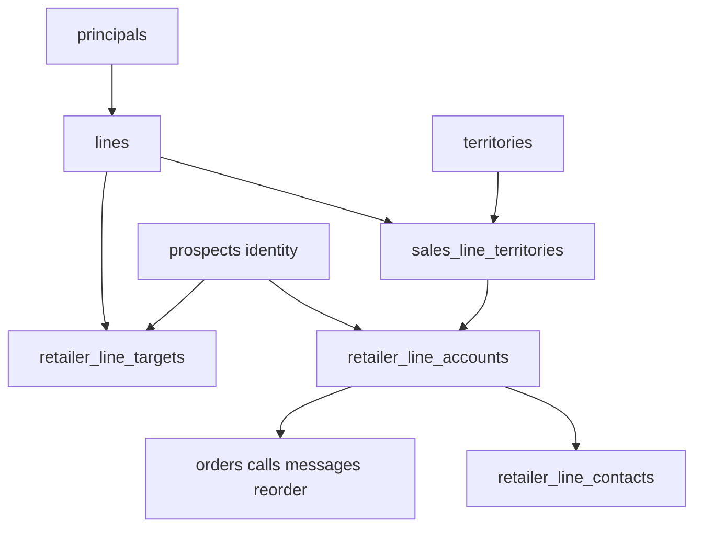

# Phase 1 Plan: Multi-Line Schema Foundation

**Status:** Implementation-ready documentation only. No migrations, schemas, application code, or production data have been changed by this document.  
**Epic:** [docs/epics/multi-line-multi-territory-crm.md](../epics/multi-line-multi-territory-crm.md)  
**Current-state audit:** [docs/multi-line-territory-audit.md](../multi-line-territory-audit.md)  
**Branch inspected:** `feature/multi-line-multi-territory-implementation` at `a1b2e57` (docs commit on `main` `879a24a`)  
**Date:** 2026-08-14

Settled business decisions in the epic **supersede** audit §8.4 / §14 items 1–6, 8, and 13 where they conflict. Live schema evidence below was re-verified against the repository; it matches the audit (no schema drift).

---

## 1. Phase objective

Add an **additive expand/contract** schema foundation so the CRM can represent multiple lines without commingling account data, while the staff UI continues to run unchanged on `prospects`.

Phase 1 must:

1. Create `principals`, extend `lines`, make `territories` hierarchical, and add `sales_line_territories`, `retailer_line_accounts`, `retailer_line_contacts`, `retailer_field_changes`, `retailer_line_targets`, and `migration_review_queue`.
2. Seed OGR (`active`), Eagle Peak (`onboarding`), Big Fish (`confirmed`), and leave BKG as an independent paused/inactive line.
3. Assign OGR territories BC/OR/WA with `rights_type = unconfirmed`; assign Eagle Peak OR/WA (active) and norcal (proposed); assign **zero** Big Fish territories.
4. Backfill **one OGR line account per existing `prospects` row**; stamp operational records onto those accounts.
5. Install dual-write triggers so new writes to `prospects` keep the OGR line account in sync while the UI flag is off.
6. Leave Eagle Peak, Big Fish, and Prospective Lines with **zero** operational line accounts.
7. Not change staff UI behavior, public catalogs, or historical migrations.



---

## 2. Current-state evidence (exact file references)

### 2.1 Branch and types

| Fact | Evidence |
|------|----------|
| HEAD is docs-only on main | `a1b2e57` on `feature/multi-line-multi-territory-implementation` |
| Types are hand-written, not CLI-generated | [src/types/database.ts](../../src/types/database.ts) lines 1–7 |
| No `FEATURE_*` flags in app today | `rg FEATURE_` under `src/` finds none for multi-line |
| No `docs/plans/` before this plan | Created by this phase |

### 2.2 `lines`

| Fact | Evidence |
|------|----------|
| Table: uuid PK, `code` unique, `active` boolean, marketing fields | [supabase/schema.sql](../../supabase/schema.sql) lines 26–58 |
| Seeds: `ogr` active, `bkg` inactive | Same; initial seed [20260802185342_initial_schema.sql](../../supabase/migrations/20260802185342_initial_schema.sql) |
| Portfolio fields + public RPC | [20260806180000_line_portfolio_fields.sql](../../supabase/migrations/20260806180000_line_portfolio_fields.sql) — `get_public_active_lines()` filters `active = true` |
| App hardcodes OGR | [src/lib/lines.ts](../../src/lib/lines.ts) `resolveOgrLineId`, explicit `LINE_SELECT` |
| `LineKey` | [src/types/index.ts](../../src/types/index.ts) `'ogr' \| 'bkg'` |

### 2.3 `territories` and retailer geography

| Fact | Evidence |
|------|----------|
| Five codes CHECK `bc\|ab\|ca\|or\|wa` | [supabase/schema.sql](../../supabase/schema.sql) lines 64–89; [20260806170000_territories.sql](../../supabase/migrations/20260806170000_territories.sql) |
| `prospects.territory_id` NOT NULL FK | Same migration; backfilled all nulls to BC |
| App defaults unknown province to BC | [src/lib/territories.ts](../../src/lib/territories.ts) `territoryCodeFromProvince` |

### 2.4 `prospects` (identity + commercial blob)

| Fact | Evidence |
|------|----------|
| Integer PK; `account_status` `prospect\|active_account\|inactive` | [supabase/schema.sql](../../supabase/schema.sql) lines 352–390; [20260802270000_account_lifecycle_orders.sql](../../supabase/migrations/20260802270000_account_lifecycle_orders.sql) |
| Planning columns | [20260804010000_prospects_planning_columns.sql](../../supabase/migrations/20260804010000_prospects_planning_columns.sql), taxonomy migrations |
| Convert flips global status | [src/lib/convertToActiveAccount.ts](../../src/lib/convertToActiveAccount.ts) |

### 2.5 Contacts, orders, calls, reorder

| Table | Key columns | FK to prospects? | Evidence |
|-------|-------------|------------------|----------|
| `account_contacts` | `account_id`, role, `is_primary` | Yes, ON DELETE CASCADE | [20260803010000_account_contacts.sql](../../supabase/migrations/20260803010000_account_contacts.sql); partial unique one primary per account |
| `orders` | `account_id`, nullable `line_id`, `total_amount_cad` | Yes | [20260802270000_account_lifecycle_orders.sql](../../supabase/migrations/20260802270000_account_lifecycle_orders.sql) |
| `account_reorder_settings` | PK = `account_id` | Yes, CASCADE | Same |
| `calls` | `prospect_id`, nullable `line_id`, `order_value_cad` | **No FK** | [supabase/schema.sql](../../supabase/schema.sql) lines 426–444; initial schema |
| `prospect_updates` | `prospect_id` | **No FK** | Same lines 412–420 |

`CALL_SELECT` omits `line_id` ([src/lib/calls.ts](../../src/lib/calls.ts)). Convert may stamp `orders.line_id` ([convertToActiveAccount.ts](../../src/lib/convertToActiveAccount.ts)).

### 2.6 Tables referencing `prospects.id` (enforced FK)

From migrations / [supabase/schema.sql](../../supabase/schema.sql):

- `orders.account_id`
- `account_reorder_settings.account_id`
- `account_contacts.account_id`
- `system_messages.prospect_id` ([20260811120000_system_messages.sql](../../supabase/migrations/20260811120000_system_messages.sql))
- `gmail_thread_links.prospect_id` ([20260809200000_gmail_thread_links.sql](../../supabase/migrations/20260809200000_gmail_thread_links.sql))
- `calendar_event_links.prospect_id` ([20260810020000_calendar_event_links.sql](../../supabase/migrations/20260810020000_calendar_event_links.sql))
- `message_threads.prospect_id` ([20260805060000_message_center.sql](../../supabase/migrations/20260805060000_message_center.sql))
- `wholesale_order_requests.prospect_id` ([20260805050000_public_ogr_wholesale_access.sql](../../supabase/migrations/20260805050000_public_ogr_wholesale_access.sql))
- `profiles.prospect_id` ([20260806190000_retailer_pricing_and_buyer_account.sql](../../supabase/migrations/20260806190000_retailer_pricing_and_buyer_account.sql))
- `account_conversion_attribution.prospect_id` ([20260812120000_outreach_goals_and_attribution.sql](../../supabase/migrations/20260812120000_outreach_goals_and_attribution.sql))

### 2.7 Tables storing `prospect_id` without FK

- `calls.prospect_id`
- `prospect_updates.prospect_id`

**Phase 1 does not add those FKs** (deferred to Phase 9 / later cleanup).

### 2.8 Nullable `line_id`

- `orders.line_id` → `lines(id)` ON DELETE SET NULL
- `calls.line_id` → `lines(id)` ON DELETE SET NULL
- Catalog tables use **required** `line_id` (`catalog_items`, `catalog_settings`, `catalog_assets`, `catalog_import_runs`)

### 2.9 Monetary columns assuming CAD

- `orders.total_amount_cad`
- `calls.order_value_cad`
- Catalog already has USD wholesale + CAD MSRP/landed (`price_usd`, `msrp_cad`, landed overrides)
- `catalog_settings` brokerage/freight allocations in CAD

### 2.10 RLS

All CRM tables use `is_approved_staff()` ([supabase/schema.sql](../../supabase/schema.sql) ~873–889, policies ~1338+). Phase 1 keeps this pattern on new tables. No line-scoped RLS in v1.

### 2.11 Import / seed scripts assuming BC or OGR

- [supabase/migrations/20260802251000_seed_catalog_prospects.sql](../../supabase/migrations/20260802251000_seed_catalog_prospects.sql) — OGR catalog + BC prospects
- [supabase/migrations/20260804120000_upsert_bc_prospect_list.sql](../../supabase/migrations/20260804120000_upsert_bc_prospect_list.sql)
- [src/lib/prospectListImport.ts](../../src/lib/prospectListImport.ts)
- [scripts/catalog-import/from-json.ts](../../scripts/catalog-import/from-json.ts) hardcodes `'ogr'`
- [src/lib/catalog.ts](../../src/lib/catalog.ts), [src/lib/catalogSettings.ts](../../src/lib/catalogSettings.ts)

**Do not rewrite historical migrations.** Do not re-run BC seeds against production as part of Phase 1.

---

## 3. Confirmed business decisions

| Decision | Value |
|----------|-------|
| `lines.status` enum | `prospective`, `confirmed`, `onboarding`, `active`, `paused`, `declined`, `terminated` |
| Acquisition stage (prospective only) | `identified`, `researching`, `contact_requested`, `conversation`, `evaluating`, `negotiating`, `decision_pending` |
| Big Fish | Confirmed represented; `status = confirmed`; not prospective; do not invent commercial terms |
| OGR territories | BC, OR, WA assigned; CA and AB **not** assigned |
| OGR `rights_type` | `unconfirmed` until written exclusivity evidence |
| `rights_type` enum | `exclusive`, `limited_exclusive`, `non_exclusive`, `unconfirmed` — never store unknown as `non_exclusive` |
| Eagle Peak | Global Shade Co. dba Eagle Peak; code `eagle-peak`; USD; 10%; OR/WA assigned; norcal proposed; no BC/AB |
| BKG | Keep `bkg`, `active = false`, map `status = paused`; do not reuse |
| Prospective Lines | Owner/admin; research targets OK; no orders/commissions/outreach/public catalog/active KPIs |
| Preserve `prospects.id` | Yes — used as `retailer_id` |
| `lines.active` | Remains public-portfolio flag; Eagle Peak / Big Fish seed `active = false` |

---

## 4. Remaining values that must stay null, proposed, or unconfirmed

| Item | Phase 1 treatment |
|------|-------------------|
| Big Fish `principals.legal_name` | **NULL** (line display name only: `Big Fish`) |
| Big Fish currency / commission / territories / catalog | **NULL / empty** |
| Northern California county list | `norcal` territory `status = proposed`; no county children |
| OGR exclusivity | All OGR assignments `rights_type = unconfirmed` |
| OGR CA / AB rights | Geo rows exist; **no** `sales_line_territories` rows |
| Eagle Peak BC / AB | No assignments |
| `lines.productivity_thresholds` for OGR | **NULL** → productivity view returns `unclassified` |
| Prospective line rows | **Zero** in Phase 1 seed (pipeline ships Phase 8) |
| Eagle Peak / Big Fish / prospective `retailer_line_accounts` | **Zero** auto-created |
| `retailer_line_targets` | Empty table; structure + triggers only |
| FKs on `calls` / `prospect_updates` | Not added |
| Rename `prospects` → `retailers` | Deferred to Phase 9 |

---

## 5. Exact target tables and columns

### 5.1 `principals` (new)

| Column | Type | Notes |
|--------|------|-------|
| `id` | uuid PK `gen_random_uuid()` | |
| `legal_name` | text nullable | Required when known; Big Fish may be null |
| `dba_name` | text nullable | Eagle Peak: `Eagle Peak` |
| `notes` | text nullable | |
| `created_at` / `updated_at` | timestamptz NOT NULL default now() | `set_updated_at` trigger |

### 5.2 Extend `lines`

Keep existing columns. Add:

| Column | Type | Notes |
|--------|------|-------|
| `principal_id` | uuid NULL → `principals(id)` ON DELETE SET NULL | |
| `status` | text NOT NULL default `'prospective'` | CHECK enum §3 |
| `acquisition_stage` | text NULL | CHECK enum §3; required iff prospective |
| `default_currency` | text NULL | ISO-4217 (`CAD`, `USD`) |
| `commission_rate` | numeric(5,4) NULL | e.g. `0.1000` = 10% |
| `effective_date` | date NULL | |
| `termination_date` | date NULL | |
| `productivity_thresholds` | jsonb NULL | Shape documented in §6 |

CHECK: `(status = 'prospective' AND acquisition_stage IS NOT NULL) OR (status <> 'prospective' AND acquisition_stage IS NULL)`.

Keep `active boolean` as public-portfolio flag (do not derive-drop in Phase 1).

### 5.3 Extend `territories`

| Change | Detail |
|--------|--------|
| Drop | `territories_code_check` (five codes) |
| Keep | `territories_country_code_check` (`CA`,`US`) for now; revisit if country-level rows need other codes |
| Add `level` | text NOT NULL default `'province_state'` CHECK (`country\|province_state\|region\|county`) |
| Add `parent_territory_id` | uuid NULL → `territories(id)` |
| Add `status` | text NOT NULL default `'active'` CHECK (`active\|proposed`) |
| Add `metadata` | jsonb NOT NULL default `'{}'` |

Existing five rows: `level = province_state`, `status = active`, `parent_territory_id = null`.  
Seed `norcal`: `level = region`, parent = `ca`, `status = proposed`.

### 5.4 `sales_line_territories` (new)

| Column | Type |
|--------|------|
| `id` | uuid PK |
| `sales_line_id` | uuid NOT NULL → `lines(id)` ON DELETE CASCADE |
| `territory_id` | uuid NOT NULL → `territories(id)` |
| `rights_type` | text NOT NULL CHECK (`exclusive\|limited_exclusive\|non_exclusive\|unconfirmed`) |
| `status` | text NOT NULL CHECK (`proposed\|active\|expired\|disputed`) |
| `effective_date` / `expiration_date` | date NULL |
| `contract_source` | text NULL |
| `restrictions` | jsonb NOT NULL default `'{}'` |
| `notes` | text NULL |
| `created_at` / `updated_at` | timestamptz |

### 5.5 `retailer_line_accounts` (new)

| Column | Type | Source |
|--------|------|--------|
| `id` | uuid PK | |
| `retailer_id` | integer NOT NULL → `prospects(id)` ON DELETE CASCADE | Preserve identity id |
| `sales_line_id` | uuid NOT NULL → `lines(id)` | |
| `sales_line_territory_id` | uuid NULL | Composite FK with `sales_line_id` |
| `relationship_status` | text NOT NULL | See §6 |
| `converted_at` | timestamptz NULL | from `prospects` |
| `initial_order_date` | timestamptz NULL | |
| `notes` | text NULL | |
| `fit` | text NULL | |
| `fit_score` | smallint NULL | |
| `ideal_opening_units` | integer NULL | |
| `priority` | text NULL | |
| `provisional_grade` | text NULL | |
| `verification_status` | text NULL | |
| `buyer_verified` | boolean NOT NULL default false | |
| `apparel_capability` | text NULL | |
| `existing_ogr` | text NULL | Keep name in Phase 1; rename later |
| `qualification_status` | text NULL | |
| `next_action` | text NULL | |
| `source_note` | text NULL | |
| `region` | text NULL | BC planning corridor (line-specific) |
| `primary_district` | text NULL | |
| `subterritory` | text NULL | |
| `secondary_channels` | jsonb NOT NULL default `'[]'` | |
| `retail_subchannels` | jsonb NOT NULL default `'[]'` | |
| `venue_contexts` | jsonb NOT NULL default `'[]'` | |
| `lifestyle_themes` | jsonb NOT NULL default `'[]'` | |
| `retail_capabilities` | jsonb NOT NULL default `'[]'` | |
| `backfill_review_reason` | text NULL | Set when territory ambiguous |
| `created_at` / `updated_at` | timestamptz | |

Do **not** store `activity_status` or `productivity_class` as mutable columns (see §6).

### 5.6 `retailer_line_contacts` (new)

| Column | Type |
|--------|------|
| `id` | uuid PK |
| `retailer_line_account_id` | uuid NOT NULL → `retailer_line_accounts(id)` ON DELETE CASCADE |
| `account_contact_id` | uuid NOT NULL → `account_contacts(id)` ON DELETE CASCADE |
| `role` | text NOT NULL CHECK (`buyer\|manager\|owner`) |
| `is_primary` | boolean NOT NULL default false |
| `notes` | text NULL |
| `created_at` / `updated_at` | timestamptz |

UNIQUE `(retailer_line_account_id, account_contact_id)`.

### 5.7 `retailer_field_changes` (new)

Mirror `catalog_field_changes`:

| Column | Type |
|--------|------|
| `id` | uuid PK |
| `retailer_id` | integer NOT NULL → `prospects(id)` ON DELETE CASCADE |
| `field_path` | text NOT NULL |
| `old_value` / `new_value` | jsonb |
| `source` | text NOT NULL default `'user'` CHECK (`user\|ai\|import\|calculated\|unknown`) |
| `actor_id` | uuid NULL → `auth.users(id)` ON DELETE SET NULL |
| `created_at` | timestamptz NOT NULL default now() |

Phase 1 creates the table; writers land in Phase 4.

### 5.8 `retailer_line_targets` (new)

| Column | Type |
|--------|------|
| `id` | uuid PK |
| `retailer_id` | integer NOT NULL → `prospects(id)` ON DELETE CASCADE |
| `sales_line_id` | uuid NOT NULL → `lines(id)` ON DELETE CASCADE |
| `interest` | text NULL |
| `fit_notes` | text NULL |
| `suggested_geo` | text NULL |
| `status` | text NOT NULL default `'watching'` CHECK (`watching\|shortlist\|dropped`) |
| `created_at` / `updated_at` | timestamptz |

UNIQUE `(retailer_id, sales_line_id)`.

### 5.9 `migration_review_queue` (new)

| Column | Type |
|--------|------|
| `id` | uuid PK |
| `entity_type` | text NOT NULL | e.g. `prospect`, `order`, `call`, `system_message` |
| `entity_id` | text NOT NULL | stringified id |
| `reason` | text NOT NULL | |
| `payload` | jsonb NOT NULL default `'{}'` | |
| `resolved_at` | timestamptz NULL | |
| `created_at` | timestamptz NOT NULL default now() |

### 5.10 Nullable transitional FKs on operational records

Add `retailer_line_account_id uuid NULL → retailer_line_accounts(id) ON DELETE SET NULL` to:

- `orders`
- `calls`
- `system_messages`
- `account_reorder_settings`
- `gmail_thread_links`
- `calendar_event_links`
- `message_threads`
- `wholesale_order_requests`
- `account_conversion_attribution`

**Optional (recommended):** add nullable `retailer_line_account_id` on `prospect_updates` **without** adding `prospect_id` FK yet — stamp during backfill when prospect exists; orphans go to review queue.

**Do not** add `retailer_line_account_id` to `profiles` in Phase 1 (buyer identity stays retailer-level).

### 5.11 Financial columns on `orders` (additive)

Keep `total_amount_cad`. Add:

| Column | Type |
|--------|------|
| `original_amount` | numeric(12,2) NULL |
| `original_currency` | text NULL |
| `exchange_rate` | numeric(18,8) NULL |
| `exchange_rate_date` | date NULL |
| `converted_amount` | numeric(12,2) NULL |
| `converted_currency` | text NULL |
| `conversion_source` | text NULL |

`order_date` remains the transaction date.

**Optional parallel on `calls`:** `order_value_original_amount`, `order_value_original_currency`, … — treat as estimate, not booked revenue. If deferred to keep Phase 1 smaller, document as Phase 3; preference is to add nullable columns now so CAD-only calls do not block multi-currency later.

---

## 6. Data types, enums, and defaults

### 6.1 Line status / acquisition

See §3. Defaults: new lines `status = 'prospective'` (safe); seeds override. OGR seed `active`, Eagle Peak `onboarding`, Big Fish `confirmed`, BKG `paused`.

### 6.2 Line-account relationship status

`relationship_status`:

| Value | Meaning |
|-------|---------|
| `prospect` | Not yet opened |
| `qualified` | Qualified, not opened (unused in OGR backfill) |
| `opened` | Opened account (maps from today's `active_account`) |
| `inactive` | Inactive relationship |
| `terminated` | Ended; excluded from partial unique |

**OGR map from `prospects.account_status`:**

| Today | `relationship_status` |
|-------|------------------------|
| `prospect` | `prospect` |
| `active_account` | `opened` |
| `inactive` | `inactive` |

Do **not** overload relationship with activity or productivity.

### 6.3 Activity status (dynamic — do not store)

**Recommendation:** expose a **view** `retailer_line_account_activity` (not a generated column — cannot subquery other tables; not a write-through cache — would go stale).

Rules:

- `never_ordered` — no non-draft orders for the line account
- `active` — at least one non-draft order with `order_date >= current_date - 365`
- `dormant` — has non-draft orders, but none in the previous 12 months

Nightly materialized view is **deferred**.

### 6.4 Productivity class (dynamic)

View `retailer_line_account_productivity` joins `lines.productivity_thresholds` jsonb.

Suggested jsonb shape (when configured later):

```json
{
  "productive_min_annual_cad": 10000,
  "developing_min_annual_cad": 2500,
  "currency": "CAD"
}
```

If thresholds NULL → all rows `unclassified`. Classes: `productive | developing | low_value | unclassified`.

### 6.5 `productivity_thresholds` default

NULL for all Phase 1 seeds.

---

## 7. Primary keys, foreign keys, unique constraints, and indexes

### 7.1 Uniqueness

| Constraint | Mechanism |
|------------|-----------|
| One operational line account per retailer × line | Partial unique index `UNIQUE (retailer_id, sales_line_id) WHERE relationship_status <> 'terminated'` |
| One primary contact per line account | Partial unique index `UNIQUE (retailer_line_account_id) WHERE is_primary` on `retailer_line_contacts` |
| Contact membership | `UNIQUE (retailer_line_account_id, account_contact_id)` |
| Line × territory assignment | Partial unique `UNIQUE (sales_line_id, territory_id) WHERE status <> 'expired'` (or full unique if expired rows must be archived elsewhere — prefer partial) |
| Composite FK support | `UNIQUE (id, sales_line_id)` on `sales_line_territories` |
| Target uniqueness | `UNIQUE (retailer_id, sales_line_id)` on `retailer_line_targets` |
| Principals | No uniqueness on name (legal names may collide across markets) |

### 7.2 Same-line territory assignment (composite FK)

```
retailer_line_accounts (sales_line_territory_id, sales_line_id)
  → sales_line_territories (id, sales_line_id)
```

MATCH SIMPLE: NULL `sales_line_territory_id` allowed. **Impossible with a single-column CHECK** — composite FK is the correct mechanism.

### 7.3 Prospective / represented separation (triggers)

PostgreSQL cannot express “FK only if parent.status = X” as a CHECK across tables. Use:

| Rule | Mechanism |
|------|-----------|
| Targets only on prospective lines | `BEFORE INSERT OR UPDATE` trigger on `retailer_line_targets` reading `lines.status` |
| No operational accounts on prospective lines | `BEFORE INSERT OR UPDATE` trigger on `retailer_line_accounts` rejecting `lines.status = 'prospective'` |
| No orders against prospective line accounts | `BEFORE INSERT OR UPDATE` trigger on `orders` joining line via `retailer_line_account_id` (and via `line_id` when set) |
| No outreach sends against prospective lines | `BEFORE INSERT OR UPDATE` trigger on `system_messages` when `origin` is product outreach / agent draft and line is prospective |
| Targets cannot own orders | Structural: orders FK `retailer_line_account_id`, not `retailer_line_target_id` — no path to attach |

Service-layer 403 for Prospective Lines UI is Phase 8; Phase 1 ships DB guards.

### 7.4 Recommended indexes

- `retailer_line_accounts (sales_line_id, relationship_status)`
- `retailer_line_accounts (retailer_id)`
- `sales_line_territories (sales_line_id)`
- `sales_line_territories (territory_id)`
- Operational tables: index on new `retailer_line_account_id`
- `migration_review_queue (entity_type, resolved_at)` where unresolved

---

## 8. RLS behavior

- Enable RLS on every new table.
- Policy: `"approved staff full access"` using / with check `public.is_approved_staff()` — same as `prospects` / `orders`.
- Do **not** introduce line-scoped RLS or owner-only Prospective Lines policies in Phase 1 (UI/API in Phase 8).
- `get_public_active_lines()` continues to filter `lines.active = true` only — Eagle Peak / Big Fish stay hidden from public portfolio while `active = false`.
- Public OGR RPCs unchanged (`code = 'ogr'`).

---

## 9. Migration ordering

After existing latest: `20260812140000_outreach_automation_runs.sql`.

| # | File | Contents |
|---|------|----------|
| 1 | `20260814100000_multi_line_phase1_tables.sql` | `principals`; alter `lines`; alter `territories` (drop code check, add hierarchy); create `sales_line_territories`, `retailer_line_accounts`, contacts, field changes, targets, review queue; add nullable FKs + financial columns; indexes; composite FK; RLS; views for activity/productivity |
| 2 | `20260814110000_multi_line_phase1_line_seeds.sql` | Principals + update `ogr`/`bkg`; insert `eagle-peak` / `big-fish`; seed `norcal`; OGR BC/OR/WA; Eagle Peak OR/WA/norcal. **No accounts** |
| 3 | `20260814120000_multi_line_phase1_ogr_backfill.sql` | Line accounts; stamp operational rows; financial backfill; review queue; assertions |
| 4 | `20260814130000_multi_line_phase1_dual_write.sql` | Dual-write triggers + prospective/order/outreach guards |

Also update [supabase/schema.sql](../../supabase/schema.sql) and [src/types/database.ts](../../src/types/database.ts) in the same PRs (hand-maintained mirror).

**Do not rewrite** historical BC/OGR seed migrations.

---

## 10. Existing-to-new field mapping

### 10.1 Identity stays on `prospects`

`id`, `name`, `category`, `city`, `address`, `phone`, `website`, `territory_id` (location hint only — not rights), `external_id`, `retail_category`, `created_at`, `updated_at`.

### 10.2 Commercial / planning → OGR `retailer_line_accounts`

Copy: `account_status`→`relationship_status` (map §6.2), `converted_at`, `initial_order_date`, `notes`, `fit`, `fit_score`, `ideal_opening_units`, `priority`, `provisional_grade`, `verification_status`, `buyer_verified`, `apparel_capability`, `existing_ogr`, `qualification_status`, `next_action`, `source_note`, `region`, `primary_district`, `subterritory`, taxonomy jsonb columns.

Leave originals on `prospects` (dual-write source of truth for UI).

### 10.3 Contacts

`account_contacts` remains person identity. Insert `retailer_line_contacts` linking each contact to the OGR line account with same `role` / `is_primary`.

### 10.4 Orders / calls / messages / reorder / links / attribution

| Source | Map |
|--------|-----|
| `orders.account_id` | OGR line account for that retailer; set `retailer_line_account_id`; set `line_id = ogr` when null or ogr |
| `calls.prospect_id` | Same; set `line_id = ogr` when null |
| `system_messages.prospect_id` | Same when non-null |
| `account_reorder_settings.account_id` | Same |
| Gmail / Calendar / message_threads / wholesale requests / attribution | Same when prospect/account id present |

---

## 11. OGR backfill algorithm

1. **Pre-count snapshot** (§ end checklists).  
2. Run seeds migration (principals, lines, territories, assignments). Assert Eagle Peak / Big Fish account counts = 0.  
3. Resolve `ogr_line_id` and OGR `sales_line_territories` ids for `bc`, `or`, `wa`.  
4. `INSERT INTO retailer_line_accounts … SELECT … FROM prospects` with mapped columns; `retailer_id = prospects.id`.  
5. **Territory assignment:**  
   - Join `prospects.territory_id` → `territories.code`.  
   - If code in (`bc`,`or`,`wa`): set `sales_line_territory_id` to matching OGR assignment.  
   - If code in (`ca`,`ab`) or unknown: leave NULL, set `backfill_review_reason`, insert `migration_review_queue` row.  
   - **Never** infer from address/city.  
6. **Orders gate:**  
   - If any `orders.line_id` references a non-OGR line → **stop backfill**, queue those order ids, fail go/no-go.  
   - Else stamp all orders to OGR line account; set `line_id = ogr` where null; set financial columns: `original_amount = total_amount_cad`, `original_currency = 'CAD'`, `exchange_rate = 1`, `exchange_rate_date = order_date`, `converted_amount = total_amount_cad`, `converted_currency = 'CAD'`, `conversion_source = 'legacy_cad_column'`.  
7. Stamp calls, system_messages, reorder settings, gmail, calendar, threads, wholesale requests, attribution.  
8. Contacts → `retailer_line_contacts`.  
9. **Orphans:** `calls` / `prospect_updates` / messages with `prospect_id` not in `prospects` → review queue; **do not delete**.  
10. Assert:  
    - `count(retailer_line_accounts where ogr) = count(prospects)`  
    - Eagle Peak / Big Fish / prospective account counts = 0  
    - `retailer_line_targets` count = 0  
    - OGR active territory codes = `{bc,or,wa}` only  

---

## 12. Handling of orphaned or ambiguous records

| Case | Action |
|------|--------|
| Prospect on CA or AB | Line account created; territory NULL; review queue |
| Prospect territory missing / unknown code | Same |
| Call / update / message with unknown `prospect_id` | Review queue; leave row unchanged except skip stamp |
| Order with non-OGR `line_id` | **Hard stop** before mass stamp |
| Order with null `line_id` | Map to OGR **only after** confirming all non-null line_ids are OGR |
| Duplicate-looking retailers | Do **not** merge; optional later review queue reason `possible_duplicate` (not auto in Phase 1) |
| Big Fish / Eagle Peak | Never auto-create accounts from OGR geography |

---

## 13. Temporary dual-write strategy

While UI still writes `prospects` (flag off):

| Trigger | Behavior |
|---------|----------|
| `AFTER INSERT OR UPDATE ON prospects` | Upsert OGR `retailer_line_accounts` commercial fields for that `retailer_id` |
| `AFTER INSERT ON account_contacts` | Insert OGR `retailer_line_contacts` (ignore conflict) |
| `BEFORE INSERT ON orders` (and peers) | If `retailer_line_account_id` IS NULL and retailer resolves, set to OGR account; set financial defaults when CAD-only insert |
| `BEFORE INSERT OR UPDATE` guards | Prospective / order / outreach protections from §7.3 |

Dual-write does **not** create Eagle Peak or Big Fish accounts.  
Dual-write does **not** change React islands or API handlers in Phase 1.

---

## 14. Application compatibility while the feature flag is off

| Surface | Why safe |
|---------|----------|
| [src/lib/lines.ts](../../src/lib/lines.ts) `LINE_SELECT` | Explicit column list — extra `lines` columns ignored |
| `fetchActiveLines` / `get_public_active_lines` | Still filter `active = true` → OGR only |
| Convert / orders / calls inserts | Omit unknown columns; triggers fill `retailer_line_account_id` |
| [src/types/database.ts](../../src/types/database.ts) | Must be updated to include new tables/columns so `npm run check` passes — types expand without requiring UI to use them |
| Staff UI / tabs | Unchanged routes and queries |
| Public wholesale | Unchanged RPCs |

`FEATURE_MULTI_LINE_SCHEMA` is **documentation only** in Phase 1 (no runtime branch required). Runtime UI gating starts Phase 2 (`FEATURE_MULTI_LINE_UI`).

---

## 15. Validation queries

### Pre-migration counts

```sql
select count(*) as prospects from prospects;
select account_status, count(*) from prospects group by 1 order by 1;
select t.code, count(*) from prospects p join territories t on t.id = p.territory_id group by 1 order by 1;
select count(*) as orders from orders;
select line_id is null as line_null, count(*) from orders group by 1;
select count(*) as calls from calls;
select count(*) as contacts from account_contacts;
select count(*) as reorder from account_reorder_settings;
select count(*) as system_messages from system_messages;
select count(*) as orphan_calls from calls c
  left join prospects p on p.id = c.prospect_id where p.id is null;
```

### Post-backfill

```sql
-- OGR account count equals prospects
select
  (select count(*) from prospects) as prospects,
  (select count(*) from retailer_line_accounts rla
     join lines l on l.id = rla.sales_line_id where l.code = 'ogr') as ogr_accounts;

-- Zero non-OGR operational accounts
select l.code, count(rla.id)
from lines l
left join retailer_line_accounts rla on rla.sales_line_id = l.id
where l.code in ('eagle-peak', 'big-fish', 'bkg')
   or l.status = 'prospective'
group by 1;

-- OGR territories
select t.code, slt.rights_type, slt.status
from sales_line_territories slt
join lines l on l.id = slt.sales_line_id
join territories t on t.id = slt.territory_id
where l.code = 'ogr'
order by 1;
-- expect bc/or/wa, rights_type unconfirmed

-- Eagle Peak territories
select t.code, slt.status
from sales_line_territories slt
join lines l on l.id = slt.sales_line_id
join territories t on t.id = slt.territory_id
where l.code = 'eagle-peak'
order by 1;
-- expect or, wa active; norcal proposed

-- Big Fish has zero territories and zero accounts
select
  (select count(*) from sales_line_territories slt join lines l on l.id = slt.sales_line_id where l.code = 'big-fish') as bf_terr,
  (select count(*) from retailer_line_accounts rla join lines l on l.id = rla.sales_line_id where l.code = 'big-fish') as bf_acct;

-- Orders stamped
select count(*) from orders where retailer_line_account_id is null; -- expect 0 for rows with known account_id
select count(*) from orders o
join retailer_line_accounts rla on rla.id = o.retailer_line_account_id
join lines l on l.id = rla.sales_line_id
where l.status = 'prospective'; -- 0

-- Review queue non-empty only if CA/AB/orphans exist
select reason, count(*) from migration_review_queue where resolved_at is null group by 1;
```

---

## 16. Rollback procedure

| Stage | Procedure |
|-------|-----------|
| After tables+seeds only (PR1) | Reverse migrations 2 then 1 (`DROP` new tables/columns; restore `territories_code_check`). `prospects` untouched. |
| After backfill+dual-write (PR2) | Disable/drop triggers first; reverse migrations 4→3→2→1. Snapshot restore if partial failure mid-backfill. |
| Snapshot required before PR2 | `prospects`, `orders`, `calls`, `account_contacts`, `system_messages`, `account_reorder_settings`, gmail/calendar links, attribution |

`prospects` remains source of truth for the app throughout Phase 1 — rollback never needs to reconstruct UI data from line accounts.

---

## 17. Required fixtures and tests

Prefer SQL fixture tests and/or Vitest that read migration SQL (pattern: [src/lib/google/crmLinkLifecycle.test.ts](../../src/lib/google/crmLinkLifecycle.test.ts)).

1. **Schema:** partial unique rejects second non-terminated account for same retailer×line.  
2. **Composite FK:** attaching Eagle Peak territory id to OGR account fails.  
3. **Target trigger:** insert target for `ogr` fails; for a prospective fixture line succeeds.  
4. **Account trigger:** insert line account for prospective line fails.  
5. **Order trigger:** order against prospective line account fails.  
6. **Seeds:** BKG `status=paused`, `active=false`; Big Fish `status=confirmed`, zero territories; Eagle Peak currency USD / commission 0.1.  
7. **Backfill fixture:** mixed `account_status`; territories BC/OR/WA/CA; null `line_id` orders; orphan call → counts + review queue.  
8. **Financial backfill:** CAD legacy columns populated; no invented USD.  
9. **`npm run check`** on every Phase 1 PR.

No UI / Playwright changes in Phase 1.

---

## 18. Exact files expected to change during implementation

| File | Change |
|------|--------|
| `supabase/migrations/20260814100000_multi_line_phase1_tables.sql` | **New** |
| `supabase/migrations/20260814110000_multi_line_phase1_line_seeds.sql` | **New** |
| `supabase/migrations/20260814120000_multi_line_phase1_ogr_backfill.sql` | **New** |
| `supabase/migrations/20260814130000_multi_line_phase1_dual_write.sql` | **New** |
| [supabase/schema.sql](../../supabase/schema.sql) | Mirror new objects |
| [src/types/database.ts](../../src/types/database.ts) | New tables/columns/enums |
| New test files under `src/lib/` or `src/test/` | Constraint / migration string tests |

**Do not change in Phase 1 implementation:** React islands, API routes, `LINE_SELECT` consumers for behavior, historical migrations, production data outside the controlled backfill migration, public RPCs.

---

## 19. Risks and failure triggers

| Risk | Failure trigger | Mitigation |
|------|-----------------|------------|
| Non-OGR `orders.line_id` exists | Pre-backfill query count > 0 | Stop; manual review |
| Orphan calls inflate silently | Orphans discarded | Review queue only |
| Dropping `territories_code_check` allows bad codes | Bad seed | App + CHECK on `level`; careful seeds |
| Dual-write trigger recursion | Update prospects ↔ line accounts loop | Trigger uses `WHEN` / `pg_trigger_depth()` / update only differing columns |
| `lines.active` confused with `status` | Eagle Peak appears in public portfolio | Seed `active=false`; leave RPC filter |
| Unknown rights stored as `non_exclusive` | Audit regression | Enum includes `unconfirmed`; seed uses it |
| Big Fish invented terms | Seed invents currency/commission | Explicit NULLs |
| Type drift | `database.ts` not updated | Same PR as migrations; `npm run check` |
| CA prospects auto-assigned OGR-CA | Inferring rights | No OGR-CA assignment; review queue |

---

## 20. Phase 1 acceptance criteria

- [ ] Four migrations applied in order on a fresh migrate path; `schema.sql` and `database.ts` match.  
- [ ] `ogr` status `active`, territories BC/OR/WA with `rights_type=unconfirmed`.  
- [ ] `eagle-peak` onboarding, USD, 10%, OR/WA active, norcal proposed, zero accounts.  
- [ ] `big-fish` confirmed, no invented commercial fields, zero territories, zero accounts.  
- [ ] `bkg` paused / inactive, unused.  
- [ ] One OGR line account per prospect; ids preserved.  
- [ ] Operational stamps complete or queued; orphans not deleted.  
- [ ] Financial columns filled for OGR CAD orders without inventing USD.  
- [ ] Dual-write triggers keep OGR accounts synced on prospect writes.  
- [ ] Prospective guards exist; targets table empty.  
- [ ] Staff UI behavior unchanged; public OGR site unchanged.  
- [ ] Validation queries pass; `npm run check` passes.  
- [ ] Rollback procedure documented and dry-runnable for PR1.

---

## 21. Explicitly deferred work

- Phase 2+ UI, routes, line picker, feature-flagged reads/writes  
- AI isolation and `retailer_field_changes` writers  
- Territory admin UI  
- Eagle Peak / Big Fish selling, outreach, public catalogs  
- Prospective Lines CRUD UI (~12) and owner/admin API 403  
- Rename `prospects` → `retailers`; drop dual-write columns  
- FKs on `calls.prospect_id` / `prospect_updates.prospect_id`  
- PostGIS / county children for norcal  
- Staff-line RLS  
- Quotes / commissions / samples tables  
- Productivity threshold configuration UI  
- Big Fish commercial term capture  
- Written OGR exclusivity evidence  
- Autosend / Gmail-as-send  

---

## Appendix A — Recommended migration-file sequence

1. `20260814100000_multi_line_phase1_tables.sql`  
2. `20260814110000_multi_line_phase1_line_seeds.sql`  
3. `20260814120000_multi_line_phase1_ogr_backfill.sql`  
4. `20260814130000_multi_line_phase1_dual_write.sql`  

---

## Appendix B — Pre-migration count checklist

Record before applying PR2:

- [ ] `prospects` total + by `account_status`  
- [ ] `prospects` by territory code  
- [ ] `orders` total + by `line_id` null/non-null  
- [ ] Distinct non-null `orders.line_id` codes (must be empty or only `ogr`)  
- [ ] `calls`, orphan call count  
- [ ] `account_contacts`, `account_reorder_settings`  
- [ ] `system_messages`, gmail/calendar links, threads, wholesale requests, attribution  

---

## Appendix C — Post-backfill validation checklist

- [ ] OGR account count = prospect count  
- [ ] Eagle Peak / Big Fish / prospective accounts = 0  
- [ ] Big Fish territories = 0  
- [ ] OGR territories = bc, or, wa only; `unconfirmed`  
- [ ] Eagle Peak territories = or, wa, norcal (proposed)  
- [ ] Orders with known accounts have `retailer_line_account_id`  
- [ ] Prospective order count = 0  
- [ ] Targets count = 0  
- [ ] Review queue explains every CA/AB/orphan case  
- [ ] Dual-write: insert test prospect (in staging) creates OGR line account  

---

## Appendix D — Go / no-go decision gate

**GO only if all are true:**

1. Epic + this plan approved.  
2. Production/staging backup taken.  
3. Pre-count checklist recorded.  
4. Every existing `orders.line_id` is NULL or OGR.  
5. No conflicting directory import running.  
6. Implementers will not invent Big Fish commercial terms or assign OGR CA/AB.

**NO-GO if:** non-OGR orders exist; backup missing; or remaining open questions are misread as “invent defaults.”

---

## Appendix E — Rollback triggers

Roll back immediately if:

- OGR account count ≠ prospect count after backfill  
- Any Eagle Peak / Big Fish / prospective operational account auto-created  
- Public `get_public_active_lines` returns non-OGR unexpectedly  
- Staff UI errors on prospect list/convert due to type or trigger failure  
- Dual-write recursion or write amplification detected  
- Financial backfill invents USD or nulls `total_amount_cad`  

---

## Appendix F — Questions that block vs can remain unresolved

| Question | Blocks Phase 1 implementation? |
|----------|--------------------------------|
| Approve this plan + epic decisions | **Yes** |
| Confirm all live orders are OGR (or null line_id) | **Yes** (go/no-go query) |
| Big Fish legal name / currency / commission / territories | No — leave null |
| Norcal county list | No — keep proposed |
| OGR exclusivity evidence | No — keep `unconfirmed` |
| Productivity thresholds | No — leave null |
| Outreach goal per line vs agency | No — Phase 2+ |
| Whether Big Fish later moves `confirmed` → `onboarding` | No — staff decision |

---

## Appendix G — Recommended PR breakdown for Phase 1

### PR 1 — Tables, seeds, types (no operational backfill)

- Migrations `…100000` + `…110000`  
- `schema.sql` + `database.ts`  
- Schema constraint tests (composite FK, enums, seed assertions)  
- **No** dual-write; **no** production account stamp  

### PR 2 — OGR backfill + dual-write

- Migrations `…120000` + `…130000`  
- Pre/post validation SQL as comments or staging runbook  
- Backfill fixture tests  
- Staging apply → validation checklist → production with snapshot  

Rollback of PR2 does not require reverting PR1 if triggers are dropped first and nullable columns left in place (expand/contract safe). Full reverse still available.

---

**Stop:** documentation complete. Do not begin migration implementation until this plan is approved.
