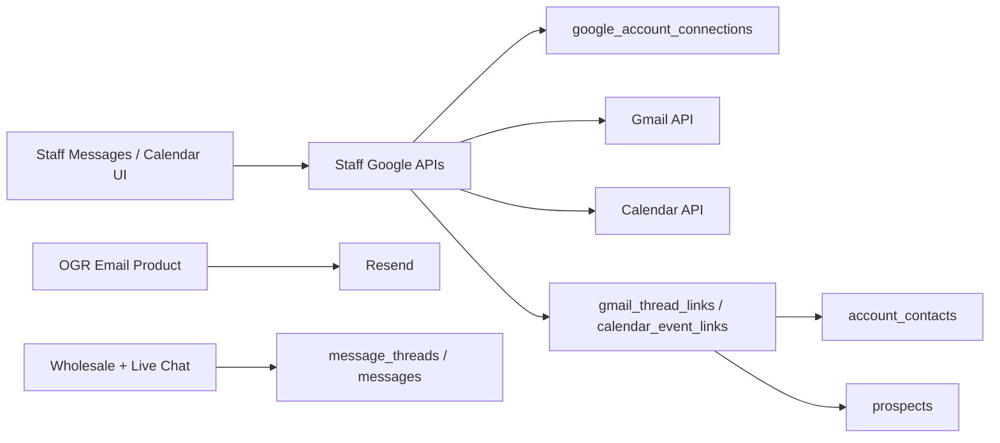

# Google Workspace — Messages (Gmail) + Calendar Integration Roadmap

Companion to existing CRM Message Center, Resend outbound email, and account/contact architecture.

**Branch recommendation:** cut `feature/google-workspace` from `main` after roadmap approval (do not mix with OGR product-email work).

## How to use (Plan Mode)

Each **implementation phase** below is sized for **one Plan Mode session → one PR**.

1. Paste the phase’s **Plan prompt**.
2. Implement; gate with `npm run check` (+ listed manual smoke).
3. Check the phase boxes when the PR merges.

Do **not** combine phases unless a later phase lists a hard dependency.  
Do **not** replace Resend, the OGR Product Email Composer, Copy Email Card, or Copy Product Link.

---

## 1. Executive Summary

**Today:** Rep Command Center already has:

- A **Messages** tab that is a CRM **Message Center** for **wholesale inbound** and **live chat** — not Gmail.
- Outbound email via **Resend** (wholesale confirmations, live-chat staff alerts, **OGR Email Product**).
- CRM people via `account_contacts` on a shared `prospects` table (`prospect` / `active_account` / `inactive`).
- Call follow-ups (`calls.follow_up_date`) and AI reorder contact dates — **not** a calendar product.
- **No** Google OAuth, Gmail API, Calendar API, or Google Contacts integration.

**This integration adds:**

```text
CRM
├── Accounts / Prospects   (unchanged)
├── Contacts               (unchanged source of truth)
├── Products               (unchanged; Resend OGR outreach stays)
├── Messages               ← extend with Gmail-backed Email channel
├── Calendar               ← new Google Calendar-backed surface
└── existing features      (wholesale Message Center, live chat, calls, …)
```

**Product intent:** Gmail is the transport/data source for ordinary business correspondence. The CRM is the contextual interface. Resend remains the transport for system-generated / specialized outbound workflows (especially OGR Product Email).

**Core answer:** Add a staff Google Workspace connection, expose Gmail threads through the existing Messages UX as a new **Email** channel (Gmail = source of truth; CRM stores only connection tokens + minimal association metadata), and add a Calendar tab backed by Google Calendar with optional CRM account/contact links — without migrating Resend or rebuilding the Message Center’s wholesale/live-chat channels.

---

## 2. Current-State Architecture

### 2.1 Messages today (not email)

| Layer | File / symbol | Role |
| ----- | ------------- | ---- |
| Tab | [`MessagesTab.tsx`](src/components/tabs/MessagesTab.tsx) | Staff Message Center; filters All / Needs mapping / Confirmed; channels All / Realtime / Wholesale |
| List / panel | [`MessagesThreadList.tsx`](src/components/messages/MessagesThreadList.tsx), [`MessageThreadPanel.tsx`](src/components/messages/MessageThreadPanel.tsx) | Thread list + detail, mapping UI, live reply |
| Account surface | [`AccountMessagesSection.tsx`](src/components/messages/AccountMessagesSection.tsx) | Confirmed threads on prospect/account drawers |
| Live chat dock | [`StaffChatDock.tsx`](src/components/messages/StaffChatDock.tsx), [`StaffLiveChatWindow.tsx`](src/components/messages/StaffLiveChatWindow.tsx) | Floating live-chat windows |
| Public chat | [`PublicChatFab.tsx`](src/components/chat/PublicChatFab.tsx) | Site FAB → `/api/chat/*` |
| Buyer portal | [`BuyerMessagesSection.tsx`](src/components/buyer/BuyerMessagesSection.tsx), [`buyerMessages.ts`](src/lib/buyerMessages.ts) | Buyer thread view + `buyer_reply` |
| Domain lib | [`messages.ts`](src/lib/messages.ts) | `MessageChannel = 'wholesale' \| 'live_chat'`; fetch/map threads |
| Fingerprint | [`messageFingerprint.ts`](src/lib/messageFingerprint.ts) | Identity fingerprint + mapping status |
| Wholesale inbound | [`messageCenterInbound.ts`](src/lib/messageCenterInbound.ts) | Upsert wholesale → threads |
| Live chat | [`liveChat.ts`](src/lib/liveChat.ts), [`useStaffLiveChatInbox.ts`](src/hooks/useStaffLiveChatInbox.ts) | Chat ops + Resend staff alert |
| Shell | [`RepCommandCenter.tsx`](src/components/RepCommandCenter.tsx), [`TabNav.tsx`](src/components/TabNav.tsx) | Wires Messages tab + dock; badge = unconfirmed mapping count |
| Tab key | [`types/index.ts`](src/types/index.ts) | `TabKey` includes `'messages'`; **no** `'calendar'` |

**Channels today:** wholesale form submissions + live chat. Outbound Resend emails are **not** stored as `messages` rows.

### 2.2 CRM accounts / contacts

| Layer | File / symbol | Role |
| ----- | ------------- | ---- |
| Shared entity | `prospects` + `account_status` | Prospects and Active Accounts are one table |
| Contacts | [`accountContacts.ts`](src/lib/accountContacts.ts), [`AccountContactsSection.tsx`](src/components/AccountContactsSection.tsx), [`ContactsTab.tsx`](src/components/tabs/ContactsTab.tsx) | People: `buyer` / `manager` / `owner`; email on contact row |
| Drawers | [`ProspectDetailDrawer.tsx`](src/components/ProspectDetailDrawer.tsx), [`AccountDetailDrawer.tsx`](src/components/AccountDetailDrawer.tsx) | Notes, contacts, confirmed messages, reorder (accounts) |
| Conversion | [`convertToActiveAccount.ts`](src/lib/convertToActiveAccount.ts) | Prospect → active account |

```text
prospects (id)
  ├── account_contacts.account_id
  ├── calls.prospect_id
  ├── orders.account_id
  ├── message_threads.prospect_id (optional until mapping confirmed)
  ├── prospect_updates.prospect_id
  ├── account_reorder_settings.account_id
  └── profiles.prospect_id (buyer link)
```

Store-level email is **not** a first-class `prospects` column; emails live on `account_contacts`, wholesale requests, and chat visitors.

### 2.3 Email today (Resend only)

| Flow | Path | Transport |
| ---- | ---- | --------- |
| Wholesale confirmation | [`wholesaleOrderEmail.ts`](src/lib/wholesaleOrderEmail.ts) | Resend |
| OGR Email Product | [`OgrProductEmailComposerModal.tsx`](src/components/OgrProductEmailComposerModal.tsx) → [`/api/staff/ogr-product-email`](src/pages/api/staff/ogr-product-email.ts) → [`sendOgrProductOutreachEmail.ts`](src/lib/sendOgrProductOutreachEmail.ts) | Resend |
| Copy Email Card | [`copyOgrProductEmailCard.ts`](src/lib/copyOgrProductEmailCard.ts) | Clipboard (paste into Gmail/Outlook) — **not** Google API |
| Live-chat staff alert | `sendLiveChatStaffAlert` in [`liveChat.ts`](src/lib/liveChat.ts) | Resend |
| Default address | `CONTACT_EMAIL` in [`landing.ts`](src/data/landing.ts) | `office@justinfassio.com` |

Env: `RESEND_API_KEY`, optional `WHOLESALE_ORDER_EMAIL_FROM` ([`.env.example`](.env.example)).

### 2.4 Calendar / tasks today

**None as product features.** Closest substitutes:

- Call Pipeline: `calls.follow_up_date`, outcome `'Follow-up Scheduled'`
- Active Accounts AI reorder: `account_reorder_settings.next_suggested_contact_date` + [`reorderCadence.ts`](src/lib/reorderCadence.ts) (date math, not Calendar UI)

### 2.5 Auth / staff gate

| Piece | Path | Role |
| ----- | ---- | ---- |
| Session | [`AuthProvider.tsx`](src/components/auth/AuthProvider.tsx) | Supabase session + `profiles` |
| Client staff checks | [`auth.ts`](src/lib/auth.ts) | `isApprovedStaff` / owner |
| API staff gate | [`agentAuth.ts`](src/lib/agentAuth.ts) — `requireApprovedStaffClient` | Bearer JWT → `is_approved_staff` |
| App entry | `/app` → AuthGate → RepCommandCenter | Approved owner/rep only |

### 2.6 Schema relevant today

| Table | Relevance |
| ----- | --------- |
| `message_threads` / `messages` | Wholesale + live chat Message Center |
| `account_contacts` | Email matching target for Gmail association |
| `prospects` | Account/prospect entity |
| `calls` | Follow-up dates (calendar seed, not sync) |
| `prospect_updates` | Sparse notes — **not** a unified timeline |
| `profiles` | Staff users who will own Google connections |
| **Absent** | `activities`, `tasks`, `calendar_events`, OAuth token tables, Gmail mirrors |

Migrations of note: `20260805060000_message_center.sql`, `20260805200000_live_chat.sql`, `20260803010000_account_contacts.sql`.

### 2.7 Google / OAuth today

**None.** `package.json` has `resend` + Supabase + AI SDK; no `googleapis`. Only Google usage is Fonts CSS / CSP allowlist.

### 2.8 API conventions

Astro routes under `src/pages/api/**` with `export const prerender = false;`. Privileged staff routes use `requireApprovedStaffClient(request)`.

### 2.9 Audit answers (concise)

1. **Messages:** Multi-channel CRM inbox for wholesale + live chat with prospect mapping; not an email client.
2. **Email/contact:** Outbound Resend + CRM `account_contacts.email` + Copy Email Card clipboard; no inbound mail sync.
3. **Calendar/tasks:** No calendar product; call follow-ups + reorder suggested dates only.
4. **Accounts/prospects/contacts:** One `prospects` row; contacts are people rows; messages map onto prospects after confirmation.
5. **Reuse:** Staff auth, Message Center UX patterns, `account_contacts` matching, account/prospect drawers, Resend for specialized outbound, roadmap/doc conventions.
6. **Gaps/conflicts:** Messages naming ≠ Gmail; no token storage; no unified activity timeline; Resend sends not CRM-logged; `message_threads` uniqueness/fingerprint model is wholesale/chat-shaped, not Gmail-thread-shaped.

---

## 3. What Stays Unchanged

Explicit non-goals / preserve list:

| System | Status |
| ------ | ------ |
| OGR Product Email Composer + `POST /api/staff/ogr-product-email` | **Unchanged** — Resend |
| `renderOgrProductEmailCard` / Copy Email Card | **Unchanged** |
| Copy Product Link / public wholesale product pages | **Unchanged** |
| Wholesale Message Center channel | **Unchanged** |
| Live chat + StaffChatDock | **Unchanged** |
| Wholesale order confirmation Resend path | **Unchanged** |
| Live-chat staff alert Resend path | **Unchanged** |
| CRM contact source of truth (`account_contacts`) | **Unchanged** — not Google Contacts |
| Existing Call Pipeline / reorder settings | **Unchanged** (Calendar may later deep-link; not replace) |

Separation to document in product copy and UI:

```text
Email Product  → structured OGR outreach     → Resend
Messages Email → ordinary business email     → Gmail
```

Both may later appear in a unified account activity history; they remain separate transport/workflow systems.

---

## 4. Target Architecture

```text
┌─────────────────────────────────────────────────────────────────┐
│ Staff browser (React islands)                                   │
│  MessagesTab ── Email channel UI                                │
│  CalendarTab ── upcoming / create / edit                        │
│  Account/Prospect drawers ── contextual Gmail + events          │
│  ProductDetailDrawer ── Email Product (Resend) UNCHANGED        │
└───────────────┬─────────────────────────────┬───────────────────┘
                │ Bearer staff JWT            │
                ▼                             ▼
┌───────────────────────────┐   ┌─────────────────────────────────┐
│ Astro API (server-only)   │   │ Existing Resend paths           │
│ /api/staff/google/*       │   │ /api/staff/ogr-product-email    │
│ /api/staff/gmail/*        │   │ wholesaleOrderEmail             │
│ /api/staff/calendar/*     │   │ liveChat staff alert            │
└───────────┬───────────────┘   └─────────────────────────────────┘
            │ refresh token (server)          │
            ▼                                 ▼
┌───────────────────────────┐   ┌─────────────────────────────────┐
│ Google Workspace APIs     │   │ Resend                          │
│ Gmail + Calendar          │   │ specialized / system outbound   │
└───────────────────────────┘   └─────────────────────────────────┘
            │
            ▼
┌───────────────────────────┐
│ Supabase                  │
│ profiles (staff)          │
│ google_account_connections│  ← encrypted refresh tokens
│ gmail_thread_links        │  ← minimal CRM association metadata
│ calendar_event_links      │  ← minimal CRM association metadata
│ account_contacts/prospects│  ← matching / context
│ message_threads/messages  │  ← wholesale + live_chat ONLY (MVP)
└───────────────────────────┘
```



**Key decision:** Do **not** store full Gmail mailboxes or full Calendar event payloads in Supabase for MVP. Google remains source of truth; Supabase stores connection secrets + CRM association metadata.

---

## 5. Messages / Gmail Product Specification

### 5.1 UX principle

Do **not** build a full Gmail clone. Prioritize CRM-relevant communication.

Extend the existing **Messages** tab with a third channel filter:

```text
Channels: All | Email | Realtime | Wholesale
```

(Today: All / Realtime / Wholesale — add **Email**.)

### 5.2 MVP capabilities (Email channel)

| Capability | MVP? | Notes |
| ---------- | ---- | ----- |
| Inbox / primary conversations | Yes | Gmail inbox or focused “Primary”/INBOX label; paginated |
| Sent | Yes | Sent label view |
| Drafts | Yes (basic) | List + open + send/discard |
| Thread view | Yes | Subject, participants, messages in thread |
| Compose | Yes | To / Cc optional / Subject / body (plain or simple HTML) |
| Reply / Reply-all | Yes | In-thread reply using Gmail thread id |
| Search | Yes (basic) | Gmail `q=` query passthrough; no custom CRM search engine |
| Attachments download/view | Yes (basic) | Via server proxy; size limits |
| Attachments upload on send | Phase C+ | Optional in first compose PR if low-risk |
| Labels beyond Inbox/Sent/Drafts | Deferred | Show unread + starred if cheap; don’t manage full label UI |
| Full offline mailbox | No | |
| Filters / vacation / settings | No | |

### 5.3 Contextual CRM surfaces

On **Account** / **Prospect** drawers (alongside existing `AccountMessagesSection`):

```text
Account: Retailer XYZ

Email
────────────────
John Smith
Re: Old Guys Rule order
Yesterday

Jane Buyer
Spring reorder
Aug 5
```

Implementation: query `gmail_thread_links` for `prospect_id` + fetch thread headers from Gmail on demand (or use cached snippet columns).

Unmatched threads appear only in the global Messages → Email view with “Link to account…” action (reuse mapping UX patterns from wholesale).

### 5.4 Existing components to extend vs replace

| Existing | Action |
| -------- | ------ |
| `MessagesTab` | Extend channel filters + Email list mode |
| `MessagesThreadList` / `MessageThreadPanel` | Prefer **parallel** Email list/panel components (`GmailThreadList`, `GmailThreadPanel`) behind the same tab shell — avoid overloading wholesale payload UI |
| `AccountMessagesSection` | Keep for wholesale/live_chat; add `AccountEmailSection` (or channel tabs inside) |
| `StaffChatDock` | Unchanged (live chat only) |
| `message_threads` / `messages` tables | **Do not** store Gmail bodies here in MVP |

---

## 6. Gmail Technical Architecture

### 6.1 OAuth

| Item | Recommendation |
| ---- | -------------- |
| Flow | Authorization Code with **server-side code exchange**; staff-only start/callback routes |
| State | **Required** — validate OAuth `state` (short TTL); reject mismatches |
| PKCE | Use where cleanly supported by the selected Google web-server OAuth library/flow; **do not** hand-roll unnecessary OAuth cryptography or custom protocol behavior |
| App type | Google Cloud OAuth client (Web) for `justinfassio.com` + localhost redirect |
| Consent / audience | **Internal Google Workspace organization only** for MVP (company staff connecting company Workspace mailboxes) |
| Connected identity | Per `profiles.id` row in `google_account_connections` |
| App auth vs Google | Supabase continues to authenticate application staff; Google OAuth only represents the connected Workspace account |
| MVP usage | Expect one Workspace mailbox (`office@…`) connected by owner; schema supports multiple staff later |
| Hardcoding | **Never** hardcode `office@justinfassio.com` as the only possible connected account; defaults may suggest it in UI copy only |
| External distribution | Shipping this integration to **unrelated Google accounts** outside the company Workspace would trigger additional Google verification / security-assessment requirements — treat as a **separate future project**, not MVP |

Suggested routes:

```text
GET  /api/staff/google/oauth/start
GET  /api/staff/google/oauth/callback
POST /api/staff/google/disconnect
GET  /api/staff/google/connection          # status for UI
```

### 6.2 Scopes (least privilege, phased)

**Google scope classification (Gmail):**

| Scope | Classification | Notes |
| ----- | -------------- | ----- |
| `https://www.googleapis.com/auth/gmail.send` | **Sensitive** | Send-only capability |
| `https://www.googleapis.com/auth/gmail.readonly` | **Restricted** | Read mailbox content |
| `https://www.googleapis.com/auth/gmail.compose` | **Restricted** | Create/update drafts (and related compose ops) |

Because `gmail.readonly` and `gmail.compose` are Restricted, keep the MVP **internal to the company Google Workspace**. External OAuth clients serving unrelated Google accounts are out of scope (see §6.1).

**Phased scope guidance (do not treat as a fixed bundle):**

| Phase | Scopes | Why |
| ----- | ------ | --- |
| A (connect) | `openid`, `email`, `profile` | Identify Workspace account |
| B (read) | Prefer `gmail.readonly` only | Inbox/thread/search — read-only; no CRM-link writes |
| C (send/drafts) | **Decide at implementation** — minimum non-overlapping set for the exact ops shipped | May be `gmail.send` alone, `gmail.compose` alone, or a justified subset — **not** assumed `readonly + send + compose` together |
| Labels/modify | **Defer** `gmail.modify` | Only if starring/archive required in MVP; prefer not |
| Full mail | **Never** request `https://mail.google.com/` | Too broad |

**Scope minimization rules:**

- Avoid redundant overlapping scopes.
- Phase C must document which operations need which scope and request only that set (incremental consent if upgrading from B).
- Continue to avoid `https://mail.google.com/`.

Calendar scopes are separate (Section 9). Request Calendar scopes in Calendar phases, not day one — or request both at connect time only if product wants one consent screen (prefer incremental authorization).

### 6.3 Tokens

| Rule | Detail |
| ---- | ------ |
| Access token | Short-lived; server memory / request-scoped; never `PUBLIC_` |
| Refresh token | Encrypted at rest in Supabase; decrypt only on server |
| Browser | May know `connected: true` + Google email; **never** refresh token |
| Encryption key | Server env e.g. `GOOGLE_TOKEN_ENCRYPTION_KEY` (not in client) |
| Disconnect | Delete local tokens + best-effort Google revoke |

### 6.4 API / service boundaries

```text
src/lib/google/
  oauth.ts                 # start/callback helpers
  tokenStore.ts            # encrypt/decrypt + load connection
  gmailClient.ts           # thin Gmail REST wrapper
  calendarClient.ts        # thin Calendar REST wrapper
  crmEmailMatch.ts         # email → account_contacts matching

src/pages/api/staff/google/...
src/pages/api/staff/gmail/...
src/pages/api/staff/calendar/...
```

UI calls staff APIs with Bearer JWT; APIs call Google with stored refresh token. Prefer official Google APIs via `googleapis` **or** fetch + typed helpers — either is fine; keep wrappers thin.

### 6.5 Gmail identifiers

| Concept | Store in CRM? | Notes |
| ------- | ------------- | ----- |
| `userId` (Google) | On connection row | |
| `threadId` | Yes (link table) | Primary association key |
| `messageId` | Optional on link history / not required MVP | |
| HistoryId | Optional later for push sync | |
| Labels | Ephemeral from API | |

### 6.6 Sync strategy — **recommended: hybrid**

| Approach | Verdict |
| -------- | ------- |
| On-demand API only | Good for freshness; weak for account drawer “recent email” without repeated list calls |
| Full mailbox mirror in Supabase | **Rejected** for MVP — quota, privacy, sync debt |
| **Hybrid (recommended)** | Gmail = source of truth for bodies **and** live thread headers; CRM persists **association rows** when staff confirms a link (Phase D), plus optional non-authoritative display cache fields |

**Persist in `gmail_thread_links`:**

| Field | Role |
| ----- | ---- |
| `gmail_thread_id` (unique per connection) | Authoritative association key (Google id) |
| `google_connection_id` | Authoritative association key |
| `prospect_id` / `account_contact_id` | Authoritative CRM link (after staff confirm) |
| `link_status` (`suggested` / `confirmed`, etc.) | Authoritative CRM workflow state |
| `subject`, `snippet`, `participants`, `unread`, `last_message_at` | **Non-authoritative cache only** — for drawer/list convenience |
| timestamps | Row bookkeeping |

**Cache semantics:** when a live Gmail thread differs from cached metadata, **Gmail wins**. Refresh cache fields opportunistically on thread open / after send; never treat cache as SoT. Do not invent CRM truth from stale snippets.

**Do not persist** full HTML/text bodies, attachment blobs, or entire mailbox indexes. Do **not** mirror Gmail into `message_threads` / `messages`.

Pagination: Gmail `pageToken` passthrough from staff API.  
Search: pass `q` to Gmail.  
Send/reply: Gmail API; optional refresh of non-authoritative cache fields after send.

### 6.7 Push notifications (Gmail)

Gmail push requires Google Cloud Pub/Sub, topic IAM, watch renewal, and a verified webhook — high operational cost on Vercel serverless.

**MVP recommendation:** **on-demand refresh** (manual refresh + refresh on tab focus / navigation).  
**Defer** Pub/Sub watch until multi-staff volume justifies it.

---

## 7. CRM Association Model

### 7.1 Strategy (lazy / manual-first)

**Phase B is read-only.** Listing or opening the Gmail inbox must **not** automatically persist CRM links or run inbox-wide association writes.

**Phase D preferred flow:**

```text
open Gmail thread
  → extract participants
  → match exact normalized emails against account_contacts.email
  → show suggested account/contact
  → staff confirms
  → persist gmail_thread_links
```

Proactive inbox-wide suggestion generation (scan all threads on fetch) may be **deferred** until lazy/manual linking is proven useful.

**Do not** auto-create CRM accounts/prospects from inbound Gmail.

### 7.2 Matching

```text
Gmail participant emails
  → normalize (lowercase, trim)
  → account_contacts.email (exact)
  → prospect_id via account_contacts.account_id
```

Also consider visitor/wholesale emails already known when staff opens a thread, but still require confirm before persist.

### 7.3 Behaviors

| Case | MVP behavior |
| ---- | ------------ |
| One matching contact | Show suggestion on thread open; persist only after staff confirms |
| Multiple contacts / accounts | Show picker; no silent overwrite |
| CC-only match | Suggest; lower confidence than From/To |
| Unknown sender | Remain unlinked; show in Email inbox; “Link to account…” |
| Aliases | Exact match only in MVP; alias table deferred |
| Shared inbox addresses | Connection is the mailbox; matching still by participant emails |
| Contact not in CRM | Allow “Add contact to account…” from thread (creates `account_contacts` only when staff chooses) |
| Inbox list fetch | No automatic `gmail_thread_links` writes |

### 7.4 Mapping UX

Reuse patterns from wholesale Message Center (`mapping_status`, confirm flow) but on `gmail_thread_links`, not by stuffing Gmail into `message_threads.identity_fingerprint`.

---

## 8. Calendar Product Specification

### 8.1 New shell surface

Add `TabKey` value `'calendar'` and a **Calendar** tab (not buried only inside Calls).

MVP:

| Capability | MVP? |
| ---------- | ---- |
| View upcoming meetings/events | Yes |
| Create event | Yes |
| Edit / cancel event | Yes |
| Invite CRM contacts (email) | Yes |
| Add Google Meet | Yes (ConferenceData) |
| Associate event ↔ account/contact | Yes (link table) |
| Full month grid polish | Nice-to-have; agenda/list is enough for MVP |
| Public website booking | **Deferred** (Section 15) |

### 8.2 CRM workflows

- From Account/Prospect drawer: “Schedule meeting” → prefill attendees from primary/selected contacts → create Google event → store `calendar_event_links`.
- From Calendar tab: create/edit; optional account picker.

Call Pipeline `follow_up_date` remains independent in MVP (optional later: “Create Calendar event from follow-up”).

---

## 9. Calendar Technical Architecture

| Item | Recommendation |
| ---- | -------------- |
| Source of truth | Google Calendar |
| Scopes (current recommendation) | `https://www.googleapis.com/auth/calendar.events` (prefer over full `calendar`) |
| Scope verification (Phase E) | Before finalizing, verify whether `calendar.events.owned` is **sufficient** for actual MVP ops (list/create/edit/cancel + attendees + Meet). Choose the **narrowest** scope that satisfies those requirements |
| Persistence | `calendar_event_links`: `google_event_id`, `calendar_id`, connection id, `prospect_id`, `account_contact_id`, title/start/end cache, meet link |
| Sync | On-demand list/get; write-through on create/edit/cancel |
| Watch channels | **Defer** (same ops cost as Gmail push) |
| Default calendar | Primary calendar of connected Workspace account |

---

## 10. Google Contacts Decision

**Defer Google Contacts for MVP.**

| Concern | Decision |
| ------- | -------- |
| CRM source of truth | `account_contacts` remains authoritative |
| Gmail matching | Works from `account_contacts.email` without Google Contacts sync |
| Dual-write risk | High confusion if Google Contacts becomes a second truth |
| Scope creep | Extra OAuth scopes + sync UX |

**Revisit later** only if staff need one-click “create Google Contact from CRM” for mobile address books — as an optional export, never the reverse as CRM master.

---

## 11. Data Model

### 11.1 Required (MVP)

**`google_account_connections`**

| Column | Notes |
| ------ | ----- |
| `id` uuid PK | |
| `profile_id` uuid → `profiles.id` unique | Staff owner of connection |
| `google_sub` text | Subject from ID token |
| `google_email` text | Connected Workspace email |
| `refresh_token_ciphertext` text | Encrypted; never select to client |
| `scopes` text[] | Granted scopes |
| `token_expires_at` timestamptz null | Optional access-token cache metadata |
| `status` text | `active` / `revoked` / `error` |
| `created_at` / `updated_at` | |

RLS: approved staff can read **their own** non-secret columns; **no** client read of ciphertext. Prefer all token access via service/server paths that never return ciphertext to the browser. Practical pattern: staff APIs use user JWT for authz, then server decrypts with env key; or store tokens only accessible to service role.

**`gmail_thread_links`** — see §6.6.

**`calendar_event_links`** — see §9.

### 11.2 Optional / deferred

- `crm_activities` unified timeline table
- Gmail body cache
- Google Contacts sync tables
- Pub/Sub watch state tables

### 11.3 Do **not** (MVP)

- Duplicate entire Gmail threads into `messages`
- Change OGR / Resend schema
- Make Google Contacts authoritative

---

## 12. Security Model

| Topic | Requirement |
| ----- | ----------- |
| OAuth `state` | **Required** — validate on callback; short TTL |
| PKCE | Use when cleanly supported by the chosen Google web-server OAuth implementation; do not hand-roll custom OAuth crypto |
| Code exchange / refresh tokens | Secure **server-side** authorization-code exchange; encrypt refresh tokens at rest; never `PUBLIC_` / never React imports |
| Access tokens | Ephemeral server-side |
| Scopes | Least privilege; avoid redundant Gmail scopes; never `https://mail.google.com/`; incremental auth preferred |
| Audience | Internal Workspace MVP; external Google-account distribution = separate verification project |
| Staff auth | Every Google/Gmail/Calendar API route uses `requireApprovedStaffClient` (Supabase staff session). Google OAuth is only the connected mailbox credential |
| Disconnect / revoke | Local delete + Google revoke endpoint |
| Webhooks | N/A in MVP; if added later, verify Google signatures / channel tokens |
| Message bodies | Treat as sensitive PII; log IDs not bodies; no client-side Google tokens; no body mirror into `message_threads` |
| Attachments | Size limits; MIME allowlist; virus scanning deferred but don’t execute content |
| Secrets | `GOOGLE_CLIENT_ID`, `GOOGLE_CLIENT_SECRET`, `GOOGLE_TOKEN_ENCRYPTION_KEY`, redirect URI — server-only |
| CSP / Vercel | May need allowlists for Google OAuth redirects (browser navigates to Google; API calls are server-side) |

---

## 13. Provider Boundary

Keep Google-specific code under `src/lib/google/*` and staff API namespaces.

UI should depend on CRM-facing DTOs:

```text
EmailThreadSummary { id, subject, participants, lastMessageAt, unread, prospectId? }
CalendarEventSummary { id, title, start, end, meetUrl?, prospectId? }
```

**Do not** build a full multi-provider plugin framework now. A future Microsoft 365 provider should be able to add `src/lib/microsoft/*` + parallel API routes without rewriting Messages/Calendar shells — that is enough isolation.

---

## 14. MVP Scope

1. Staff connect/disconnect one Google Workspace account (schema supports per-staff).
2. Messages → **Email** channel: list Inbox/Sent/Drafts, open thread, search, compose, reply.
3. Link/unlink Gmail threads to prospect/account (+ contact when known).
4. Account/Prospect drawer shows linked/suggested email threads.
5. Calendar tab: list upcoming, create/edit/cancel, Meet link, invite contact emails, link to account/contact.
6. Security: OAuth `state` validation, PKCE when cleanly supported, encrypted refresh tokens, staff gate, no browser refresh tokens; internal Workspace audience.
7. Docs + `.env.example` Google vars.
8. Resend / OGR / wholesale / live chat untouched.

---

## 15. Deferred Scope

- AI thread summaries, suggested replies, next-action extraction
- Public website appointment booking → Google Calendar
- Gmail Pub/Sub push / Calendar watch channels
- Full mailbox persistence / CRM-wide email search index
- Google Contacts sync
- Microsoft 365
- `gmail.modify` archive/label manager
- Unified `crm_activities` timeline (design-ready; implement after Gmail+Calendar stable)
- Auto-logging Resend OGR sends into that timeline
- Multi-mailbox rules / shared delegation UX beyond one connected account per staff user

---

## 16. Implementation Phases

### Phase A — Google OAuth + connection

**Goal:** Staff can connect/disconnect Workspace; UI shows connection status; tokens encrypted server-side.

**Depends on:** nothing Google-specific.

**Deliverables:**

- Migration: `google_account_connections`
- `src/lib/google/oauth.ts`, `tokenStore.ts`
- API: oauth start/callback, connection status, disconnect
- Settings/Messages empty-state “Connect Google Workspace”
- Env docs; Vitest for encrypt/decrypt + authz denials

**Plan prompt:**

```text
Implement Phase A of google-workspace-messages-calendar-roadmap.md:
Google OAuth authorization-code flow for approved staff with required state validation,
server-side code exchange, and PKCE where cleanly supported by the chosen library
(do not hand-roll OAuth crypto). Encrypted refresh-token storage in
google_account_connections, connection status + disconnect APIs, and a minimal
Connect Google UI entry point. Internal Workspace audience only. No Gmail/Calendar
API calls yet. Do not touch Resend or OGR product email. Gate with npm run check.
```

- [ ] Phase A merged

---

### Phase B — Gmail read / thread integration

**Goal:** Messages Email channel can list and open threads (read-only).

**Depends on:** A + `gmail.readonly` (Restricted scope; internal Workspace only).

**Deliverables:**

- `gmailClient.ts` list/get thread
- API: list threads, get thread, search
- `GmailThreadList` / `GmailThreadPanel` under Messages tab Email filter
- On-demand refresh; no body persistence; **no** automatic CRM-link persistence on inbox fetch
- Tests with mocked Gmail HTTP

**Plan prompt:**

```text
Implement Phase B of google-workspace-messages-calendar-roadmap.md:
Read-only Gmail integration behind staff APIs; Messages tab Email channel with
thread list + thread view + basic search. Gmail is source of truth; do not mirror
mailboxes into message_threads; do not persist gmail_thread_links or run inbox-wide
CRM matching while fetching. Preserve wholesale/live_chat channels. npm run check.
```

- [ ] Phase B merged

---

### Phase C — Gmail compose / send / reply / drafts

**Goal:** Ordinary business email send path via Gmail (not Resend).

**Depends on:** B + the **minimum** Gmail scope set required for the exact operations implemented (incremental consent if needed).

**Scope determination (required in this phase):**

- Do **not** assume `gmail.readonly + gmail.send + gmail.compose` are all required together.
- Map each shipped operation (send, reply, draft create/update/send/discard) to the narrowest scope that covers it.
- Prefer a non-overlapping set; avoid redundant scopes.
- Note classifications: `gmail.send` = Sensitive; `gmail.compose` = Restricted; keep avoiding `https://mail.google.com/`.
- Document the chosen scope set in the PR / phase notes.

**Deliverables:**

- Compose modal; reply in thread; drafts list/send/discard (as justified by chosen scopes)
- Basic attachment download; upload optional if small
- Explicit UI copy: OGR Email Product remains Resend
- Written justification of final Gmail scopes

**Plan prompt:**

```text
Implement Phase C of google-workspace-messages-calendar-roadmap.md:
Gmail compose, reply, and drafts via staff APIs. Determine and request only the
minimum non-overlapping Gmail scopes needed for the exact operations implemented
(do not assume readonly+send+compose). Never use https://mail.google.com/. Do not
migrate OGR Product Email or any Resend path to Gmail. npm run check.
```

- [ ] Phase C merged

---

### Phase D — CRM account/contact association

**Goal:** Threads associate to CRM entities via lazy/manual-first matching.

**Depends on:** B (C optional but useful).

**Deliverables:**

- Migration: `gmail_thread_links` (association keys authoritative; subject/snippet/participants/unread/last_message_at = non-authoritative cache; Gmail wins on conflict)
- Lazy match on thread open → suggest → staff confirm → persist
- Link/confirm UI; Account/Prospect email section
- No inbox-wide auto-persistence on list fetch; no auto-create accounts from inbound Gmail
- Proactive inbox-wide suggestion generation deferred unless explicitly justified later

**Plan prompt:**

```text
Implement Phase D of google-workspace-messages-calendar-roadmap.md:
gmail_thread_links with lazy/manual-first matching — open thread, extract participants,
exact-match account_contacts.email, show suggestion, persist only after staff confirm.
Cache metadata fields are non-authoritative (Gmail wins). Do not auto-link on inbox
fetch; do not auto-create accounts. Contextual lists on account/prospect drawers.
Do not overload message_threads. npm run check.
```

- [ ] Phase D merged

---

### Phase E — Google Calendar read / create / edit

**Goal:** Calendar tab backed by Google Calendar.

**Depends on:** A (+ chosen calendar scope after verification).

**Scope verification (required in this phase):**

- Current roadmap recommendation remains `calendar.events`.
- Before locking the consent request, verify whether `calendar.events.owned` is sufficient for list/create/edit/cancel, attendees, and Meet.
- Choose the **narrowest** scope that satisfies those MVP operations; document the choice.

**Deliverables:**

- `calendarClient.ts`
- API list/create/patch/delete
- New `calendar` tab (agenda/upcoming + event form)
- Google Meet conference data on create
- Written justification of final Calendar scope

**Plan prompt:**

```text
Implement Phase E of google-workspace-messages-calendar-roadmap.md:
Calendar tab with upcoming events and create/edit/cancel via Google Calendar API,
including Meet links. Verify whether calendar.events.owned is sufficient before
choosing the final scope; pick the narrowest scope that covers MVP ops. On-demand
sync; no full event mirror. npm run check.
```

- [ ] Phase E merged

---

### Phase F — CRM calendar association + contact invites

**Goal:** Events linked to accounts/contacts; invite CRM emails.

**Depends on:** E + contacts.

**Deliverables:**

- Migration: `calendar_event_links`
- Account picker / contact attendee prefills
- Drawer “Schedule meeting” entry point

**Plan prompt:**

```text
Implement Phase F of google-workspace-messages-calendar-roadmap.md:
calendar_event_links; invite account_contacts; associate events to prospects/accounts;
Schedule meeting from drawers. Public booking still deferred. npm run check.
```

- [ ] Phase F merged

---

### Phase G — Hardening / docs / QA

**Goal:** Ship-ready.

**Depends on:** A–F as merged.

**Deliverables:**

- Threat review of token handling
- Disconnect/revoke E2E
- Quota/error UX
- Update `docs/product-architecture.md` pointers
- Manual smoke checklist complete
- Confirm Resend/OGR regression smoke

**Plan prompt:**

```text
Implement Phase G of google-workspace-messages-calendar-roadmap.md:
Hardening, docs, security/QA for Google Workspace Messages + Calendar MVP.
No new features. Verify Resend OGR + Message Center wholesale/live chat still work.
npm run check.
```

- [ ] Phase G merged

---

## 17. File-Level Roadmap

### Existing files to extend

| File | Change |
| ---- | ------ |
| [`src/types/index.ts`](src/types/index.ts) | Add `'calendar'` to `TabKey` |
| [`src/components/TabNav.tsx`](src/components/TabNav.tsx) | Calendar nav item |
| [`src/components/RepCommandCenter.tsx`](src/components/RepCommandCenter.tsx) | Mount Calendar tab; optional Google connection badge |
| [`src/components/tabs/MessagesTab.tsx`](src/components/tabs/MessagesTab.tsx) | Email channel filter + mount Gmail panels |
| [`src/components/AccountDetailDrawer.tsx`](src/components/AccountDetailDrawer.tsx) / [`ProspectDetailDrawer.tsx`](src/components/ProspectDetailDrawer.tsx) | Email + Schedule meeting sections |
| [`.env.example`](.env.example) | Google OAuth + encryption key vars |
| [`docs/product-architecture.md`](docs/product-architecture.md) | Pointer to this roadmap / transport split |

### Proposed new files (indicative)

| File | Phase |
| ---- | ----- |
| `supabase/migrations/YYYYMMDDHHMMSS_google_account_connections.sql` | A |
| `supabase/migrations/YYYYMMDDHHMMSS_gmail_thread_links.sql` | D |
| `supabase/migrations/YYYYMMDDHHMMSS_calendar_event_links.sql` | F |
| `src/lib/google/oauth.ts` | A |
| `src/lib/google/tokenStore.ts` | A |
| `src/lib/google/gmailClient.ts` | B–C |
| `src/lib/google/calendarClient.ts` | E |
| `src/lib/google/crmEmailMatch.ts` | D |
| `src/pages/api/staff/google/oauth/start.ts` | A |
| `src/pages/api/staff/google/oauth/callback.ts` | A |
| `src/pages/api/staff/google/connection.ts` | A |
| `src/pages/api/staff/google/disconnect.ts` | A |
| `src/pages/api/staff/gmail/threads/index.ts` | B |
| `src/pages/api/staff/gmail/threads/[threadId].ts` | B |
| `src/pages/api/staff/gmail/send.ts` | C |
| `src/pages/api/staff/gmail/drafts.ts` | C |
| `src/pages/api/staff/calendar/events.ts` | E |
| `src/components/tabs/CalendarTab.tsx` | E |
| `src/components/google/ConnectGoogleWorkspaceCard.tsx` | A |
| `src/components/messages/GmailThreadList.tsx` | B |
| `src/components/messages/GmailThreadPanel.tsx` | B |
| `src/components/messages/GmailComposeModal.tsx` | C |
| `src/components/messages/AccountEmailSection.tsx` | D |
| `src/test/api/google-*.test.ts` / `src/lib/google/*.test.ts` | A–F |

### Explicitly do **not** modify for Gmail transport

- `src/lib/sendOgrProductOutreachEmail.ts`
- `src/lib/ogrProductOutreachEmail.ts` / email card renderer
- `src/pages/api/staff/ogr-product-email.ts`
- `src/lib/wholesaleOrderEmail.ts`

---

## 18. Migration Plan

1. **Phase A:** `google_account_connections` + RLS/policies; no client access to ciphertext.
2. **Phase D:** `gmail_thread_links` + indexes on `(google_connection_id, gmail_thread_id)`, `(prospect_id, last_message_at desc)`. Document cache columns (`subject`, `snippet`, `participants`, `unread`, `last_message_at`) as non-authoritative.
3. **Phase F:** `calendar_event_links` + indexes on `google_event_id`, `prospect_id`.
4. Regenerate / update [`src/types/database.ts`](src/types/database.ts) per project convention.
5. No backfill from Gmail required (empty links until use).
6. No changes to `message_threads` channel enum required for MVP (Email channel is parallel).

---

## 19. Test Strategy

| Area | Approach |
| ---- | -------- |
| OAuth | Unit-test `state` validation (and PKCE helpers if used); callback rejects bad state; unauthenticated 401 |
| Token store | Encrypt/decrypt round-trip; ensure API responses omit ciphertext |
| Gmail/Calendar clients | Mock HTTP; map errors (401 revoked → connection status error) |
| Staff auth | Non-staff 403 on all `/api/staff/google|gmail|calendar/*` |
| Matching | `crmEmailMatch` unit tests: exact, none, multi-account ambiguity |
| UI | RTL: Email channel empty/disconnected states; compose validation |
| Regression | Existing Message Center + OGR email API tests must stay green |
| Manual smoke | Connect Workspace → read thread → send to self → link account → create Meet event |

---

## 20. Operational Requirements

| Requirement | Detail |
| ----------- | ------ |
| Google Cloud project | Enable Gmail API + Google Calendar API |
| OAuth consent screen | **Internal / company Google Workspace only** for MVP; external Google-account distribution deferred (extra verification / security assessment) |
| Gmail scope classes | Document Sensitive (`gmail.send`) vs Restricted (`gmail.readonly`, `gmail.compose`) in ops notes; minimize overlapping scopes |
| OAuth client | Web application |
| Redirect URLs | `http://localhost:4321/api/staff/google/oauth/callback`, production/preview HTTPS equivalents |
| Env vars | `GOOGLE_CLIENT_ID`, `GOOGLE_CLIENT_SECRET`, `GOOGLE_TOKEN_ENCRYPTION_KEY`, `GOOGLE_OAUTH_REDIRECT_URI` (or derive from request origin carefully) |
| Workspace | Mailbox used for business correspondence (e.g. office@) available to connecting staff user |
| Vercel | Set server env for Production/Preview; never `PUBLIC_` for secrets |
| Support | Document disconnect + reconnect when Google revokes refresh tokens |

---

## 21. Risks

| Risk | Mitigation |
| ---- | ---------- |
| Gmail API quota | On-demand + pagination; cache only link metadata; debounce refresh |
| OAuth verification / Sensitive + Restricted scopes | Keep MVP Workspace-internal; Restricted Gmail scopes block casual external apps; minimize scopes; incremental auth |
| Token revocation | Surface reconnect CTA; mark connection `error` |
| Sync consistency | Gmail/Calendar are SoT; treat link metadata cache as stale-ok; on conflict Gmail/Calendar win |
| Account matching errors | Lazy suggest on thread open + confirm; no inbox auto-link; no silent account creation |
| Privacy / PII in logs | Log thread IDs, not bodies |
| Naming confusion Messages vs Gmail vs Resend | UI copy: Email (Gmail) vs Email Product (Resend) |
| Overloading `message_threads` | Parallel link tables (recommended) |
| Serverless OAuth callback quirks | Explicit redirect URI config; test localhost + preview |

---

## 22. Acceptance Criteria (MVP complete)

- [ ] Approved staff can connect and disconnect a Google Workspace account; refresh token never appears in browser network payloads
- [ ] Messages → Email lists Inbox/Sent/Drafts and opens threads from Gmail
- [ ] Staff can compose and reply via Gmail
- [ ] Threads can be linked to a prospect/account via contact email matching or manual link
- [ ] Account/Prospect drawers show contextual linked email threads
- [ ] Calendar tab lists upcoming Google events; staff can create/edit/cancel with optional Meet + CRM contact invitees
- [ ] Events can be associated to account/contact
- [ ] Wholesale Message Center, live chat, OGR Email Product (Resend), Copy Email Card, Copy Product Link still work unchanged
- [ ] `npm run check` passes; security review of token storage done
- [ ] `.env.example` + this roadmap phases checked off through G

---

## 23. Recommended Implementation Order

After roadmap approval:

1. Create Google Cloud project + OAuth client + enable APIs (ops, can parallelize with Phase A coding).
2. Cut `feature/google-workspace` from `main`.
3. Execute **Phase A → B → C → D** for Messages value.
4. Execute **Phase E → F** for Calendar.
5. **Phase G** hardening before calling MVP done.
6. Only then consider unified activity timeline / AI / public booking as separate roadmaps.

**Immediate next prompt:** Phase A Plan prompt in §16.

---

## 24. Open Decisions

Only items that genuinely need a product/ops choice before or during early phases:

1. **Single consent vs incremental scopes** — One connect screen requesting Gmail+Calendar together, vs Gmail-first then Calendar upgrade. *Recommendation:* incremental (Gmail in A/B/C; add Calendar scopes at E) unless ops strongly prefers one consent.
2. **Where “Connect Google” lives** — Messages empty state vs a small Settings panel vs both. *Recommendation:* both Messages Email empty state + a compact status in Calendar.
3. **Phase C final Gmail scope set** — Exact minimum non-overlapping scopes for send/reply/drafts (resolved during Phase C implementation; not pre-bundled).
4. **Phase E final Calendar scope** — `calendar.events` vs `calendar.events.owned` after verification against Meet/attendee needs.
5. **Proactive inbox-wide Gmail→CRM suggestions** — Deferred by default; revisit only after lazy/manual-first linking (Phase D) proves useful.
6. **Preview deploy OAuth redirects** — Whether Vercel preview URLs are first-class redirect targets or localhost+production only for MVP.
7. **Token table access pattern** — Ciphertext readable only via service role vs encrypted columns with staff RLS on non-secret fields. *Recommendation:* staff can read connection status row; ciphertext selected only in server modules that never serialize it to Response.
8. **PKCE with chosen library** — Confirm the selected Google web-server OAuth path supports PKCE cleanly; if not, rely on confidential-client server secret + mandatory `state` (do not hand-roll PKCE).

---

## Appendix A — Transport split (canonical)

```text
┌──────────────────────────┐     ┌──────────────────────────┐
│ Email Product (OGR)      │     │ Messages → Email         │
│ Product drawer composer  │     │ Ordinary correspondence  │
│ renderOgrProductEmailCard│     │ Gmail threads            │
│ Resend                   │     │ Google Workspace         │
└──────────────────────────┘     └──────────────────────────┘
              │                                │
              └──────── future timeline ───────┘
                     (deferred; do not merge transports)
```

## Appendix B — Why not put Gmail into `message_threads` in MVP

- Unique `identity_fingerprint` and wholesale payload shapes don’t map cleanly to Gmail thread IDs.
- Live chat realtime + buyer RLS policies are chat-specific.
- Persisting Gmail bodies into `messages` reintroduces mailbox duplication the sync strategy rejects.
- Parallel `gmail_thread_links` keeps wholesale/live_chat stable while Email ships.

A later unification (e.g. a CRM `activities` or `conversations` view model) can aggregate channels without forcing one physical table.
