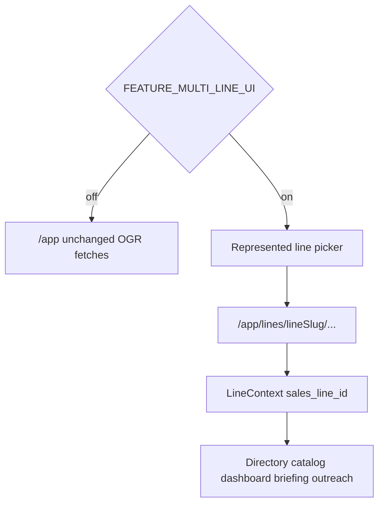

# Phase 2 — Line Context and Line-Scoped Reads (implementation plan)

**Status:** Ready for implementation approval  
**Date:** 2026-08-14  
**Branch:** `feature/multi-line-multi-territory-implementation`  
**Prerequisites:** Phase 1A–1C complete locally (`…100000` through `…130000`); staff UI still OGR-global

**Sources of truth (do not redesign architecture):**

- [docs/epics/multi-line-multi-territory-crm.md](../docs/epics/multi-line-multi-territory-crm.md) Phase 2, §4 picker rules, §7 workflow, §11 flags
- [docs/multi-line-territory-audit.md](../docs/multi-line-territory-audit.md) §7.1–§7.4 routes / header / badges
- [docs/plans/multi-line-phase-1-schema-foundation.md](../docs/plans/multi-line-phase-1-schema-foundation.md) (Phase 1 complete; dual-write in place)
- [plan/multi-line-phase-1c-dual-write.md](multi-line-phase-1c-dual-write.md) (legacy writes remain 1C-protected)

This document is the **agent-executable** Phase 2 implementation brief. Follow it exactly. Do not change legacy write paths. Do not begin Phase 3.

---

## Locked decisions (no agent discretion)

| Decision                         | Choice                                                                                                                      |
| -------------------------------- | --------------------------------------------------------------------------------------------------------------------------- |
| Scope                            | **Reads and navigation only.** Legacy writes stay unchanged and 1C-protected                                                |
| Feature flag                     | `FEATURE_MULTI_LINE_UI` — **server env**, default **off**, not `PUBLIC_`                                                    |
| Flag off                         | Current `/app` UX unchanged: OGR-only, no picker, no new routes required                                                    |
| Represented picker (flag on)     | `ogr` (live), `eagle-peak` (onboarding), `big-fish` (confirmed). **Exclude** `bkg`, `prospective`, `declined`, `terminated` |
| Routes (flag on)                 | Audit §7.1 line-prefixed paths. Compatibility aliases for `?tab=` / `?prospectId=` / `?sku=` / `?draftId=`                  |
| Prospective Lines routes         | **Out of scope** (Phase 8)                                                                                                  |
| Territory admin CRUD             | **Out of scope** (Phase 5). Phase 2 may add **read-only** territories list                                                  |
| Line-scoped reads (flag on)      | Prospects, accounts, contacts, catalog, dashboard, briefing, outreach **GET**s, calls, insights — all take `sales_line_id`  |
| Empty books                      | Eagle Peak / Big Fish show **zero** operational rows — never fall back to OGR                                               |
| OGR reconciliation               | Flag on + slug `ogr` list counts must match flag-off / pre-change OGR counts                                                |
| Cross-line badges                | `{ lineName, relationship_status }` only — no orders, revenue, notes, scores, KPIs, buyers, or tasks                        |
| AI / prompts                     | **No changes** (Phase 4)                                                                                                    |
| Account cloning                  | **Forbidden** — no Eagle Peak / Big Fish clones from OGR                                                                    |
| Hosted / staging / production DB | **Forbidden**                                                                                                               |
| Commit / push / deploy           | **Forbidden** unless the user separately asks after implementation                                                          |

---

## Non-goals / Phase 3+ exclusions

Do **not** in Phase 2:

- Change convert / demote / notes / contact CRUD / `insertOrder` / `LogCallModal` / reorder upsert / outreach prep or send
- Introduce `FEATURE_MULTI_LINE_WRITES` or write to line accounts as the UI source of truth
- Stop writing line-specific fields onto `prospects` (still dual-write while UI writes legacy)
- Clone OGR accounts onto Eagle Peak or Big Fish
- Put Prospective Lines in the represented picker or implement `/app/prospective-lines*`
- Blend orders, revenue, notes, scoring, or KPIs across lines
- Change AI prompts, agent tools, or fill-blanks line isolation (Phase 4)
- Territory admin CRUD (Phase 5)
- Eagle Peak / Big Fish selling or outreach flags (Phases 6–7)
- Touch hosted databases
- Commit or push unless the user separately asks

Those remain **Phase 3+**.

---

## Reinspection snapshot (plan authorship)

| Check                   | Result                                                                                                       |
| ----------------------- | ------------------------------------------------------------------------------------------------------------ |
| Branch                  | `feature/multi-line-multi-territory-implementation`                                                          |
| HEAD at plan authorship | `8dc6c9f` (Phase 1C committed)                                                                               |
| Phase 1 migrations      | Present: `…100000` through `…130000`                                                                         |
| Phase 2 plan / routes   | **Absent** before this plan file (`/app/lines/*`, `FEATURE_*` runtime flags)                                 |
| Staff shell             | `/app` → `AuthGate` → `RepCommandCenter`; tabs in React state; query params mount-only                       |
| Header / `LineKey`      | OGR hardcoded; `LineKey = 'ogr' \| 'bkg'`                                                                    |
| Reads                   | Global / OGR-hardcoded (`fetchProspects`, `fetchCatalogItems` via `code='ogr'`, unscoped briefing/dashboard) |
| Writes                  | Legacy tables + Phase 1C dual-write — **must not change**                                                    |

If implementing agents find Phase 1C dual-write missing, or Eagle Peak / Big Fish already have operational accounts, **stop** and report — do not guess.

---

## 1. Ordered implementation steps

1. Confirm branch + Phase 1A–1C migrations exist; ensure this plan file is the Phase 2 brief.
2. Record baseline OGR counts (local disposable DB and/or fixture expectations) for reconciliation (§8).
3. Add `FEATURE_MULTI_LINE_UI` server helper + approved-staff `/api/staff/features` snapshot (§4).
4. Extend `LINE_SELECT` / `fetchRepresentedLines` / line-context types (§5).
5. Add line context provider + Header picker (flag on only) (§5–§6).
6. Add `/app/lines/[lineSlug]/…` Astro wrappers + compatibility alias behavior (§6).
7. Parameterize read libs and staff **GET** outreach routes by `sales_line_id` (§7).
8. Wire tabs to consume line context; unmount prior book on line switch (§5).
9. Add cross-line badge **read** helper + empty-safe chip UI (§7.4).
10. Add Vitest coverage for flag off/on, OGR count reconciliation, empty books, picker exclusions, badges (§8).
11. Run `npm run check`.
12. Append a short **Implementation results — Phase 2** note to the foundation plan or epic status (results only; no architecture rewrite).
13. **Stop.** Do not commit/push unless asked. Do not start Phase 3.

---

## 2. Exact files to create or modify

### Create

| File                                                         | Role                                                               |
| ------------------------------------------------------------ | ------------------------------------------------------------------ |
| `src/lib/staffFeatures.ts`                                   | Read `FEATURE_MULTI_LINE_UI` (and document-only siblings) from env |
| `src/pages/api/staff/features.ts`                            | Approved-staff GET snapshot (no secrets; no `PUBLIC_` flag)        |
| `src/lib/lineContext.tsx` (or `.ts` + provider component)    | Selected `sales_line_id` / slug / status / name; unmount on switch |
| `src/lib/retailerLineAccounts.ts`                            | Line-scoped directory reads + cross-line badge helper              |
| `src/pages/app/lines/[lineSlug]/index.astro` (+ nested)      | Line home / tab wrappers per §6                                    |
| `src/lib/multiLinePhase2Reads.test.ts` (and/or focused libs) | Flag, picker, scoped reads, count reconciliation                   |

Nested Astro pages (flag-on routes) — create as needed to match audit §7.1:

- `src/pages/app/lines/index.astro` — portfolio / picker landing
- `src/pages/app/lines/[lineSlug]/index.astro` — line home
- `src/pages/app/lines/[lineSlug]/briefing.astro`
- `src/pages/app/lines/[lineSlug]/prospects.astro`
- `src/pages/app/lines/[lineSlug]/accounts.astro`
- `src/pages/app/lines/[lineSlug]/accounts/[lineAccountId].astro` (read/detail only)
- `src/pages/app/lines/[lineSlug]/contacts.astro`
- `src/pages/app/lines/[lineSlug]/catalog.astro`
- `src/pages/app/lines/[lineSlug]/dashboard.astro`
- `src/pages/app/lines/[lineSlug]/territories.astro` — **read-only** list (no CRUD)

Optional thin wrappers may all render `AuthGate` / `RepCommandCenter` with line slug from params rather than duplicating tab UI.

### Modify

| File                                                   | Change                                                                                                                                                 |
| ------------------------------------------------------ | ------------------------------------------------------------------------------------------------------------------------------------------------------ |
| `src/lib/lines.ts`                                     | Extend `LINE_SELECT`; add `fetchRepresentedLines`; keep `fetchActiveLines` public-portfolio semantics                                                  |
| `src/types/index.ts`                                   | Expand `LineKey` for represented codes used by UI (`ogr`, `eagle-peak`, `big-fish`)                                                                    |
| `src/components/Header.tsx`                            | Real picker when flag on; status badges                                                                                                                |
| `src/components/auth/AuthGate.tsx`                     | Load features; pass line slug / flag into shell                                                                                                        |
| `src/components/RepCommandCenter.tsx`                  | Line-scoped directory reload; wire picker; unmount on switch                                                                                           |
| `src/lib/prospects.ts`                                 | Line-scoped fetch via `retailer_line_accounts` when flag/context on                                                                                    |
| `src/lib/catalog.ts` / `catalogSettings.ts`            | Parameterize by `lineId` / `lineCode` (stop hardcoding `ogr` when scoped)                                                                              |
| `src/lib/accountContacts.ts`                           | Filter contacts by line-account membership for reads                                                                                                   |
| `src/lib/calls.ts`                                     | Add `line_id` / `retailer_line_account_id` to **select**; filter reads                                                                                 |
| `src/lib/orders.ts`                                    | **Fetch-only** filter by line / RLA (do not change `insertOrder`)                                                                                      |
| Outreach read libs                                     | `outreachBriefing.ts`, `outreachLeadLists.ts`, `outreachGoalDashboard.ts`, `outreachProductSelection.ts`, related GET helpers — accept `sales_line_id` |
| `src/pages/api/staff/outreach/briefing.ts`, `leads.ts` | Accept `sales_line_id` / slug query; reject unknown lines                                                                                              |
| Tab components                                         | Consume line context for reads only                                                                                                                    |

### Do not touch

- `src/lib/convertToActiveAccount.ts`, `ConvertAccountModal.tsx`
- `insertOrder` callers (`AccountOrderHistoryModal.tsx`) — write path
- `LogCallModal.tsx` write path
- Phase 1C migration / dual-write triggers
- `src/pages/api/agent.ts`, `agentCrmTools.ts` prompts (Phase 4)
- Public RPCs / wholesale showroom
- Historical migrations; hosted DBs
- `database.ts` unless a type-only select expand is required for new columns already present

---

## 3. Feature-flag rollout and rollback

### 3.1 Flag definition

| Env var                 | Type   | Default   | Effect                                    |
| ----------------------- | ------ | --------- | ----------------------------------------- |
| `FEATURE_MULTI_LINE_UI` | server | off/falsy | Enables picker, line routes, scoped reads |

Never expose as `PUBLIC_FEATURE_MULTI_LINE_UI` if it could be confused with a secret; staff UI obtains a boolean via `/api/staff/features` under `requireApprovedStaffClient`.

Truthy values: `1`, `true`, `yes`, `on` (case-insensitive). Everything else = off.

### 3.2 Dual-read behavior



| Mode     | Behavior                                                                                                          |
| -------- | ----------------------------------------------------------------------------------------------------------------- |
| Flag off | Keep today’s functions; hardcoded OGR catalog; unscoped briefing/dashboard; Header OGR button (current UX)        |
| Flag on  | Context provider + picker; line routes; reads join `retailer_line_accounts` / catalog `line_id` for selected line |

### 3.3 Rollback

1. Set `FEATURE_MULTI_LINE_UI` off (or unset) in the environment.
2. Staff `/app` returns to OGR-only behavior without code revert.
3. Line-prefixed URLs may 404 or redirect to `/app` when flag off — document chosen behavior in implementation results; prefer **redirect to `/app`** with optional `?tab=` preserved.
4. Do **not** reverse Phase 1 migrations to roll back Phase 2 UI.

---

## 4. Line-context ownership and propagation

### 4.1 Owner

Staff React **LineContext** provider (new) owns:

- `sales_line_id` (uuid)
- `lineSlug` / `code` (`ogr` | `eagle-peak` | `big-fish`)
- `status` (`active` | `onboarding` | `confirmed`)
- `name`
- `loading` / `error`

### 4.2 Source of truth

| Surface                        | Rule                                                                             |
| ------------------------------ | -------------------------------------------------------------------------------- |
| Flag on + `/app/lines/:slug/…` | URL slug is source of truth                                                      |
| Flag on + `/app`               | Resolve last-used slug from `sessionStorage`, else `ogr`                         |
| Compatibility query params     | `?tab=` / `?prospectId=` / `?sku=` / `?draftId=` apply **after** line resolution |
| Flag off                       | No provider required; existing shell behavior                                    |

Persist last-used slug on successful line select (`sessionStorage` key e.g. `rcc.lastLineSlug`).

### 4.3 Switch semantics

- Switching lines **unmounts** the previous line’s lists and drawers (audit §7.2).
- Do not keep the prior book in memory as the visible list.
- Pass `sales_line_id` into read libs and staff outreach **GET** handlers only.
- Do **not** add `sales_line_id` to convert / order / call **writes** in Phase 2.

### 4.4 Loading / invalid / unauthorized

| Case                    | Behavior                                                                  |
| ----------------------- | ------------------------------------------------------------------------- |
| Loading line metadata   | Existing AuthGate / shell spinner                                         |
| Unknown / excluded slug | Staff 404 page or inline “Unknown line” (e.g. `bkg`, `prospective`, typo) |
| Represented but empty   | Empty book UI — not an error                                              |
| Staff auth              | v1: any `is_approved_staff()` may open represented lines                  |
| Prospective URLs        | Out of scope — treat as unknown (404)                                     |
| Staff-line RLS          | **Not** in Phase 2                                                        |

---

## 5. Represented-line picker

### 5.1 Membership

`fetchRepresentedLines()`:

```sql
-- Conceptual filter (implement via Supabase query)
status in ('active', 'onboarding', 'confirmed')
-- and code in ('ogr', 'eagle-peak', 'big-fish') for v1 seed set
-- exclude: bkg, prospective, declined, terminated
```

| Code         | Status       | Badge      |
| ------------ | ------------ | ---------- |
| `ogr`        | `active`     | Live       |
| `eagle-peak` | `onboarding` | Onboarding |
| `big-fish`   | `confirmed`  | Confirmed  |

### 5.2 Header UX (flag on)

- Replace no-op OGR-only button with picker / segmented control.
- Show status badge per selected line.
- Optional read-only territory chips from `sales_line_territories` (OGR: bc/or/wa; Eagle Peak: or/wa/norcal; Big Fish: none).
- Subtitle may reflect selected line name; do not invent “British Columbia” as rights for non-OGR lines.

### 5.3 Extend `LINE_SELECT`

Include Phase 1 columns needed by the picker: at least `status`, and optionally `principal_id`, `default_currency`. Keep `fetchActiveLines()` / public portfolio semantics as `active = true` (OGR-only public) — do **not** redefine public RPCs in Phase 2.

Expand `LineKey` in `src/types/index.ts` to represented UI codes (drop unused `bkg` from picker types or keep but never select).

---

## 6. Routes and legacy compatibility

### 6.1 Flag-on routes (audit §7.1)

```
/app                              → last-used line or redirect into /app/lines/:slug
/app/lines                        → portfolio (represented lines)
/app/lines/:lineSlug              → line home (status, read-only territories, KPIs shell)
/app/lines/:lineSlug/briefing
/app/lines/:lineSlug/prospects
/app/lines/:lineSlug/accounts
/app/lines/:lineSlug/accounts/:lineAccountId   → detail; 404 if RLA belongs to another slug
/app/lines/:lineSlug/contacts
/app/lines/:lineSlug/catalog
/app/lines/:lineSlug/territories  → read-only
/app/lines/:lineSlug/dashboard
```

**Do not implement in Phase 2:**

- `/app/retailers/:retailerId` portfolio identity page (may stub later; not required for exit)
- `/app/prospective-lines*` (Phase 8)
- Territory admin mutations (Phase 5)

### 6.2 Compatibility aliases

Keep `/app?tab=&prospectId=&sku=&draftId=` working:

- Flag off: current behavior (mount-only tab/deep links).
- Flag on: resolve line (last-used or `ogr`), then apply query params to the line-scoped shell. Prefer redirecting into `/app/lines/:slug?tab=…` so the URL becomes canonical without breaking bookmarks.

Tab changes may begin writing the URL under flag on (optional improvement); must not break flag-off mount-only behavior.

### 6.3 Account detail isolation

`/app/lines/:lineSlug/accounts/:lineAccountId` must **404** when the RLA’s `sales_line_id` does not match the slug’s line (epic §10 item 4).

---

## 7. Line-scoped reads

### 7.1 Directory (prospects / accounts)

When flag on + context set:

- Fetch `retailer_line_accounts` for `sales_line_id` where `relationship_status <> 'terminated'`.
- Join identity from `prospects` (`retailer_id = prospects.id`) for name/city/address/etc.
- **Prospects tab:** RLAs with relationship mapped from/filterable as prospect-side statuses (e.g. `prospect`, and any non-opened planning states used by UI).
- **Accounts tab:** RLAs with `relationship_status = 'opened'` (maps from legacy `active_account`).
- OGR: counts must equal flag-off `fetchProspects` / active-account splits (reconciliation §8).
- Eagle Peak / Big Fish: **empty arrays** (zero RLAs seeded).

Do not show OGR rows when `sales_line_id` is Eagle Peak or Big Fish.

### 7.2 Contacts

- Read contacts linked via `retailer_line_contacts` for RLAs of the current line, **or** `account_contacts` filtered to retailers that have a non-terminated RLA on the current line (pick one approach and test it; prefer junction when present).
- Empty for Eagle Peak / Big Fish.

### 7.3 Catalog / line sheet

- `fetchCatalogItems({ lineId })` / settings by `line_id`.
- OGR: same items as today’s `code='ogr'` filter.
- Eagle Peak / Big Fish: empty until Phase 6 catalog import — **empty book, not OGR catalog**.

### 7.4 Calls / insights / orders (reads)

- Filter by `line_id = sales_line_id` and/or `retailer_line_account_id` in current line’s RLA set.
- Extend `CALL_SELECT` to include `line_id` / `retailer_line_account_id` for filtering — **read only**.
- `fetchOrdersForAccounts`: restrict to orders for accounts in the current line book (and/or `retailer_line_account_id`).
- Do not change `insertOrder` or Log Call insert payloads.

### 7.5 Dashboard / briefing / outreach GET

| Surface                      | Phase 2 rule                                                                                                                                                       |
| ---------------------------- | ------------------------------------------------------------------------------------------------------------------------------------------------------------------ |
| PMF Dashboard                | Scope calls / conversion snapshots to current `sales_line_id`                                                                                                      |
| Daily Briefing GET           | Require/accept `sales_line_id`; empty lists for EP/BF                                                                                                              |
| Outreach leads GET           | Same                                                                                                                                                               |
| Outreach product pool (read) | Filter catalog by current line (OGR-only products for `ogr`)                                                                                                       |
| Outreach prep POST / send    | **Unchanged** (still OGR write behavior; Phase 3 / Phase 6)                                                                                                        |
| Goal settings singleton      | Read may remain global in Phase 2 **only if** dashboard clearly labels OGR; prefer scoping reads to OGR when line is `ogr` and returning empty/zero KPIs for EP/BF |

**No blended portfolio revenue.** Default dashboards stay in-line.

### 7.6 Cross-line badge reads

```ts
// Conceptual return type — name + status only
type CrossLineBadge = {
  lineCode: string;
  lineName: string;
  relationshipStatus: string;
};
```

- Input: `retailerId` + current `salesLineId`.
- Query other non-terminated `retailer_line_accounts` for that retailer.
- UI: chip `Also {lineName}` or `N lines`; click switches line context (navigate to other slug).
- **Forbidden in payload:** orders, notes, scores, buyers, tasks, revenue, KPIs.
- With current seeds badges will not appear until a future non-OGR RLA exists — still ship helper + empty-safe UI.

### 7.7 Messages / calendar

- Lower priority: may remain globally listed in Phase 2 if already prospect-linked, but must not invent cross-line commercial panels.
- Do not block Phase 2 exit on full Gmail/Calendar line isolation if directory/catalog/dashboard/briefing are scoped; document residual risk (audit §7.4 / §10) in results note.
- Prefer filtering message thread lists by `retailer_line_account_id` / prospect-in-current-book when inexpensive.

---

## 8. Tests and count reconciliation

### 8.1 Baseline (record before/after)

On local disposable DB (or stable fixtures):

```sql
select count(*) from prospects; -- expect 607 locally after 1B
select account_status, count(*) from prospects group by 1;
select count(*) from catalog_items ci
  join lines l on l.id = ci.line_id where l.code = 'ogr';
select count(*) from retailer_line_accounts rla
  join lines l on l.id = rla.sales_line_id where l.code = 'ogr';
select count(*) from retailer_line_accounts rla
  join lines l on l.id = rla.sales_line_id where l.code in ('eagle-peak','big-fish');
-- expect 0 for eagle-peak / big-fish
```

### 8.2 Required automated tests

| #   | Assertion                                                                      |
| --- | ------------------------------------------------------------------------------ |
| 1   | Flag off: represented picker / line routes not required; OGR fetches unchanged |
| 2   | Flag on + `ogr`: prospect/account/catalog counts match flag-off                |
| 3   | Flag on + `eagle-peak`: zero RLAs / empty directory / empty catalog            |
| 4   | Flag on + `big-fish`: same empty book                                          |
| 5   | Picker query excludes `bkg` and `prospective`                                  |
| 6   | Invalid slug → unknown-line handling                                           |
| 7   | Cross-line badge helper returns only name + relationship status                |
| 8   | Account detail for wrong `lineSlug` does not resolve (404 / null)              |
| 9   | No write-path files modified as part of Phase 2 (optional snapshot test)       |

### 8.3 Commands

```bash
npx vitest run src/lib/multiLinePhase2Reads.test.ts
# plus any focused lib tests touched
npm run check
```

No new Playwright suite required unless existing e2e already covers `/app`.

---

## 9. Completion criteria

Phase 2 is complete when all are true:

- [ ] `FEATURE_MULTI_LINE_UI` server flag + `/api/staff/features` snapshot exist; default off
- [ ] Flag off: `/app` behavior and OGR counts unchanged
- [ ] Flag on: represented picker shows OGR / Eagle Peak / Big Fish with correct badges; excludes prospective/`bkg`
- [ ] Line-prefixed routes work; legacy `?tab=` / `?prospectId=` aliases resolve
- [ ] Directory, catalog, dashboard, briefing, outreach **GET**s take `sales_line_id`
- [ ] Eagle Peak / Big Fish books empty — no OGR leakage
- [ ] OGR flag-on counts reconcile to flag-off
- [ ] Cross-line badge reads are name+status only
- [ ] Invalid line slug handled; wrong-line account id does not open
- [ ] No convert/order/call/contact write changes; no AI prompt changes
- [ ] No hosted DB access; no Eagle Peak/Big Fish cloning
- [ ] Vitest + `npm run check` pass
- [ ] Short implementation-results note appended
- [ ] No commit/push unless separately requested

---

## 10. Explicit Phase 3 write exclusions (remainder)

Out of scope until a separate Phase 3 request:

- `FEATURE_MULTI_LINE_WRITES`
- Writes originating on `retailer_line_accounts` / junction as source of truth
- Convert / demote / notes / contacts / orders / calls / reorder **per line**
- Stop writing line-specific fields onto `prospects` except dual-write while flag on
- Full isolation test: converting an Eagle Peak test account cannot flip OGR `account_status`
- AI isolation (Phase 4)
- Territory admin CRUD (Phase 5)
- Eagle Peak / Big Fish selling & outreach flags (Phases 6–7)
- Prospective Lines UI (Phase 8)

---

## 11. Implementation outline (for the implementing agent)

1. Header comment / PR description: Phase 2 reads+nav only; flag default off; no write cutover.
2. `staffFeatures` + `/api/staff/features`.
3. `lines.ts` represented fetch + `LINE_SELECT` expand.
4. `lineContext` provider; Header picker; sessionStorage last slug.
5. Astro `/app/lines/...` wrappers reusing shell.
6. `retailerLineAccounts.ts` directory + badge helper.
7. Parameterize catalog / prospects / contacts / calls / orders **fetch** / outreach GET / dashboard.
8. Wire `RepCommandCenter` reload keyed by `sales_line_id`; unmount on switch.
9. Tests + reconciliation + `npm run check`.
10. Results note; **stop**.

Preserve all existing IDs. Prefer surgical edits over shell rewrites. Keep Phase 1C dual-write intact.

---

**Stop after Phase 2 implementation and local validation.** Do not begin Phase 3. Do not commit, push, or deploy unless the user separately asks.
