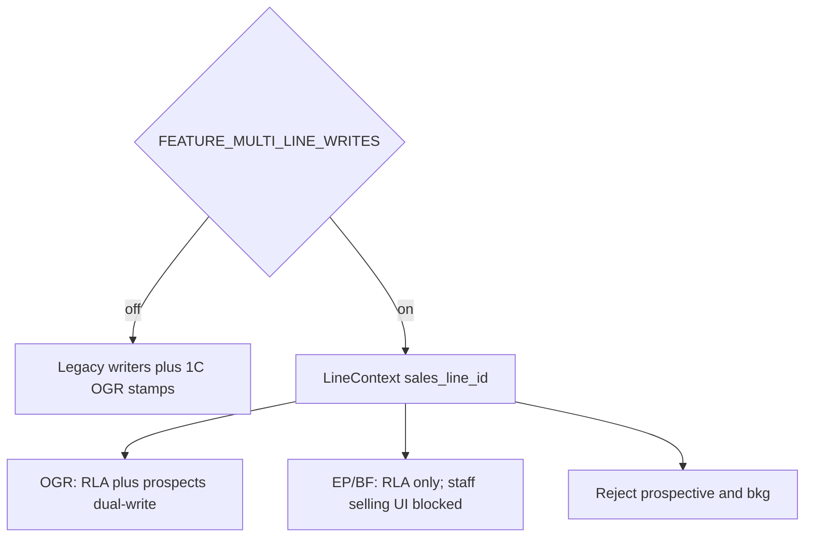

# Phase 3 — Writes on Line Accounts (implementation plan)

**Status:** Ready for implementation approval  
**Date:** 2026-08-14  
**Branch:** `feature/multi-line-multi-territory-implementation`  
**Prerequisites:** Phase 1A–1C complete locally (`…100000` through `…130000`); Phase 2 line-context reads complete (`FEATURE_MULTI_LINE_UI`, `/app/lines/*`, scoped reads)

**Sources of truth (do not redesign architecture):**

- [docs/epics/multi-line-multi-territory-crm.md](../docs/epics/multi-line-multi-territory-crm.md) Phase 3, §4 selling table, §9 expand/contract, §10 isolation tests, §11 `FEATURE_MULTI_LINE_WRITES`
- [docs/plans/multi-line-phase-1-schema-foundation.md](../docs/plans/multi-line-phase-1-schema-foundation.md) (Phase 1 complete; dual-write in place; Phase 2 results recorded)
- [plan/multi-line-phase2-line-context-reads.md](multi-line-phase2-line-context-reads.md) (reads/nav shipped; write paths explicitly left 1C-protected)
- [plan/multi-line-phase-1c-dual-write.md](multi-line-phase-1c-dual-write.md) (one-way prospects → OGR RLA; do not rewrite `…130000`)

This document is the **agent-executable** Phase 3 implementation brief. Follow it exactly. Do not begin Phase 4. Do not introduce Eagle Peak / Big Fish selling or outreach flags.

---

## Locked decisions (no agent discretion)

| Decision                            | Choice                                                                                                                                                                                                                           |
| ----------------------------------- | -------------------------------------------------------------------------------------------------------------------------------------------------------------------------------------------------------------------------------- |
| Scope                               | **Writes on line accounts** as source of truth when `FEATURE_MULTI_LINE_WRITES` is on. Phase 2 reads stay as shipped                                                                                                             |
| Feature flag                        | `FEATURE_MULTI_LINE_WRITES` — **server env**, default **off**, not `PUBLIC_`. Snapshot via existing `/api/staff/features`                                                                                                        |
| Flag off                            | Today’s writers unchanged; Phase 1C dual-write remains the OGR compatibility path                                                                                                                                                |
| Flag on + `ogr`                     | Write RLA (`relationship_status`, notes, convert/demote dates) **and** keep writing `prospects` commercial fields so rollback still has a populated retailer row (epic §9.2). Stamp `line_id` + `retailer_line_account_id`       |
| Flag on + `eagle-peak` / `big-fish` | Write **RLA only**. Never write `prospects.account_status`, `converted_at`, line notes, scoring, or planning onto the shared retailer. Staff **selling UI** stays **blocked** until Phase 6/7 flags — **do not add those flags** |
| Isolation test                      | Local disposable Eagle Peak **test** RLA + convert via lib (not staff selling UI). Must not flip OGR `prospects.account_status`. Delete test rows after                                                                          |
| Empty books                         | Eagle Peak / Big Fish remain empty unless records are **deliberately** created for those lines (isolation test only in Phase 3)                                                                                                  |
| Prospective / `bkg`                 | Hard-block operational RLA / orders / calls / convert / contacts-junction / outreach-goal writes (DB + app)                                                                                                                      |
| Account cloning                     | **Forbidden** — do not copy OGR prospects/orders onto Eagle Peak or Big Fish                                                                                                                                                     |
| Currency                            | Preserve original transaction currency. Never invent USD on OGR. Never implicit CAD/USD blend or fold Eagle Peak USD into OGR `total_amount_cad` LTV                                                                             |
| Outreach prep / send                | **Unchanged** (still OGR). Phase 6 `FEATURE_EAGLE_PEAK_OUTREACH` / Phase 7 Big Fish outreach                                                                                                                                     |
| Outreach goals                      | Per-line when writes flag on: OGR keeps current singleton values; Eagle Peak / Big Fish have no goal row (empty/zero)                                                                                                            |
| Messages / calendar lists           | **Do not** line-filter the global inbox/calendar UI (Phase 2 residual). Phase 3 only **stamps** `retailer_line_account_id` on **new** link writes when context is known                                                          |
| Cross-line badges                   | Already shipped in Phase 2 — name + `relationship_status` only; do not expand payload                                                                                                                                            |
| AI / prompts                        | **No changes** (Phase 4)                                                                                                                                                                                                         |
| Territory admin CRUD                | **Out of scope** (Phase 5)                                                                                                                                                                                                       |
| Hosted / staging / production DB    | **Forbidden**                                                                                                                                                                                                                    |
| Phase 1C migration                  | **Do not rewrite** `…130000`. Keep one-way prospects → OGR RLA                                                                                                                                                                   |
| Commit / push / deploy              | **Forbidden** unless the user separately asks after implementation                                                                                                                                                               |



---

## Non-goals / later-phase exclusions

Do **not** in Phase 3:

- Introduce `FEATURE_EAGLE_PEAK_SELLING`, `FEATURE_EAGLE_PEAK_OUTREACH`, `FEATURE_EAGLE_PEAK_PUBLIC_CATALOG`, or Big Fish equivalents (Phases 6–7)
- Enable staff convert / orders / calls / reorder / line-junction contacts on Eagle Peak or Big Fish in the UI
- Change AI prompts, agent tools, fill-blanks, enrich, or research-update (Phase 4)
- Territory admin CRUD (Phase 5)
- Prospective Lines UI / `retailer_line_targets` writers (Phase 8)
- Rewrite or drop Phase 1C dual-write triggers (Phase 9)
- Rename `prospects` → `retailers` or drop dual-write columns (Phase 9)
- Line-filter Messages / Calendar / Gmail inbox lists (residual; not Phase 4–8)
- Staff-line RLS / `staff_line_memberships` (Phase 9 optional)
- Clone OGR accounts onto Eagle Peak or Big Fish
- Invent Big Fish commercial terms, USD on OGR rows, or blended CAD/USD LTV
- Change public RPCs / wholesale showroom
- Touch hosted databases
- Begin Phase 4
- Commit or push unless the user separately asks

---

## Reinspection snapshot (plan authorship)

| Check                    | Result                                                                                                                                                |
| ------------------------ | ----------------------------------------------------------------------------------------------------------------------------------------------------- |
| Branch                   | `feature/multi-line-multi-territory-implementation`                                                                                                   |
| HEAD at plan authorship  | `6b0d8d9` (Phase 2 reads + Copilot follow-up **committed and pushed**)                                                                                |
| Phase 1 migrations       | Present: `…100000` through `…130000`                                                                                                                  |
| Phase 2                  | Complete: `FEATURE_MULTI_LINE_UI`, `/app/lines/*`, scoped directory/catalog/dashboard/briefing/contacts/calls/orders **reads**, badges, isolation 404 |
| `staffFeatures.ts`       | **Only** `FEATURE_MULTI_LINE_UI`. `FEATURE_MULTI_LINE_WRITES` absent (expected)                                                                       |
| `outreach_goal_settings` | Global singleton — **no** `sales_line_id` (additive migration required)                                                                               |
| Convert / order UI       | Still `resolveOgrLineId()` in `ConvertAccountModal.tsx` / `AccountOrderHistoryModal.tsx`                                                              |
| App RLA / RLC writes     | **None.** 1C triggers stamp OGR RLA / junction / `retailer_line_account_id` on operational inserts                                                    |
| Call insert              | Inline in `LogCallModal.tsx` — `prospect_id` only; no `line_id` / RLA in payload                                                                      |
| `insertOrder`            | `account_id` + optional `line_id`; never passes `retailer_line_account_id`; omits original-currency columns                                           |
| Messages / calendar      | Global prospect-linked lists (Phase 2 residual). Link upserts do not set RLA in app code                                                              |
| Epic header              | Still says “documentation only” — **stale**; 1A–1C + Phase 2 exist                                                                                    |
| Phase 2 results note     | Still says “no commit/push”; later user-requested push supersedes that sentence                                                                       |

**Accepted Phase 2 recorded results (do not retest as a Phase 3 gate):** 607 prospects; 607 OGR RLAs; 190 OGR catalog items; Eagle Peak / Big Fish / BKG RLA = 0; Vitest + `npm run check` passed.

If implementing agents find Phase 1C dual-write missing, or Eagle Peak / Big Fish already have operational accounts **before** Phase 3 starts, **stop** and report — do not guess.

---

## Line-isolation rules (must hold)

1. Every convert / demote / notes / contact-junction / order / call / reorder / link-stamp / goal **write** takes `sales_line_id` (and `retailer_line_account_id` when the row exists).
2. Resolve RLA by `(retailer_id, sales_line_id)` where `relationship_status <> 'terminated'`. Wrong-line id → 404 / reject.
3. Do not write orders, calls, notes, scores, tasks, outreach goals, or financials onto another line’s RLA.
4. Do not write non-OGR commercial lifecycle onto `prospects` (`account_status`, `converted_at`, line notes, scoring, planning).
5. OGR flag-on writes **may** still update `prospects` commercial fields (rollback / 1C compat). That is OGR-only.
6. Cross-line badges remain `{ lineName, relationship_status }` only.
7. Converting an Eagle Peak **test** account must not change any OGR `prospects.account_status` or OGR RLA commercial columns.
8. Prospective / `bkg` / `declined` / `terminated` lines must not receive operational RLA, orders, calls, convert, junction, or goal rows.
9. `line_id` on an order/call must match the RLA’s `sales_line_id`. Disagree → reject.
10. Original currency on new orders/calls is the **line’s** `default_currency` (OGR = CAD). Never copy another line’s amount into OGR `total_amount_cad`.

---

## 1. Ordered implementation steps

1. Confirm branch + Phase 1A–1C + Phase 2 exist; this plan file is the Phase 3 brief.
2. Record local baseline (accept 607 / 190 / EP-BF = 0). **Stop** if EP/BF RLAs already exist or 1C is missing.
3. Add `FEATURE_MULTI_LINE_WRITES` to `staffFeatures` + `/api/staff/features` snapshot (default off).
4. Additive local migration: `outreach_goal_settings.sales_line_id` + write-guard triggers; mirror in `schema.sql`; type-only `database.ts` update.
5. RLA write helpers + selling-status gate (`ogr` allowed in staff UI; EP/BF UI blocked; prospective/`bkg` reject).
6. Convert / demote / notes / contacts-junction / `insertOrder` / `LogCallModal` / reorder / attribution — parameterized by `sales_line_id`.
7. Stamp `retailer_line_account_id` on **new** Gmail / Calendar / thread-link writes when line context is known. Do **not** filter Messages/Calendar lists.
8. Per-line outreach goal GET/PATCH; leave prep POST / send / cron unchanged.
9. Isolation + guard + currency + flag-off Vitest; local SQL reconciliation; `npm run check`.
10. Append **Implementation results — Phase 3** to the foundation plan (results only).
11. **Stop.** Do not commit/push unless asked. Do not start Phase 4.

---

## 2. Exact files to create or modify

### Create

| File                                                                    | Role                                                                                                                                |
| ----------------------------------------------------------------------- | ----------------------------------------------------------------------------------------------------------------------------------- |
| `supabase/migrations/20260815NNNNNN_multi_line_phase3_write_guards.sql` | Additive: `outreach_goal_settings.sales_line_id` (unique per line); backfill existing singleton to OGR; BEFORE INSERT/UPDATE guards |
| `src/lib/multiLinePhase3Writes.test.ts`                                 | Flag off/on, OGR dual-write, EP isolation, prospective/`bkg` reject, currency, wrong-line reject                                    |

Use the next available `YYYYMMDDHHMMSS` timestamp after `20260814130000` (do not reuse Phase 1 versions). Apply **local disposable DB only**.

### Modify

| File                                                 | Change                                                                                                                                  |
| ---------------------------------------------------- | --------------------------------------------------------------------------------------------------------------------------------------- |
| `src/lib/staffFeatures.ts`                           | Add `FEATURE_MULTI_LINE_WRITES` (same truthy parser as UI flag)                                                                         |
| `src/pages/api/staff/features.ts`                    | Include the new boolean in the snapshot (no secrets)                                                                                    |
| `src/lib/retailerLineAccounts.ts`                    | Ensure/open/update RLA; junction write helper; `assertLineAllowsOperationalWrite`                                                       |
| `src/lib/convertToActiveAccount.ts`                  | Accept `salesLineId`; OGR: RLA `opened` + `prospects.account_status`; non-OGR: RLA only                                                 |
| `src/components/ConvertAccountModal.tsx`             | Pass current line from context; stop hardcoding `resolveOgrLineId()` when writes flag on; hide/disable for EP/BF                        |
| `src/components/AccountDetailDrawer.tsx`             | Demote: OGR dual-write vs RLA-only; block EP/BF selling UI                                                                              |
| `src/lib/prospects.ts`                               | `updateProspectNotes`: OGR writes both; non-OGR writes RLA `notes` only                                                                 |
| `src/lib/accountContacts.ts`                         | When writes flag on, also write `retailer_line_contacts` for the current RLA                                                            |
| `src/lib/orders.ts`                                  | `insertOrder`: require `line_id` + `retailer_line_account_id`; set original currency from line; **do not** change Phase 2 fetch filters |
| `src/components/AccountOrderHistoryModal.tsx`        | Pass current line / RLA; stop OGR-only resolve when writes flag on; block EP/BF                                                         |
| `src/components/LogCallModal.tsx`                    | Stamp `line_id` + RLA; OGR CAD estimate unchanged; block EP/BF selling UI                                                               |
| `src/lib/accountReorderSettings.ts`                  | Stamp RLA on upsert when writes flag on                                                                                                 |
| `src/lib/google/gmailThreadLinks.ts`                 | Stamp RLA on **new** confirmed links when `sales_line_id` known                                                                         |
| `src/lib/google/calendarEventLinks.ts`               | Same                                                                                                                                    |
| `src/lib/messages.ts`                                | `confirmThreadMapping`: stamp RLA when context known; do not filter thread **lists**                                                    |
| `src/lib/outreachGoals.ts`                           | Read/write by `sales_line_id` when writes flag on; OGR = existing row                                                                   |
| `src/pages/api/staff/outreach/goals.ts`              | Accept `sales_line_id`; reject unknown / prospective / `bkg`                                                                            |
| `src/lib/outreachAttribution.ts`                     | Stamp RLA on new attribution rows                                                                                                       |
| `src/types/database.ts`                              | Type-only: `outreach_goal_settings.sales_line_id`                                                                                       |
| `supabase/schema.sql`                                | Mirror Phase 3 guards + goal column                                                                                                     |
| `docs/plans/multi-line-phase-1-schema-foundation.md` | Append **Implementation results — Phase 3** after implementation (not during planning)                                                  |

### Do not touch

- `supabase/migrations/20260814100000_*.sql` through `20260814130000_*.sql`
- `src/pages/api/agent.ts`, `src/lib/agentCrmTools.ts`
- `src/lib/createEnrichedProspect.ts`, `createEnrichedContact.ts`, `updateProspectResearch.ts`, `fillBlankProspectFields.ts` (Phase 4)
- `src/pages/api/prospects/enrich.ts`, `contacts/enrich.ts`, `prospects/research-update/apply.ts`
- `src/lib/outreachNightlyPrep.ts`, `src/pages/api/staff/outreach/prep.ts`, `src/pages/api/cron/outreach-nightly-prep.ts`
- `src/pages/api/staff/ogr-product-email.ts` and send/draft send routes
- Public RPCs / `WholesaleShowroom.tsx`
- Historical BC seed migrations; hosted DBs

---

## 3. Feature-flag rollout and rollback

### 3.1 Flag definition

| Env var                     | Type   | Default   | Effect                                         |
| --------------------------- | ------ | --------- | ---------------------------------------------- |
| `FEATURE_MULTI_LINE_UI`     | server | off       | Already shipped (picker, routes, scoped reads) |
| `FEATURE_MULTI_LINE_WRITES` | server | off/falsy | Line-account writes as source of truth         |

Never `PUBLIC_FEATURE_MULTI_LINE_WRITES`. Truthy values: `1`, `true`, `yes`, `on` (case-insensitive).

Staff UI obtains booleans via `/api/staff/features` under `requireApprovedStaffClient`.

`FEATURE_MULTI_LINE_WRITES` on without UI flag: server/libs still honor writes flag when callers pass `sales_line_id`; the staff shell should not expose EP/BF selling controls. Prefer documenting: writes path is used when writes flag is on **and** the caller supplies line context.

### 3.2 Dual-write behavior (OGR vs others)

| Mode                            | Behavior                                                                                                                                |
| ------------------------------- | --------------------------------------------------------------------------------------------------------------------------------------- |
| Writes flag **off**             | Legacy functions; 1C fills OGR RLA / stamps from `prospects` / `account_contacts` / operational inserts                                 |
| Writes on + `ogr`               | App writes RLA **and** `prospects` commercial columns (status, dates, notes). 1C may fire on the prospects write — must stay idempotent |
| Writes on + EP/BF               | App writes RLA only. Staff selling UI **blocked**. Isolation tests call libs directly                                                   |
| Writes on + prospective / `bkg` | Reject in app **and** DB trigger                                                                                                        |

Do **not** add a reverse-sync trigger RLA → `prospects`. OGR compat is app-level dual-write only.

### 3.3 Rollback

1. Unset `FEATURE_MULTI_LINE_WRITES` (optionally also UI flag).
2. Staff writers return to legacy + 1C. OGR `prospects` rows remain populated.
3. Do **not** reverse Phase 1 migrations.
4. Phase 3 guard migration must **not** block flag-off OGR inserts. Drop/disable it only if it does (that would be an implementation defect).

---

## 4. Selling-status gate

```ts
// Conceptual — implement in retailerLineAccounts.ts
function assertLineAllowsOperationalWrite(line: {
  code: string;
  status: string;
}): 'allow' | 'ui_blocked' | 'reject' {
  if (line.status === 'prospective' || line.status === 'declined' || line.status === 'terminated')
    return 'reject';
  if (line.code === 'bkg') return 'reject';
  if (line.code === 'ogr' && line.status === 'active') return 'allow';
  if (line.code === 'eagle-peak' || line.code === 'big-fish') return 'ui_blocked'; // libs may write in isolation tests
  return 'reject';
}
```

| Code / status               | Staff selling UI (convert, order, call, reorder, junction) | Lib / isolation test | DB guard          |
| --------------------------- | ---------------------------------------------------------- | -------------------- | ----------------- |
| `ogr` / `active`            | Allowed when writes flag on                                | Allowed              | Allow             |
| `eagle-peak` / `onboarding` | **Blocked** (Phase 6 flags)                                | Allowed for test RLA | Allow represented |
| `big-fish` / `confirmed`    | **Blocked** (Phase 7 flags)                                | Allowed for test RLA | Allow represented |
| `bkg` / `paused`            | Hidden                                                     | Reject               | Reject            |
| `prospective`               | Hidden                                                     | Reject               | Reject            |

Do **not** create `FEATURE_EAGLE_PEAK_SELLING` in this phase.

---

## 5. Write-path cutover (flag on)

### 5.1 Convert / demote

`convertToActiveAccount({ accountId, salesLineId, ... })`:

- Resolve or ensure RLA for `(accountId, salesLineId)`.
- Set RLA `relationship_status = 'opened'`, `converted_at`, optional `initial_order_date`.
- If line is OGR: also update `prospects.account_status = 'active_account'` (today’s columns).
- If line is not OGR: **do not** update `prospects.account_status`.
- Initial order: `insertOrder` with matching `line_id` + `retailer_line_account_id`.
- Staff UI: only enabled for `ogr`. Isolation test may call the lib for Eagle Peak.

`demoteToProspect`: RLA → `prospect`; OGR also sets `prospects.account_status = 'prospect'` and clears `converted_at`. Non-OGR: RLA only.

### 5.2 Notes

- OGR: `prospects.notes` + RLA `notes` (keep in sync).
- Non-OGR: RLA `notes` only.

### 5.3 Contacts

- Continue writing `account_contacts` (person identity on the retailer).
- When writes flag on: also upsert `retailer_line_contacts` for the **current** RLA (`role`, `is_primary`, `notes`).
- 1C still syncs OGR junction from `account_contacts` — keep idempotent; do not delete 1C.
- Do not attach a contact junction to a different line’s RLA.

### 5.4 Orders / calls / reorder / attribution

- `insertOrder` requires `line_id` and `retailer_line_account_id` when writes flag on; they must match.
- Set `original_amount` / `original_currency` from the line (`ogr` → CAD, `conversion_source = 'legacy_cad_column'` for OGR). Do not invent USD on OGR. Do not alter `total_amount_cad` semantics for OGR.
- `LogCallModal`: add `line_id` + `retailer_line_account_id`. OGR `order_value_cad` estimate unchanged.
- Reorder upsert and conversion attribution: stamp RLA when writes flag on.

### 5.5 Gmail / Calendar / message-thread **stamps**

- On **new** confirmed link / mapping writes, set `retailer_line_account_id` when `sales_line_id` + retailer are known.
- If line context is missing (flag off, or inbound wholesale with no line): leave stamp to 1C OGR filler — do not invent a non-OGR RLA.
- **Do not** filter `MessagesTab` / `CalendarTab` lists by line. Do not add cross-line commercial panels.
- Full inbox isolation remains residual (not Phase 3 exit; not Phase 4–8).

### 5.6 Outreach goals (not prep/send)

- Additive column `outreach_goal_settings.sales_line_id` (unique, nullable then backfill existing row to OGR id).
- Flag on: GET/PATCH scoped to `sales_line_id`. OGR returns current numbers. Eagle Peak / Big Fish: no row → empty/zero KPIs (already the Phase 2 read behavior for non-OGR briefing).
- Prep POST, send, nightly cron: **no signature change**.

---

## 6. Migration strategy

**One additive local migration** (do not rewrite 1C):

1. `alter table outreach_goal_settings add column sales_line_id uuid references lines(id);`
2. Backfill the existing singleton `sales_line_id` = OGR id.
3. Unique index on `sales_line_id`.
4. BEFORE INSERT OR UPDATE functions:
   - On `retailer_line_accounts`, `orders`, `calls`, `retailer_line_contacts`, `account_reorder_settings`, `account_conversion_attribution`, `outreach_goal_settings`: reject if the target line `code = 'bkg'` or `status in ('prospective','declined','terminated')`.
   - On `orders` / `calls`: reject if `retailer_line_account_id` is set and its `sales_line_id` ≠ `line_id`.
5. Guards must **allow** OGR flag-off inserts that omit RLA (1C filler still runs).

Apply with `npx supabase migration up --local` only.

---

## 7. Tests and count reconciliation

### 7.1 Baseline (accept; stop if drifted)

```sql
select count(*) from prospects; -- 607
select count(*) from retailer_line_accounts rla
  join lines l on l.id = rla.sales_line_id where l.code = 'ogr'; -- 607
select count(*) from catalog_items ci
  join lines l on l.id = ci.line_id where l.code = 'ogr'; -- 190
select l.code, count(rla.id)
from lines l
left join retailer_line_accounts rla on rla.sales_line_id = l.id
where l.code in ('eagle-peak','big-fish','bkg')
group by 1; -- expect 0
```

### 7.2 Required automated tests

| #   | Assertion                                                                                                                              |
| --- | -------------------------------------------------------------------------------------------------------------------------------------- |
| 1   | Writes flag off: `convertToActiveAccount` still updates `prospects.account_status`; 1C migration file untouched                        |
| 2   | Writes flag on + `ogr`: convert sets RLA `opened` **and** `prospects.account_status = active_account`                                  |
| 3   | Writes flag on + Eagle Peak **test** convert: RLA `opened`; **no** change to that retailer’s OGR `prospects.account_status` or OGR RLA |
| 4   | Prospective / `bkg` RLA or order insert rejected                                                                                       |
| 5   | `insertOrder` with mismatched `line_id` / RLA rejected                                                                                 |
| 6   | OGR insert does not set `original_currency = 'USD'`                                                                                    |
| 7   | Staff features snapshot includes `FEATURE_MULTI_LINE_WRITES` default false                                                             |
| 8   | Cross-line badge helper still name + status only                                                                                       |
| 9   | Gmail/Calendar **list** modules are not rewritten to filter by line (optional source snapshot)                                         |

Isolation test: create a throwaway EP RLA on a **new or existing retailer that already has an OGR RLA**; convert via lib; assert OGR status unchanged; **rollback/delete** the EP RLA (and any EP order/call) so local counts return to 0.

### 7.3 Commands

```bash
npx vitest run src/lib/multiLinePhase3Writes.test.ts
npm run check
```

No new Playwright suite required.

---

## 8. Completion criteria

Phase 3 is complete when all are true:

- [ ] `FEATURE_MULTI_LINE_WRITES` exists; default off; staff snapshot updated
- [ ] Flag off: convert / order / call / notes / contacts behave as today (1C still fills OGR)
- [ ] Flag on + `ogr`: writes stamp RLA + keep `prospects` commercial columns
- [ ] Flag on + EP/BF: staff selling UI blocked; lib can write RLA only
- [ ] Isolation: EP test convert cannot flip OGR `account_status`
- [ ] Prospective / `bkg` operational writes rejected (DB + app)
- [ ] Orders/calls cannot land on the wrong line
- [ ] Original currency preserved; no CAD/USD blend on OGR LTV
- [ ] Outreach goals per line (OGR keeps numbers); prep/send unchanged
- [ ] New Gmail/Calendar/thread links stamp RLA when context known; lists remain global
- [ ] No AI / territory admin / EP-BF selling flags / public RPC changes
- [ ] No hosted DB; no OGR cloning onto EP/BF
- [ ] Vitest + `npm run check` pass
- [ ] Implementation-results note appended
- [ ] No commit/push unless separately requested
- [ ] Local EP/BF operational counts return to 0 after isolation-test cleanup

---

## 9. Stop conditions

Stop and report (do not guess) if:

- Phase 1C dual-write is missing
- Eagle Peak / Big Fish already have operational accounts **before** implementation starts
- Isolation would require cloning OGR orders/catalog onto Eagle Peak
- Guards would break flag-off OGR inserts
- A hosted/staging/production database would need to be touched

---

## 10. Blocking vs unresolved

**Locked (do not re-litigate):**

- EP/BF staff selling stays off without Phase 6/7 flags
- Isolation uses a local test RLA, not staff UI
- OGR keeps app-level dual-write to `prospects` (no reverse-sync trigger)
- Goals get `sales_line_id`; prep/send stay OGR
- Messages/calendar **lists** stay global; Phase 3 only stamps new links
- 1C migration is not rewritten

**Unresolved / do not block Phase 3:**

- Big Fish legal name, currency, commission, territories, catalog
- Northern California exact county list
- Written evidence that OGR rights are exclusive
- Whether the “5 accounts” outreach goal is agency-wide vs per-line (Phase 3 **stores per line**; OGR keeps current numbers)
- Whether to move Big Fish from `confirmed` to `onboarding` (staff, later)

---

## 11. Implementation outline (for the implementing agent)

1. Header comment / PR description: Phase 3 writes on line accounts; flag default off; no EP/BF selling flags; no AI.
2. Baseline counts; stop if EP/BF RLAs exist.
3. `FEATURE_MULTI_LINE_WRITES` + features snapshot.
4. Additive migration + `schema.sql` + `database.ts` type.
5. RLA write helpers + selling gate.
6. Convert / demote / notes / contacts / orders / calls / reorder / attribution.
7. Link stamps only; do not filter lists.
8. Per-line goals; do not change prep/send.
9. Tests + local SQL + `npm run check`.
10. Results note; **stop**.

Preserve all existing IDs. Surgical edits. Keep Phase 1C intact. Keep Eagle Peak / Big Fish empty except the rolled-back isolation test.

---

**Stop after Phase 3 implementation and local validation.** Do not begin Phase 4. Do not commit, push, or deploy unless the user separately asks.
