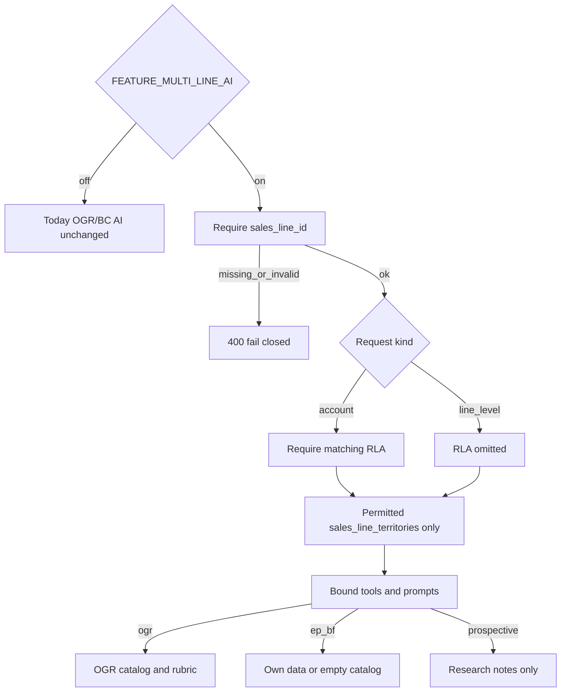

# Phase 4 — AI Isolation (implementation plan)

**Status:** Ready for implementation approval  
**Date:** 2026-08-15  
**Branch:** `feature/multi-line-multi-territory-implementation`  
**Prerequisites:** Phase 1A–1C complete locally (`…100000` through `…130000`); Phase 2 line-context reads complete; Phase 3 writes complete (`FEATURE_MULTI_LINE_WRITES`, `…15120000` write guards)

**Sources of truth (do not redesign architecture):**

- [docs/epics/multi-line-multi-territory-crm.md](../docs/epics/multi-line-multi-territory-crm.md) Phase 4, §4 selling table, §10 isolation tests, §11 `FEATURE_MULTI_LINE_AI`; audit §9 (AI surfaces)
- [docs/plans/multi-line-phase-1-schema-foundation.md](../docs/plans/multi-line-phase-1-schema-foundation.md) (Phase 1–3 results recorded; `retailer_field_changes` table exists, writers deferred to Phase 4)
- [plan/multi-line-phase3-writes-on-line-accounts.md](multi-line-phase3-writes-on-line-accounts.md) (writes/RLA/selling gate shipped; AI explicitly left unchanged)
- [plan/multi-line-phase2-line-context-reads.md](multi-line-phase2-line-context-reads.md) (picker + LineContext `salesLineId`; catalog/calls/orders **reads** already line-scoped)

This document is the **agent-executable** Phase 4 implementation brief. Follow it exactly. Do not begin Phase 5. Do not introduce Eagle Peak / Big Fish selling or outreach flags. Do not enable EP/BF staff convert/order/call. Do not build territory administration or prospective-line UI. Do not modify public catalogs or live-chat AI.

---

## Locked decisions (no agent discretion)

| Decision                         | Choice                                                                                                                                                                                                                         |
| -------------------------------- | ------------------------------------------------------------------------------------------------------------------------------------------------------------------------------------------------------------------------------ |
| Scope                            | Isolate **staff** AI when `FEATURE_MULTI_LINE_AI` is on. Phase 1–3 schema/reads/writes stay as shipped                                                                                                                         |
| Feature flag                     | `FEATURE_MULTI_LINE_AI` — **server env**, default **off**, not `PUBLIC_`. Snapshot via existing `/api/staff/features`                                                                                                          |
| Snapshot gating                  | `FEATURE_MULTI_LINE_AI = isMultiLineAiEnabled() && isMultiLineUiEnabled()` (same AND as writes after Copilot #79). Server libs/APIs call `isMultiLineAiEnabled()`; islands use snapshot + LineContext                          |
| Flag off                         | Today’s AI signatures and implicit OGR/BC behavior unchanged so existing AI tests keep passing                                                                                                                                 |
| Flag on                          | Every staff AI request requires explicit `sales_line_id`. Missing / unknown / `bkg` / `declined` / `terminated` → **400** with a clear error. **Never** silently default to OGR                                               |
| Account-specific AI              | Also require `retailer_line_account_id` whose `(retailer_id, sales_line_id)` matches and `relationship_status <> 'terminated'`. Mismatch → 400                                                                                 |
| Line-level AI                    | Add via AI (create), landed-rates, catalog-only APF with no prospect: `sales_line_id` required; RLA omitted                                                                                                                    |
| Territory                        | **Read-only** `sales_line_territories` for that line. Inject permitted assignment ids. Named territory id must be in that set. **Do not** auto-assign from city/state (Phase 5). Big Fish has zero assignments → empty set    |
| Profiles                         | Additive `lines.ai_profile jsonb` (epic v1). Seed OGR with current ICP/rubric/prompt keys; EP/BF with empty-catalog + no OGR apparel rubric. No invented Big Fish commercial terms. No `sales_line_ai_profiles` table in v1    |
| Tools                            | Bind `createAgentCrmTools(supabase, ctx)` to request context. Remove default `lineCode = 'ogr'` when flag on. Filter calls/orders/notes by `line_id` / RLA. Catalog `.eq('line_id', ctx.salesLineId)` only                     |
| Prospective                      | Research notes only. Refuse convert, operational writes, outreach generate/send, and represented-line catalogs                                                                                                                 |
| Eagle Peak / Big Fish            | Own data only; empty catalogs stay empty (**zero OGR SKUs**). Staff selling UI stays blocked (Phase 3). Do **not** add Phase 6/7 flags                                                                                         |
| Provenance                       | AI Update / fill-blanks / Add-via-AI identity edits are **proposals**. Apply writes `retailer_field_changes` (`source = 'ai'`). Do not overwrite `buyer_verified === true` or `verification_status` matching `/^verified$/i` without explicit staff confirm |
| Outreach prep / send / cron      | **Unchanged** (still OGR). Only `generate-draft` is Phase 4. Phase 6/7 outreach flags stay off                                                                                                                                 |
| Public live chat / catalogs      | **Out of scope** (not staff CRM AI)                                                                                                                                                                                            |
| Territory admin CRUD             | **Out of scope** (Phase 5)                                                                                                                                                                                                     |
| Messages / calendar lists        | **Do not** line-filter (Phase 2 residual; not Phase 4)                                                                                                                                                                         |
| Hosted / staging / production DB | **Forbidden**                                                                                                                                                                                                                  |
| Phase 1–3 migrations             | **Do not rewrite** `…100000`–`…130000` or `…15120000`                                                                                                                                                                          |
| Commit / push / deploy           | **Forbidden** unless the user separately asks after implementation                                                                                                                                                             |



**Client-flag constraint:** `FEATURE_MULTI_LINE_AI` must not be `PUBLIC_`. React islands cannot read it from `import.meta.env`. Staff UI must use `/api/staff/features` (same pattern as UI/writes flags).

---

## Non-goals / later-phase exclusions

Do **not** in Phase 4:

- Introduce `FEATURE_EAGLE_PEAK_SELLING`, `FEATURE_EAGLE_PEAK_OUTREACH`, `FEATURE_EAGLE_PEAK_PUBLIC_CATALOG`, or Big Fish equivalents (Phases 6–7)
- Enable staff convert / orders / calls / reorder / junction on Eagle Peak or Big Fish
- Change `outreachNightlyPrep.ts`, prep POST, send routes, or cron signatures (Phase 6–7)
- Territory admin CRUD / `/app/lines/:lineSlug/territories` (Phase 5)
- Prospective Lines UI / `retailer_line_targets` writers (Phase 8)
- Modify public RPCs, wholesale showroom, or `POST /api/chat/ai-reply` (buyer OGR chat)
- Line-filter Messages / Calendar / Gmail inbox lists
- Rewrite Phase 1C dual-write or Phase 3 write-guard migrations
- Clone OGR accounts/catalog onto Eagle Peak or Big Fish
- Invent Big Fish commercial terms
- Auto-assign `sales_line_territory_id` from city/state
- Begin Phase 5
- Commit or push unless the user separately asks

---

## Reinspection snapshot (plan authorship)

| Check                         | Result                                                                                                                                                                      |
| ----------------------------- | --------------------------------------------------------------------------------------------------------------------------------------------------------------------------- |
| Branch                        | `feature/multi-line-multi-territory-implementation`                                                                                                                         |
| HEAD at plan authorship       | `6027d14` (Phase 3 writes + Copilot follow-up on PR #79 **committed and pushed**)                                                                                           |
| Phase 1–3 migrations          | Present: `…100000` through `…15120000`                                                                                                                                      |
| `FEATURE_MULTI_LINE_AI`       | **Absent** (expected)                                                                                                                                                       |
| `staffFeatures.ts`            | UI + writes only. Writes snapshot **AND-gated with UI** (Copilot #79). AI flag must follow the same snapshot rule                                                           |
| Staff AI routes               | **Zero** accept `salesLineId` / `retailer_line_account_id`. Enrich accepts optional `territoryCode` and defaults to **BC**                                                  |
| `agent.ts` SYSTEM_PROMPT      | Hardcoded “BC wholesale apparel… (Old Guys Rule)”                                                                                                                           |
| `agentCrmTools.ts`            | `getAccountProductFit` filters catalog by `line_id` but **defaults `lineCode` to `ogr`**. `listRecentCalls` / `getReorderSuggestions` query by prospect/account id only     |
| Reorder tool                  | **Upserts** shared `account_reorder_settings` (PK `account_id`) — cross-line leak + write                                                                                |
| `retailer_field_changes`      | Table exists (Phase 1A); **no app writers**. No `sales_line_id` / RLA columns                                                                                               |
| `lines.ai_profile`            | **Absent**                                                                                                                                                                  |
| `verification_status`         | Freeform **text** (not enum `verified`). `buyer_verified` is the boolean. Epic “verified” maps to `buyer_verified === true` **or** `verification_status` matching `/^verified$/i` |
| `applyProspectResearchUpdate` | Writes `prospects` directly; no audit rows                                                                                                                                  |
| Catalog fetch                 | Phase 2 scopes by `lineId`; [src/lib/catalog.ts](../src/lib/catalog.ts) still defaults omitted `lineCode` to `ogr`                                                           |
| LineContext                   | Has `salesLineId` + `multiLineWrites`; **no** `multiLineAi`                                                                                                                 |
| Outreach generate             | `generateOgrProductOutreachDraft` / `loadPublishedOgrProductForEmail` hardcode `lines.code = 'ogr'`                                                                         |
| Prep / send / cron            | Unchanged (Phase 3 lock). Briefing GET already accepts `sales_line_id` (reads only)                                                                                         |
| Public live chat              | OGR buyer prompt in `liveChat.ts` — **not staff**; out of Phase 4                                                                                                           |
| Phase 3 results note          | Still says “no commit/push”; PR #79 supersedes that sentence                                                                                                                |

**Accepted Phase 3 recorded results (do not retest as a Phase 4 gate):** 607 prospects; 607 OGR RLAs; 190 OGR catalog items; Eagle Peak / Big Fish / BKG RLA = 0; `FEATURE_MULTI_LINE_WRITES` default off; Vitest + `npm run check` passed.

If implementing agents find Phase 3 write guards / `FEATURE_MULTI_LINE_WRITES` missing, or Eagle Peak / Big Fish already have operational accounts **before** Phase 4 starts (except a rolled-back isolation row), **stop and report** — do not guess.

---

## Current staff AI inventory (must isolate)

Auth for all of these: `requireApprovedStaffClient` + `prerender = false`. Rate limits stay as today.

### Account-specific (flag on: `sales_line_id` **and** matching RLA)

| Surface            | Entry                                                                                          |
| ------------------ | ---------------------------------------------------------------------------------------------- |
| Ask AI / coach     | `AIAssistantModal` → `POST /api/agent` + `createAgentCrmTools`                                 |
| Suggest            | `buildSuggestDraft` → `/api/agent`                                                             |
| APF Brief          | `buildApfDraft` → `getAccountProductFit`                                                       |
| Assist / call draft| `buildAssistDraft` / `buildCallDraft` / LogCallModal `openAssist`                              |
| AI Update          | `AiUpdateResearchModal` → `/api/prospects/research-update` + `/apply`                          |
| Fill blanks        | same research-update route, `mode = 'fill-blanks'`                                             |
| Contact enrich     | `/api/contacts/enrich` when `accountId` is present                                             |
| Outreach generate  | `POST /api/staff/ogr-product-email/generate-draft` for a retailer                              |

### Line-level (flag on: `sales_line_id` required; RLA omitted)

| Surface         | Entry                                                          |
| --------------- | -------------------------------------------------------------- |
| Add via AI      | `/api/prospects/enrich` → `createEnrichedProspect`             |
| Contact create  | `/api/contacts/enrich` when creating a prospect                |
| Landed rates    | `POST /api/pricing/landed-rates`                               |
| Catalog-only APF| Insights / agent with no `prospectId`                          |

### Explicitly out of Phase 4

- `POST /api/staff/outreach/prep`, cron nightly prep, send routes
- `POST /api/chat/ai-reply` (public buyer chat)
- Public catalog RPCs / showroom

### Hardcoded OGR/BC (must become profile-driven when flag on)

- `src/pages/api/agent.ts` `SYSTEM_PROMPT`
- `src/lib/aiAssistPrefill.ts`
- `src/lib/agentCrmTools.ts` `DEFAULT_LINE_CODE = 'ogr'`
- `src/lib/companyWebResearch.ts`, `createEnrichedProspect.ts`, `fillBlankProspectFields.ts`, `prospectEnrichment/bcTerritory.ts`
- `src/lib/generateOgrProductOutreachDraft.ts`, `loadPublishedOgrProductForEmail.ts`
- `src/lib/landedRatesResearch.ts`
- Enrich `territoryCode` default `bc`

---

## AI isolation rules (must hold)

1. Flag on: every staff AI request takes `sales_line_id`. Missing or invalid → **400**, not OGR.
2. Account-specific AI also takes `retailer_line_account_id`. Resolve by `(retailer_id, sales_line_id)` where not terminated. Wrong-line id → 400.
3. Do not load `catalog_items` for another `line_id`. EP/BF APF returns `catalogAnchors: []`, never OGR SKUs.
4. Do not concatenate notes, calls, orders, or scores across line accounts. Filter by `line_id` / `retailer_line_account_id`.
5. Do not apply OGR seed-fit / Okanagan / apparel taxonomy to Eagle Peak or Big Fish.
6. Do not use another line’s price list or currency.
7. Territory-scoped AI receives only that line’s `sales_line_territories` ids. Named id outside the set → 400. Do not auto-assign from address.
8. Prospective / `bkg` / `declined` / `terminated`: no convert, operational records, outreach generate, or represented catalogs.
9. OGR under explicit OGR context keeps today’s functional AI (prompts, 190 SKUs, BC enrich strategy).
10. Verified identity fields are never silently overwritten; every applied AI field change inserts `retailer_field_changes`.
11. Flag off: do not require `salesLineId`; do not break existing AI tests.

---

## 1. Ordered implementation steps

1. Confirm branch + Phase 1A–3 exist; this plan file is the Phase 4 brief.
2. Record local baseline (accept 607 / 190 / EP-BF = 0). **Stop** if EP/BF RLAs already exist or Phase 3 guards / writes flag are missing.
3. Add `FEATURE_MULTI_LINE_AI` to `staffFeatures` + snapshot (AND UI) + AuthGate/LineContext `multiLineAi`.
4. Additive local migration: `lines.ai_profile` + `retailer_field_changes.sales_line_id` / `retailer_line_account_id`; seed profiles; mirror `schema.sql` + type-only `database.ts`.
5. `resolveStaffAiContext` + `retailerFieldChanges` writer.
6. Bind `/api/agent` + `createAgentCrmTools(ctx)`; 400 missing context; APF catalog = request line only.
7. Enrich / fill-blanks / research-update / landed-rates / generate-draft: require context; OGR strategy only when `ctx.code === 'ogr'`.
8. Client islands pass LineContext `salesLineId` (+ RLA when account-specific) when snapshot AI+UI are on.
9. Isolation + 400 + empty-catalog + provenance Vitest; local SQL reconciliation; `npm run check`.
10. Append **Implementation results — Phase 4** to the foundation plan (results only).
11. **Stop.** Do not commit/push unless asked. Do not start Phase 5.

---

## 2. Exact files to create or modify

### Create

| File                                                                       | Role                                                                                          |
| -------------------------------------------------------------------------- | --------------------------------------------------------------------------------------------- |
| `supabase/migrations/20260816NNNNNN_multi_line_phase4_ai_profiles.sql`     | Additive: `lines.ai_profile jsonb`; seed OGR/EP/BF; field-change line/RLA columns             |
| `src/lib/aiLineContext.ts`                                                 | `resolveStaffAiContext`; request kinds `account` \| `line_level`                              |
| `src/lib/salesLineAiProfiles.ts`                                           | Load/map `lines.ai_profile`                                                                   |
| `src/lib/retailerFieldChanges.ts`                                          | Insert audit rows (`source = 'ai'`)                                                           |
| `src/lib/multiLinePhase4Ai.test.ts`                                        | Flag, 400, APF EP empty catalog, leak filters, provenance, prep untouched                     |

Use the next available `YYYYMMDDHHMMSS` timestamp after `20260815120000` (do not reuse Phase 1–3 versions). Apply **local disposable DB only**.

### Modify

| File                                                      | Change                                                                                                                                      |
| --------------------------------------------------------- | ------------------------------------------------------------------------------------------------------------------------------------------- |
| `src/lib/staffFeatures.ts`                                | Add `FEATURE_MULTI_LINE_AI`, `isMultiLineAiEnabled()`, snapshot AND UI                                                                      |
| `src/pages/api/staff/features.ts`                         | Already returns `getStaffFeatureFlags()` — type-only via staffFeatures                                                                      |
| `src/components/auth/AuthGate.tsx`                        | Parse snapshot boolean; pass `multiLineAi` into `LineProvider`                                                                              |
| `src/components/auth/AuthGate.test.tsx`                   | Stub the new boolean `false`                                                                                                                |
| `src/lib/lineContext.tsx`                                 | Add `multiLineAi: boolean`                                                                                                                  |
| `src/pages/api/agent.ts`                                  | Flag on: require `salesLineId` (+ RLA when prospect in body/chips); bind tools to ctx; system prompt from profile                           |
| `src/lib/agentCrmTools.ts`                                | `createAgentCrmTools(supabase, ctx)`; no ogr default when flag on; filter calls/orders by line/RLA; APF catalog = ctx line (EP/BF → `[]`)   |
| `src/lib/aiAssistPrefill.ts`                              | Line name from context when AI snapshot on; keep OGR copy when flag off                                                                     |
| `src/pages/api/prospects/enrich.ts`                       | Accept `salesLineId`; 400 when flag on and missing; stop silent `territoryCode = bc` unless OGR ctx                                         |
| `src/pages/api/contacts/enrich.ts`                        | Same; account-specific requires RLA                                                                                                         |
| `src/pages/api/prospects/research-update/index.ts`        | Account context required when flag on                                                                                                       |
| `src/pages/api/prospects/research-update/apply.ts`        | Same + verified-field guard + `retailer_field_changes`                                                                                      |
| `src/pages/api/pricing/landed-rates.ts`                   | Require `salesLineId` when flag on; prompt from profile                                                                                     |
| `src/pages/api/staff/ogr-product-email/generate-draft.ts` | Require line (+ RLA for retailer targets); refuse prospective; no OGR SKU fallback for EP/BF                                                |
| `src/lib/createEnrichedProspect.ts`                       | OGR/BC strategy only when `ctx.code === 'ogr'`                                                                                              |
| `src/lib/createEnrichedContact.ts`                        | Same                                                                                                                                         |
| `src/lib/companyWebResearch.ts`                           | Profile persona; no “BC OGR reps” when not OGR                                                                                              |
| `src/lib/fillBlankProspectFields.ts`                      | Line rubric from profile; BC mappers only for OGR                                                                                           |
| `src/lib/prospectEnrichment/bcTerritory.ts`               | Keep as **OGR line strategy**, not global default                                                                                           |
| `src/lib/updateProspectResearch.ts`                       | Preview unchanged; apply: audit rows; skip `buyer_verified` / `/^verified$/i` fields unless `confirmVerifiedOverwrite`                      |
| `src/lib/generateOgrProductOutreachDraft.ts`              | Require line context when flag on                                                                                                           |
| `src/lib/loadPublishedOgrProductForEmail.ts`              | Load published SKUs for **request line**, not hardcoded `ogr` when flag on                                                                  |
| `src/lib/landedRatesResearch.ts`                          | Line profile framing                                                                                                                        |
| `src/components/ui/AIAssistantModal.tsx`                  | POST `salesLineId` + optional RLA from LineContext when snapshot on                                                                         |
| `src/components/tabs/ProspectsTab.tsx`                    | Pass line/RLA into assist + research + enrich                                                                                               |
| `src/components/tabs/ActiveAccountsTab.tsx`               | Same                                                                                                                                         |
| `src/components/tabs/CallsTab.tsx`                        | Same                                                                                                                                         |
| `src/components/tabs/InsightsTab.tsx`                     | Same                                                                                                                                         |
| `src/components/LogCallModal.tsx`                         | Pass line into `openAssist` when AI snapshot on (selling block stays Phase 3)                                                               |
| `src/components/AiUpdateResearchModal.tsx`                | Pass account AI context                                                                                                                     |
| `src/components/AddProspectAiModal.tsx`                   | Pass `salesLineId`; no silent BC                                                                                                            |
| `src/components/AddContactAiModal.tsx`                    | Pass line + RLA when account-scoped                                                                                                         |
| `src/components/messages/MessageThreadPanel.tsx`          | Add-via-AI from message: pass current line                                                                                                  |
| `src/components/tabs/CatalogTab.tsx`                      | Landed-rates POST includes `salesLineId` when AI snapshot on                                                                                |
| `src/components/OgrProductEmailComposerModal.tsx`         | Generate-draft includes line + RLA                                                                                                          |
| `src/types/database.ts`                                   | Type-only: `lines.ai_profile`; field-change line/RLA columns                                                                                |
| `supabase/schema.sql`                                     | Mirror column + seed comments                                                                                                               |
| `docs/plans/multi-line-phase-1-schema-foundation.md`      | Append **Implementation results — Phase 4** after implementation                                                                            |

### Do not touch

- `supabase/migrations/20260814100000_*.sql` through `20260815120000_*.sql`
- `src/lib/outreachNightlyPrep.ts`, `src/pages/api/staff/outreach/prep.ts`, `src/pages/api/cron/outreach-nightly-prep.ts`
- `src/pages/api/staff/ogr-product-email.ts` and send/draft-send routes
- `src/pages/api/chat/ai-reply.ts`, `src/lib/liveChat.ts` AI reply prompt
- Public RPCs / `WholesaleShowroom.tsx`
- Territory admin pages (none exist; do not create)
- Historical BC seed migrations; hosted DBs

---

## 3. Feature-flag rollout and rollback

### 3.1 Flag definition

| Env var                     | Type   | Default   | Effect                                              |
| --------------------------- | ------ | --------- | --------------------------------------------------- |
| `FEATURE_MULTI_LINE_UI`     | server | off       | Already shipped                                     |
| `FEATURE_MULTI_LINE_WRITES` | server | off       | Already shipped                                     |
| `FEATURE_MULTI_LINE_AI`     | server | off/falsy | Strict staff AI context (this phase)                |

Never `PUBLIC_FEATURE_MULTI_LINE_AI`. Truthy values: `1`, `true`, `yes`, `on` (case-insensitive) via existing `parseFeatureFlag`.

Staff UI obtains booleans via `/api/staff/features` under `requireApprovedStaffClient`.

`FEATURE_MULTI_LINE_AI` on without UI flag: **snapshot is false** so islands do not send line ids and must not 400 themselves. Server `isMultiLineAiEnabled()` still enforces 400 if a client sends a flag-on request without context. Prefer documenting: AI isolation path is used when the AI flag is on **and** the caller supplies `sales_line_id`.

### 3.2 Behavior matrix

| Mode                         | Behavior                                                                                                      |
| ---------------------------- | ------------------------------------------------------------------------------------------------------------- |
| AI flag **off**              | Today’s agent/enrich/APF/fill-blanks/generate-draft (implicit OGR/BC)                                         |
| AI on + `ogr` + valid ctx    | Profile prompts; catalog = 190 OGR SKUs; BC enrich strategy allowed                                           |
| AI on + EP/BF + valid ctx    | Own data; empty catalog; no OGR SKUs/rubric; no convert/outreach/order tools                                  |
| AI on + missing ctx          | **400** clear error; do not default OGR                                                                       |
| AI on + mismatched RLA       | **400**                                                                                                       |
| AI on + prospective          | Research notes only; refuse catalog/convert/generate-draft                                                    |
| AI on + `bkg` / declined     | **400**                                                                                                       |

### 3.3 Rollback

1. Unset `FEATURE_MULTI_LINE_AI` (optionally also UI/writes).
2. Staff AI returns to implicit OGR/BC. Additive `ai_profile` / field-change columns are unused.
3. Do **not** reverse Phase 1–3 migrations. Do **not** drop `retailer_field_changes`.
4. Flag-off paths must not require `salesLineId`.

---

## 4. Context-validation and authorization

```ts
// Conceptual — implement in src/lib/aiLineContext.ts
type StaffAiKind = 'account' | 'line_level';

async function resolveStaffAiContext(input: {
  client: AgentSupabase;
  salesLineId: string | null | undefined;
  retailerLineAccountId?: string | null;
  prospectId?: number | null;
  territoryAssignmentId?: string | null;
  kind: StaffAiKind;
}): Promise<{ ok: true; ctx: StaffAiContext } | { ok: false; status: 400; error: string }>;
```

Rules:

- Reuse `isUuid` from `resolveSalesLineQuery.ts`. Non-UUID `salesLineId` → 400.
- Load line: `id, code, name, status, default_currency, ai_profile`. Unknown → 400.
- Reject `bkg`, `declined`, `terminated`.
- `kind === 'account'`: require RLA; `retailer_id` matches prospect/account; `sales_line_id` matches; not terminated. Else 400.
- Load permitted territory assignment ids for that `sales_line_id`. If `territoryAssignmentId` is set and not in the set → 400.
- `data_scope`: `catalog_items` where `line_id = ctx.salesLineId`; calls/orders where `line_id` or `retailer_line_account_id` matches; notes from **that** RLA (OGR may also read `prospects.notes` as today).
- Prospective: `mode = 'research_only'` — do not register convert/outreach/order/APF-catalog tools.
- EP/BF: isolated reads allowed; reuse `assertLineAllowsOperationalWrite` — selling **writes** (including `getReorderSuggestions` upsert) → reject when AI flag on.
- Every staff AI API calls this when `isMultiLineAiEnabled()`. Flag off: skip resolver (legacy).

Do not invent a parallel auth path. Keep JWT + `is_approved_staff` RLS. Do not use the service role for domain AI CRUD.

---

## 5. Cutover (flag on)

### 5.1 Agent + CRM tools

- `POST /api/agent` body: `{ messages, salesLineId, retailerLineAccountId?, prospectId? }`.
- System prompt from `ctx.ai_profile.systemPrompt` (OGR seed = today’s string).
- Tools closed over `ctx`. Model-supplied `lineCode` **cannot** override request line.
- `getAccountProductFit`: catalog `.eq('line_id', ctx.salesLineId).limit(12)`. EP/BF → `[]`.
- `listRecentCalls`: `.eq('prospect_id', id)` **and** `.eq('line_id', ctx.salesLineId)` (or RLA). Do not return another line’s calls.
- `getReorderSuggestions`: filter orders by `line_id`; **do not** upsert shared reorder settings for EP/BF / prospective. OGR may upsert and stamp RLA when writes flag is also on (existing Phase 3 helper).

### 5.2 Enrich / fill-blanks / AI Update

- Enrich: require `salesLineId`; after insert, `ensureRetailerLineAccount` for represented lines (reuse Phase 3 helper). Territory default from **permitted assignments**, not hardcoded `bc`, unless OGR profile.
- Fill-blanks / update: account kind; preview stays; apply inserts `retailer_field_changes` per patched field; skip verified identity (`name`, `address`, `phone`, `website`) when `buyer_verified` or `/^verified$/i` unless body `confirmVerifiedOverwrite: true`.
- Contact enrich with `accountId`: account kind + RLA.

### 5.3 Outreach generate (not prep/send)

- Generate-draft requires line (+ RLA for a retailer target).
- Load published catalog for **that** `line_id`. Empty → error or empty copy, **not** OGR SKUs.
- Prospective → 400.
- Do not change prep POST / cron / send.

### 5.4 Landed rates

- Require `salesLineId`. Prompt/currency from profile. Non-OGR: do not use “Vista, CA → Canada / BC GST-PST” framing.

### 5.5 Client wiring

When `multiLineAi && salesLineId`, islands include those ids in AI POSTs. When snapshot is off, omit them (flag-off server path). Do not read `FEATURE_MULTI_LINE_AI` from `import.meta.env`.

---

## 6. Migration strategy

**One additive local migration** (do not rewrite 1C or Phase 3):

1. `alter table lines add column if not exists ai_profile jsonb;`
2. Seed `ai_profile` for `ogr` (today’s persona / system / APF / fill-blanks / catalogFilter / currency CAD / ICP / rubric).
3. Seed `eagle-peak` / `big-fish` empty-catalog personas; **no** OGR SKU lists or apparel rubrics; currency from `default_currency` (do not invent Big Fish terms).
4. `alter table retailer_field_changes add column if not exists sales_line_id uuid references lines(id);`
5. `alter table retailer_field_changes add column if not exists retailer_line_account_id uuid references retailer_line_accounts(id);`

Apply with `npx supabase migration up --local` only.

---

## 7. Tests and count reconciliation

### 7.1 Baseline (accept; stop if drifted)

```sql
select count(*) from prospects; -- 607
select count(*) from retailer_line_accounts rla
  join lines l on l.id = rla.sales_line_id where l.code = 'ogr'; -- 607
select count(*) from catalog_items ci
  join lines l on l.id = ci.line_id where l.code = 'ogr'; -- 190
select l.code, count(rla.id)
from lines l
left join retailer_line_accounts rla on rla.sales_line_id = l.id
where l.code in ('eagle-peak','big-fish','bkg')
group by 1; -- expect 0
```

### 7.2 Required automated tests

| #   | Assertion                                                                                                      |
| --- | -------------------------------------------------------------------------------------------------------------- |
| 1   | AI flag defaults off; snapshot false without UI; no `PUBLIC_FEATURE_MULTI_LINE_AI`                             |
| 2   | Flag off: agent / enrich / APF default `ogr` still present in source; existing AI tests green                  |
| 3   | Flag on + missing `salesLineId` → 400 (agent + one enrich or research-update route)                            |
| 4   | Flag on + invalid / `bkg` / prospective catalog or convert tool → reject                                       |
| 5   | Flag on + mismatched RLA / line → 400                                                                          |
| 6   | APF Eagle Peak context: `catalogAnchors` empty; no OGR SKU fields                                              |
| 7   | `listRecentCalls` / order fetch use `line_id` or RLA (source snapshot)                                         |
| 8   | Apply research writes `retailer_field_changes`; verified / `buyer_verified` fields not in silent patch         |
| 9   | Nightly prep file still has **no** `salesLineId` signature change                                              |
| 10  | Phase 2 / Phase 3 Vitest files stay green                                                                      |

Isolation: if a throwaway EP RLA is created for APF, **delete** it (and any EP AI rows) so local EP/BF counts return to 0. Do not clone OGR catalog onto Eagle Peak.

Follow Phase 1C/2/3 style: source snapshots + mocked lib behavior. No new Playwright suite.

### 7.3 Commands

```bash
npx vitest run src/lib/multiLinePhase4Ai.test.ts
npm run check
```

---

## 8. Completion criteria

Phase 4 is complete when all are true:

- [ ] `FEATURE_MULTI_LINE_AI` exists; default off; staff snapshot AND-gated with UI; not `PUBLIC_`
- [ ] Flag off: Ask AI / APF / Suggest / fill-blanks / enrich / generate-draft behave as today
- [ ] Flag on: every staff AI call has `sales_line_id`; account calls have matching RLA
- [ ] Missing / invalid context → **400**, not silent OGR
- [ ] Territory-scoped AI sees only that line’s assignments
- [ ] No cross-line catalog, notes, calls, orders, or scores in prompts or tool results
- [ ] APF in Eagle Peak context returns **zero** OGR SKUs
- [ ] OGR AI works under explicit OGR context
- [ ] Prospective: research-only; no convert / operational records / generate-draft / represented catalogs
- [ ] Applied AI identity edits write `retailer_field_changes`; verified / `buyer_verified` not silently overwritten
- [ ] Prep / send / cron, public chat, public catalogs, territory admin, EP/BF selling flags untouched
- [ ] No hosted DB; no OGR cloning onto EP/BF
- [ ] Vitest + `npm run check` pass
- [ ] Implementation-results note appended
- [ ] No commit/push unless separately requested
- [ ] Local EP/BF operational counts return to 0 after isolation-test cleanup

---

## 9. Stop conditions

Stop and report (do not guess) if:

- Phase 3 write guards or `FEATURE_MULTI_LINE_WRITES` are missing
- Eagle Peak / Big Fish already have operational accounts **before** implementation starts
- Isolation would require cloning OGR catalog/orders onto Eagle Peak
- Flag-off AI tests would break unless `salesLineId` is sent
- A hosted/staging/production database would need to be touched
- Public live-chat or public catalog RPCs would need to change to pass the exit tests

---

## 10. Blocking vs unresolved

**Locked (do not re-litigate):**

- Staff snapshot ANDs AI flag with UI flag
- Fail closed: no silent OGR default when AI flag is on
- JSON `lines.ai_profile` (not a split table) for v1
- `verification_status` stays freeform; “verified” = `buyer_verified` or `/^verified$/i`
- Prep/send/cron stay OGR; only generate-draft is isolated
- Public live chat stays OGR buyer AI
- EP/BF staff selling stays off without Phase 6/7 flags
- Territory admin CRUD is Phase 5; Phase 4 only **reads** assignments
- Phase 1–3 migrations are not rewritten

**Unresolved / do not block Phase 4:**

- Big Fish legal name, currency, commission, territories, catalog
- Northern California exact county list
- Whether to move Big Fish from `confirmed` to `onboarding`
- Full inbox/calendar line isolation (residual)
- Splitting `sales_line_ai_profiles` into its own table (later, if prompts grow)

---

## 11. Implementation outline (for the implementing agent)

1. Header comment / PR description: Phase 4 AI isolation; flag default off; no EP/BF selling flags; no territory admin; no public catalog/chat changes.
2. Baseline counts; stop if EP/BF RLAs exist.
3. `FEATURE_MULTI_LINE_AI` + features snapshot (AND UI) + LineContext.
4. Additive migration + `schema.sql` + `database.ts` type.
5. `resolveStaffAiContext` + field-change writer.
6. Agent + CRM tools bound to ctx; 400 missing context.
7. Enrich / fill-blanks / research-update / landed rates / generate-draft.
8. Client POST wiring from LineContext when snapshot on.
9. Tests + local SQL + `npm run check`.
10. Results note; **stop**.

Preserve all existing IDs. Surgical edits. Keep Phase 1C and Phase 3 intact. Keep Eagle Peak / Big Fish empty except rolled-back isolation rows. Keep existing AI tests green on the flag-off path.

---

**Stop after Phase 4 implementation and local validation.** Do not begin Phase 5. Do not commit, push, or deploy unless the user separately asks.
