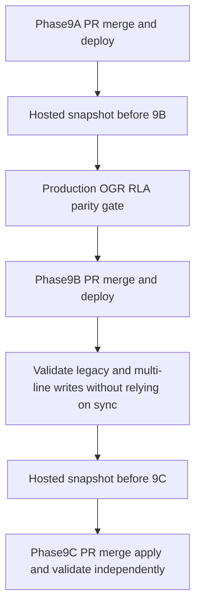

# Phase 9 — Isolation, dual-write cutover, then sync-trigger removal

**Status:** Implementation in progress  
**Date:** 2026-08-17  
**Branch:** `feature/multi-line-multi-territory-implementation`  
**Prerequisites:** Phases 1A–8 complete in repo; local chain through `20260816120000_public_line_cards.sql`. Do not begin until this plan is approved.

**Sources of truth (do not redesign architecture):**

- [docs/epics/multi-line-multi-territory-crm.md](../docs/epics/multi-line-multi-territory-crm.md) Phase 9, §4 picker vs selling, §9 expand/contract, §9.2 snapshot
- [docs/plans/multi-line-phase-1-schema-foundation.md](../docs/plans/multi-line-phase-1-schema-foundation.md) §2.7 deferred FKs; Phase 1C–8 results; §22.3 status map
- [plan/multi-line-phase-1c-dual-write.md](multi-line-phase-1c-dual-write.md) (sync vs fill triggers)
- [plan/multi-line-phase3-writes-on-line-accounts.md](multi-line-phase3-writes-on-line-accounts.md)

After approval, copy this brief to `plan/multi-line-phase9-cleanup.md`. Do not rewrite Phase 1–8 migrations. Do not invent Big Fish terms.

**This phase completes the dual-write contract.** It stops both application dual-write of commercial fields and (in 9C) database synchronization. It does **not** drop `prospects` commercial columns or rename `prospects` → `retailers`. Those remain a later dedicated migration.

## Conservative locks (unchanged)

- Do **not** rename `prospects` → `retailers`.
- Do **not** drop `prospects` identity/location columns or commercial columns in this phase. After 9B those commercial columns are **read-only historical** (app must not write them).
- Do **not** add PostGIS or `staff_line_memberships` RLS. v1 stays `is_approved_staff()` (+ owner APIs).
- Do **not** invent Big Fish legal name, currency, commission, territories, or catalog.
- Do **not** flip `lines.active` or add `get_public_eagle_peak_*` / `get_public_big_fish_*`. Homepage stays `get_public_line_cards()` for the three marketing brands.
- Do **not** delete live feature flags. Selling/outreach flags still gate **UI**, not RLA persistence.
- Do **not** add `salesLineId` to prep/send/cron **request contracts**. OGR outreach may resolve the OGR line id internally so eligibility reads RLA, not `prospects.account_status`.
- Do **not** reverse-sync RLA → `prospects` as an ordinary rollback.
- Hosted apply / commit / push / deploy only if the user separately asks. Snapshot **immediately before 9B** and again **before 9C**. Do not reset hosted OGR `rights_type`.

## Deployment sequence (hard gate)

Do **not** ship 9A–9C as one PR, one stack, or one deployment. Sequential commits in a single deploy are not a safety gate.



1. Implement, merge, and deploy **9A**.
2. Take a **hosted snapshot immediately before deploying 9B**. Irreversibility begins when 9B stops updating `prospects` commercial fields.
3. Run the **production OGR RLA parity gate**. Stop if it fails. Historical local 607/607 (or later hosted 612/612) is evidence, not a substitute.
4. Implement, merge, and deploy **9B** (triggers still present on the database).
5. Validate all legacy and multi-line write paths on the deployed 9B app **without relying on sync**. If any path still needs a trigger, **do not start 9C**.
6. Take a **second hosted snapshot** before 9C.
7. Implement **9C** trigger removal in a **separate PR**.
8. Apply and validate 9C independently.

Trigger removal is the **final** step of Phase 9 and a separate production event. If any inspected write path still relies on `sync_ogr_retailer_line_account_from_prospect` or `sync_ogr_retailer_line_contact_from_account_contact`, **retain that trigger**, stop 9C, and report.

**Recovery after 9B:** prefer **roll-forward**. Ordinary application rollback to pre-9B code is **not** allowed after RLA-only writes: that code would read stale `prospects.account_status` / dates. Recovery requires either an explicit data-reconciliation procedure or restoration of the pre-9B snapshot. Do not reverse-sync RLA onto `prospects` as a casual rollback.

---

## Phase 9A — Remaining isolation and dynamic represented lines

Own PR. No schema trigger drops. No commercial-column write changes required here (those are 9B).

### 9A.1 Messages and Calendar list isolation

A line workspace must not show another line’s **linked** CRM messages or calendar events.

**Lineage precedence** (same helper for `message_threads`, `gmail_thread_links`, and `calendar_event_links`):

1. If `retailer_line_account_id` is non-null, derive the line from **that RLA** (`retailer_line_accounts.sales_line_id`). This wins even when the row’s own `sales_line_id` is null. A null `sales_line_id` must **not** make an EP/BF (or other non-OGR) RLA-linked row visible in OGR.
2. Else if `sales_line_id` is non-null and `retailer_line_account_id` is null, use `sales_line_id`.
3. Treat as **legacy OGR-only** only when **both** `sales_line_id` and `retailer_line_account_id` are null.
4. If both are non-null and they **disagree** (row `sales_line_id` ≠ RLA `sales_line_id`): **fail closed** — omit the row from every line workspace list; report ids/counts in 9A implementation results. Do not show the row in OGR or in the RLA’s line until reviewed.

Unmapped native threads (`prospect_id` null and both lineage columns null): OGR-only, same as rule 3.

**Native CRM threads** ([`src/lib/messages.ts`](src/lib/messages.ts) `fetchMessageThreads`):

- Add optional `salesLineId`. When set, include a thread only when the resolved lineage matches that line (rules above).
- Wire [`MessagesTab`](src/components/tabs/MessagesTab.tsx) through LineContext `salesLineId` when `FEATURE_MULTI_LINE_UI` is on. Flag off: today’s unscoped OGR `/app` list unchanged (legacy-null + OGR-resolved rows).

**Gmail / Calendar CRM links** ([`src/lib/google/gmailThreadLinks.ts`](src/lib/google/gmailThreadLinks.ts), [`src/lib/google/calendarEventLinks.ts`](src/lib/google/calendarEventLinks.ts), [`CalendarTab`](src/components/tabs/CalendarTab.tsx)):

- List helpers take `salesLineId` and apply the same precedence.
- Google’s raw thread/event list may stay connection-global; **mapping overlay** must be line-scoped.
- New link writes already stamp `sales_line_id` / RLA when context is known. Keep stamping; do not require the writes flag to stamp.

Update [`src/lib/multiLinePhase3Writes.test.ts`](src/lib/multiLinePhase3Writes.test.ts) “Gmail / Calendar / message list helpers stay prospect-global” — that assertion is **retired** by 9A (do not weaken other Phase 3 tests).

Prep/send/cron **signatures** stay unchanged.

### 9A.2 Represented workspace from database status

Phase 8 promotion is incomplete while membership is a source union.

**Minimum safe change:**

- Represented workspace = `lines.status in ('active','onboarding','confirmed')` and `code <> 'bkg'`. Prospective / declined / terminated stay out. Soft-cap ~12 still applies only to **prospective** rows.
- [`fetchRepresentedLines`](src/lib/lines.ts) must **stop** `.in('code', REPRESENTED_LINE_CODES)`. Query by status (and not `bkg`).
- Replace `isRepresentedLineCode` (three-code type guard) with a status-based helper used after a DB row is loaded, e.g. `isRepresentedLineStatus(status, code)` — `confirmed|onboarding|active` and not `bkg`.
- [`resolveSalesLineQuery`](src/lib/resolveSalesLineQuery.ts), [`AuthGate`](src/components/auth/AuthGate.tsx), [`lineContext.tsx`](src/lib/lineContext.tsx), [`lineContextStorage.ts`](src/lib/lineContextStorage.ts), [`Header.tsx`](src/components/Header.tsx), [`RepCommandCenter.tsx`](src/components/RepCommandCenter.tsx), [`CrossLineBadgeChips.tsx`](src/components/CrossLineBadgeChips.tsx): validate slugs by fetching the line and checking represented status, not `LineKey`.
- Change picker/context `LineKey` from `'ogr' | 'eagle-peak' | 'big-fish'` to `string` (slug). Keep **seed constants** for OGR / Eagle Peak / Big Fish special-cases that are not picker membership: public paths, EP geo allowlist, BF `default_currency` gate, `RESERVED_LINE_CODES` for prospective create.
- `/app/lines/:lineSlug` already exists as a dynamic Astro param. A promoted slug must resolve if status is represented; unknown / prospective / `bkg` still 404 / Unknown line.
- Promotion still creates **no** RLAs, territories, catalog, or commercial terms. Promoted lines appear in the picker with empty books until staff create accounts.

**Do not** add promoted lines to the public homepage RPC. Public cards remain OGR / Eagle Peak / Big Fish via `get_public_line_cards`.

Picker membership is **not** selling. A newly promoted represented line must appear in the picker and must **not** be able to sell, take orders, run outreach, or show a catalog until its configuration and the appropriate flags exist. [`assertLineAllowsOperationalWrite`](src/lib/retailerLineAccounts.ts) already `reject`s unknown codes; keep that. Do not invent a generic selling flag for arbitrary promoted lines.

Update Phase 2/8 tests that freeze `REPRESENTED_LINE_CODES` to exactly three codes: they must assert **status-based** membership and that `bkg` / prospective remain excluded.

---

## Phase 9B — Complete application dual-write cutover and integrity FKs

Own PR. **Do not drop sync triggers in 9B.** Triggers remain on the database as a safety net until 9C. The 9B **application** must not need them.

### 9B.0 Pre-deploy gates (hard)

Do not deploy 9B until both complete:

**Hosted snapshot** of the live database, taken immediately before the 9B deploy. This is the restore point if RLA-only writes must be undone. Keep a written record of snapshot id/time in Phase 9B implementation results.

**Production OGR RLA parity** on the **deployment target** (hosted), not local seed:

- Every retailer expected in operational UI (`prospects` rows used by `/app` directory) has **exactly one** OGR `retailer_line_accounts` row.
- Missing OGR RLA count = 0.
- Duplicate OGR RLA count = 0 (`retailer_id` with more than one OGR RLA).
- Status mapping counts match §22.3: `prospect`↔`prospect`, `active_account`↔`opened`, `inactive`↔`inactive`. Report the three-way counts; stop on unexpected pairs.
- Date mapping: count rows where OGR RLA `converted_at` / `initial_order_date` disagree with `prospects` for the same retailer. Stop if unexpected mismatches remain (document any reviewed exceptions before proceeding).

Stop 9B deploy if parity fails. Do not treat a prior local 607/607 (or a later hosted 612/612) as this gate.

### 9B.1 Commercial source of truth is RLA (complete the app dual-write)

`prospects.account_status`, `prospects.converted_at`, and `prospects.initial_order_date` are commercial fields, not retailer identity. Phase 9 must **stop writing** them.

Required:

- OGR directory and account **reads** use RLA `relationship_status` / `converted_at` / `initial_order_date` **unconditionally** (flag on and flag off). Overlay onto existing `Prospect.accountStatus` / `convertedAt` for UI compatibility, or drive the OGR directory split from `lineRelationshipStatus` for OGR as well as EP/BF. Do not filter flag-off `/app` lists on stale `prospects.account_status`.
- Convert and demote ([`convertToActiveAccount.ts`](src/lib/convertToActiveAccount.ts)) update **RLA only**. Remove the `isOgr` block that writes `prospects.account_status` / `converted_at` / `initial_order_date`. Remove the same writes from `convertLegacy` / `demoteLegacy`.
- Retain the columns on `prospects` as **read-only historical compatibility**. Do not `DROP COLUMN`. Do not reverse-sync RLA back onto them.
- OGR outreach eligibility that today filters `prospects.account_status` / `converted_at` (for example [`outreachSelectTargets.ts`](src/lib/outreachSelectTargets.ts), briefing, attribution replay) must resolve the OGR line internally ([`resolveOgrLineId`](src/lib/lines.ts) / existing outreach OGR helper) and read OGR RLA status. Do not add `salesLineId` to prep/send/cron HTTP contracts.

Update Phase 3/6/7 tests that currently require OGR convert to dual-write `prospects.account_status`.

### 9B.2 Flag-off and no-context paths (explicit OGR fallback)

“Persist whenever `salesLineId` is known” is **not** enough. When `FEATURE_MULTI_LINE_UI` is off, legacy `/app` callers often omit a line id. [`isLineAccountWritePath`](src/lib/retailerLineAccounts.ts) today requires `writesEnabled && salesLineId`, which sends convert/demote into `convertLegacy` (prospects commercial writes + 1C sync). That path cannot survive trigger removal.

Use an **explicit OGR fallback** only on confirmed legacy OGR-specific paths (flag-off `/app`, missing `salesLineId`, writes snapshot off). Resolve OGR via `resolveOgrLineId()`. Do not guess a line for EP/BF/promoted contexts.

Before 9C is allowed, tests must prove that flag-off / no-context paths still create, **without depending on sync triggers**:

- An OGR retailer-line account for new retailers ([`createEnrichedProspect.ts`](src/lib/createEnrichedProspect.ts), wholesale inbound [`wholesaleProspectMatch.ts`](src/lib/wholesaleProspectMatch.ts), Add via AI)
- An OGR `retailer_line_contacts` junction for new contacts ([`accountContacts.ts`](src/lib/accountContacts.ts) `maybeUpsertLineContactJunction` currently returns null unless `writesEnabled` **and** `salesLineId`)
- Correct OGR RLA status/date updates for convert and demote
- Correct OGR RLA stamps on orders, calls, notes, reorder, attribution, and wholesale inbound records

If any flag-off path still depends on a trigger after 9B, **keep that trigger** and do not start 9C.

Selling flags still `reject` / `ui_blocked` for EP/BF staff convert/order/call chrome. OGR persistence must not sit behind `FEATURE_MULTI_LINE_WRITES`.

Keep 1C **BEFORE INSERT fillers** as a safety net until 9C proves unused.

### 9B.3 Integrity FKs (precise orphan strategy)

Additive migration (new file only; do not rewrite `…130000`). Mirror in [`supabase/schema.sql`](supabase/schema.sql).

**Inspect `migration_review_queue` before inserting new reasons.** Live shape ([`supabase/schema.sql`](supabase/schema.sql)): columns `entity_type`, `entity_id`, `reason` (text, **no CHECK today**), `payload`; unique unresolved index `(entity_type, entity_id, reason)`. There is no `issue_type` column. Re-read hosted constraints at 9B implementation time. If a CHECK on `reason` (or `entity_type`) exists, **extend it additively** before inserting. Use distinct `reason` values so 9B rows are not confused with Phase 1B `orphan_call` / `orphan_prospect_update` (if present).

For `calls.prospect_id` and `prospect_updates.prospect_id`:

1. Count orphans (`prospect_id` not in `prospects`).
2. If the count is greater than zero: report counts; insert `migration_review_queue` rows with 9B-specific **`reason`** values (`orphan_call_fk` / `orphan_prospect_update_fk`) after the constraint inspection above; **preserve existing rows** (never delete).
3. `ALTER TABLE ... ADD CONSTRAINT ... FOREIGN KEY ... NOT VALID` so **new** invalid references are rejected and existing orphans remain.
4. Do **not** omit orphan ids from the constraint. Do **not** add a VALID FK while orphans exist.
5. `VALIDATE CONSTRAINT` only in **9C** (or a later follow-up) when orphan count is **zero**.

Prefer `ON DELETE RESTRICT`. Do not `DROP COLUMN` on `prospects`.

### 9B.4 Schema rollback (not an app revert)

Adding `NOT VALID` foreign keys changes the database. Reverting the 9B application deploy does **not** undo them, and ordinary app rollback after RLA-only writes is **forbidden** without snapshot restore or an explicit reconciliation procedure. Ship rollback SQL in the 9B plan file and keep it next to the migration. Approximate form (final names must match the 9B migration; use `reason`, not `issue_type`):

```sql
ALTER TABLE public.calls
  DROP CONSTRAINT IF EXISTS calls_prospect_id_fkey;

ALTER TABLE public.prospect_updates
  DROP CONSTRAINT IF EXISTS prospect_updates_prospect_id_fkey;

DELETE FROM public.migration_review_queue
WHERE reason IN ('orphan_call_fk', 'orphan_prospect_update_fk');
```

Also revert any other 9B-only schema objects (indexes created solely for those FKs, helper functions, additive CHECK extensions on `reason`). Do not delete Phase 1B review-queue rows. Local: `db reset` still works because 9B is additive. Preferred hosted recovery remains **roll-forward** or **restore the pre-9B snapshot**.

---

## Phase 9C — Synchronization-trigger removal (separate PR)

**Gates (all required):**

- 9A merged and deployed
- Pre-9B hosted snapshot taken
- Production OGR RLA parity passed
- 9B merged and deployed
- Deployed validation: flag-off and multi-line write paths create/update OGR RLA and line-contacts **without relying on sync**
- **Second** hosted snapshot taken (pre-9C)

Then, and only then, a **new PR**:

- `DROP TRIGGER` / `DROP FUNCTION` for **sync** objects only: `sync_ogr_retailer_line_account_from_prospect`, `sync_ogr_retailer_line_contact_from_account_contact`, and their triggers.
- **Retain** `fill_ogr_retailer_line_account_on_*` BEFORE INSERT fillers unless a grep of live insert paths shows every path already stamps RLA **and** flag-off tests cover those inserts. If any path still omits RLA, keep that filler.
- If orphan count is zero, `VALIDATE CONSTRAINT` on the 9B FKs in this PR (or stop and leave them `NOT VALID` if orphans remain).
- Do not rewrite `…130000`. Historical Phase 1C tests that read **that file** stay as-is. Update only tests that read live `schema.sql`.

If tests or hosted validation show any remaining sync dependency: **do not merge 9C**. Stop and report which path.

9C rollback is restore-from-snapshot (the pre-9C snapshot; epic §9.2). Do not ship a “recreate 1C sync” migration in this work.

---

## Tests

Per-subphase test files (do not wait until 9C to cover 9A/9B):

- **9A:** Lineage helper: RLA wins over null `sales_line_id`; both-null is OGR-only; EP/BF RLA with null `sales_line_id` is not visible in OGR; mismatched non-null lineage is omitted from all lists. Messages/Gmail/Calendar list helpers use that helper. `fetchRepresentedLines` has no three-code `.in('code')`; promoted `confirmed`/`onboarding` slug is represented; `bkg` and `prospective` are not.
- **9A additional:** a newly promoted represented line appears in the picker **and** cannot sell, order, outreach, or access a catalog until its configuration and appropriate flags exist (`assertLineAllowsOperationalWrite` is not `allow`; catalog fetch is empty; outreach generate-draft / product pick remains blocked).
- **9B:** convert/demote do **not** write `prospects.account_status` / `converted_at` / `initial_order_date`. Directory/account reads overlay OGR RLA status with flags off. Junction/RLA helpers persist without `writesEnabled` and without a caller-supplied `salesLineId` via OGR fallback. Flag-off new retailer, new contact, convert/demote, orders, calls, notes, wholesale inbound do not require sync. 9B migration adds FKs `NOT VALID`; no `DROP COLUMN`; no rename. Queue inserts use `reason` after constraint inspection. Rollback SQL exists and matches constraint/`reason` names. Parity-gate queries are documented and fail closed on missing/duplicate OGR RLAs.
- **9C:** migration drops sync triggers only; fillers remain unless proven unused; live `schema.sql` no longer has the sync functions.
- No `staff_line_memberships`; no `get_public_eagle_peak`; public cards still three marketing codes.
- Retire Phase 3 “lists stay prospect-global” (9A) and Phase 3/6/7 “OGR convert dual-writes `prospects.account_status`” (9B).
- Relax Phase 2/8 “exactly three REPRESENTED_LINE_CODES” workspace assertions (9A).
- `npm run check` on each PR.
- Append **Implementation results — Phase 9A/9B/9C** to [docs/plans/multi-line-phase-1-schema-foundation.md](../docs/plans/multi-line-phase-1-schema-foundation.md) after each subphase, including snapshot ids and parity counts for 9B.

## Stop and report

- Lineage mismatches (non-null `sales_line_id` ≠ RLA `sales_line_id`) found on hosted during 9A
- Production OGR RLA parity fails (missing, duplicate, or unexpected status/date mapping)
- A write path still requires 1C **sync** after 9B deploy validation
- Orphans greater than zero and someone asks to VALIDATE the FK anyway
- Request to rename `prospects`, drop commercial columns, add PostGIS, or `staff_line_memberships`
- Request to auto-create RLAs/territories/catalog on promote
- Request to combine 9C into the 9B PR or deploy
- Request for ordinary app rollback after 9B without snapshot restore or an explicit reconciliation procedure
- Hosted 9B apply without the pre-9B snapshot, or 9C apply without the pre-9C snapshot
