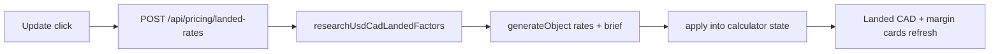

# Pricing catalog AI roadmap

Phased plan for granular CAD landed multipliers on the Line Sheet tab, plus an AI web-search **Update** for live USD→CAD (and optional suggested rates).  
Companion to [`roadmap.md`](roadmap.md).

**Branch context:** `feature/ai-integration-pricing-catalog-tab` (from `main`). Reuses AI Gateway + Perplexity search patterns from company enrich (`companyWebResearch` / `generateObject`) and staff JWT gating (`requireApprovedStaffClient`).

## How to use (Plan Mode)

Each phase below is sized for **one Plan Mode session → one implementation PR**.

1. Open Plan Mode and paste the phase’s **Plan prompt**.
2. Review the plan; adjust only if exit criteria or out-of-scope need changing.
3. Implement on the feature branch (or a short-lived slice branch); gate with `npm run check` (+ manual smoke listed).
4. Check the phase boxes in this file when the PR merges.

Do **not** combine phases in one plan unless a later phase explicitly lists a dependency merge.

---

## Locked architecture

**Line Sheet calculator only.** Extend the existing FX + freight landed-cost stack—do **not** AI-update catalog SKU counts or tee wholesale card copy. Secrets stay on the server; React islands call Bearer-protected APIs.

| Concern         | Decision                                                                                                                  |
| --------------- | ------------------------------------------------------------------------------------------------------------------------- |
| Surface         | Summary cards + **CAD Landed Multiplier** bar in [`CatalogTab.tsx`](src/components/tabs/CatalogTab.tsx)                   |
| Formula         | `landedCad = priceUsd * fx * (1 + freightRate) * (1 + gstRate) * (1 + otherTaxRate)` (replaces `priceUsd * fx * freight`) |
| Defaults        | `fx = 1.45`, `freightRate = 0.10` (today’s `1.1` multiplier), `gstRate = 0.05`, `otherTaxRate = 0`                        |
| Freight UI      | Edit as a **rate** (0.10) or %-friendly input—do not keep the opaque `1.1` multiplier long-term                           |
| GST / other     | Explicit fields; GST labeled federal 5%; **Other tax** is a single combined rate (PST/HST/misc) for v1                    |
| Update          | Staff Bearer → `POST /api/pricing/landed-rates`; Perplexity via AI Gateway → structured rates + short source brief        |
| Confirm UX      | Apply research into calculator state (fields remain editable); no DB write for rates in Phases I–III                      |
| Persistence     | Session/hook state through Phase III; optional `localStorage` in Phase IV                                                 |
| Secrets         | Server route only; no `PUBLIC_*` LLM keys                                                                                 |
| Unchanged cards | Total Styles / SKUs and Tee Wholesale (USD) copy stay static                                                              |

```text
CatalogTab (Line Sheet)
  ├─ Summary cards (landed CAD + keystone margin use calculator state)
  └─ CAD Landed Multiplier bar
        ├─ FX · Freight % · GST % · Other tax %
        └─ Update ─► POST /api/pricing/landed-rates
                        ├─ researchUsdCadLandedFactors (web search)
                        └─ generateObject → { fx, freightRate?, gstRate?, otherTaxRate?, brief, asOf }
                             └─ client applies into useLandedCostCalculator
```



---

## Phase I — Granular landed-cost math (no AI)

**Status:** Done  
**Goal:** Replace the single freight multiplier with freight + GST + other tax rates; keep FX. No web search.  
**Depends on:** nothing  
**Estimate:** 1 PR

### In scope

- [x] Extend [`src/lib/landedCost.ts`](src/lib/landedCost.ts): new formula + helpers; keep/adapt `formatMarginRange`
- [x] Update [`src/lib/landedCost.test.ts`](src/lib/landedCost.test.ts) for rate-based inputs; assert defaults ≈ today’s tee landed (~$20.73) and margin band
- [x] Update [`src/hooks/useLandedCostCalculator.ts`](src/hooks/useLandedCostCalculator.ts) state: `fx`, `freightRate`, `gstRate`, `otherTaxRate`
- [x] Wire [`CatalogTab.tsx`](src/components/tabs/CatalogTab.tsx) multiplier bar: FX, Freight %, GST %, Other tax %; refresh Est. Landed meta + table Landed CAD / margin columns
- [x] Propagate through [`RepCommandCenter.tsx`](src/components/RepCommandCenter.tsx) and any Insights margin consumers of the hook

### Out of scope

- Update button, API routes, web research, persistence

### Exit criteria

- [x] Unit tests: with `gstRate = 0` and `freightRate = 0.10`, landed/margins match the prior `fx * 1.1` stack (~$20.73 tee sample)
- [x] Product defaults ship `gstRate = 0.05` (intentional landed bump vs pre-GST UI; call out in PR)
- [x] Manual field edits recalculate cards and catalog rows
- [x] `npm run check` green

### Plan prompt

```text
Implement pricing-catalog-ai-roadmap.md Phase I (Granular landed-cost math) only.
No AI, no Update button, no API. Gate with npm run check.
```

---

## Phase II — Update control + client shell (no live search yet)

**Status:** Not started  
**Goal:** Add **Update** UX and a typed client helper; stub or soft-fail until Phase III.  
**Depends on:** Phase I  
**Estimate:** 1 PR

### In scope

- [ ] **Update** button on the CAD Landed Multiplier bar (busy / error / optional last-updated placeholder)
- [ ] Client module (e.g. [`src/lib/landedRatesClient.ts`](src/lib/landedRatesClient.ts)) posting to `/api/pricing/landed-rates` with Bearer token (mirror enrich client pattern)
- [ ] Soft-surface errors when the API is missing or returns 501; do **not** leave a permanent mock flag in main after Phase III

### Out of scope

- Live Perplexity research implementation (Phase III)
- `localStorage` (Phase IV)

### Exit criteria

- [ ] Manual fields still work without Update
- [ ] Update shows clear busy/error (or soft “not ready”) without crashing
- [ ] `npm run check` green

### Plan prompt

```text
Implement pricing-catalog-ai-roadmap.md Phase II (Update control + client shell) only.
No live web research yet. Gate with npm run check.
```

---

## Phase III — Web research API (core AI)

**Status:** Not started  
**Goal:** Authenticated API researches current USD→CAD (and optional suggested rates) and applies into calculator state.  
**Depends on:** Phase II  
**Estimate:** 1 PR

### In scope

- [ ] `researchUsdCadLandedFactors` (Perplexity via AI Gateway → brief; structured via `generateObject`)
- [ ] Return shape: `{ fx, freightRate?, gstRate?, otherTaxRate?, brief, asOf }`
- [ ] [`src/pages/api/pricing/landed-rates.ts`](src/pages/api/pricing/landed-rates.ts) (or `index.ts`): `prerender = false`, `requireApprovedStaffClient`
- [ ] Wire Update to apply FX (and any suggested rates); fields remain editable after apply
- [ ] Unit tests with mocked search / `generateObject`; auth rejection covered where practical

### Out of scope

- `localStorage`, duties/brokerage line items, DB-backed rep prefs

### Exit criteria

- [ ] Authenticated Update refreshes FX from the web into the calculator
- [ ] Unauthenticated → 401
- [ ] `npm run check` green

### Plan prompt

```text
Implement pricing-catalog-ai-roadmap.md Phase III (Web research API) only.
Reuse AI Gateway + Perplexity patterns from companyWebResearch / enrich. Gate with npm run check.
```

---

## Phase IV — Persistence + polish

**Status:** Not started  
**Goal:** Remember last rates in the browser; surface source brief / as-of on the Line Sheet.  
**Depends on:** Phase III  
**Estimate:** 1 PR

### In scope

- [ ] `localStorage` for last rates + `asOf` (hydrate hook on load; write after successful Update / manual save-if-needed)
- [ ] Source brief / as-of meta under multiplier bar or landed card
- [ ] Docs touch: `.env.example` / README only if Gateway usage for this route needs clarifying
- [ ] Mark completed phase checkboxes in this file when merging

### Out of scope

- Supabase-backed rep preferences table
- Separate duty / brokerage / brokerage-fee fields

### Exit criteria

- [ ] Reload restores last Update (or last edited) rates
- [ ] Brief/as-of visible after a successful Update
- [ ] `npm run check` green

### Plan prompt

```text
Implement pricing-catalog-ai-roadmap.md Phase IV (Persistence + polish) only.
localStorage + source brief/as-of UI. No DB prefs. Gate with npm run check.
```

---

## Phase order (summary)

```text
I  Granular landed-cost math (freight / GST / other)   ← no AI
    ↓
II Update button + client shell                        ← soft-fail OK
    ↓
III Web research API + wire Update                     ← core AI
    ↓
IV localStorage + brief/as-of polish
```

| Phase | Plan-sized goal                                  |
| ----- | ------------------------------------------------ |
| I     | Rate-based landed formula + CatalogTab fields    |
| II    | Update UX + Bearer client shell                  |
| III   | `/api/pricing/landed-rates` + apply web FX/rates |
| IV    | Remember rates + show research brief             |

---

## Explicit non-goals

- AI-updating Total Styles / SKUs or Tee Wholesale card copy
- Duties, brokerage, or multi-province tax matrices as separate line items (v1 = one **Other tax** rate)
- Provider keys in `PUBLIC_*` or React islands
- DB-backed rep pricing preferences (unless a later phase is added)
- Replacing global **AI assist** chat with this Update flow

---

## Verification (every phase)

```bash
npm run check
```

Manual smoke after Phase III: signed-in rep → Line Sheet → **Update** → FX (and optional rates) refresh → cards/table recalculate; Cancel/edit still works without another search.

---

## References

- Product roadmap: [`roadmap.md`](roadmap.md)
- AI agent / Gateway: [`ai-agent-roadmap.md`](ai-agent-roadmap.md), [`src/lib/companyWebResearch.ts`](src/lib/companyWebResearch.ts)
- Calculator: [`src/lib/landedCost.ts`](src/lib/landedCost.ts), [`src/hooks/useLandedCostCalculator.ts`](src/hooks/useLandedCostCalculator.ts)
- UI: [`src/components/tabs/CatalogTab.tsx`](src/components/tabs/CatalogTab.tsx)
- Auth gate for APIs: [`src/lib/agentAuth.ts`](src/lib/agentAuth.ts)
